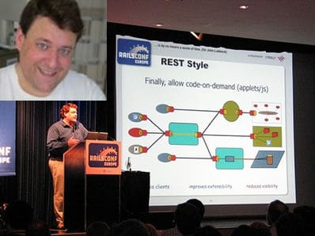

# √ 服务设计风格

在软件业发展的初期，程序编写都是以算法为核心的，程序员会把数据和过程分别作为独立的部分来考虑，数据代表问题空间中的客体，程序代码则用于处理这些数据，这种思维方式直接站在计算机的角度去抽象问题和解决问题，被称为面向过程的编程思想。与此相对，面向对象的编程思想则站在现实世界的角度去抽象和解决问题，它把数据和行为都看作是对象的一部分，这样可以让程序员能以符合现实世界的思维方式来编写和组织程序。

这两种思想有出现的向后顺序，但在一件人类使用计算机语言来处理数据的工作中，无论提倡以计算机的思维还是提倡以人类的思维来思考问题，这都是合乎逻辑的，并不应该是评价它们先进性的标准。

12年一轮回，经过了上世纪90年代末到21世纪初期面向对象编程的火热之后，又出现了另一种新的考虑如何对内封装逻辑、对外重用服务的思想：面向资源的编程思想。这种新思想是把问题空间中的数据对象作为抽象的主题，把解决问题时从输入数据到输出结果的处理过程，看作是一个（组）数据对象的状态不断发生变换而导致的结果。这种思想有其生根的土壤基础：在跨越进程、跨越网络主机、跨越编程语言的分布式系统中，人们尝试过将之前在单进程应用里行之有效的面向过程、面向对象的服务设计方法改造迁移，使之适应分布式环境，这项工作总体上获得了成功，但在分布式环境里多少还是出现了一些新瑕疵，所以为另一种服务设计风格，即面向资源的编程思想留出了成长的空间。

尽管在2020年还谈论什么RESTful、RPC，大概是确实有点落伍了，可这个问题是一个架构设计者必须有明确取舍权衡的重要技术决策，今天笔者仍准备来谈一下这个话题。

## 远程服务调用

分布式系统各个节点中的机器大都通过特定的网络协议（HTTP、TCP等公有协议或[JRMP](https://zh.wikipedia.org/wiki/Java%E8%BF%9C%E7%A8%8B%E6%96%B9%E6%B3%95%E5%8D%8F%E8%AE%AE)、[GIOP](https://zh.wikipedia.org/wiki/%E9%80%9A%E7%94%A8%E5%AF%B9%E8%B1%A1%E8%AF%B7%E6%B1%82%E4%BB%A3%E7%90%86%E9%97%B4%E9%80%9A%E4%BF%A1%E5%8D%8F%E8%AE%AE)这样专有协议）相互访问，但网络协议只是负责往目标机器发送了一段文本或二进制的数据，为了建立可靠的服务，还有很多问题需要抽象：

- 服务所需的参数，服务返回的结果以什么格式传输？
- 服务变化了，如何兼容前后不同版本的格式？
- 如何提高网络利用的效率，譬如连接是否可被多个请求复用以减少开销？多个请求是否可以同时发往一个连接上?
- 如何提高数据序列化的效率？
- 如何保证网络的可靠性？譬如调用期间某个链接忽然断开了怎么办？
- 怎样进行异常处理？异常该如何让调用者获知？
- 万一发送的请求服务端不回复该怎么办？
- ……

早在1988年，绝大多数人都对分布式、远程服务没有什么概念的时候（这话我说轻了，说那时候多数人对计算机没什么概念都不嫌过分），Sun Microsystems就起草并向IETF提交了[RFC 1050](https://tools.ietf.org/html/rfc1050)规范，正式提出了远程服务调用（Remote Procedure Call，RPC）的概念，并设计了一套面向C语言的RPC协议（最后并没有什么人采用）。

:::quote 远程服务调用
Remote Procedure Call is a protocol that one program can use to request a service from a program located in another computer on a network without having to understand the network's details. A procedure call is also sometimes known as a function call or a subroutine call.
:::

1991年，万维网还没正式诞生的年代，[对象管理组织](https://zh.wikipedia.org/wiki/%E5%AF%B9%E8%B1%A1%E7%AE%A1%E7%90%86%E7%BB%84%E7%BB%87)（Object Management Group，OMG）发布了跨进程、面向异构语言的服务调用协议：CORBA 1.0（Common Object Request Broker Architecture，1.0版本只提供了C语言的调用）。到1997年发布的CORBA 2.0版本，CORBA支持了C、C++、Java（1998年新加入的Java语言映射）等主流编程语言，这是第一套由国际标准组织牵头，多个主流软件提供商共同参与的分布式规范，当时影响力只有微软私有的[DCOM](https://zh.wikipedia.org/wiki/Distributed_COM)可以与之竞争。

不过，CORBA与DCOM都没有获得真正的胜利，在1999年末，SOAP 1.0（Simple Object Access Protocol）规范的发布。SOAP是由微软和DevelopMentor共同起草的远程服务标准，随后提交给W3C成为国际标准，SOAP使用XML作为远程过程调用的编码载体（实际上并不绑定于XML-RPC，有SOAP Over UDP这类其他载体的应用），当时XML是计算工业最新的银弹，几乎所有只要是定义为XML的东西都是好的，连微软自己都主动放弃了DCOM转投SOAP。

SOAP没有天生属于哪家公司的烙印，商业运作非常成功，很受市场欢迎，大量的厂商都想分一杯羹。但从技术角度来看，SOAP设计得并不优秀，甚至可以说是有显著缺陷的。对于开发者而言，SOAP最大的缺点是它那过于严格的规范定义，需要专门的客户端去调用和解析SOAP，也需要专门的服务去部署SOAP（如Apache Axis/CXF）。SOAP协议家族中，除它本身外包括了服务描述的[Web服务描述标准](https://zh.wikipedia.org/wiki/WSDL)（Web Service Description Language，WSDL）协议、服务发现的[统一描述、发现和集成](https://zh.wikipedia.org/wiki/UDDI)（Universal Description / Discovery and Integration，UDDI）协议、还有一堆几乎谁都说不清有多少个的[WS-*](https://zh.wikipedia.org/wiki/Web%E6%9C%8D%E5%8A%A1%E8%A7%84%E8%8C%83%E5%88%97%E8%A1%A8)的子功能协议，对开发者来说都是很大的学习负担。

人们对SOAP的热情迅速兴起，又逐渐冷却之后，远程服务器调用这个小小领域，开始进入了群雄混战、百家争鸣的战国时代，且延续至今。相继出现了RMI（Sun/Oracle）、Thrift（Facebook）、Dubbo（阿里巴巴）、gRPC（Google）、Motan2（新浪）、Finagle（Twitter）、brpc（百度）、Arvo（Hadoop）、JSON-RPC 2.0（公开规范，JSON-RPC工作组）等等一系列的协议/框架。这些框架功能、特点各不相同，有的是某种语言私有，有的能支持跨越多门语言，有的运行在HTTP协议之上，有的能直接运行于TCP/UDP之上的，但总体而言，RPC在朝着三个主要方向发展：

- 朝着**对象**发展，不满足于RPC将面向过程的编码方式带到分布式，希望在分布式系统中也能够进行跨进程的面向对象编程，代表为RMI、.NET Remoting，之前的CORBA和DCOM也可以归入这类，这条线有一个别名叫做[分布式对象](https://en.wikipedia.org/wiki/Distributed_object)（Distributed Object）。
- 朝着**效率**发展，代表为gRPC和Thrift，传输效率（主要是Payload所占传输数据的比例大小，使用的传输协议和协议的设计都会影响到这点）和序列化效率的影响是最大的，gRPC和Thrift都有自己优秀的私有序列化器，传输协议一个是HTTP2，支持多路复用和头压缩，另一个直接基于TCP。
- 朝着**简化**发展，代表为JSON-RPC，说要选速度最快的RPC可能会有争议，但选速度最慢的，JSON-RPC大概是逃不了的。牺牲了功能和效率，换来的是协议的简单，接口与格式都更为通用。

不同的RPC框架所提供的不同特性多少是有矛盾的，很难有某一种框架说“我全部都要”。譬如，要把面向对象那套全搬过来，就注定不会太简单（如建Stub、Skeleton就很烦了）；功能多起来，协议就要弄得复杂，效率一般就会受影响；要简单易用，那很多事情就必须遵循约定而不是配置才行；要重视效率，那就需要采用二进制的序列化器和较底层的传输协议，支持的语言范围容易受限。

也正是每一种RPC框架都有不完美的地方，所以才导致不断有新的RPC出现，也导致了新想法的出现，REST便有了它诞生的土壤。

## RESTful服务

REST是这篇文章内定的主角，无论是思想上、概念上还是应用目标上，它与各种RPC协议只能算是有关联，但本质上并不是同一种东西。思想上的不同之前已经提到过，面向过程的编程思想与面向资源的编程思想，什么是面向资源编程，稍后我们再谈。

而概念上不同是指REST并不是一种远程服务调用协议，甚至都可以把定语去掉，它就不是一种协议。协议都带有一定的规范性和强制性，至少也得有个文档吧，JSON-RPC再简单，也要有个《[JSON-RPC Specification](https://www.jsonrpc.org/specification)》来规定它的格式细节、异常、响应码等信息，但REST并没有这些东西，尽管有一些指导原则，但实际上不受约束。常有人批评某个服务“设计得不是RESTful”，其实这句话本身就没有正确地理解REST，这一点我们也将在稍后详细讨论。

至于应用目标，REST与RPC在范围上是确有重合的，但实际上重合的区域并不大。上面列举的RPC三个方向中，分布式对象这一条线的应用与REST可以说是毫无关系；而重视”效率“这个方向的应用，基本上就限制了只能是后端应用（前端应用对于网络协议、序列化器这两点都没有选择的余地，想要高效率也有心无力），在分布式服务各个后端节点之间通讯这一块，REST虽然照样可以用于任何语言（只要有个HTTP Client就可以用）之间的调用，但其实在需要“效率”的纯后端应用场景里REST使用率真算不得高。我们开发的REST服务，可能有百分之八九十是提供给前端去消费的。而在前端这一块，最多也就是JSON-RPC有机会和REST产生竞争，其他所有RPC框架，哪怕是支持HTTP协议，哪怕提供了JavaScript版本的客户端（如gRPC），也是为了去支持node.js，没见过有谁把它们用到浏览器上的。

但尽管有如此多的不同，这两者还是产生了很多的比较与争论，就如同当年面向对象与面向过程一样，非得争出个高低不可。网上许多REST vs RPC的口水仗中说REST不好的，通常也并不是支持哪个RPC框架/协议比它好用，大多都只是不赞成REST的设计风格，心中说的本意其实是“面向资源编程”的思想不好，不如“面向过程编程”来得好用好理解。

### 理解REST

个人会有好恶偏爱，但计算机科学是务实的，有了面向过程之后，还能产生面向资源，并引起广泛的关注、使用和讨论，后者一定是有一些面向过程没有的闪光点，或者解决/避免了一些面向过程中的缺陷。我们不妨先去理解REST为什么出现、解决什么问题、方法是什么，然后再来评价它。

许多人都知道REST源于Roy Thomas Fielding在2000年发表的博士论文：《[Architectural Styles and the Design of Network-based Software Architectures](https://www.ics.uci.edu/~fielding/pubs/dissertation/top.htm)》，此文的确是REST的源头，但我们不能忽略Fielding的身份和之前工作的背景，这对理解REST的设计思想至关重要。

首先，Fielding是一名很优秀的软件工程师，他是Apache服务器的核心开发者，后来成为了著名的Apache软件基金会的合作创始人；同时，Fielding也是HTTP 1.0协议（1996年发布）的专家组成员，后来还成为了HTTP 1.1协议（1999年发布）的负责人。HTTP 1.1协议设计的极为成功，以至于发布之后长达十年的时间里，都没有多少人认为有修订的必要。用来指导HTTP 1.1协议设计的理论和思想，最初是以备忘录的形式在专家组成员之间交流，除了IETF、W3C的专家外，并没有在外界广泛流传。

:::center

Roy Thomas Fielding
:::

从时间上看，对HTTP 1.1协议的设计工作贯穿了Fielding的整个博士研究生涯，当起草HTTP 1.1协议的工作完成后，Fielding回到了加州大学欧文分校继续攻读自己的博士学位。第二年，他更为系统、严谨地阐述了这套理论框架，并且以这套理论框架导出了一种新的编程风格，他为这种风格取了一个很多人难以理解，但是今天已经广为人知的名字REST（**Re**presentational **S**tate **T**ransfer）“表征状态转移”的缩写。

哪怕对编程和网络都很熟悉的同学，只从标题中也不太可能直接弄明白什么叫“表征”、啥东西的“状态”、从哪“转移”到哪。尽管在论文原文中确有论述这些概念，但写得确实相当晦涩（不想读英文的同学从此[获得中文版本](https://www.infoq.cn/article/2007/07/dlee-fielding-rest/)），我推荐一种比较好的方式是先理解什么是HTTP，再配合一些实际例子来进行类比，你会发现“REST”实际上是“HTT”（**H**yper **T**ext **T**ransfer）的进一步抽象，两者就如同接口与实现类之间的关系一般。

“超文本”一词是美国社会学家Theodor Holm Nelson在1967年于《[Brief Words on the Hypertext](https://archive.org/details/SelectedPapers1977)》一文中提出的，下面引用他本人在1992年修正后的定义：

::: quote Hypertext
By now the word "hypertext" has become generally accepted for branching and responding text, but the corresponding word "hypermedia", meaning complexes of branching and responding graphics, movies and sound – as well as text – is much less used. Instead they use the strange term "interactive multimedia": this is four syllables longer, and does not express the idea of extending hypertext.
::: right
—— Theodor Holm Nelson [ Literary Machines](https://en.wikipedia.org/wiki/Literary_Machines), 1992
:::

以上描述了超文本（超媒体）是一种“能够对操作进行判断和响应的文本（或声音、图像等）”，这个概念在上世纪60年代提出时也许还属于科幻的范畴，但是今天大众已经完全接受了，互联网中一段文字可以点击、可以触发脚本执行、可以调用服务端，这毫不稀奇。那我们继续尝试从“超文本”或者“超媒体”的含义来理解什么是“表征”以及REST中其他关键概念：

- **资源**（Resource）：譬如你现在正在阅读一篇名为《服务设计风格》的文章，这篇文章中的内容本身（你将其视作是某种信息、数据）我们称之为“资源”。无论你是在网上看的网页、是打印出来的文字稿、是在电脑屏幕上阅读抑或是手机上浏览，尽管呈现的样子各不相同，但其中的信息是不变的，你所阅读的仍是同一个“资源”。

- **表征**（Representation）：当你通过电脑浏览器阅读此文章时，浏览器向服务端发出请求“我需要这个资源的HTML格式”，服务端向浏览器返回的这个HTML，这就被称之为“表征”，你通过其他方式拿到的PDF、Markdown、RSS等其他形式，它们也同样是表征。可见表征这个概念与我们开发分层中常说的“表示层”（Presentation Layer）的语义其实是一致的。

- **状态**（State）：当你把这篇文章阅读完毕，想看下一篇文章是什么内容的时候，你向服务器请求“给我下一篇文章”，但是“下一篇”是个相对概念，必须依赖“当前你正在阅读的文章是哪一篇”才能正确回应，这类在特定语境中才能产生、无法提前预置的上下文信息即为“状态”。我们所说的有状态（Stateful）还是无状态（Stateless），是只相对于服务端来说的，服务器要完成“取下一篇”的请求，要么自己记住用户的状态（这个用户现在阅读的是哪一篇文章，有状态），要么用户在请求的时候明确告诉服务器（我正在阅读某某文章，现在要读下一篇，无状态）。

- **转移**（Transfer）：无论状态是由服务端还是客户端来提供的，“取下一篇文章”这个行为逻辑必然只能由服务端来提供。服务器通过某种方式，把“用户当前阅读的文章”转变成“下一篇文章”，这就被称为“**表征状态转移**”

借着这个故事的上下文，笔者顺便再介绍几个目前不涉及但稍后要用到的概念名词：

- **统一接口**（Uniform Interface）：上面说的“服务器通过某种方式”具体是什么方式？把文章拉倒结尾处，右下角有下一篇文章的[URI](https://zh.wikipedia.org/wiki/%E7%BB%9F%E4%B8%80%E8%B5%84%E6%BA%90%E6%A0%87%E5%BF%97%E7%AC%A6)超链接地址，这是服务端渲染这篇文章时就预置好的，它就是所谓的“某种方式”。但URI的含义是同一资源标识符，如何能表达出“转移”的含义呢？HTTP协议中提前约定好了一套“统一接口”，包括：**GET**、**HEAD**、**POST**、**PUT**、**DELETE**、**TRACE**、**OPTIONS**七中操作，任何一个支持HTTP协议的服务器都会遵守，对特定的URI采取这些操作，服务器自然就会触发相应的表征状态转移。

- **超文本驱动**（Hypertext Driven）：尽管表征状态转移是由浏览器主动向服务器发出请求，导致了“在我们浏览器的屏幕上显示出了下一篇文章的内容”这个结果的出现，但浏览器其实根本不知道系统中这套转移逻辑，它是根据请求首页时服务器给予的超文本内容，导航到了这篇文章，阅读结束时再导航到下一篇。浏览器作为所有网站的通用的客户端，以上所有行为都是不可能预置于浏览器之中，而是由服务器第一个请求中的返回信息（超文本）来驱动的。这点其实与带有客户端的软件有很本质的区别，那些软件中，业务逻辑是预置于客户端之中的。

HTTP，即

REST的初衷就是尽可能复用HTTP语义和相关基础支持

URL作为资源索引，启用METHOD语义，复用状态码，自定义HEADER，都是在这个指导思路下来的设计

## REST约束

### RMM成熟度

HTTP标准都还没有真正得到落实，谈完全的RESTful还早

一定程度的RESTful

https://martinfowler.com/articles/richardsonMaturityModel.html

CN： https://blog.csdn.net/dm_vincent/article/details/51341037

关于REST的论文在诞生之后的将近五年时间里，一直没有得到足够的重视。譬如之前提到在1999年发布SOAP 1.0规范的设计者们，显然就并不能理解远程服务调用与HTTP的设计思想能产生什么联系？到2005年左右，情况忽然有了180°的转折，

### GraphQL

REST只提供了增删改查的基本语义，其他的语义基本上不管。比如批量添加，批量删除

不能说 GraphQL 是要完全取代 REST，因为前者只是一个工具，而 REST 是一种架构模式

