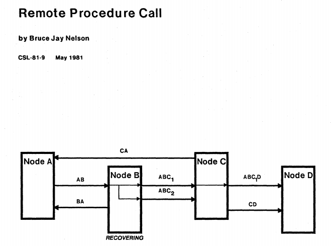

# 远程服务调用

[远程服务调用](https://en.wikipedia.org/wiki/Remote_procedure_call)（Remote Procedure Call，RPC）在计算机科学中已经存在有超过40年时间了，但在今天仍然可以在Quora、知乎等网站上随处可见“什么是RPC？”、“如何评价某某RPC技术？”、“RPC好还是REST好？”之类的问题，仍然“每天”都有新的不同形状的RPC轮子被发明制造出来，仍然有层出不穷的文章去比对谷歌gRPC、阿里Dubbo等等各个厂家的RPC技术优劣。

在计算机这个技术快速更迭的领域，以上肯定不是正常现象，这一方面是由于微服务风潮带来的热度，另外一方面，也不得不承认，某些开发者对RPC本身解决什么问题、如何解决这些问题的或多或少存在认知模糊之处。本篇中，笔者将尽可能从根源到现状，尝试去解析清楚RPC的前世与今生。

尽管今天的大多数RPC技术已经不再追求这个目标了，但无可否认，RPC出现的最初目的，就是**为了让计算机能够跟调用本地方法一样去调用远程方法**。所以，我们先来看一下本地方法调用时，会发生什么。笔者通过以下这段Java风格的伪代码，先来定义几个概念：

```java
// 调用者（Caller）      ： main()
// 被调者（Callee）      ： println()
// 调用点（Call Site）   ： 发生方法调用的指令流位置
// 调用参数（Parameter） ： 由Caller传递给Callee的数据，即“hello world”
// 返回值（Retval）      ： 由Callee传递给Caller的数据，如果方法正常完成，是void，如果方法异常完成，是对应的异常
public static void main(String[] args) {
	System.out.println(“hello world”);
}
```

在完全不考虑编译器优化的前提下，程序运行至调用`println()`的这一行时，计算机（物理机或者虚拟机）会做以下这些事情：

1. 将字符串`helloworld`的引用压栈。
2. 确定`println()`方法的版本。
   这其实并不是一个简单的过程，不论是编译时静态解析也好，是运行时动态分派也好，总之必须根据某些语言规范中明确定义原则，找到明确的`Callee`，“明确”是指唯一的一个`Callee`，或者有严格优先级的多个`Callee`，譬如不同的重载版本。笔者曾在《[深入理解Java虚拟机](https://book.douban.com/subject/34907497/)》中用一整章篇幅介绍这个过程，这里就不赘述了。
3. 从栈中获得`Parameter`，以此为输入，执行`Callee`内部的逻辑。
4. 将`Callee`的执行结果压栈，并将指令流恢复到`Call Site`处继续向下执行。

接下来，我们考虑当`println()`方法不在当前进程的内存地址空间中的情况。很显然，此时第一步就无法做下去，将参数在一个进程中压栈，对于另外一个进程执行的方法毫无意义。我们面临的首个问题是两个进程之间，要有交换数据的手段，这件事情被称为“[进程间通讯](https://en.wikipedia.org/wiki/Inter-process_communication)”（Inter-Process Communication，IPC）。可以考虑的办法有以下几种：

- **管道**（Pipe）或者**具名管道**（Named Pipe）：管道类似于两个进程间的桥梁，用于进程间传递少量的字符流或字节流。管道可用于有亲缘关系进程（由一个进程启动的另外一个进程）间的通信，具名管道摆脱了管道没有名字的限制，除具有管道所具有的功能外，它还允许无亲缘关系进程间的通信。管道典型的应用就是命令行中的`|`操作符，譬如：

  ```bash
  ps -ef | grep java 
  ```

  以上命令就通过管道操作符`|`将ps命令的标准输出通过管道连接到grep命令的标准输入上。

- **信号**（Signal）：信号用于通知接受进程有某种事件发生，除了用于进程间通信外，进程还可以发送信号给进程自身。信号的典型应用是kill命令，譬如：

  ```bash
  kill -9 pid
  ```

  以上就是由Shell进程向指定PID的进程发送SIGKILL信号。

- **信号量**（Semaphore）：信号量用于两个进程之间同步协作手段，它相当于操作系统提供的一个特殊变量，你可以在上面进行wait()和notify()操作。

- **消息队列**（Message Queue）：以上三种方式只适合传递传递少量信息，POSIX标准中有定义消息队列用于进程间通讯。进程可以向队列中添加消息，被赋予读权限的进程则可以从队列消费消息。消息队列克服了信号承载信息量少，管道只能承载无格式字节流以及缓冲区大小受限等缺点。

- **共享内存**（Shared Memory）：允许多个进程可以访问同一块内存空间，这是效率最高的进程间通讯形式。进程的内存地址空间是独立隔离的，但操作系统提供了让进程主动创建、映射、分离、控制某一块内存的接口。由于内存是多进程共享的，所以往往与其它通信机制，如信号量结合使用，来达到进程间的同步及互斥。

- **套接字接口**（Socket）：以上两种方式只适合单机多进程间的通讯，套接字接口是更为普适的进程间通信机制，可用于不同机器之间的进程通信。起初是由Unix系统的BSD分支开发出来的，但现在已经移植到所有*nix系统上。基于效率考虑，当仅限于本机进程间通讯时，套接字接口是被优化过的，不会经过网络协议栈，不需要打包拆包、计算校验和、维护序号和应答等操作，只是简单地将应用层数据从一个进程拷贝到另一个进程，此时可以称之为Unix Domain Socket。

之所以花费那么多篇幅来介绍IPC的手段，是因为最初计算机科学家们的想法，就是将RPC作为IPC的一种特例来看待的（其实现在分类上这么说也仍然合适，只是到具体操作手段上不会这么做了）。请特别关注最后一种基于套接字接口的通讯方式（IPC Socket、Unix Domain Socket），它不仅普适，能够支持基于的网络多机进程间通讯，而且被许多实践验证过是有效的，譬如X Window服务器和GUI程序之间就是由这套机制来实现。此外，这样做有一个看起来无比诱人的好处，由于IPC Socket是操作系统提供的标准接口，完全有可能把远程方法调用的通讯细节隐藏在操作系统底层，从应用层面上看来可以做到远程调用与本地方法调用几乎完全一致。事实上，在[原始分布式时代](/architecture/architect-history/primitive-distribution.html)的初期确实是奔着这个目标去做的，但这种透明的调用形式却反而造成了程序员**误以为通信是无成本的假象**，从而被滥用以致于显著降低了分布式系统的性能。1988年，当“透明的RPC调用”还是主流观点的时候，Andrew Tanenbaum教授就发表了论文《[A Critique of the Remote Procedure Call Paradigm](https://www.cs.vu.nl/~ast/Publications/Papers/euteco-1988.pdf)》，对这种透明的RPC实现提出了一系列质问：

- 两个进程通讯，谁作为服务端，谁作为客户端？
- 怎样进行异常处理？异常该如何让调用者获知？
- 服务端出现多线程竞争之后怎么办？
- 如何提高网络利用的效率，譬如连接是否可被多个请求复用以减少开销？是否支持多播？
- 参数、返回值如何表示？应该有怎样的字节序？
- 如何保证网络的可靠性？譬如调用期间某个链接忽然断开了怎么办？
- 发送的请求服务端收不到回复该怎么办？
- ……

论文的中心观点是：本地调用与远程调用当做一样处理这是犯了方向性的错误，把系统间的调用做成透明，反而会增加程序员工作的复杂度。此后几年，关于RPC应该如何发展、实现的论文层出不穷，支持者有之，反对者有之，冷静分析者有之，狂热唾骂者有之，但历史逐渐证明Andrew Tanenbaum的预言是正确的。最终，到1994年至1997年间，由ACM和Sun院士[Peter Deutsch](https://en.wikipedia.org/wiki/L._Peter_Deutsch)、套接字接口发明者[Bill Joy](https://en.wikipedia.org/wiki/Bill_Joy)、Java之父[James Gosling](https://en.wikipedia.org/wiki/James_Gosling)等一众在Sun Microsystems工作的大佬们共同总结了[通过网络进行分布式运算的八宗罪](https://en.wikipedia.org/wiki/Fallacies_of_distributed_computing)（8 Fallacies of Distributed Computing）：

1. The network is reliable —— 网络是可靠的
2. Latency is zero —— 延迟是不存在的
3. Bandwidth is infinite —— 带宽是无限的
4. The network is secure —— 网络是安全的
5. Topology doesn't change —— 拓扑结构是一成不变的
6. There is one administrator —— 总会有一个管理员
7. Transport cost is zero —— 不考虑传输成本
8. The network is homogeneous —— 网络是同质化的

以上这八条被认程序员在网络编程中经常忽略的八大问题，潜台词就是如果远程服务调用要弄透明化的话，就必须为这些罪过埋单，这算是给RPC是否能等同于IPC来实现**暂时**定下了一个具有公信力的结论。至此，RPC应该是一种高层次的或者说语言层次的特征，而不是像IPC那样，是低层次的或者说系统层次的特征成为工业界、学术界的主流观点。

在1980年代初期，传奇的[施乐Palo Alto研究中心](https://en.wikipedia.org/wiki/PARC_(company))发布了基于Cedar语言的RPC框架Lupine，并实现了世界上第一个基于RPC的商业应用Courier，这里施乐PARC所定义的“远程服务调用”的概念就是符合以上对RPC的结论的，所以，尽管此前已经有用其他名词指代RPC这种操作，但一般仍认为RPC的概念最早由施乐公司所提出。

:::quote 首次提出远程服务调用的定义
Remote procedure call is the synchronous language-level transfer of control between programs in disjoint address spaces whose primary communication medium is a narrow channel. 



:::right

—— Bruce Jay  Nelson，[Remote Procedure  Call](http://www.bitsavers.org/pdf/xerox/parc/techReports/CSL-81-9_Remote_Procedure_Call.pdf)，Xerox PARC，1981

:::

80年代中后期，惠普和Apollo提出了[网络运算架构](https://en.wikipedia.org/wiki/Network_Computing_System)（Network Computing Architecture，NCA）的设想，并随后在[DCE项目](https://en.wikipedia.org/wiki/Distributed_Computing_Environment)中发展成在Unix系统下的远程服务调用框架[DCE/RPC](https://zh.wikipedia.org/wiki/DCE/RPC)，笔者曾经在“[原始分布式时代](/architecture/architect-history/primitive-distribution.html)”中介绍过DEC，这是历史上第一次对分布式有组织的探索尝试，由于DEC本身是基于Unix操作系统的，所以DEC/RPC也仅面向于在Unix系统程序之间通用。在1988年，Sun Microsystems起草并向[互联网工程任务组](https://en.wikipedia.org/wiki/Internet_Engineering_Task_Force)（Internet Engineering Task Force，IETF）提交了[RFC 1050](https://tools.ietf.org/html/rfc1050)规范，此规范中设计了一套面向于广域网或混合网络环境的、基于TCP/IP网络的、支持C语言的RPC协议，后被称为[ONC RPC](https://en.wikipedia.org/wiki/Open_Network_Computing_Remote_Procedure_Call)（Open Network Computing RPC，也被称为Sun RPC），这两个RPC协议就可以算是如今各种RPC协议的鼻祖了，从它们开始，直至这几十年来所有流行过的RPC协议，都不外乎通过各种手段来解决以下三个问题：

- **如何表示数据**：无论是将参数传递给另外一个进程，还是从另外一个进程中取回执行结果，都涉及到数据应该如何表示的问题。进程内的方法调用，使用程序语言的标准的和程序员自定义的数据类型就很容易解决数据表示问题，远程方法调用则完全可能面临交互双方分属不同程序语言的情况；即使只支持同一种语言RPC协议，在不同硬件指令集、不同操作系统下，也完全可能有不一样表现细节，譬如数据宽度、字节序的差异等等。行之有效的做法是将交互双方所涉及的数据转换为某种事先约定好的中立数据流格式进行传输，将数据流转换回不同语言中对应的数据类型来进行使用，这个操作相信大家都很熟悉，就是序列化与反序列化。每种RPC协议都应该要有对应的序列化协议，如：
  - ONC RPC的[External Data Representation](https://en.wikipedia.org/wiki/External_Data_Representation) （XDR）
  - CORBA的[Common Data Representation](https://en.wikipedia.org/wiki/Common_Data_Representation)（CDR）
  - Java RMI的[Java Object Serialization Stream Protocol](https://docs.oracle.com/javase/8/docs/platform/serialization/spec/protocol.html#a10258)
  - gRPC的[Protocol Buffers](https://developers.google.com/protocol-buffers)
  - Web Service的[XML  Serialization](https://docs.microsoft.com/en-us/dotnet/standard/serialization/xml-serialization-with-xml-web-services)
  - 众多轻量级RPC支持的[JSON Serialization](https://tools.ietf.org/html/rfc7159)
  - ……
- **如何传递数据**：准确地说，是指如何通过网络，在两个服务Endpoint之间相互操作、交换数据。这通常指的是应用层协议，实际传输一般是基于标准的TCP、UDP等传输层协议来完成的。两个服务交互不是只扔个序列化数据流来表示参数和结果就行的，许多在此之外信息，譬如异常、超时、安全、认证、授权、事务，等等，都可能存在双方交换信息的需求。在计算机科学中，专门有一个名称“[Wire Protocol](https://en.wikipedia.org/wiki/Wire_protocol)”来用于表示这种两个Endpoint之间交换这类数据的行为，常见的Wire Protocol有：
  - Java RMI的[Java Remote Message Protocol](https://docs.oracle.com/javase/8/docs/platform/rmi/spec/rmi-protocol3.html)（JRMP，也支持[RMI-IIOP](https://zh.wikipedia.org/w/index.php?title=RMI-IIOP&action=edit&redlink=1)）
  - CORBA的[Internet Inter ORB Protocol](https://en.wikipedia.org/wiki/General_Inter-ORB_Protocol)（IIOP，是GIOP协议在IP协议上的实现版本）
  - DDS的[Real Time Publish Subscribe Protocol](https://en.wikipedia.org/wiki/Data_Distribution_Service)（RTPS）
  - Web Service的[Simple Object Access Protocol](https://en.wikipedia.org/wiki/SOAP)（SOAP）
  - 如果要求足够简单，双方都是HTTP Endpoint，直接使用HTTP也是可以的（如JSON-RPC）
  - ……
- **如何表示方法**：这在本地方法调用中也不成问题，编译器或者解释器会根据语言规范，将调用的方法转换为进程地址空间中方法入口位置的指针。不过一旦考虑不同语言，事情又麻烦起来，每门语言的方法签名都可能有所差别，所以如“何表示一个方法”，“如何找到这些方法”还是得弄个统一的标准。这个标准做起来可以很简单，只要给程序中每个方法都规定一个唯一的绝不重复的编号，调用时不用管它什么方法签名定义，直接传这个编号就可以了。这种听起无比寒碜的办法，还真的就是DCE/RPC的最初准备的解决方案。虽然最终DCE还是弄出了一套语言无关的[接口描述语言](https://en.wikipedia.org/wiki/Interface_description_language)（Interface Description Language，IDL），成为此后许多RPC参考或依赖的基础（如CORBA的OMG IDL），但最初那个唯一的“绝不重复”的编码方案[UUID](https://en.wikipedia.org/wiki/Universally_unique_identifier)却广为流传开来，今天已广泛应用于程序开发的方方面面。这类用于表示方法的协议还有：
  - Android的[Android Interface Definition Language](https://developer.android.com/guide/components/aidl)（AIDL）
  - CORBA的[OMG Interface Definition Language](https://www.omg.org/spec/IDL)（OMG IDL）
  - Web Service的[Web Service Description Language](https://zh.wikipedia.org/wiki/WSDL)（WSDL）
  - JSON-RPC的[JSON Web Service Protocol](https://en.wikipedia.org/wiki/JSON-WSP)（JSON-WSP）
  - ……

DEC/RPC与ONC RPC都有很重的Unix痕迹，其实并没有真正在Unix系统以外大规模流行过，而且它们还有一个“大问题”：只支持在传递值而不支持传递对象（ONC RPC的XDR的序列化器能用于序列化结构体，但结构体毕竟不是对象），这两门RPC协议都是面向C语言设计的，根本就没有对象的概念。而90年代正好又是[面向对象编程](https://en.wikipedia.org/wiki/Object-oriented_programming)（Object-Oriented Programming，OOP）风头正盛的年代，所以在1991年，[对象管理组织](https://zh.wikipedia.org/wiki/%E5%AF%B9%E8%B1%A1%E7%AE%A1%E7%90%86%E7%BB%84%E7%BB%87)（Object Management Group，OMG）便发布了跨进程、面向异构语言的、支持面向对象的服务调用协议：CORBA 1.0（Common Object Request Broker Architecture，1.0和1.1版本只提供了C、C++语言的支持）。到了末代的CORBA 3.0版本，CORBA不仅支持了C、C++、Java、Lisp、Object Pascal、Python、Ruby等多种主流编程语言，还支持了Smalltalk、Ada、COBOL等已经半截入土的非主流语言，阵营不可谓不强大。这是一套由国际标准组织牵头，由主流软件提供商共同参与的分布式规范，当时影响力只有微软私有的[DCOM](https://zh.wikipedia.org/wiki/Distributed_COM)可以与之媲美，但微软的DCOM与DCE一样，是受限于操作系统的（不过比DCE厉害的是DCOM能跨语言哟），所以同时支持跨系统、跨语言的CORBA原本是最有机会统一RPC这个细分领域的有力竞争者。

但无奈CORBA 本身设计得实在是太过于啰嗦繁琐，甚至有些规定简直到了荒谬的程度——写一个对象请求代理（ORB，这是CORBA中的关键概念）大概要200行代码，其中大概有170行都是纯粹无用的废话（这句带有鞭尸性质的得罪人的评价不是笔者写的，是CORBA的首席科学家Michi Henning在论文《[The Rise and Fall of CORBA](https://dl.acm.org/doi/pdf/10.1145/1142031.1142044)》中自己说的）。另一方面，为CORBA制定规范的专家逐步脱离实际，做出CORBA规范晦涩难懂，各家语言的厂商都有自己的解读，结果弄出来的CORBA实现互不兼容，实在是对CORBA号称支持众多异构语言的莫大讽刺。这也间接造就了稍后W3C Web Service出现后，CORBA与Web Service竞争时出现了犹如十八路诸侯讨董卓的惨败局面，与DCOM一同被扫进计算机历史的博物馆中。

CORBA没有把握住统一RPC的大好机遇，很快另外一个更有希望的机会再次降临。1998年，XML 1.0发布，并成为[万维网联盟](https://en.wikipedia.org/wiki/World_Wide_Web_Consortium)（World Wide Web Consortium，W3C）的推荐标准。1999年末，SOAP 1.0（Simple Object Access Protocol）规范的发布，它代表这一种被称为“Web Service”的全新的RPC协议的诞生。Web Service是由微软和DevelopMentor公司共同起草的远程服务标准，随后提交给W3C投票成为国际标准，所以Web Service也被称为W3C Web Service。Web Service采用了XML作为远程过程调用的序列化、接口描述、服务发现等所有编码的载体，当时XML是计算机工业最新的银弹，只要是定义为XML的东西几乎就都被认为是好的，连微软自己都主动宣布放弃DCOM，迅速转投SOAP的怀抱。

Web Service没有天生属于哪家公司的烙印，商业运作非常成功，很受市场欢迎，大量的厂商都想分一杯羹。但从技术角度来看，SOAP设计得也并不优秀，甚至同样可以说是有显著缺陷的。对于开发者而言，Web Service的一大缺点是它那过于严格的数据和接口定义所导致的性能问题，尽管Web Service吸取了CORBA失败的教训，不需要程序员手工去编写对象的描述和服务代理，可是，XML作为一门描述性语言本身信息密度就非常低下（不用与二进制协议比，与今天的JSON或YAML比一下就知道了），Web Service又是跨语言的RPC协议，这使得一个简单的字段，为了在不同语言中不会产生歧义，要以XML描述去清楚的话，往往比原本存储这个字段值的空间多出十几倍、几十倍乃至上百倍。这个特点一方面导致了使用Web Service必须要专门的客户端去调用和解析SOAP内容，也需要专门的服务去部署（如Java中的Apache Axis/CXF），更关键的是导致了每一次数据交互都包含大量的冗余信息，性能奇差无比。

如果只是需要客户端、传输性能差也就算了，[又不是不能用](https://www.zhihu.com/topic/20003839/hot)。既然选择了XML，获得自描述能力，本来也就没有打算把性能放到第一位，但Web Service还有另外一点原罪：贪婪。“贪婪”是指它希望在一套协议上一揽子解决分布式计算中可能遇到的所有问题，这导致Web Service生出了一整个家族的协议出来（这句话居然没有用拟人修辞）。Web Service协议家族中，除它本身外包括了的SOAP、WSDL、UDDI协议之外，还有一堆几乎说不清有多少个以[WS-*](https://en.wikipedia.org/wiki/List_of_web_service_specifications)命名的、用于解决事务、一致性、事件、通知、业务描述、安全……等等的子功能协议，子子孙孙无穷无尽，对开发者造成了非常沉重的学习负担，这次算是真得了罪惨了开发者，谁爱用谁用去。

当程序员们对Web Service的热情迅速兴起，又逐渐冷却之后，自己也不仅开始反思：那些面向透明的、简单的RPC协议，如DCE/RPC、DCOM、Java RMI，要么依赖于操作系统，要么依赖于特定语言，总有一些先天约束；那些面向通用的、普适的RPC协议；如CORBA，就无法逃过使用复杂性的困扰，CORBA的OMG IDL、ORB这些就很好的佐证；而那些意图通过技术手段来屏蔽复杂性的RPC协议，如Web Service，又不免受到性能问题的束缚。简单、普适、高性能这三点，似乎真的难以同时满足。

由于一直没有一个同时满足以上三点的“完美RPC协议”出现，所以远程服务器调用这个小小领域里，逐渐进入了群雄混战、百家争鸣的战国时代，距离“统一”越走越远，并一直延续至今。如今，相继出现了RMI（Sun/Oracle）、Thrift（Facebook/Apache）、Dubbo（阿里巴巴/Apache）、gRPC（Google）、Motan2（新浪）、Finagle（Twitter）、brpc（百度）、Arvo（Hadoop）、JSON-RPC 2.0（公开规范，JSON-RPC工作组）……等等一系列的协议/框架。这些框架功能、特点各不相同，有的是某种语言私有，有的能支持跨越多门语言，有的运行在HTTP协议之上，有的能直接运行于TCP/UDP之上的，但肯定不存在哪一款是“最完美的RPC”。今时今日，任何一款具有生命力的RPC框架，都不再去追求大而全的“完美”，而是有自己的针对性特点作为主要的发展方向，譬如：

- 朝着**面向对象**发展，不满足于RPC将面向过程的编码方式带到分布式，希望在分布式系统中也能够进行跨进程的面向对象编程，代表为RMI、.NET Remoting，之前的CORBA和DCOM也可以归入这类，这条线有一个别名叫做[分布式对象](https://en.wikipedia.org/wiki/Distributed_object)（Distributed Object）。
- 朝着**性能**发展，代表为gRPC和Thrift，SOAP的墓志铭上还刻着“信息密度（主要是Payload所占传输数据的比例大小，使用的传输协议和协议的设计都会影响到这点）和序列化效率的影响是最大的因素”，gRPC和Thrift都有自己优秀的私有序列化器，而传输协议它俩一个是HTTP2，支持多路复用和Header压缩，另一个直接基于TCP协议自己来处理编码。
- 朝着**简化**发展，代表为JSON-RPC，说要选功能最强、速度最快的RPC可能会有争议，但选功能弱的、速度慢的，JSON-RPC肯定会候选人中之一。牺牲了功能和效率，换来的是协议的简单，接口与格式都更为通用，尤其适合支持Web浏览器这类一般不会有额外协议、客户端支持的应用场合。
- ……

经历了RPC框架的“战国时代”，开发者们终于认可了不同的RPC框架所提供的不同特性或多或少是有矛盾的，很难有某一种框架说“我全部都要”。要把面向对象那套全搬过来，就注定不会太简单（如建Stub、Skeleton就很烦了，即使由IDL生成也很麻烦）；功能多起来，协议就要弄得复杂，效率一般就会受影响；要简单易用，那很多事情就必须遵循约定而不是配置才行；要重视效率，那就需要采用二进制的序列化器和较底层的传输协议，支持的语言范围容易受限。也正是每一种RPC框架都有不完美的地方，所以才导致不断有新的RPC轮子出现，决定了选择框架时在获得一些利益的同时，要付出另外一些代价。到了最近几年，RPC框架有明显的朝着插件化方向发展的趋势，不再选择自己去解决RPC的全部三个问题（表示数据、传递数据、表示方法），而是将全部或者一部分问题设计为扩展点，实现核心能力的可配置，再辅以外围功能，如负载均衡、服务注册、可观察性等方面的支持。这一类框架的代表Facebook Thrift与阿里的Dubbo（现在两者都是Apache的）。以Dubbo的序列化器为例，它默认采用Hessian 2作为序列化器，如果你有JSON的需求，可以替换为FastJSON，如果你对性能有更高的需求，可以替换为Kryo、FST、Protocol Buffers，如果不想依赖其他包，直接使用JDK自带的序列化器也可以，这在一定程度上缓解了RPC框架必须取舍，难以完美的遗憾。

最后，笔者提个问题，你我不妨来反思一下：开发一个分布式系统，是不是就只有RPC这一条路呢？RPC的三大问题源自于对本地方法调用的类比模拟，如果没有了方法调用，那自然参数与结果如何表示、方法如何表示、数据如何传递这些问题都会海阔天空，有新的视角。但是我们写程序，真的可能不面向方法来编程吗？这就是笔者下一篇准备谈的话题了。

---

**后记**：前文提及的DCOM、CORBA、Web Service的失败时，可能笔者的口吻多少有一些戏虐，这只是落笔行文的方式，这些框架即使没有成功，但作为早期的探索先驱，并没有什么该去讽刺的地方。而且它们的后续发展，都称得上是知耻后勇的表现，反而值得我们去赞赏。譬如说到CORBA的消亡，OMG痛定思痛之后，提出了基于RTPS协议栈的“[数据分发服务](https://en.wikipedia.org/wiki/Data_Distribution_Service)”商业标准（Data Distribution Service，DDS，“商业”就是要付费使用的意思），如今主要流行于物联网领域，能够做到微秒级延时，还能支持大规模并发通讯。譬如说到DCOM的失败和Web Service的式微，微软在它们的基础上推出的[.NET WCF](https://en.wikipedia.org/wiki/Windows_Communication_Foundation)（Windows Communication Foundation，Windows通信基础），不仅同时将REST、TCP、SOAP等不同形式的调用自动封装为完全一致的如同本地方法调用一般的程序接口，还依靠自家的“地表最强IDE”Visual Studio将工作量减少到只需要指定一个远程服务地址，就可以获取服务描述、绑定各种特性（譬如安全传输）、自动生成客户端调用代码、甚至还能选择同步还是异步之类细节的程度。尽管这东西只支持.NET平台，而且与传统Web Service一样采用XML描述，但使用起来体验真的是异常地畅快，能挽回Web Service中得罪开发者丢掉的全部印象分。