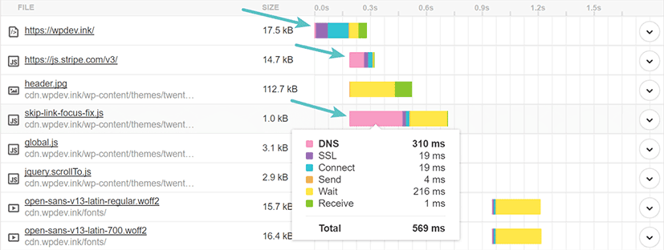

# 域名解析

::: tip 域名缓存（DNS Lookup）

DNS也许是全世界最大、使用最频繁的信息查询系统，如果没有适当的分流机制，DNS将会成为整个网络的瓶颈。

:::

我们都知道DNS的作用是将便于人类理解的域名地址转换为便于计算机处理的IP地址，也许你会觉得好笑：笔者在接触计算机网络的开头一段不短的时间里面，都把DNS想像成一个部署在全世界某个神秘机房中的大型电话本式的翻译服务。后来，当笔者第一次了解到DNS的工作原理，并得知世界根域名服务器的ZONE文件只有2MB大小，甚至可以打印出来物理备份的时候，对DNS系统的设计是非常惊叹的。域名解析这个话题同样涉及缓存等因素，虽然它并不算本篇讨论的重点，但其本身就是堪称示范性的透明多级分流系统，很值得我们借鉴。

假设我们访问域名：www.icyfenix.com.cn，DNS并不是一次性地将“www.icyfenix.com.cn”解析成IP地址的，这需要经历一个递归解析的过程。首先DNS会将域名还原为“www.icyfenix.com.cn.”，注意最后多了一个点“.”，它是“.root”的含义（早期的域名必须带有这个点DNS才能够正确解析，如今DNS服务器已经可以自动补上结尾的点号），然后开始如下过程：

1. 客户端检查本地DNS缓存，查看是否存在并存活着的该域名的地址记录，DNS是以[存活时间](https://zh.wikipedia.org/zh-tw/%E5%AD%98%E6%B4%BB%E6%99%82%E9%96%93)（Time to Live，TTL）来衡量缓存的存活情况的。后续每一级DNS查询的过程都会有类似的缓存查询操作，将不再重复叙述。
2. 客户端将地址发送给本机系统中设置的本地DNS（Local DNS，这个服务器可以通过手工设置，在路由做DHCP分配时或者在拨号时从PPP服务器中也会自动获取到）。
3. 本地DNS收到查询后，会按照“是否有www.icyfenix.com.cn的权威服务器”-->“是否有icyfenix.com.cn的权威服务器”-->“是否有com.cn的权威服务器”-->“是否有cn的权威服务器”的顺序，查询自己的地址记录，如果都没有查询到，就会一直找到最后点号代表的根域名服务器为止。这里涉及了两个名词：
   - **权威域名服务器**（Authoritative DNS）：是指负责翻译指定域名的DNS服务器，“权威”意味着指定域名应该翻译出怎样的结果是由它来决定。DNS翻译域名时无需像查电话本一样刻板地机械翻译，根据来访机器、网络链路、服务内容等各种信息，可以玩出很多花样。
   - **根域名服务器**（Root DNS）是指固定的、无需查询的（可以默认为已内置）[顶级域名](https://en.wikipedia.org/wiki/Top-level_domain)（Top-Level Domain）服务器。全世界一共有13个根域名服务器（但并不是13台，每一个根域名都通过[任播](https://zh.wikipedia.org/wiki/%E4%BB%BB%E6%92%AD)的方式建立了一大群镜像，根据维基百科的数据，迄今已经超过1000台根域名服务器的镜像了）。13这个数字是由于DNS主要采用UDP传输协议（在需要稳定性保证的时候也可以采用TCP）来进行数据交换，未分片的UDP数据包在IPv4下最大有效值为512字节，由此而来的限制。
4. 我们假设本地DNS是新开张的，上述权威服务器的记录它都没有，一直查到根域名服务器后，它将会得到“cn的权威服务器”的记录，然后通过“cn的权威服务器”，得到“com.cn的权威服务器”，以此类推，最后找到“www.icyfenix.com.cn的权威服务器”。
5. 通过“www.icyfenix.com.cn的权威服务器”，查询www.icyfenix.com.cn的地址记录（有RFC定义的地址记录有[数十种类型](https://zh.wikipedia.org/wiki/DNS%E8%AE%B0%E5%BD%95%E7%B1%BB%E5%9E%8B%E5%88%97%E8%A1%A8)，譬如IPv4下的IP地址为A记录，IPv6下的AAAA记录、主机别名CNAME记录，等等），选择一条合适的返回给客户端。

一个域名可以配置多条不同的A记录，此时权威服务器可以根据自己的策略来进行选择。一种典型的应用是智能线路：根据访问者所处的不同地区（譬如华北、华南、东北、港澳台、国外）、不同服务商（譬如电信、联通、移动）等因素来确定返回的A记录。

DNS系统多级分流的设计使得DNS系统能够经受住全球网络流量不间断的冲击，但也并非全无缺点。譬如，当极端情况（各级服务器均无缓存）下的域名解析可能导致后续递归的多次查询而显著影响响应速度，譬如下图所示。

:::center

首次DNS请求耗时（图片来自网络）
:::

专门有一种被称为“DNS预取”（DNS Prefetching）的前端优化手段：如果网站后续要使用来自于其他域的资源，那就在网页加载时便生成一个link请求，促使浏览器对该域名进行预解释，譬如下面所示：

```html
<link rel="dns-prefetch" href="//domain.not-icyfenx.cn">  
```

而另一种可能更严重的缺陷是DNS的分级查询意味着每一级都有可能受到中间人攻击的威胁，产生被劫持的风险。要攻陷位于递归链条顶层的（譬如根域名服务器，cn权威服务器）服务器和链路是非常困难的，但很多位于递归链底层的、本地运营商的Local DNS服务器的安全防护则相对松懈，甚至不少地区的运行商自己就会进行劫持，专门返回一个错的IP，在这个IP上代理用户请求，以便给特定资源（主要是HTML）注入广告，以此牟利。

为此，最近几年出现了另一种新的DNS应用形式：[HTTPDNS](https://en.wikipedia.org/wiki/DNS_over_HTTPS)（也称为DNS over HTTPS，DoH）。它将DNS服务开放为一个HTTPS服务，替代基于UDP传输协议的DNS域名解析，直接从权威DNS或者可靠Local DNS获取解析数据，从而绕过传统Local DNS。这种做法的好处是避免了底层的域名劫持（遇到顶层劫持是往往是政府行为，这是没办法的），能够有效解决Local DNS不可靠导致的域名生效缓慢、来源IP不准确产生的智能线路切换错误等问题。