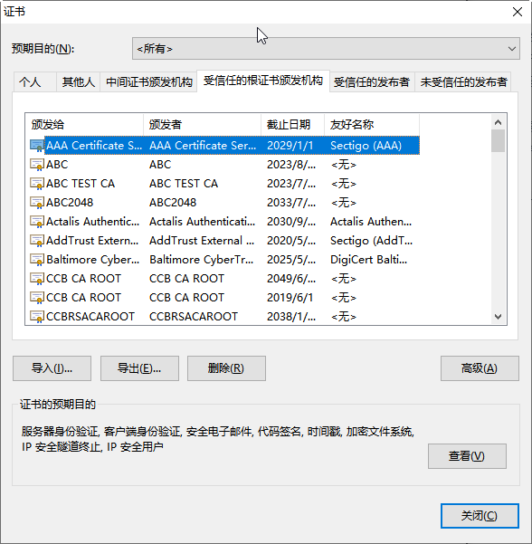

# 传输

::: tip 传输（Transport Security）

系统如何保证通过网络传输的信息无法被第三方窃听、篡改和冒充？

:::

这节的主角是签名、证书、TLS等，但不会涉及“到哪找免费的CA证书？”、“如何生成数字证书？”、“如何把证书置入Web服务器？”这一类操作性的话题，而更多是对整套传输安全层原理的讲述。尽管这部分内容相对较难，但如果前面你已经阅读过并理解了认证、授权、凭证、保密的内容，而又对SSL/TLS本身没有什么了解的话，那这一节可能会是最容易理解的讲述传输安全层工作原理的方式。笔者将从“假设传输层安全得不到保障，攻击者如何摧毁之前认证、授权、凭证、保密中所提到的种种安全机制”为具体场景来讲解传输层安全所面临的问题和它的解决方案。

## 摘要、加密与签名

我们从JWT令牌的一小段“题外话”来引出整套现代加密通讯体系，以便于阐述哈希摘要、对称/非对称加密的特点与局限。我们知道，JWT中携带信息的价值来自于它是被签名的、不可篡改的信息。这一点之前介绍到：

> 签名的意义在于确保负载中的信息是可信的、没有被篡改的，也没有在传输过程中丢失。因为被签名的内容哪怕发生了一个字节的变动，也会导致整个签名发生显著变化。此外，由于这件事情只能由认证/授权服务器完成（只有它知道Secret），任何人都无法在篡改后重新计算出合法的签名值，所以服务端才能够完全信任客户端传上来的JWT中的负载信息。

我们来深入分析一下，“签名”具体是如何让负载中的信息变得“不可篡改”的。以默认的SHA256哈希算法为例，进行签名，相当于进行如下计算过程：

```java
signature = SHA256(base64UrlEncode(header) + "." + base64UrlEncode(payload) , secret)
```

理想的哈希算法通常都会具备两个特性：一是**易变性**，这是指算法的输入发生了任何一点变动，都会导致[雪崩效应](https://zh.wikipedia.org/wiki/%E9%9B%AA%E5%B4%A9%E6%95%88%E5%BA%94)（Avalanche Effect），使得输出结果发生发生极大的变化。这个特性常被用来做校验，譬如互联网上下载大文件，常会附有一个哈希校验码，以确保下载下来的文件没有因网络或其他原因与原文件产生哪怕一个字节的偏差。二是**不可逆性**，这是指算法根据输入计算输出结果耗费的算力资源极小，但根据输出结果反过来推算原本的输入，耗费的算力就极大。一个经常被人们用来讲解不可逆性的例子是[大数分解](https://zh.wikipedia.org/wiki/%E6%95%B4%E6%95%B0%E5%88%86%E8%A7%A3)，我们可以轻而易举的地（[以O(nlogn)的复杂度](https://www.reddit.com/r/math/comments/b5aiz1/harvey_and_van_der_hoeven_claim_to_have_found_an/?utm_medium=android_app&utm_source=share)）计算出两个大素数的乘积：

```java
97667323933 * 128764321253 = 12576066674829627448049
```

根据[算术基本定理](https://zh.wikipedia.org/wiki/%E7%AE%97%E6%9C%AF%E5%9F%BA%E6%9C%AC%E5%AE%9A%E7%90%86)，质因数的分解形式是唯一的，且前面笔者所举例的运算因子已经都是素数，所以12576066674829627448049的分解形式只有唯一的上面所示的一种答案，但是如何对大数进行因数分解，迄今没有找到多项式时间的解法（24位十进制数的因数分解完全在现代计算机的暴力处理能力范围内，这里只是举例。但目前很多计算机科学家都相信大数分解问题就是一种[P!=NP](https://zh.wikipedia.org/wiki/P/NP%E9%97%AE%E9%A2%98)的证例，尽管也并没有人能证明它一定不存在多项式时间的解法）。不可逆性常被人用来做数字签名，利用的就是如果你知道密钥，很容易通过明文算出签名值，但知道明文和签名值，几乎不可能逆推出密钥，这就实现了签名易于验证，难以破解的特点。

必须注意，签名“易于验证、难以破解”是建立在密钥不会泄漏，也不会被篡改的基础上的。当授权服务器与资源服务器是同一个服务时，JWT运作不会遭遇什么风险。而当授权服务器与资源服务器并不是同一个，他们之间就涉及到资源服务其如何验证的问题，无论是资源服务器对每个收到的令牌都请求授权服务器验证一下，还是资源服务器自己也拿到密钥来自行验证令牌真伪都是不可行的。这种情况的解决方案前面讨论中已提到过：

> 在多方系统、授权服务与资源服务分离的实际应用中，通常会采用非对称加密算法（典型如RSA）来进行签名，这时候除了授权服务端持有的可以用于签名的私钥外，还会对其他服务器公开一个公钥，公钥不会用来签名，但是能被其他服务用于验证签名是否由私钥所签发的。这样其他服务器也能不依赖授权服务器独立判断JWT令牌中的信息的真伪。

非对称加密就是加密和解密使用的是不同的密钥的算法，那自然对称加密就是指加密是指加密和解密是一样的密钥的算法。不知道上面看这段话的时候，你心中是否会想“这里写JWT通常会采用非对称加密算法，那改用对称加密行不行呢？”之类的疑问。答案是除非有其他传递或者动态协商密钥的途径，否则这个场景中对称加密是不可行的，因为对称加密只有一个密钥，授权和资源服务不在同一台服务器的话，如何将这个密钥传送给资源服务器？再加密一次传送的话就成了“[蛋鸡悖论](https://zh.wikipedia.org/wiki/%E5%85%88%E6%9C%89%E9%B8%A1%E8%BF%98%E6%98%AF%E5%85%88%E6%9C%89%E8%9B%8B)”了。

事实上，在分布式环境中，真正能够用来签名的，通常都只有非对称加密算法。在它的密钥对中，其中一个密钥是对外公开的，所有人都可以获取到， 称为公钥，另外一个密钥是不公开的称为私钥。这两个密钥谁加密、谁解密构成了两种不同的用途：

1. 公钥加密，私钥解密，这种就是**加密**，用于向公钥所有者发布信息，这个信息可能被他人篡改，但是无法被他人获得。如果甲想给乙发一个安全的保密的数据，那么应该甲乙各自有一个私钥，甲先用乙的公钥加密这段数据，再用自己的私钥加密这段加密后的数据。最后再发给乙，这样确保了内容即不会被读取，也不会被篡改。
2. 私钥加密，公钥解密，这种就是**签名**，用于让所有公钥所有者验证私钥所有者的身份并且用来防止私钥所有者发布的内容被篡改。但是不用来保证内容不被他人获得。

看到这里，可能有人在想只用“非对称加密”行不行？为什么还需要对称加密？答案是非对称加密算法对加密内容的长度有限制，不能超过公钥长度。譬如说现在常用的公钥是长度是2048 bits，意味着明文不能超过256 bytes。此外，由于对称加密的设计难度相对较小，其加密的效率一般远高于非对称加密，这决定了在大数据量的加密数据传输中，通常是两种加密算法结合使用的，用非对称加密来传递密钥，收到密钥后用对称加密来加密内容。

下表把前面涉及到的三种算法放到一块，列举了它们的主要特征、用途和局限性：

| <div style="width:80px">类型</div> | 特点                                                         | 常见实现                  | 主要用途       | 主要局限                           |
| ---------------------------------- | ------------------------------------------------------------ | ------------------------- | -------------- | ---------------------------------- |
| 哈希摘要                           | 不可逆，即不能解密，所以并不是加密算法，只是一些场景把它当作加密算法使用<br />易变性，输入发生1Bit变动，就可能导致输出结果50%的内容发生改变。<br />无论输入长度多少，输出长度固定（2的N次幂） | MD2/4/5/6、SHA0/1/256/512 | 摘要           | 无法解密                           |
| 对称加密                           | 加密是指加密和解密是一样的密钥<br />设计难度相对较小，执行速度相对较块<br />加密明文长度不受限制 | DES、AES、RC4、IDEA       | 加密           | 要解决如何把密钥安全地传递给解密者 |
| 非对称加密                         | 加密和解密使用的是不同的密钥<br />明文长度不能超过公钥长度   | RSA、BCDSA、ElGamal       | 签名、传递密钥 | 加密明文长度受限                   |

现在我们再回到多方系统如何验证令牌的问题中来。有了非对称加密，公钥可以不需要加密地公开了，那问题难道还没有解决了吗？并没有，还存在一个明显的漏洞，公钥虽然是公开的，但如何保证要获取公钥的资源服务，拿到的公钥就是授权服务所希望它拿到的呢？如果公钥在网络传输过程中，获取公钥的这一步被攻击者截获并篡改了，返回了攻击者自己提供的公钥，那以后攻击者就可以用自己的私钥签名，让资源服务器无条件信任自己的所有动作了。这里公钥显然也无法再用加密来传输，否则也是一个蛋鸡问题。

## 数字证书

当我们无法以“签名”的手段来达成信任时，就只能求助于其他途径。不妨想想真实的世界中，我们是如何达成信任的，其实不外乎以下两种：

- **基于共同私密信息的信任**<br/>
  譬如某个陌生号码找你，说是你的老同学，生病了要找你借钱。你能够信任他的方式是向对方询问一些你们两个应该知道，且只有你们两个知道的私密信息，如果对方能够回答上来，他有可能真的是你的老同学，否则他十有八九就是个诈骗犯。
- **基于权威公证人的信任**<br/>如果有个陌生人找你，说他是警察，让你把存款转到他们的安全账号上。你能够信任他的方式是找到公安局，如果公安局担保他确实是个警察，那他有可能真的是警察，否则他十有八九就是个诈骗犯。

回到网络世界中，我们并不能假设授权服务器和资源服务器是互相认识的，所以通常不太会采用第一种方式，而第二种就是目前标准的保证公钥可信分发的标准，这个标准一个名字：[公开密钥基础设施](https://zh.wikipedia.org/wiki/%E5%85%AC%E9%96%8B%E9%87%91%E9%91%B0%E5%9F%BA%E7%A4%8E%E5%BB%BA%E8%A8%AD)（Public Key Infrastructure，PKI）。

:::quote 公开密钥基础设施（Public Key Infrastructure，PKI）
又称公开密钥基础架构、公钥基础建设、公钥基础设施、公开密码匙基础建设或公钥基础架构，是一组由硬件、软件、参与者、管理政策与流程组成的基础架构，其目的在于创造、管理、分配、使用、存储以及撤销数字证书。

密码学上，公开密钥基础建设借着数字证书认证中心（Certificate Authority，CA）将用户的个人身份跟公开密钥链接在一起。对每个证书中心用户的身份必须是唯一的。链接关系通过注册和发布过程创建，取决于担保级别，链接关系可能由CA的各种软件或在人为监督下完成。PKI的确定链接关系的这一角色称为注册管理中心（Registration Authority，RA）。RA确保公开密钥和个人身份链接，可以防抵赖。
:::

我们不纠缠于PKI概念上的内容，只要知道里面定义了数字证书认证中心便相当于前面例子中“权威公证人”的角色，负责发放和管理数字证书的权威机构（你也可以签发证书，不权威罢了），它作为受信任的第三方，承担公钥体系中公钥的合法性检验的责任。可是，这里和现实世界仍然有一些区别，现实世界你去找的公安局，那大楼不大可能是剧场布景冒认的；而网络世界，在假设所有网络传输都有可能被截获、冒认的前提下，“去CA中心进行认证”本身也是一种网络操作，这与之前的“去获取去公钥”本质上不是没什么差别吗？其实还是有差别的，公钥成千上万不可数，而权威的CA中心则应是可数的，“可数的”意味着可以不通过网络，而在浏览器、操作系统出厂时预置好，或者在专门安装（如银行的证书），下图为我机器上的现存的根证书。

:::center

Windows系统的CA证书
:::

到这里终于出现了一个这节的关键词之一：证书（Certificate），证书是权威CA中心对特定公钥信息的一层公证载体，由于客户的机器上已经预置了这些权威CA中心本身的证书（称为根证书），使得我们能够在不依靠网络的前提下，使用里面的公钥信息对其所签发的证书中的签名进行确认。到此终于打破了鸡生蛋、蛋生鸡的循环，使得整套数字签名体系有了逻辑基础。

PKI中采用的证书格式是[X.509标准格式](https://zh.wikipedia.org/wiki/X.509)，它定义了证书中应该包含哪些信息，并描述了这些信息是如何编码的，里面最关键的就是认证机构的数字签名和公钥信息两项内容。一个证书具体包含以下内容：

1. **版本号**（Version）：指出该证书使用了哪种版本的X.509标准（版本1、版本2或是版本3），版本号会影响证书中的一些特定信息，目前的版本为3。
2. **序列号**（Serial Number）： 标识证书的唯一整数，由证书颁发者分配的本证书的唯一标识符。
3. **签名算法标识符**： 用于签证书的算法标识，由对象标识符加上相关的参数组成，用于说明本证书所用的数字签名算法。例如，SHA1和RSA的对象标识符就用来说明该数字签名是利用RSA对SHA1杂凑加密。
4. **认证机构的数字签名**：这是使用证书发布者私钥生成的签名，以确保这个证书在发放之后没有被撰改过。
5. **认证机构**： 证书颁发者的可识别名，是签发该证书的实体唯一的CA的[X.500](https://zh.wikipedia.org/wiki/X.500)名字。使用该证书意味着信任签发证书的实体（注意：在某些情况下，比如根或顶级CA证书，发布者自己签发证书）。
6. **有效期限**（Validity）： 证书起始日期和时间以及终止日期和时间；指明证书在这两个时间内有效。
7. **主题信息**（Subject）：证书持有人唯一的标识符（Distinguished Name）这个名字在 互联网上应该是唯一的。
8. **公钥信息**（Public-Key）： 包括证书持有人的公钥、算法(指明密钥属于哪种密码系统)的标识符和其他相关的密钥参数。
9. **颁发者唯一标识符**（Issuer）：标识符—证书颁发者的唯一标识符，仅在版本2和版本3中有要求，属于可选项。

## 传输安全层

尽管到此为止，数字签名的安全性已经可以自洽了，但相信你也感受到了这套信任链的繁琐，如果从确定加密算法、生成密钥、公钥分发、CA认证、核验公钥、签名、验证签名这些步骤都要由用户来承担的话，这样意义的“安全”估计只能一直是存于实验室中的阳春白雪。如何把这一套繁琐的技术体系自动化地应用于无处不在的网络通讯之中，是这一节要讨论的话题。

在计算机科学里，隔离复杂性的常用手段之一就是分层，在网络中更是如此，OSI模型、TCP/IP模型将网络从物理特性（比特流）开始，逐层封装隔离，到了HTTP协议这种面向应用的协议里，就已经不会去关心网卡/交换机如何处理数据帧、MAC地址；不会去关心ARP如何做地址转换；不会去关心IP寻址、TCP传输等等；那要在网络中让用户无感知地、自动地安全通讯，最合理的做法就是在传输层之上、应用层之下加入一层安全层来实现，这样对上层原本基于HTTP的Web应用来说，几乎可以是毫无感知的。而构建传输安全层这件事情，可以说是和万维网的历史一样长，早在1994年，就已经有公司开始着手去尝试了，这里先简单回顾这将近30年来的进展：

- 1994年，网景（Netscape）公司开发了SSL协议（Secure Sockets Layer）的1.0版，这是构建传输安全层的起源，但是SSL 1.0并未正式对外发布。
- 1995年，Netscape把SSL升级到2.0版，正式对外发布，但是刚刚发布不久就被发现有严重漏洞，所以并未大规模使用。
- 1996年，修补好漏洞的SSL 3.0对外发布，这个版本得到了广泛的应用，成为Web网络安全层的事实标准。
- 1999年，互联网标准化组织接替Netscape，将SSL改名TLS（Transport Layer Security）后推进为国际标准，第一个正式的版本是[RFC 2246](https://tools.ietf.org/html/rfc2246)定义的TLS 1.0。这个版本的TLS生存时间极长，直至我写下这段文字的2020年3月，主流浏览器（Chrome、Firefox、IE、Safari）才刚刚共同宣布停止TLS 1.0/1.1的支持。而讽刺的是，由于停止后许多政府网站被无法被浏览，此时又正值新冠病毒（COVID-19）爆发期，Firefox紧急[发布公告](https://www.mozilla.org/en-US/firefox/74.0/releasenotes/)宣布撤回该改动，TLS 1.0的生命还在顽强延续。
- 2006年，TLS的第一个升级版1.1发布（[RFC 4346](https://tools.ietf.org/html/rfc4346)），但却沦为了被遗忘的孩子，很少人使用TLS 1.1，甚至到了因此该版本没有已知的协议漏洞被提出的程度。
- 2008年，TLS 1.1发布2年之后，TLS 1.2标准发布（[RFC 5246](https://tools.ietf.org/html/rfc5246)），迄今超过90%的互联网HTTPS流量是由TLS 1.2所支持的，现在仍在使用的浏览器几乎都完美支持了该协议。
- 2018年，最新的TLS 1.3（[RFC 8446](https://tools.ietf.org/html/rfc8446)）发布，比起前面版本相对温和的升级，TLS 1.3做了出了一些激烈的改动，包括修改了从1.0起一直没有大变化的2轮4次（2-RTT）握手，首次连接仅需1轮（1-RTT）即可完成，在连接复用时甚至将TLS 1.2原本的1-RTT下降到了0-RTT，显著提升了访问速度。

下面笔者将以TLS 1.2为例，介绍传输安全层是如何保障所有信息都是第三方无法窃听（加密传输）、无法篡改（一旦篡改通讯算法会立刻发现）、无法冒充（证书验证身份）的。TLS 1.2在传输之前的握手过程一共需要进行上下2轮、4次信息发送，时序如下所示：

<mermaid style="margin-bottom: 0px">
sequenceDiagram
	客户端 ->> 服务器: 客户端请求：Client Hello
	服务器 -->> 客户端: 服务器回应：Server Hello
	客户端 ->> 服务器: 客户端确认：Client Handshake Finished
	服务器 -->> 客户端: 服务端确认：Server Handshake Finished
</mermaid>

在介绍这四次握手具体会做什么之前，先推荐一个制作很用心的网站（[https://tls.ulfheim.net/](https://tls.ulfheim.net/)），上面以网页的方式详细解释了每一次握手过程中所做的事情、发送的数据、收到的响应等内容。然后，让我们开始一段相对要枯燥困难一些的握手过程：

1. **客户端请求**：Client Hello<br/>
   客户端（一般就是浏览器了）向服务器请求进行加密通讯，在这个请求里面，它会以**明文**的形式，向服务端提供以下信息：
   - 支持的协议版本，譬如TLS 1.2。但是要注意，1.0-3.0分别代表SSL1.0-3.0，TLS1.0则是3.1，一直到TLS1.3的3.4。
   - 一个客户端生成的32 bytes随机数，这个随机数将稍后用于产生加密的密钥。
   - 一个SessionID（可选），不要和前面Cookie-Session那套混淆了，这个SessionID是只链接的SessionID，是为了TLS的链接复用。
   - 一系列支持的[密码学算法套件](https://zh.wikipedia.org/wiki/%E5%AF%86%E7%A0%81%E5%A5%97%E4%BB%B6)，它应该是一组算法的组合，例如TLS_RSA_WITH_AES_128_GCM_SHA256，代表着密钥交换算法是RSA，加密算法是AES128-GCM，消息认证码算法是SHA256
   - 一系列支持的压缩算法。
   - 其他可扩展的信息，为了保证协议的稳定，后续对协议的功能扩展大多都添加到这个变长结构中。譬如TLS 1.0中由于发送的数据并不包含服务器的域名地址，导致了一台服务器只能安装一张数字证书，这对虚拟主机来说就很不方便，所以TLS 1.1起就增加了名为“Server Name”的扩展，以便一台服务器给不同的站点安装不同的证书。

2. **服务器回应**：Server Hello<br/>
   服务端收到客户单的通讯请求后，如果客户端支持的协议版本、加密算法组合在服务端中能找到一致的，将向客户端发出回应。如果不行，将会返回一个握手失败的警告提示。这次回应同样是明文的，包括以下信息：
   - 服务端确认使用的协议版本。
   - 第二个32 bytes的随机数，稍后用于产生加密的密钥。
   - 一个SessionID，以后链接复用可以减少一轮握手。
   - 服务端选定的密码学算法套件。
   - 服务端选定的压缩方法。
   - 其他可扩展的信息。
   - 如果协商出的加密算法组合是依赖证书认证的，服务端要发送出自己的X.509证书，而证书中的公钥是什么，也必须根据协商的加密算法组合来决定。
   - 密钥协商消息，这部对于不同密码学套件有不同的价值，譬如对于ECDH + anon这样得密钥协商算法组合（基于椭圆曲线的[ECDH算法](https://zh.wikipedia.org/wiki/%E6%A9%A2%E5%9C%93%E6%9B%B2%E7%B7%9A%E8%BF%AA%E8%8F%B2-%E8%B5%AB%E7%88%BE%E6%9B%BC%E9%87%91%E9%91%B0%E4%BA%A4%E6%8F%9B)可以在双方通讯都公开的情况下协商出一组只有通讯双方知道的密钥）就不依赖证书中的公钥，而是通过Server Key Exchange消息协商出密钥。

3. **客户端确认**：Client Handshake Finished<br/>
   由于密码学套件的组合复杂多样，这里仅以RSA算法为密钥交换算法为例介绍后续过程。客户端收到服务器应答后，先要验证服务器证书。如果证书不是可信机构颁布、或者证书中信息存在问题（域名与实际域名不一致、或者证书已经过期、或通过[在线证书状态协议](https://zh.wikipedia.org/wiki/%E5%9C%A8%E7%BA%BF%E8%AF%81%E4%B9%A6%E7%8A%B6%E6%80%81%E5%8D%8F%E8%AE%AE)得知证书已被吊销，等等），都会向访问者显示一个“证书不可信任”的警告，由其选择是否还要继续通信。如果证书没有问题，客户端就会从证书中取出服务器的公钥，并向服务器发送以下信息：
   - 客户端证书（可选）。部分服务端并不是面向全公众，只对特定的客户端提供服务，此时客户端需要发送它自身的证书，如果不发送，或者验证不通过，服务端可执行决定是否要继续握手，或者返回一个握手失败的信息。
   - 第三个32 bytes的随机数，这个随机数不再是明文发送，而是以服务端传过来的公钥加密的，它被称为PreMasterSecret，将与前两次发送的随机数一起，根据[特定算法](https://tls.ulfheim.net/files/curve25519-mult.c)计算出48 bytes的MasterSecret ，此即为后续内容传输时的对称加密算法所采用的私钥。
   - 编码改变通知，表示随后的信息都将用双方商定的加密方法和密钥发送。
   - 客户端握手结束通知，表示客户端的握手阶段已经结束。这一项同时也是前面发送的所有内容的哈希值，用来供服务器校验。

4. **服务端确认**：Server Handshake Finished<br/>
   服务端向客户端回应最后的确认通知，包括以下信息：
   - 编码改变通知，表示随后的信息都将用双方商定的加密方法和密钥发送。
   - 服务器握手结束通知，表示服务器的握手阶段已经结束。这一项同时也是前面发送的所有内容的哈希值，用来供客户端校验。

至此，整个握手阶段全部结束，一个安全的链接已经建立，每一个链接建立时，客户端和服务端均通过上面的握手过程协商出了一个只有双方才知道的随机产生的密钥，以及后面传输过程中要采用的对称加密算法（如例子中的AES128），此后该链接的通讯将使用此密钥和加密算法进行加、解密。这种处理方式对上层协议的功能上完全没有影响（性能上当然有影响），建立在这层安全传输层之上的HTTP协议，就被称为“HTTP Over SSL/TLS”，即大家熟知的HTTPS。

从上面握手协商的过程中我们还可以得知，HTTPS同样并非是离散的二元选项，不是只有“启用了HTTPS”和“未启用HTTPS”的差别，采用不同的协议版本、不同的密码学套件、证书是否有效、服务端/客户端对面对无效证书时的处理策略如何都导致了不同HTTPS站点的安全强度的不同。你可以使用[亚洲诚信](https://myssl.com)的诊断服务查看以下几个网站的安全评分，以对安全强度有更加量化直观的理解：

- 亚洲诚信：[https://myssl.com/myssl.com](https://myssl.com/myssl.com)
- 腾讯网：[https://myssl.com/www.qq.com](https://myssl.com/www.qq.com)
- 本站：[https://myssl.com/icyfenix.cn](https://myssl.com/icyfenix.cn)
- 趣店：[https://myssl.com/www.quqianbao.com](https://myssl.com/www.quqianbao.com)