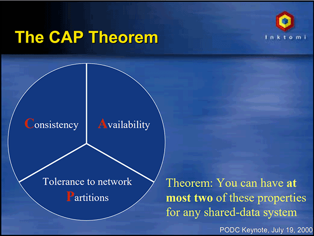

# 分布式事务

本节所说的分布式事务（Distributed Transactions）指的是多个服务同时访问多个数据源的事务处理机制，请注意它与[DTP模型](https://en.wikipedia.org/wiki/Distributed_transaction)中“分布式事务”的差异，DTP模型所指的“分布式”是相对于数据源而言的，并不涉及服务，这部分内容已经在“[全局事务](/architect-perspective/general-architecture/transaction/global.html)”一节里进行过讨论。本节所指的“分布式”是相对于服务而言的，如果严谨地说，它更应该被称为“在分布式服务环境下的事务处理机制”。

曾经（在2000年以前），人们寄希望于XA的事务机制可以在本节所说的分布式环境中也能良好地应用，但这个美好的愿望今天已经被CAP理论彻底地击碎了，这节的话题就从CAP与ACID的矛盾说起。

## CAP与ACID

CAP理论，也被称为Brewer理论，是在2000年7月，加州大学伯克利分校的Eric Brewer教授于“ACM分布式计算原理研讨会（PODC）”上所提出的一个猜想：

:::center

[CAP理论原稿](https://people.eecs.berkeley.edu/~brewer/cs262b-2004/PODC-keynote.pdf)（那时候还只是猜想）
:::

2002年，麻省理工学院的Seth Gilbert和Nancy Lynch以严谨的数学推理上证明了CAP猜想。自此之后，CAP理论正式成为分布式计算领域所公认的著名定理。这个定理里描述了一个分布式的系统中，涉及到共享数据问题时，以下三个特性最多只能满足其二：

- **一致性**（**C**onsistency）：代表数据在任何时刻、任何分布式节点中所看到的都是没有矛盾的。这与前面所提的ACID中的C是相同的单词又有不同的定义（分别指Replication的一致性和数据库状态的一致性）。但分布式事务中，ACID的C要以满足CAP中的C为前提。
- **可用性**（**A**vailability）：代表系统**不间断地**提供服务的能力。
- **分区容忍性**（**P**artition Tolerance）：代表分布式环境中部分节点因网络原因而彼此失联（即与其他节点形成“网络分区”）时，系统仍能**正确地**提供服务的能力。

单纯只列概念，CAP是比较抽象的，笔者仍以本章开头所列的事例场景来说明这三种特性对分布式系统来说将意味着什么。假设Fenix's Bookstore的服务拓扑如下图所示，一个来自最终用户的交易请求，将交由账号、商家和仓库服务集群中某一个节点来完成响应：

<mermaid style="margin: -15px 0 -30px 0;">
graph TB
	User("最终用户")-->Store("Fenix's Bookstore") 
	Store-->Warehouse("仓库服务集群")
	Store-->Business("商家服务集群")
	Store-->Account("账号服务集群")
    subgraph 
    Warehouse-.->Warehouse1("仓库节点1")
    Warehouse-.->Warehouse2("仓库节点2")
    Warehouse-->WarehouseN("仓库节点N")
    end
    subgraph 
    Business-.->Business1("商家节点1")
    Business-->Business2("商家节点2")
    Business-.->BusinessN("商家节点N")
    end
    subgraph 
    Account-->Account1("账号节点1")
    Account-.->Account2("账号节点2")
    Account-.->AccountN("账号节点N")
    end
</mermaid>

在这套系统中，每一个单独的服务节点都有着自己的数据库，假设某次交易请求分别由“账号节点1”、“商家节点2”、“仓库节点N”来进行响应。当用户购买一件价值100元的商品后，账号节点1首先应给该用户账号扣减100元货款，它在自己数据库扣减100元很容易，但它还要把这次交易变动告知节点2到N，以及确保能正确变更商家和仓库集群其他账号节点中的关联数据，此时将面临以下情况：

- 如果该变动信息没有及时同步给其他账号节点，将导致有可能发生用户购买另一商品时，被分配给到另一个节点处理，由于看到账户上有不正确的余额而错误地发生了原本无法进行的交易，此为一致性问题。
- 如果由于要把该变动信息同步给其他账号节点，必须暂时停止对该用户的交易服务，直至数据同步一致后再重新恢复，将可能导致用户在下一次购买商品时，因系统暂时无法提供服务而被拒绝交易，此为可用性问题。
- 如果由于账号服务集群中某一部分节点，因出现网络问题，无法正常与另一部分节点交换账号变动信息，那此时服务集群中无论哪一部分节点对外提供的服务都可能是不正确的，能否接受由于部分节点之间的连接中断而影响整个集群的正确性，此为分区容忍性。

以上还仅是涉及到了账号服务集群自身的CAP问题，对于整个Fenix's Bookstore站点来说，它更是面临着来自于账号、商家和仓库服务集群带来的CAP问题，譬如，用户账号扣款后，由于未及时通知仓库服务，导致另一次交易中看到仓库中有不正确的库存数据而发生超售。又譬如因涉及到仓库中某个商品的交易正在进行，为了同步用户、商家和仓库的交易变动，而暂时锁定该商品的交易服务，导致了的可用性问题，等等。

既然已有数学证明，我们就不去讨论为何CAP不可兼得，接下来直接分析如何权衡取舍CAP，以及不同取舍所带来的问题。

- 如果放弃分区容错性（CA without P），这意味着我们将假设节点之间通讯永远是可靠的。永远可靠的通讯在分布式系统中必定不成立的，这不是你想不想的问题，而是网络分区现象始终会存在。在现实中，主流的RDBMS集群通常就是放弃分区容错性的工作模式，以Oracle的RAC集群为例，它的每一个节点均有自己的SGA、重做日志、回滚日志等，但各个节点是共享磁盘中的同一份数据文件和控制文件的，是通过共享磁盘的方式来避免网络分区的出现。
- 如果放弃可用性（CP without A），这意味着我们将假设一旦发生分区，节点之间的信息同步时间可以无限制地延长，此时问题相当于退化到前面“全局事务”中讨论的一个系统多个数据源的场景之中，我们可以通过2PC/3PC等手段，同时获得分区容错性和一致性。在现实中，除了DTP模型的分布式数据库事务外，著名的HBase也是属于CP系统，以它的集群为例，假如某个RegionServer宕机了，这个RegionServer持有的所有键值范围都将离线，直到数据恢复过程完成为止，这个时间通常会是很长的。
- 如果放弃一致性（AP without C），这意味着我们将假设一旦发生分区，节点之间所提供的数据可能不一致。AP系统目前是分布式系统设计的主流选择，因为P是分布式网络的天然属性，你不想要也无法丢弃；而A通常是建设分布式的目的，如果可用性随着节点数量增加反而降低的话，很多分布式系统可能就没有存在的价值了（除非银行这些涉及到金钱交易的服务，宁可中断也不能出错）。目前大多数NoSQL库和支持分布式的缓存都是AP系统，以Redis集群为例，如果某个Redis节点出现网络分区，那仍不妨碍每个节点以自己本地的数据对外提供服务，但这时有可能出现请求分配到不同节点时返回给客户端的是不同的数据。

行文至此，不知道你是否感受到一丝无奈，本章讨论的话题“事务”原本的目的就是获得“一致性”，而在分布式环境中，“一致性”却不得不成为了通常被牺牲、被放弃的那一项属性。但无论如何，我们建设信息系统，终究还是要保证操作结果（在最终被交付的时候）是正确的，为此，人们又重新给一致性下了定义，将前面我们在CAP、ACID中讨论的一致性称为“[强一致性](https://en.wikipedia.org/wiki/Strong_consistency)”（Strong Consistency），有时也称为“[线性一致性](https://en.wikipedia.org/wiki/Linearizability)”（Linearizability，通常是在讨论[共识算法](/distribution/service-discovery/consensus)的场景中），而把牺牲了C的AP系统又要尽可能获得正确的结果的行为称为追求“弱一致性”，不过，如果单纯只说“弱一致性”那其实就是“不保证一致性”的意思……人类语言这东西真是博大精深。为此，在弱一致性中，人们又总结出了一种特例，被称为“[最终一致性](https://en.wikipedia.org/wiki/Eventual_consistency)”（Eventual Consistency），它是指：如果数据在一段时间之内没有被另外的操作所更改，那它最终将会达到与强一致性过程相同的结果，有时候面向最终一致性的算法也被称为“乐观复制算法”。

在本节讨论的主题“分布式事务”中，目标同样也不得不从前面的获得强一致性，降低为获得“最终一致性”，在这个意义上，其实“事务”一词的含义也已经被拓宽了，人们把之前追求ACID的事务称为“刚性事务”，而把笔者下面将要介绍几种分布式事务的常见做法统称为“柔性事务”。

## 可靠事件队列

最终一致性的概念是eBay的系统架构师Dan Pritchett在2008年发表于ACM的论文《[Base: An Acid Alternative](https://queue.acm.org/detail.cfm?id=1394128)》中提出的，该文中总结了另外一种独立于ACID获得的强一致性之外的、通过BASE来达成一致性目的的途径，最终一致性就是其中的“E”。BASE这提法比起ACID凑缩写的痕迹更重，不过有ACID vs BASE（酸 vs 碱）这个朗朗上口的梗，这篇文章传播得足够快，在这里笔者就不多谈BASE中的概念了，但这篇论文本身作为最终一致性的概念起源，并系统性地总结了一种在分布式事务的技术手段，还是非常有价值的。

我们继续以本章的事例场景来解释Dan Pritchett提出的“可靠事件队列”的具体做法，下图为操作时序：

<mermaid style="margin-bottom: 0px">
sequenceDiagram
	Fenix's Bookstore ->>+ 账户服务: 启动事务
	账户服务 ->> 账户服务: 扣减货款
	账户服务 ->>- 消息队列: 提交本地事务，发出消息
	loop 循环直至成功
		消息队列 ->> 仓库服务: 扣减库存
		alt 扣减成功
        	仓库服务 -->> 消息队列: 成功
		else 业务或网络异常
        	仓库服务 -->> 消息队列: 失败
		end
	end
	消息队列 -->> 账户服务: 更新消息表，仓库服务完成
	loop 循环直至成功
		消息队列 ->> 商家服务: 货款收款
		alt 收款成功
        	商家服务 -->> 消息队列: 成功
		else 业务或网络异常
        	商家服务 -->> 消息队列: 失败
		end
	end
	消息队列 -->> 账户服务: 更新消息表，商家服务完成
</mermaid>

1. 最终用户向Fenix's Bookstore发送交易请求：购买一本价值100元的《深入理解Java虚拟机》。
2. Fenix's Bookstore应该对用户账户扣款、商家账户收款、库存商品出库这三个操作有一个出错概率的先验评估，根据出错概率的大小来安排它们的操作顺序（这个一般体现在程序代码中，有一些大型系统也可能动态排序）。譬如，最有可能的出错的是用户购买了，但是不同意扣款，或者账户余额不足；其次是商品库存不足；最后商家收款，一般收款不会遇到什么意外。那顺序就应该是最容易出错的最先进行，即：账户扣款 --> 仓库出库 --> 商家收款。
3. 账户服务进行扣款业务，如扣款成功，则在自己的数据库建立一张消息表，里面存入一条消息：“事务ID：UUID，扣款：100元（状态：已完成），仓库出库《深入理解Java虚拟机》：1本（状态：进行中），某商家收款：100元（状态：进行中）”，注意，这个步骤中“扣款业务”和“写入消息”是依靠同一个本地事务写入自身数据库的。
4. 系统建立一个消息服务，定时轮询消息表，将状态是“进行中”的消息同时发送到库存和商家服务节点中去（可以串行地，即一个成功后再发送另一个，但在我们讨论的场景中没必要）。这时候可能产生以下几种可能的情况：
   1. 商家和仓库服务成功完成了收款和出库工作，向用户账户服务器返回执行结果，用户账户服务把消息状态从“进行中”更新为“已完成”。整个事务宣告顺利结束，达到最终一致性的状态。
   2. 商家或仓库服务有某个或全部因网络原因，未能收到来自用户账户服务的消息。此时，由于用户账户服务器中存储的消息状态一直处于“进行中”，所以消息服务器将在每次轮训的时候持续地向对应的服务重复发送消息。这个步骤可重复性决定了所有被消息服务器发送的消息都必须具备幂等性，通常的设计是让消息带上一个唯一的事务ID，以保证一个事务中的出库、收款动作只会被处理一次。
   3. 商家或仓库服务有某个或全部无法完成工作，譬如仓库发现《深入理解Java虚拟机》没有库存了，此时，仍然是持续自动重发消息，直至操作成功（譬如补充了库存），或者被人工介入为止。
   4. 商家和仓库服务成功完成了收款和出库工作，但回复的应答消息因网络原因丢失，此时，用户账户服务仍会重新发出下一条消息，但因消息幂等，所以不会导致重复出库和收款，只会导致商家、仓库服务器重新发送一条应答消息，此过程重复直至双方网络恢复。
   5. 也有一些支持分布式事务的消息框架，如RocketMQ，原生就支持分布式事务操作，这时候上述情况2、4也可以交由消息框架来保障。

以上这种靠着持续重试来保证可靠性的操作，在计算机中非常常见，它有个专门的名字叫做“[最大努力交付](https://en.wikipedia.org/wiki/Best-effort_delivery)”（Best-Effort Delivery），譬如TCP协议中的可靠性保障就属于最大努力交付。而“可靠事件队列”有一种更普通的形式，被称为“最大努力一次提交”（Best-Effort 1PC），所指的就是将最有可能出错的业务以本地事务的方式完成后，通过不断重试的方式（不限于消息系统）来促使同个事务的其他关联业务完成。

## TCC事务

TCC是另一种常见的分布式事务机制，它是“Try-Confirm-Cancel”三个单词的缩写，是由数据库专家Pat Helland在2007年撰写的论文《[Life beyond Distributed Transactions: an Apostate’s Opinion](https://www-db.cs.wisc.edu/cidr/cidr2007/papers/cidr07p15.pdf)》中提出。

前面介绍的可靠消息队列虽然能保证最终的结果是相对可靠的，过程也简单（相对于TCC来说），但整个过程完全没有任何隔离性可言，有一些业务中隔离性是无关紧要的，但有一些业务中缺乏隔离性就会带来许多麻烦。譬如我们的事例场景中，缺乏隔离性带来的一个显而易见的问题便是“超售”：完全有可能两个客户在短时间内都成功购买了同一件商品，而且他们各自购买的数量都不超过目前的库存，但他们购买的数量之和却超过了库存。如果这件事情处于刚性事务，且隔离级别足够的情况下是可以避免的，譬如，处理“第二类丢失更新的问题”（Second Lost Update）需要“可重复读”（Repeatable Read）的隔离剂别（这部分属于数据库基础常识，就不展开了），以保证后面提交的事务会因为无法获得锁而导致更新失败，但用可靠消息队列就无法做到这一点，这时候就可以考虑TCC方案了，它比较适合用于需要较强隔离性的分布式事务中。

TCC是一种业务侵入式较强的事务方案，它要求业务处理过程必须拆分为“预留业务资源”和“确认/释放消费资源”两个子过程。如同TCC的名字所示，它分为以下三个阶段：

- **Try**：尝试执行阶段，完成所有业务可执行性的检查（保障一致性），并且预留好全部需用到的业务资源（保障隔离性）。
- **Confirm**：确认执行阶段，不进行任何业务检查，直接使用Try阶段准备的资源来完成业务处理。Confirm阶段可能会重复执行，需要满足幂等性。
- **Cancel**：取消执行阶段，释放Try阶段预留的业务资源。Cancel阶段可能会重复执行，需要满足幂等性。

按照我们的示例场景，TCC的执行过程应该是这样的：

<mermaid style="margin-bottom: 0px">
sequenceDiagram
	Fenix's Bookstore ->> 账户服务: 业务检查，冻结货款
	alt 成功
		账户服务 -->> Fenix's Bookstore: 记录进入Confirm阶段
	else 业务或网络异常
		账户服务 -->> Fenix's Bookstore: 记录进入Cancel阶段
	end
	Fenix's Bookstore ->> 仓库服务: 业务检查，冻结商品
	alt 成功
		仓库服务 -->> Fenix's Bookstore: 记录进入Confirm阶段
	else 业务或网络异常
		仓库服务 -->> Fenix's Bookstore: 记录进入Cancel阶段
	end
	Fenix's Bookstore ->> 商家服务: 业务检查
	alt 成功
		商家服务 -->> Fenix's Bookstore: 记录进入Confirm阶段
	else 业务或网络异常
		商家服务 -->> Fenix's Bookstore: 记录进入Cancel阶段
	end
    opt 全部记录均返回Confirm阶段
		loop 循环直至全部成功
        	Fenix's Bookstore->>账户服务: 完成业务，扣减冻结的货款
        	Fenix's Bookstore->>仓库服务: 完成业务，扣减冻结的货物
        	Fenix's Bookstore->>商家服务: 完成业务，货款收款
		end
    end
    opt 任意服务超时或返回Cancel阶段
		loop 循环直至全部成功
        	Fenix's Bookstore->>账户服务:取消业务，解冻货款
        	Fenix's Bookstore->>仓库服务:取消业务， 解冻货物
        	Fenix's Bookstore->>商家服务:取消业务
		end
    end
</mermaid>

1. 最终用户向Fenix's Bookstore发送交易请求：购买一本价值100元的《深入理解Java虚拟机》。
2. 创建事务，生成事务ID，记录在活动日志中，进入Try阶段：
   - 用户服务：检查业务可行性，可行的话，将该用户的100元设置为“冻结”状态，通知下一步进入Confirm阶段；不可行的话，通知下一步进入Cancel阶段。
   - 仓库服务：检查业务可行性，可行的话，将该仓库的1本《深入理解Java虚拟机》设置为“冻结”状态，通知下一步进入Confirm阶段；不可行的话，通知下一步进入Cancel阶段。
   - 商家服务：检查业务可行性，不需要冻结资源。
3. 如果第2步所有业务均反馈业务可行，将活动日志中的状态记录为Confirm，进入Confirm阶段：
   - 用户服务：完成业务操作（扣减那被冻结的100元）
   - 仓库服务：完成业务操作（标记那1本冻结的书为出库状态，扣减相应库存）
   - 商家服务：完成业务操作（收款100元）
4. 第3步如果全部完成，事务宣告正常结束，如果第3步中任何一方出现异常（业务异常或者网络异常），将根据活动日志中的记录，重复执行该服务的Confirm操作（即最大努力交付）。
5. 如果第2步有任意一方反馈业务不可行，或任意一方超时，将活动日志的状态记录为Cancel，进入Cancel阶段：
   - 用户服务：取消业务操作（释放被冻结的100元）
   - 仓库服务：取消业务操作（释放被冻结的1本书）
   - 商家服务：取消业务操作（大哭一场后安慰商家谋生不易）
6. 第5步如果全部完成，事务宣告回滚结束，如果第5步中任何一方出现异常（业务异常或者网络异常），将根据活动日志中的记录，重复执行该服务的Cancel操作（即最大努力交付）。

由上述操作过程可见，TCC其实有点类似于2PC的准备阶段和提交阶段，但TCC是位于用户代码层面，而不是基础设施层面，这为它的实现带来了一定的灵活性，可以根据需要设计资源锁定的粒度。同时，这也带来了更高的开发成本和业务侵入性（主要影响到可控性和更换事务实现方案的成本），所以，通常我们并不会裸编码来做TCC，而是基于某些分布式事务中间件（譬如阿里开源的[Seata](https://seata.io/zh-cn)）基础之上完成。

## SAGA事务

TCC事务具有较强的隔离性，避免了“超售”的问题，而且其性能一般来说是本篇提及的几种柔性事务模式中最高的（只操作预留资源，几乎不会涉及到锁和资源的争用），但它仍不能满足所有的场景。TCC的最主要限制是它的业务侵入性很强，这里并不是说它需要开发编码配合所带来的工作量，而更多的是指它所要求的技术可控性上的约束。譬如，把我们的事例场景修改如下：由于中国网络支付日益盛行，现在用户和商家在书店系统中可以选择不在开设账号，至少不会强求一定要从银行充值到系统中才能进行消费，可以直接在购物时通过网络支付在银行账号中划转货款。这里面就给系统施加了限制，用户、商家的账户在银行的话，其操作权限和数据结构就不可能再随心所欲的地设计，通常也就无法完成冻结款项、解冻、扣减这样的操作（银行一般不会配合你的操作）。所以TCC中第一步Try阶段往往就已经无法施行。这时候我们就可以考虑一下采用另外一种柔性事务方案：SAGA事务（SAGA在英文中是“长篇故事、长篇记叙、一长串事件”的意思）。

SAGA事务模式的历史很久，最早源于1987年普林斯顿大学的Hector Garcia-Molina和Kenneth Salem在ACM发表的一篇论文《[SAGAS](https://www.cs.cornell.edu/andru/cs711/2002fa/reading/sagas.pdf)》（这就是论文的名字）。文中提出了一种如何提升“长时间事务”（Long Lived Transaction）运作效率的方法，大致思路是把一个大事务分解为可以交错运行的一系列子事务集合。原本SAGA目的是为了避免大事务长时间锁定数据库的资源，后来发展成将一个分布式环境中的大事务分解为一系列本地事务的设计模式。SAGA由两部分操作组成：

- 每个分布式事务对数据的操作，分解为N个子事务，命名为T~1~，T~2~，…，T~i~，…，T~n~。每个子事务都应该是或者能被视为是原子行为。如果分布式事务能够正常提交，其对数据的影响（最终一致性）应与连续按顺序成功提交T~i~等价。
- 为每一个子事务设计补偿动作，命名为C~1~，C~2~，…，C~i~，…，C~n~。T~i~与C~i~满足以下条件：
  - T~i~与C~i~都具备幂等性。
  - T~i~与C~i~满足交换律（Commutative），即先执行T~i~还是先执行C~i~，其效果都是一样的。
  - C~i~必须能成功提交，不考虑C~i~本身提交失败被回滚的情形，此时需要人工介入。

如果T~1~到T~n~均成功提交，那事务顺利完成，否则，要采取以下两种恢复策略之一：

- **正向恢复**（Forward Recovery）：如果T~i~事务提交失败，则一直对T~i~进行重试，直至成功为止（最大努力交付）。这种恢复方式不需要补偿，适用于事务最终都要成功的场景（譬如扣了款，就一定要给别人发货）。正向恢复的执行模式为：T~1~，T~2~，…，T~i~（失败），T~i~（重试），…，T~n~。
- **反向恢复**（Backward Recovery）：如果T~i~事务提交失败，则一直执行C~i~对T~i~进行补偿，直至成功为止（最大努力交付）。这里要求C~i~必须（持续重试后）执行成功。反向恢复的执行模式为：T~1~，T~2~，…，T~i~（失败），C~i~（补偿），…，C~2~，C~1~。

与TCC相比，SAGA不需要为资源设计冻结状态和撤销冻结的操作，补偿操作往往要容易实现得多。譬如，前面提到的账户直接开设在银行的场景，从银行划转货款到Fenix's Bookstore系统中，这步是经由用户支付操作（扫码、U盾）来促使银行提供服务；如果后续业务操作失败，尽管我们无法要求银行撤销掉之前用户转账的操作，但是由Fenix's Bookstore系统将货款转回到用户账上作为补偿措施确是完全可行的。

SAGA必须保证所有子事务都得以提交或者补偿，但SAGA系统本身也有可能会崩溃，所以它必须设计与数据库类似的日志机制（被称为SAGA Log）以保证系统恢复后可以追踪到子事务的执行情况，譬如执行至哪一步或者补偿至哪一步了。另外，尽管补偿操作通常比冻结/撤销容易实现，但保证正向、反向恢复过程的能严谨地进行也需要花费不少的工夫（譬如通过服务编排、可靠事件队列等方式完成），所以，SAGA事务通常也不会完全裸编码来实现，一般也是在事务中间件的基础上完成，前面提到的Seata同样支持SAGA模式。

基于数据补偿来代替回滚的思路，可以应用在其他事务方案上，这个笔者就不开独立小节，放到这里一起来解释。举个例子，譬如阿里的GTS（Global Transaction Service，Seata由GTS开源而来）所提出的“[AT事务模式](https://seata.io/zh-cn/docs/overview/what-is-seata.html)”就是这样的一种应用。

从整体上看是AT事务是参照了XA两段提交协议实现的，但针对XA 2PC的缺陷，即在准备阶段必须等待所有数据源都返回成功后，协调者才能统一发出Commit命令而导致的[木桶效应](https://en.wikipedia.org/wiki/Liebig%27s_law_of_the_minimum)（所有涉及到的锁和资源都需要等待到最慢的事务完成后才能统一释放），设计了针对性的解决方案。大致的做法是在业务数据提交时自动拦截所有SQL，将SQL对数据修改前、修改后的结果分别保存快照，生成行锁，通过本地事务一起提交到操作的数据源中（相当于记录了重做和回滚日志）。如果分布式事务成功提交，那后续清理每个数据源中对应的日志数据即可；如果分布式事务需要回滚，就根据日志数据自动产生用于补偿的“逆向SQL”。基于这种补偿方式，分布式事务中所涉及的每一个数据源都可以单独提交，然后立刻释放锁和资源。这种异步提交的模式，相比起2PC极大地提升了可以系统的吞吐量水平。而其代价就是大幅度地牺牲了隔离性，在缺乏隔离性的前提下，以补偿代替回滚并不一定是总能成功的。譬如，当本地事务提交之后、分布式事务完成之前，该数据被补偿之前又被其他操作修改过，即出现了脏写（Dirty Wirte），这时候一旦出现分布式事务需要回滚，就不可能再通过自动的逆向SQL来实现补偿，只能由人工介入处理了。

通常来说，脏写是一定要避免的（几乎所有DBMS在最低的隔离级别上都仍然要加锁以避免脏写），实际上这种情况人工也很难进行有效处理。所以GTS增加了一个“全局锁”（Global Lock）的机制来实现写隔离，要求本地事务提交之前，一定要先拿到针对修改记录的全局锁后才允许提交，没有获得全局锁之前就必须一直等待，这避免了有两个分布式事务中包含的本地事务修改了同一个数据，从而避免脏写。在读隔离方面，AT事务默认的隔离级别是Read Uncommitted，这意味着可能产生脏读（Dirty Read）。读隔离也可以采用全局锁的方案解决，但直接阻塞读取的话，代价就非常大了，通常并不会这样做。由此可见，分布式事务中没有一揽子包治百病的解决办法，因地制宜地选用合适的事务处理方案才是唯一有效的做法。

