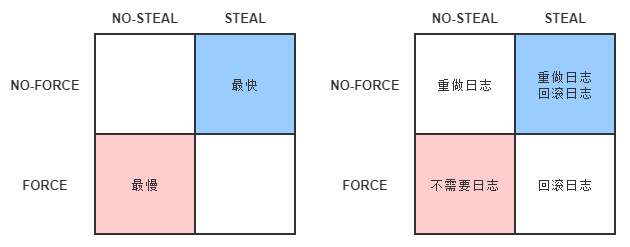

# 本地事务

本地事务（Local Transaction）其实应该翻译成“局部事务”才好与稍后的“全局事务”相对应，不过现在“本地事务”的译法似乎已经成为主流，这里也就不去纠结名称了。本地事务是指仅操作单一事务资源的、不需要全局事务管理器进行协调的事务。在没有介绍什么是“全局事务管理器”前，很难从概念入手去讲解“本地事务”，这里先暂且将概念放下，等读完下一节“[全局事务](/architect-perspective/general-architecture/transaction/global.html)”后再回过头来对比理解。

本地事务是最基础的一种事务解决方案，只适用于单个服务使用单个数据源的场景。从应用角度看，它是直接依赖于数据源本身提供的事务能力来工作的，在程序代码层面，最多只能对事务接口做一层标准化的包装（如JDBC接口），并不能深入参与到事务的运作过程当中，事务的开启、终止、提交、回滚、嵌套、设置隔离级别，乃至与应用代码贴近的事务传播方式，全部都要依赖底层数据源的支持才能工作，这一点与后续介绍的XA、TCC、SAGA等主要靠应用程序代码来实现的事务有着十分明显的区别。举个例子，假设你的代码调用了JDBC中的`Transaction::rollback()`方法，方法的成功执行也并不一定代表事务就已经被成功回滚，如果数据表采用的引擎是[MyISAM](https://en.wikipedia.org/wiki/MyISAM)，那`rollback()`方法便是一项没有意义的空操作。因此，我们要想深入地讨论本地事务，便不得不越过应用代码的层次，去了解一些数据库本身的事务实现原理，弄明白传统数据库管理系统是如何通过ACID来实现事务的。

如今研究事务的实现原理，必定会追溯到[ARIES](https://en.wikipedia.org/wiki/Algorithms_for_Recovery_and_Isolation_Exploiting_Semantics)理论（Algorithms for Recovery and Isolation Exploiting Semantics，ARIES），直接翻译过来是“基于语义的恢复与隔离算法”，起这拗口的名字肯定多少也有些想拼凑“ARIES”这单词目的，跟ACID差不多的恶趣味。

ARIES是现代数据库的基础理论，就算不能称所有的数据库都实现了ARIES，至少也可以称现代的主流关系型数据库（Oracle、MS SQLServer、MySQL/InnoDB、IBM DB2、PostgreSQL，等等）在事务实现上都深受该理论的影响。在20世纪90年代，[IBM Almaden研究院](http://www.research.ibm.com/labs/almaden/)总结了研发原型数据库系统“IBM System R”的经验，发表了ARIES理论中最主要的三篇论文，其中《[ARIES: A Transaction Recovery Method Supporting Fine-Granularity Locking and Partial Rollbacks Using Write-Ahead Logging](https://cs.stanford.edu/people/chrismre/cs345/rl/aries.pdf)》着重解决了ACID的其中两个属性：原子性（A）和持久性（D）在算法层面上应当如何实现。而另一篇《[ARIES/KVL: A Key-Value Locking Method for Concurrency Control of Multiaction Transactions Operating on B-Tree Indexes](http://vldb.org/conf/1990/P392.PDF)》则是现代数据库隔离性（I）奠基式的文章，下面，我们先从原子性和持久性说起。

## 实现原子性和持久性

原子性和持久性在事务里是密切相关的两个属性，原子性保证了事务的多个操作要么都生效要么都不生效，不会存在中间状态；持久性保证了一旦事务生效，就不会再因为任何原因而导致其修改的内容被撤销或丢失。

众所周知，数据必须要成功写入磁盘、磁带等持久化存储器后才能拥有持久性，只存储在内存中的数据，一旦遇到应用程序忽然崩溃，或者数据库、操作系统一侧的崩溃，甚至是机器突然断电宕机等情况就会丢失，后文我们将这些意外情况都统称为“崩溃”（Crash）。实现原子性和持久性的最大困难是“写入磁盘”这个操作并不是原子的，不仅有“写入”与“未写入”状态，还客观地存在着“正在写”的中间状态。正因为写入中间状态与崩溃都不可能消除，所以如果不做额外保障措施的话，将内存中的数据写入磁盘，并不能保证原子性与持久性。下面通过具体事例来说明。

按照前面预设的[场景事例](/architect-perspective/general-architecture/transaction/)，从Fenix's Bookstore购买一本书需要修改三个数据：在用户账户中减去货款、在商家账户中增加货款、在商品仓库中标记一本书为配送状态。由于写入存在中间状态，所以可能发生以下情形。

- **未提交事务，写入后崩溃**：程序还没修改完三个数据，但数据库已经将其中一个或两个数据的变动写入磁盘，此时出现崩溃，一旦重启之后，数据库必须要有办法得知崩溃前发生过一次不完整的购物操作，将已经修改过的数据从磁盘中恢复成没有改过的样子，以保证原子性。
- **已提交事务，写入前崩溃**：程序已经修改完三个数据，但数据库还未将全部三个数据的变动都写入到磁盘，此时出现崩溃，一旦重启之后，数据库必须要有办法得知崩溃前发生过一次完整的购物操作，将还没来得及写入磁盘的那部分数据重新写入，以保证持久性。

由于写入中间状态与崩溃都是无法避免的，为了保证原子性和持久性，就只能在崩溃后采取恢复的补救措施，这种数据恢复操作被称为“崩溃恢复”（Crash Recovery，也有资料称作Failure Recovery或Transaction Recovery）。

为了能够顺利地完成崩溃恢复，在磁盘中写入数据就不能像程序修改内存中变量值那样，直接改变某表某行某列的某个值，而是必须将修改数据这个操作所需的全部信息，包括修改什么数据、数据物理上位于哪个内存页和磁盘块中、从什么值改成什么值，等等，以日志的形式——即仅进行顺序追加的文件写入的形式（这是最高效的写入方式）先记录到磁盘中。只有在日志记录全部都安全落盘，数据库在日志中看到代表事务成功提交的“提交记录”（Commit Record）后，才会根据日志上的信息对真正的数据进行修改，修改完成后，再在日志中加入一条“结束记录”（End Record）表示事务已完成持久化，这种事务实现方法被称为“Commit Logging”（提交日志）。

:::quote 额外知识：Shadow Paging

通过日志实现事务的原子性和持久性是当今的主流方案，但并不是唯一的选择。除日志外，还有另外一种称为“[Shadow Paging](https://en.wikipedia.org/wiki/Shadow_paging)”（有中文资料翻译为“影子分页”）的事务实现机制，常用的轻量级数据库SQLite Version 3采用的事务机制就是Shadow Paging。

Shadow Paging的大体思路是对数据的变动会写到硬盘的数据中，但并不是直接就地修改原先的数据，而是先将数据复制一份副本，保留原数据，修改副本数据。在事务过程中，被修改的数据会同时存在两份，一份是修改前的数据，一份是修改后的数据，这也是“影子”（Shadow）这个名字的由来。当事务成功提交，所有数据的修改都成功持久化之后，最后一步是去修改数据的引用指针，将引用从原数据改为新复制出来修改后的副本，最后的“修改指针”这个操作将被认为是原子操作，现代磁盘的写操作可以认为在硬件上保证了不会出现“改了半个值”的现象。所以Shadow Paging也可以保证原子性和持久性。Shadow Paging实现事务要比Commit Logging更加简单，但涉及隔离性与并发锁时，Shadow Paging实现的事务并发能力就相对有限，因此在高性能的数据库中应用不多。

:::

Commit Logging保障数据持久性、原子性的原理并不难理解：首先，日志一旦成功写入Commit Record，那整个事务就是成功的，即使真正修改数据时崩溃了，重启后根据已经写入磁盘的日志信息恢复现场、继续修改数据即可，这保证了持久性；其次，如果日志没有成功写入Commit Record就发生崩溃，那整个事务就是失败的，系统重启后会看到一部分没有Commit Record的日志，那将这部分日志标记为回滚状态即可，整个事务就像完全没好有发生过一样，这保证了原子性。

Commit Logging的原理很清晰，也确实有一些数据库就是直接采用Commit Logging机制来实现事务的，譬如较具代表性的是阿里的[OceanBase](https://zh.wikipedia.org/wiki/OceanBase)。但是，Commit Logging存在一个巨大的先天缺陷：所有对数据的真实修改都必须发生在事务提交以后，即日志写入了Commit Record之后。在此之前，即使磁盘I/O有足够空闲、即使某个事务修改的数据量非常庞大，占用了大量的内存缓冲区，无论有何种理由，都决不允许在事务提交之前就修改磁盘上的数据，这一点是Commit Logging成立的前提，却对提升数据库的性能十分不利。为了解决这个问题，前面提到的ARIES理论终于可以登场。ARIES提出了“Write-Ahead Logging”的日志改进方案，所谓“提前写入”（Write-Ahead），就是允许在事务提交之前，提前写入变动数据的意思。

Write-Ahead Logging先将何时写入变动数据，按照事务提交时点为界，划分为FORCE和STEAL两类情况。

- **FORCE**：当事务提交后，要求变动数据必须同时完成写入则称为FORCE，如果不强制变动数据必须同时完成写入则称为NO-FORCE。现实中绝大多数数据库采用的都是NO-FORCE策略，因为只要有了日志，变动数据随时可以持久化，从优化磁盘I/O性能考虑，没有必要强制数据写入立即进行。
- **STEAL**：在事务提交前，允许变动数据提前写入则称为STEAL，不允许则称为NO-STEAL。从优化磁盘I/O性能考虑，允许数据提前写入，有利于利用空闲I/O资源，也有利于节省数据库缓存区的内存。

Commit Logging允许NO-FORCE，但不允许STEAL。因为假如事务提交前就有部分变动数据写入磁盘，那一旦事务要回滚，或者发生了崩溃，这些提前写入的变动数据就都成了错误。

Write-Ahead Logging允许NO-FORCE，也允许STEAL，它给出的解决办法是增加了另一种被称为Undo Log的日志类型，当变动数据写入磁盘前，必须先记录Undo Log，注明修改了哪个位置的数据、从什么值改成什么值，等等。以便在事务回滚或者崩溃恢复时根据Undo Log对提前写入的数据变动进行擦除。Undo Log现在一般被翻译为“回滚日志”，此前记录的用于崩溃恢复时重演数据变动的日志就相应被命名为Redo Log，一般翻译为“重做日志”。由于Undo Log的加入，Write-Ahead Logging在崩溃恢复时会执行以下三个阶段的操作。

- **分析阶段**（Analysis）：该阶段从最后一次检查点（Checkpoint，可理解为在这个点之前所有应该持久化的变动都已安全落盘）开始扫描日志，找出所有没有End Record的事务，组成待恢复的事务集合，这个集合至少会包括Transaction Table和Dirty Page Table两个组成部分。
- **重做阶段**（Redo）：该阶段依据分析阶段中产生的待恢复的事务集合来重演历史（Repeat History），具体操作为：找出所有包含Commit Record的日志，将这些日志修改的数据写入磁盘，写入完成后在日志中增加一条End Record，然后移除出待恢复事务集合。
- **回滚阶段**（Undo）：该阶段处理经过分析、重做阶段后剩余的恢复事务集合，此时剩下的都是需要回滚的事务，它们被称为Loser，根据Undo Log中的信息，将已经提前写入磁盘的信息重新改写回去，以达到回滚这些Loser事务的目的。

重做阶段和回滚阶段的操作都应该设计为幂等的。为了追求高I/O性能，以上三个阶段无可避免地会涉及非常烦琐的概念和细节（如Redo Log、Undo Log的具体数据结构等），囿于篇幅限制，笔者并不打算具体介绍这些内容，如感兴趣，阅读本节开头引用的那两篇论文是最佳的途径。Write-Ahead Logging是ARIES理论的一部分，整套ARIES拥有严谨、高性能等很多的优点，但这些也是以高度复杂为代价的。数据库按照是否允许FORCE和STEAL可以产生共计四种组合，从优化磁盘I/O的角度看，NO-FORCE加STEAL组合的性能无疑是最高的；从算法实现与日志的角度看NO-FORCE加STEAL组合的复杂度无疑也是最高的。这四种组合与Undo Log、Redo Log之间的具体关系如图3-1所示。

:::center

图3-1 FORCE和STEAL的四种组合关系
:::

## 实现隔离性

本节我们来探讨数据库是如何实现隔离性的。隔离性保证了每个事务各自读、写的数据互相独立，不会彼此影响。只从定义上就能嗅出隔离性肯定与并发密切相关，因为如果没有并发，所有事务全都是串行的，那就不需要任何隔离，或者说这样的访问具备了天然的隔离性。但现实情况不可能没有并发，要在并发下实现串行的数据访问该怎样做？几乎所有程序员都会回答：加锁同步呀！正确，现代数据库均提供了以下三种锁。

- **写锁**（Write Lock，也作做排他锁，eXclusive Lock，简写为X-Lock）：如果数据有加写锁，就只有持有写锁的事务才能对数据进行写入操作，数据加持着写锁时，其他事务不能写入数据，也不能施加读锁。
- **读锁**（Read Lock，也作做共享锁，Shared Lock，简写为S-Lock）：多个事务可以对同一个数据添加多个读锁，数据被加上读锁后就不能再被加上写锁，所以其他事务不能对该数据进行写入，但仍然可以读取。对于持有读锁的事务，如果该数据只有它自己一个事务加了读锁，允许直接将其升级为写锁，然后写入数据。
- **范围锁**（Range Lock）：对于某个范围直接加排他锁，在这个范围内的数据不能被写入。如下语句是典型的加范围锁的例子：
  
  ```sql
  SELECT * FROM books WHERE price < 100 FOR UPDATE;
  ```
  请注意“范围不能被写入”与“一批数据不能被写入”的差别，即不要把范围锁理解成一组排他锁的集合。加了范围锁后，不仅无法修改该范围内已有的数据，也不能在该范围内新增或删除任何数据，后者是一组排他锁的集合无法做到的。

串行化访问提供了强度最高的隔离性，[ANSI/ISO SQL-92](https://en.wikipedia.org/wiki/SQL-92)中定义的最高等级的隔离级别便是`可串行化`（Serializable）。`可串行化`完全符合普通程序员对数据竞争加锁的理解，如果不考虑性能优化的话，对事务所有读、写的数据全都加上读锁、写锁和范围锁即可做到`可串行化`（“即可”是简化理解，实际还是很复杂的，要分成Expanding和Shrinking两阶段去处理读锁、写锁与数据间的关系，称为[Two-Phase Lock](https://en.wikipedia.org/wiki/Two-phase_locking)，2PL）。但数据库不考虑性能肯定是不行的，[并发控制理论](https://en.wikipedia.org/wiki/Concurrency_control)（Concurrency Control）决定了隔离程度与并发能力是相互抵触的，隔离程度越高，并发访问时的吞吐量就越低。现代数据库一定会提供除`可串行化`以外的其他隔离级别供用户使用，让用户调节隔离级别的选项，根本目的是让用户可以调节数据库的加锁方式，取得隔离性与吞吐量之间的平衡。

`可串行化`的下一个隔离级别是`可重复读`（Repeatable Read），`可重复读`对事务所涉及的数据加读锁和写锁，且一直持有至事务结束，但不再加范围锁。`可重复读`比`可串行化`弱化的地方在于[幻读问题](https://en.wikipedia.org/wiki/Isolation_(database_systems)#Phantom_reads)（Phantom Reads），它是指在事务执行过程中，两个完全相同的范围查询得到了不同的结果集。譬如现在准备统计一下Fenix's Bookstore中售价小于100元的书有多少本，会执行以下第一条SQL语句：

```sql
SELECT count(1) FROM books WHERE price < 100					/* 时间顺序：1，事务： T1 */
INSERT INTO books(name,price) VALUES ('深入理解Java虚拟机',90)	/* 时间顺序：2，事务： T2 */
SELECT count(1) FROM books WHERE price < 100					/* 时间顺序：3，事务： T1 */
```

根据前面对范围锁、读锁和写锁的定义可知，假如这条SQL语句在同一个事务中重复执行了两次，且这两次执行之间恰好有另外一个事务在数据库插入了一本小于100元的书籍，这是会被允许的，那这两次相同的查询就会得到不一样的结果，原因是`可重复读`没有范围锁来禁止在该范围内插入新的数据，这是一个事务受到其他事务影响，隔离性被破坏的表现。

提醒注意一点，这里的介绍是以ARIES理论为讨论目标的，具体的数据库并不一定要完全遵照着理论去实现。一个例子是MySQL/InnoDB的默认隔离级别为`可重复读`，但它在只读事务中可以完全避免幻读问题，譬如上面例子中事务T1只有查询语句，是一个只读事务，所以例子中的问题在MySQL中并不会出现。但在读写事务中，MySQL仍然会出现幻读问题，譬如例子中事务T1如果在其他事务插入新书后，不是重新查询一次数量，而是要将所有小于100元的书改名，那就依然会受到新插入书籍的影响。

`可重复读`的下一个隔离级别是`读已提交`（Read Committed），`读已提交`对事务涉及的数据加的写锁会一直持续到事务结束，但加的读锁在查询操作完成后就马上会释放。`读已提交`比`可重复读`弱化的地方在于[不可重复读问题](https://en.wikipedia.org/wiki/Isolation_(database_systems)#Non-repeatable_reads)（Non-Repeatable Reads），它是指在事务执行过程中，对同一行数据的两次查询得到了不同的结果。譬如笔者想要获取Fenix's Bookstore中《深入理解Java虚拟机》这本书的售价，同样执行了两条SQL语句，在此两条语句执行之间，恰好另外一个事务修改了这本书的价格，将书的价格从90元调整到了110元，如下SQL所示：

```sql
SELECT * FROM books WHERE id = 1;   						/* 时间顺序：1，事务： T1 */
UPDATE books SET price = 110 WHERE ID = 1; COMMIT;			/* 时间顺序：2，事务： T2 */
SELECT * FROM books WHERE id = 1; COMMIT;   				/* 时间顺序：3，事务： T1 */
```

如果隔离级别是`读已提交`，这两次重复执行的查询结果就会不一样，原因是`读已提交`的隔离级别缺乏贯穿整个事务周期的读锁，无法禁止读取过的数据发生变化，此时事务T2中的更新语句可以马上提供成功，这也是一个事务受到其他事务影响，隔离性被破坏的表现。假如隔离级别是`可重复读`的话，由于数据已被事务T1施加了读锁且读取后不会马上释放，所以事务T2无法获取到写锁，更新就会被阻塞，直至事务T1被提交或回滚后才能提交。

`读已提交`的下一个级别是`读未提交`（Read Uncommitted），`读未提交`对事务涉及的数据只加写锁，会一直持续到事务结束，但完全不加读锁。`读未提交`比`读已提交`弱化的地方在于[脏读问题](https://en.wikipedia.org/wiki/Isolation_(database_systems)#Dirty_reads)（Dirty Reads），它是指在事务执行过程中，一个事务读取到了另一个事务未提交的数据。譬如笔者觉得《深入理解Java虚拟机》从90元涨价到110元是损害消费者利益的行为，又执行了一条更新语句把价格改回了90元，在提交事务之前，同事说这并不是随便涨价，而是印刷成本上升导致的，按90元卖要亏本，于是笔者随即回滚了事务，场景如下SQL所示：

```sql
SELECT * FROM books WHERE id = 1;   						/* 时间顺序：1，事务： T1 */
/* 注意没有COMMIT */
UPDATE books SET price = 90 WHERE ID = 1;					/* 时间顺序：2，事务： T2 */
/* 这条SELECT模拟购书的操作的逻辑 */
SELECT * FROM books WHERE id = 1;			  				/* 时间顺序：3，事务： T1 */
ROLLBACK;			  										/* 时间顺序：4，事务： T2 */
```

不过，在之前修改价格后，事务T1已经按90元的价格卖出了几本。原因是`读未提交`在数据上完全不加读锁，这反而令它能读到其他事务加了写锁的数据，即上述事务T1中两条查询语句得到的结果并不相同。如果你不能理解这句话中的“反而”二字，请再重读一次写锁的定义：写锁禁止其他事务施加读锁，而不是禁止事务读取数据，如果事务T1读取数据时根本就不用去加读锁的话，就会导致事务T2未提交的数据也马上就能被事务T1所读到。这同样是一个事务受到其他事务影响，隔离性被破坏的表现。假如隔离级别是`读已提交`的话，由于事务T2持有数据的写锁，所以事务T1的第二次查询就无法获得读锁，而`读已提交`级别是要求先加读锁后读数据的，因此T1中的查询就会被阻塞，直至事务T2被提交或者回滚后才能得到结果。

理论上还存在更低的隔离级别，就是“完全不隔离”，即读、写锁都不加。`读未提交`会有脏读问题，但不会有脏写问题（Dirty Write），即一个事务的没提交之前的修改可以被另外一个事务的修改覆盖掉，脏写已经不单纯是隔离性上的问题了，它将导致事务的原子性都无法实现，所以一般谈论隔离级别时不会将它纳入讨论范围内，而将`读未提交`视为是最低级的隔离级别。

以上四种隔离级别属于数据库理论的基础知识，多数大学的计算机课程应该都会讲到，可惜的是不少教材、资料将它们当作数据库的某种固有属性或设定来讲解，这导致很多同学只能对这些现象死记硬背。其实不同隔离级别以及幻读、不可重复读、脏读等问题都只是表面现象，是各种锁在不同加锁时间上组合应用所产生的结果，以锁为手段来实现隔离性才是数据库表现出不同隔离级别的根本原因。

除了都以锁来实现外，以上四种隔离级别还有另一个共同特点，就是幻读、不可重复读、脏读等问题都是由于一个事务在读数据过程中，受另外一个写数据的事务影响而破坏了隔离性，针对这种“一个事务读+另一个事务写”的隔离问题，近年来有一种名为“[多版本并发控制](https://en.wikipedia.org/wiki/Multiversion_concurrency_control)”（Multi-Version Concurrency Control，MVCC）的无锁优化方案被主流的商业数据库广泛采用。MVCC是一种读取优化策略，它的“无锁”是特指读取时不需要加锁。MVCC的基本思路是对数据库的任何修改都不会直接覆盖之前的数据，而是产生一个新版副本与老版本共存，以此达到读取时可以完全不加锁的目的。在这句话中，“版本”是个关键词，你不妨将版本理解为数据库中每一行记录都存在两个看不见的字段：CREATE_VERSION和DELETE_VERSION，这两个字段记录的值都是事务ID，事务ID是一个全局严格递增的数值，然后根据以下规则写入数据。

- 插入数据时：CREATE_VERSION记录插入数据的事务ID，DELETE_VERSION为空。
- 删除数据时：DELETE_VERSION记录删除数据的事务ID，CREATE_VERSION为空。
- 修改数据时：将修改数据视为“删除旧数据，插入新数据”的组合，即先将原有数据复制一份，原有数据的DELETE_VERSION记录修改数据的事务ID，CREATE_VERSION为空。复制出来的新数据的CREATE_VERSION记录修改数据的事务ID，DELETE_VERSION为空。

此时，如有另外一个事务要读取这些发生了变化的数据，将根据隔离级别来决定到底应该读取哪个版本的数据。

- 隔离级别是`可重复读`：总是读取CREATE_VERSION小于或等于当前事务ID的记录，在这个前提下，如果数据仍有多个版本，则取最新（事务ID最大）的。
- 隔离级别是`读已提交`：总是取最新的版本即可，即最近被Commit的那个版本的数据记录。

另外两个隔离级别都没有必要用到MVCC，因为`读未提交`直接修改原始数据即可，其他事务查看数据的时候立刻可以看到，根本无须版本字段。`可串行化`本来的语义就是要阻塞其他事务的读取操作，而MVCC是做读取时无锁优化的，自然就不会放到一起用。

MVCC是只针对“读+写”场景的优化，如果是两个事务同时修改数据，即“写+写”的情况，那就没有多少优化的空间了，此时加锁几乎是唯一可行的解决方案，稍微有点讨论余地的是加锁的策略是“乐观加锁”（Optimistic Locking）还是“悲观加锁”（Pessimistic Locking）。前面笔者介绍的加锁都属于悲观加锁策略，即认为如果不先做加锁再访问数据，就肯定会出现问题。相对地，乐观加锁策略认为事务之间数据存在竞争是偶然情况，没有竞争才是普遍情况，这样就不应该在一开始就加锁，而是应当在出现竞争时再找补救措施。这种思路被称为“[乐观并发控制](https://en.wikipedia.org/wiki/Optimistic_concurrency_control)”（Optimistic Concurrency Control，OCC），囿于篇幅与主题的原因，就不再展开了，不过笔者提醒一句，没有必要迷信什么乐观锁要比悲观锁更快的说法，这纯粹看竞争的剧烈程度，如果竞争剧烈的话，乐观锁反而更慢。