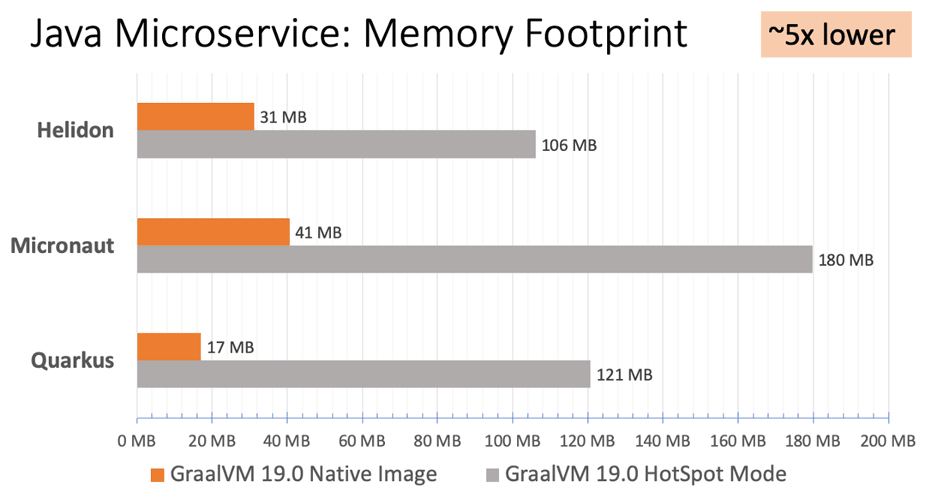

# Graal VM

网上每隔一段时间就能见到几条“未来X语言将会取代Java”的新闻，此处“X”可以用Kotlin、Golang、Dart、JavaScript、Python……等各种编程语言来代入。这大概就是长期占据[编程语言榜单](https://www.tiobe.com/tiobe-index/)第一位的烦恼，天下第一总避免不了挑战者相伴。

如果Java有拟人化的思维，它应该从来没有惧怕过被哪一门语言所取代，Java“天下第一”的底气不在于语法多么先进好用，而是来自它庞大的用户群和极其成熟的软件生态，这在朝夕之间难以撼动。不过，既然有那么多新、旧编程语言的兴起躁动，说明必然有其需求动力所在，譬如互联网之于JavaScript、人工智能之于Python，微服务风潮之于Golang等等。大家都清楚不太可能有哪门语言能在每一个领域都尽占优势，Java已是距离这个目标最接近的选项，但若“天下第一”还要百尺竿头更进一步的话，似乎就只能忘掉Java语言本身，踏入无招胜有招的境界。

2018年4月，Oracle Labs新公开了一项黑科技：[Graal VM](https://www.graalvm.org/)，从它的口号“Run Programs Faster Anywhere”就能感觉到一颗蓬勃的野心，这句话显然是与1995年Java刚诞生时的“Write Once，Run Anywhere”在遥相呼应。

:::center

Graal VM
:::

Graal VM被官方称为“Universal VM”和“Polyglot VM”，这是一个在HotSpot虚拟机基础上增强而成的跨语言全栈虚拟机，可以作为“任何语言”的运行平台使用，这里“任何语言”包括了Java、Scala、Groovy、Kotlin等基于Java虚拟机之上的语言，还包括了C、C++、Rust等基于LLVM的语言，同时支持其他像JavaScript、Ruby、Python和R语言等等。Graal VM可以无额外开销地混合使用这些编程语言，支持不同语言中混用对方的接口和对象，也能够支持这些语言使用已经编写好的本地库文件。

Graal VM的基本工作原理是将这些语言的源代码（例如JavaScript）或源代码编译后的中间格式（例如LLVM字节码）通过解释器转换为能被Graal VM接受的[中间表示](https://zh.wikipedia.org/wiki/%E4%B8%AD%E9%96%93%E8%AA%9E%E8%A8%80)（Intermediate Representation，IR），譬如设计一个解释器专门对LLVM输出的字节码进行转换来支持C和C++语言，这个过程称为“[程序特化](https://en.wikipedia.org/wiki/Partial_evaluation)”（Specialized，也常称为Partial Evaluation）。Graal VM提供了[Truffle工具集](https://github.com/oracle/graal/tree/master/truffle)来快速构建面向一种新语言的解释器，并用它构建了一个称为[Sulong](https://github.com/oracle/graal/tree/master/sulong)的高性能LLVM字节码解释器。

以更严格的角度来看，Graal VM才是真正意义上与物理计算机相对应的高级语言虚拟机，理由是它与物理硬件的指令集一样，做到了只与机器特性相关而不与某种高级语言特性相关。Oracle Labs的研究总监Thomas Wuerthinger在接受[InfoQ采访](https://www.infoq.com/news/2018/04/oracle-graalvm-v1/)时谈到：“随着Graal VM 1.0的发布，我们已经证明了拥有高性能的多语言虚拟机是可能的，并且实现这个目标的最佳方式不是通过类似Java虚拟机和微软CLR那样带有语言特性的字节码”。对于一些本来就不以速度见长的语言运行环境，由于Graal VM本身能够对输入的中间表示进行自动优化，在运行时还能进行即时编译优化，往往使用Graal VM实现能够获得比原生编译器更优秀的执行效率，譬如Graal.js要优于Node.js、Graal.Python要优于CPtyhon，TruffleRuby要优于Ruby MRI，FastR要优于R语言等等。

针对Java而言，Graal VM本来就是在HotSpot基础上诞生的，天生就可作为一套完整的符合Java SE 8标准Java虚拟机来使用。它和标准的HotSpot差异主要在即时编译器上，其执行效率、编译质量目前与标准版的HotSpot相比也是互有胜负。但现在Oracle Labs和美国大学里面的研究院所做的最新即时编译技术的研究全部都迁移至基于Graal VM之上进行了，其发展潜力令人期待。如果Java语言或者HotSpot虚拟机真的有被取代的一天，那从现在看来Graal VM是希望最大的一个候选项，这场革命很可能会在Java使用者没有明显感觉的情况下悄然而来，Java世界所有的软件生态都没有发生丝毫变化，但天下第一的位置已经悄然更迭。

## 新一代即时编译器

对需要长时间运行的应用来说，由于经过充分预热，热点代码会被HotSpot的探测机制准确定位捕获，并将其编译为物理硬件可直接执行的机器码，在这类应用中Java的运行效率很大程度上是取决于即时编译器所输出的代码质量。

HotSpot虚拟机中包含有两个即时编译器，分别是编译时间较短但输出代码优化程度较低的客户端编译器（简称为C1）以及编译耗时长但输出代码优化质量也更高的服务端编译器（简称为C2），通常它们会在分层编译机制下与解释器互相配合来共同构成HotSpot虚拟机的执行子系统的。

自JDK 10起，HotSpot中又加入了一个全新的即时编译器：Graal编译器，看名字就可以联想到它是来自于前一节提到的Graal VM。Graal编译器是作为C2编译器替代者的角色登场的。C2的历史已经非常长了，可以追溯到Cliff Click大神读博士期间的作品，这个由C++写成的编译器尽管目前依然效果拔群，但已经复杂到连Cliff Click本人都不愿意继续维护的程度。而Graal编译器本身就是由Java语言写成，实现时又刻意与C2采用了同一种名为“Sea-of-Nodes”的高级中间表示（High IR）形式，使其能够更容易借鉴C2的优点。Graal编译器比C2编译器晚了足足二十年面世，有着极其充沛的后发优势，在保持能输出相近质量的编译代码的同时，开发效率和扩展性上都要显著优于C2编译器，这决定了C2编译器中优秀的代码优化技术可以轻易地移植到Graal编译器上，但是反过来Graal编译器中行之有效的优化在C2编译器里实现起来则异常艰难。这种情况下，Graal的编译效果短短几年间迅速追平了C2，甚至某些测试项中开始逐渐反超C2编译器。Graal能够做比C2更加复杂的优化，如“[部分逃逸分析](http://www.ssw.uni-linz.ac.at/Research/Papers/Stadler14/Stadler2014-CGO-PEA.pdf)”（Partial Escape Analysis），也拥有比C2更容易使用“[激进预测性优化](http://citeseerx.ist.psu.edu/viewdoc/summary?doi=10.1.1.78.6063)”（Aggressive Speculative Optimization）的策略，支持自定义的预测性假设等等。

今天的Graal编译器尚且年幼，还未经过足够多的实践验证，所以仍然带着“实验状态”的标签，需要用开关参数去激活，这让笔者不禁联想起JDK 1.3时代，HotSpot虚拟机刚刚横空出世时的场景，同样也是需要用开关激活，也是作为Classic虚拟机的替代品的一段历史。

Graal编译器未来的前途可期，作为Java虚拟机执行代码的最新引擎，它的持续改进，会同时为HotSpot与Graal VM注入更快更强的驱动力。

## 向原生迈进

对不需要长时间运行的，或者小型化的应用而言，Java（而不是指Java ME）天生就带有一些劣势，这里并不光是指跑个HelloWorld也需要百多兆的JRE之类的问题，而更重要的是指近几年从大型单体应用架构向小型微服务应用架构发展的技术潮流下，Java表现出来的不适应。

在微服务架构的视角下，应用拆分后，单个微服务很可能就不再需要再面对数十、数百GB乃至TB的内存，有了高可用的服务集群，也无须追求单个服务要7×24小时不可间断地运行，它们随时可以中断和更新；但相应地，Java的启动时间相对较长、需要预热才能达到最高性能等特点就显得相悖于这样的应用场景。在无服务架构中，矛盾则可能会更加突出，比起服务，一个函数的规模通常会更小，执行时间会更短，当前最热门的无服务运行环境AWS Lambda所允许的最长运行时间仅有15分钟。

一直把软件服务作为重点领域的Java自然不可能对此视而不见，在最新的几个JDK版本的功能清单中，已经陆续推出了跨进程的、可以面向用户程序的类型信息共享（Application Class Data Sharing，AppCDS，允许把加载解析后的类型信息缓存起来，从而提升下次启动速度，原本CDS只支持Java标准库，在JDK 10时的AppCDS开始支持用户的程序代码）、无操作的垃圾收集器（Epsilon，只做内存分配而不做回收的收集器，对于运行完就退出的应用十分合适）等改善措施。而酝酿中的一个更彻底的解决方案，是逐步开始对提前编译（Ahead of Time Compilation，AOT）提供支持。

提前编译是相对于即时编译的概念，提前编译能带来的最大好处是Java虚拟机加载这些已经预编译成二进制库之后就能够直接调用，而无须再等待即时编译器在运行时将其编译成二进制机器码。理论上，提前编译可以减少即时编译带来的预热时间，减少Java应用长期给人带来的“第一次运行慢”不良体验，可以放心地进行很多全程序的分析行为，可以使用时间压力更大的优化措施。

但是提前编译的坏处也很明显，它破坏了Java“一次编写，到处运行”的承诺，必须为每个不同的硬件、操作系统去编译对应的发行包。也显著降低了Java链接过程的动态性，必须要求加载的代码在编译期就是全部已知的，而不能再是运行期才确定，否则就只能舍弃掉已经提前编译好的版本，退回到原来的即时编译执行状态。

早在JDK 9时期，Java 就提供了实验性的Jaotc命令来进行提前编译，不过多数人试用过后都颇感失望，大家原本期望的是类似于Excelsior JET那样的编译过后能生成本地代码完全脱离Java虚拟机运行的解决方案，但Jaotc其实仅仅是代替掉即时编译的一部分作用而已，仍需要运行于HotSpot之上。

直到[Substrate VM](https://github.com/oracle/graal/tree/master/substratevm)出现，才算是满足了人们心中对Java提前编译的全部期待。Substrate VM是在Graal VM 0.20版本里新出现的一个极小型的运行时环境，包括了独立的异常处理、同步调度、线程管理、内存管理（垃圾收集）和JNI访问等组件，目标是代替HotSpot用来支持提前编译后的程序执行。它还包含了一个本地镜像的构造器（Native Image Generator）用于为用户程序建立基于Substrate VM的本地运行时镜像。这个构造器采用指针分析（Points-To Analysis）技术，从用户提供的程序入口出发，搜索所有可达的代码。在搜索的同时，它还将执行初始化代码，并在最终生成可执行文件时，将已初始化的堆保存至一个堆快照之中。这样一来，Substrate VM就可以直接从目标程序开始运行，而无须重复进行Java虚拟机的初始化过程。但相应地，原理上也决定了Substrate VM必须要求目标程序是完全封闭的，即不能动态加载其他编译期不可知的代码和类库。基于这个假设，Substrate VM才能探索整个编译空间，并通过静态分析推算出所有虚方法调用的目标方法。

Substrate VM带来的好处是能显著降低了内存占用及启动时间，由于HotSpot本身就会有一定的内存消耗（通常约几十MB），这对最低也从几GB内存起步的大型单体应用来说并不算什么，但在微服务下就是一笔不可忽视的成本。根据Oracle官方给出的[测试数据](https://www.infoq.com/presentations/graalvm-performance/)，运行在Substrate VM上的小规模应用，其内存占用和启动时间与运行在HotSpot相比有了5倍到50倍的下降，具体结果如下图所示：

:::center

内存占用对比

启动时间对比
:::

Substrate VM补全了Graal VM“Run Programs Faster Anywhere”愿景蓝图里最后的一块拼图，让Graal VM支持其他语言时不会有重量级的运行负担。譬如运行JavaScript代码，Node.js的V8引擎执行效率非常高，但即使是最简单的HelloWorld，它也要使用约20MB的内存，而运行在Substrate VM上的Graal.js，跑一个HelloWorld则只需要4.2MB内存而已，且运行速度与V8持平。Substrate VM 的轻量特性，使得它十分适合于嵌入至其他系统之中，譬如[Oracle自家的数据库](https://oracle.github.io/oracle-db-mle)就已经开始使用这种方式支持用不同的语言代替PL/SQL来编写存储过程。

## 没有虚拟机的Java

尽管Java已经看清楚了在微服务时代的前进目标，但是，Java语言和生态在微服务、微应用环境中的天生的劣势并不会一蹴而就地被解决，通往这个目标的道路注定会充满荆棘；尽管已经有了放弃“一次编写，到处运行”、放弃语言动态性的思想准备，但是，这些特性并不单纯是宣传口号，它们在Java语言诞生之初就被植入到基因之中，当Graal VM试图打破这些规则的同时，也受到了Java语言和在其之上的生态生态的强烈反噬，笔者选择其中最主要的一些困列举如下：

- 某些Java语言的特性，使得Graal VM编译本地镜像的过程变得极为艰难。譬如常见的反射，除非使用[安全管理器](/architect-perspective/general-architecture/system-security/authentication.html)去专门进行认证许可，否则反射机制具有在运行期动态调用几乎所有API接口的能力，且具体会调用哪些接口，在程序不会真正运行起来的编译期是无法获知的。反射显然是Java不能放弃不能妥协的重要特性，为此，只能由程序的开发者明确地告知Graal VM有哪些代码可能被反射调用（通过JSON配置文件的形式），Graal VM才能在编译本地程序时将它们囊括进来。

  ```json
  [
      {
          name: "com.github.fenixsoft.SomeClass",
          allDeclaredConstructors: true,
          allPublicMethods: true
      },
      {
          name: "com.github.fenixsoft.AnotherClass",
          fileds: [{name: "foo"}, {name: "bar"}],
          methods: [{
              name: "<init>",
              parameterTypes: ["char[]"]
          }]
      },
      // something else ……
  ]
  ```

  这是一种可操作性极其低下却又无可奈何的解决方案，即使开发者接受不厌其烦地列举出自己代码中所用到的反射API，但他们又如何能保证程序所引用的其他类库的反射行为都已全部被获知，其中没有任何遗漏？与此类似的还有另外一些语言特性，如动态代理等。另外，一切非代码性质的资源，如最典型的配置文件等，也都必须明确加入配置中才能被Graal VM编译打包。这导致了如果没有专门的工具去协助，使用Graal VM编译Java的遗留系统即使理论可行，实际操作也将是极度的繁琐。

- 大多数运行期对字节码的生成和修改操作，在Graal VM看来都是无法接受的，因为Substrate VM里面不再包含即时编译器和字节码执行引擎，所以一切可能被运行的字节码，都必须经过AOT编译成为原生代码。请不要觉得运行期直接生成字节码会很罕见，误以为导致的影响应该不算很大。事实上，多数实际用于生产的Java系统都或直接或讲解、或多或少引用了ASM、CGLIB、Javassist这类字节码库。举个例子，CGLIB是通过运行时产生字节码（生成代理类的子类）来做动态代理的，长期以来这都是Java世界里进行类增强的主流形式，因为面向接口的增强可以使用JDK自带的动态代理，但对类的增强则并没有多少选择的余地。CGLIB也是Spring用来做类增强的选择，但Graal VM明确表示是不可能支持CGLIB的，因此，这点就必须由用户（面向接口编程）、框架（Spring这些DI框架放弃CGLIB增强）和Graal VM（起码得支持JDK的动态代理，留条活路可走）来共同解决。自Spring Framework 5.2起，@Configuration注解中加入了一个新的proxyBeanMethods参数，设置为false则可避免Spring对与非接口类型的Bean进行代理。同样地，对应在Spring Boot 2.2中，@SpringBootApplication注解也增加了proxyBeanMethods参数，通常采用Graal VM去构建的Spring Boot本地应用都需要设置该参数。

- 一切HotSpot虚拟机本身的内部接口，譬如JVMTI、JVMCI等，在都将不复存在了——在本地镜像中，连HotSpot本身都被消灭了，这些接口自然成了无根之木。这对使用者一侧的最大影响是再也无法进行Java语言层次的远程调试了，最多只能进行汇编层次的调试。在生产系统中一般也没有人这样做，开发环境就没必要采用Graal VM编译，这点的实际影响并不算大。

- Graal VM放弃了一部分可以妥协的语言和平台层面的特性，譬如Finalizer、安全管理器、InvokeDynamic指令和MethodHandles，等等，在Graal VM中都被声明为不支持的，这些妥协的内容大多倒并非全然无法解决，主要是基于工作量性价比的原因。能够被放弃的语言特性，说明确实是影响范围非常小的，所以这个对使用者来说一般是可以接受的。

- ……

以上，是Graal VM在Java语言中面临的部分困难，在整个Java的生态系统中，数量庞大的第三方库才是真正最棘手的难题。可以预料，这些第三方库一旦脱离了Java虚拟机，在原生环境中肯定会暴露出无数千奇百怪的异常行为。Graal VM团队对此的态度非常务实，并没有直接硬啃。要建设可持续、可维护的Graal VM，就不能为了兼容现有JVM生态，做出过多的会影响性能、优化空间和未来拓展的妥协牺牲，为此，应该也只能反过来由Java生态去适应Graal VM，这是Graal VM团队明确传递出对第三方库的态度：

:::quote 3rd party libraries

Graal VM native support needs to be sustainable and maintainable, that's why we do not want to maintain fragile pathches for the whole JVM ecosystem.

The ecosystem of libraries needs to support it natively.

::: right

—— Sébastien Deleuze，[DEVOXX 2019](https://www.youtube.com/watch?v=3eoAxphAUIg)

:::

为了推进Java生态向Graal VM兼容，Graal VM主动拉拢了Java生态中最庞大的一个派系：Spring。从2018年起，来自Oracle的Graal VM团队与来自Pivotal的Spring团队已经紧密合作了很长的一段时间，共同创建了[Spring Graal Native](https://github.com/spring-projects-experimental/spring-graal-native)项目来解决Spring全家桶在Graal VM上的运行适配问题，在不久的将来（预计应该是2020年10月左右），下一个大的Spring版本（Spring Framework 5.3、Spring Boot 2.3）的其中一项主要改进就是能够开箱即用地支持Graal VM，这样，用于微服务环境的Spring Cloud便会获得不受Java虚拟机束缚的更广阔舞台空间。

## Spring over Graal

前面几部分，我们以定性的角度分析了Graal VM诞生的背景与它的价值，在最后这部分，我们尝试进行一些实践和定量的讨论，介绍具体如何使用Graal VM之余，也希望能以更加量化的角度去理解程序运行在Graal VM之上，会有哪些具体的收益和代价。

尽管需要到2020年10月正式发布之后，Spring对Graal VM的支持才会正式提供，但现在的我们其实已经可以使用Graal VM来（实验性地）运行Spring、Spring Boot、Spring Data、Netty、JPA等等的一系列组件（不过SpringCloud中的组件暂时还不行）。接下来，我们将尝试使用Graal VM来编译一个标准的Spring Boot应用：

- **环境准备**：

  - 安装Graal VM，你可以选择直接[下载](https://github.com/graalvm/graalvm-ce-builds/releases)安装（版本选择Graal VM CE 20.0.0），然后配置好PATH和JAVA_HOME环境变量即可；也可以选择使用[SDKMAN](https://sdkman.io/install)来快速切换环境。个人推荐后者，毕竟目前还不适合长期基于Graal VM环境下工作，经常手工切换会很麻烦。

    ``` bash
    # 安装SDKMAN
    $ curl -s "https://get.sdkman.io" | bash

    # 安装Graal VM
    $ sdk install java 20.0.0.r8-grl
    ```

  - 安装本地镜像编译依赖的LLVM工具链。

    ```bash
    # gu命令来源于Graal VM的bin目录
    $ gu install native-image
    ```

    请注意，这里已经假设你机器上已有基础的GCC编译环境，即已安装过build-essential、libz-dev等套件。没有的话请先行安装。对于Windows环境来说，这步是需要Windows SDK 7.1中的C++编译环境来支持。我个人并不建议在Windows上进行Java应用的本地化操作，如果说在Linux中编译一个本地镜像，通常是为了打包到Docker，然后发布到服务器中使用。那在Windows上编译一个本地镜像，你打算用它来干什么呢？

- **编译准备**：

  - 首先，我们先假设你准备编译的代码是“符合要求”的，即没有使用到Graal VM不支持的特性，譬如前面提到的Finalizer、CGLIB、InvokeDynamic这类功能。然后，由于我们用的是Graal VM的Java 8版本，也必须假设你编译使用Java语言级别在Java 8以内。

  - 然后，我们需要用到尚未正式对外发布的Spring Boot 2.3，目前最新的版本是Spring Boot 2.3.0.M4。请将你的pom.xml中的Spring Boot版本修改如下（假设你编译用的是Maven，用Gradle的请自行调整）：

    ```xml
    <parent>
        <groupId>org.springframework.boot</groupId>
        <artifactId>spring-boot-starter-parent</artifactId>
        <version>2.3.0.M4</version>
        <relativePath/>
    </parent>
    ```

    由于是未发布的Spring Boot版本，所以它在Maven的中央仓库中是找不到的，需要手动加入Spring的私有仓库，如下所示：

    ```xml
    <repositories>
        <repository>
            <id>spring-milestone</id>
            <name>Spring milestone</name>
            <url>https://repo.spring.io/milestone</url>
        </repository>
    </repositories>
    ```

  - 最后，尽管我们可以通过命令行（使用native-image命令）来直接进行编译，这对于没有什么依赖的普通Jar包、写一个Helloworld来说都是可行的，但对于Spring Boot，光是在命令行中写Classpath上都忙活一阵的，建议还是使用[Maven插件](https://www.graalvm.org/docs/reference-manual/native-image/#integration-with-maven)来驱动Graal VM编译，这个插件能够根据Maven的依赖信息自动组织好Classpath，你只需要填其他命令行参数就行了。因为并不是每次编译都需要构建一次本地镜像，为了不干扰使用普通Java虚拟机的编译，建议在Maven中独立建一个Profile来调用Graal VM插件，具体如下所示：

    ```xml
    <profiles>
      <profile>
        <id>graal</id>
        <build>
          <plugins>
            <plugin>
              <groupId>org.graalvm.nativeimage</groupId>
              <artifactId>native-image-maven-plugin</artifactId>
              <version>20.0.0</version>
              <configuration>
                <buildArgs>-Dspring.graal.remove-unused-autoconfig=true --no-fallback -H:+ReportExceptionStackTraces --no-server</buildArgs>
              </configuration>
              <executions>
                <execution>
                  <goals>
                    <goal>native-image</goal>
                  </goals>
                  <phase>package</phase>
                </execution>
              </executions>
            </plugin>
            <plugin>
              <groupId>org.springframework.boot</groupId>
              <artifactId>spring-boot-maven-plugin</artifactId>
            </plugin>
          </plugins>
        </build>
      </profile>
    </profiles>
    ```

    这个插件同样在Maven中央仓库中不存在，所以也得加上前面Spring的私有库：

    ```xml
    <pluginRepositories>
        <pluginRepository>
            <id>spring-milestone</id>
            <name>Spring milestone</name>
            <url>https://repo.spring.io/milestone</url>
        </pluginRepository>
    </pluginRepositories>
    ```

    至此，编译环境的准备顺利完成。

- **程序调整**：

  - 首先，前面提到了Graal VM不支持CGLIB，只能使用JDK动态代理，所以应当把Spring对普通类的Bean增强给关闭掉：

    ```java
    @SpringBootApplication(proxyBeanMethods = false)
    public class ExampleApplication {

        public static void main(String[] args) {
            SpringApplication.run(ExampleApplication.class, args);
        }

    }
    ```

  - 然后，这是最麻烦的一个步骤，你程序里反射调用过哪些API、用到哪些资源、动态代理，还有哪些类型需要在编译期初始化的，都必须使用JSON配置文件逐一告知Graal VM。前面也说过了，这事情只有理论上的可行性，实际做起来完全不可操作。Graal VM的开发团队当然也清楚这一点，所以这个步骤实际的处理途径有两种，第一种是假设你依赖的第三方包，全部都在Jar包中内置了以上编译所需的配置信息，这样你只要提供你程序里用户代码中用到的配置即可，如果你程序里没写过反射、没用过动态代理什么的，那就什么配置都无需提供。第二种途径是Graal VM计划提供一个Native Image Agent的代理，只要将它挂载在在程序中，以普通Java虚拟机运行一遍，把所有可能的代码路径都操作覆盖到，这个Agent就能自动帮你根据程序实际运行情况来生成编译所需要的配置，这样无论是你自己的代码还是第三方的代码，都不需要做预先的配置。目前，第二种方式中的Agent尚未正式发布，只有方式一是可用的。幸好，Spring与Graal VM共同维护的在[Spring Graal Native](https://github.com/spring-projects-experimental/spring-graal-native)项目已经提供了大多数Spring Boot组件的配置信息（以及一些需要在代码层面处理的Patch），我们只需要简单依赖该工程即可。

    ```xml
    <dependencies>
        <dependency>
            <groupId>org.springframework.experimental</groupId>
            <artifactId>spring-graal-native</artifactId>
            <version>0.6.1.RELEASE</version>
        </dependency>
        <dependency>
          <groupId>org.springframework</groupId>
          <artifactId>spring-context-indexer</artifactId>
        </dependency>
    </dependencies>
    ```

    另外还有一个小问题，由于目前Spring Boot嵌入的Tomcat中，WebSocket部分在JMX反射上还有一些瑕疵，在[修正该问题的PR](https://github.com/apache/tomcat/pull/274)被Merge之前，暂时需要手工去除掉这个依赖：

    ```xml
    <dependencies>
        <dependency>
            <groupId>org.springframework.boot</groupId>
            <artifactId>spring-boot-starter-web</artifactId>
            <exclusions>
                <exclusion>
                    <groupId>org.apache.tomcat.embed</groupId>
                    <artifactId>tomcat-embed-websocket</artifactId>
                </exclusion>
            </exclusions>
        </dependency>
    </dependencies>
    ```

  - 最后，在Maven中给出程序的启动类的路径：

    ```xml
    <properties>
        <start-class>com.example.ExampleApplication</start-class>
    </properties>
    ```

- **开始编译**：

  - 到此一切准备就绪，通过Maven进行编译：

    ```bash
    $ mvn -Pgraal clean package
    ```
  编译的结果默认输出在target目录，以启动类的名字命名。

  - 因为AOT编译可以放心大胆地进行大量全程序的重负载优化，所以无论是编译时间还是空间占用都非常可观。笔者在intel 9900K、64GB内存的机器上，编译了一个只引用了org.springframework.boot:spring-boot-starter-web的Helloworld类型的工程，大约耗费了两分钟时间。

    ```
    [com.example.exampleapplication:9839]   (typeflow):  22,093.72 ms,  6.48 GB
    [com.example.exampleapplication:9839]    (objects):  34,528.09 ms,  6.48 GB
    [com.example.exampleapplication:9839]   (features):   6,488.74 ms,  6.48 GB
    [com.example.exampleapplication:9839]     analysis:  65,465.65 ms,  6.48 GB
    [com.example.exampleapplication:9839]     (clinit):   2,135.25 ms,  6.48 GB
    [com.example.exampleapplication:9839]     universe:   4,449.61 ms,  6.48 GB
    [com.example.exampleapplication:9839]      (parse):   2,161.78 ms,  6.32 GB
    [com.example.exampleapplication:9839]     (inline):   3,113.77 ms,  6.25 GB
    [com.example.exampleapplication:9839]    (compile):  15,892.88 ms,  6.56 GB
    [com.example.exampleapplication:9839]      compile:  25,044.34 ms,  6.56 GB
    [com.example.exampleapplication:9839]        image:   6,580.71 ms,  6.63 GB
    [com.example.exampleapplication:9839]        write:   1,362.73 ms,  6.63 GB
    [com.example.exampleapplication:9839]      [total]: 120,410.26 ms,  6.63 GB
    [INFO]
    [INFO] --- spring-boot-maven-plugin:2.3.0.M4:repackage (repackage) @ exampleapplication ---
    [INFO] Replacing main artifact with repackaged archive
    [INFO] ------------------------------------------------------------------------
    [INFO] BUILD SUCCESS
    [INFO] ------------------------------------------------------------------------
    [INFO] Total time: 02:08 min
    [INFO] Finished at: 2020-04-25T22:18:14+08:00
    [INFO] Final Memory: 38M/599M
    [INFO] ------------------------------------------------------------------------
    ```

- **效果评估**：

  - 笔者使用Graal VM编译一个最简单的Helloworld程序（就只在控制台输出个Helloworld，什么都不依赖），最终输出的结果大约3.6MB，启动时间能低至2ms左右。如果用这个程序去生成Docker镜像（不基于任何基础镜像，即使用FROM scratch打包），产生的镜像还不到3.8MB。 而OpenJDK官方提供的Docker镜像，即使是slim版，其大小也在200MB到300MB之间。

  - 使用Graal VM编译一个简单的Spring Boot Web应用，仅导入Spring Boot的Web Starter的依赖的话，编译结果有77MB，原始的Fat Jar包大约是16MB，这样打包出来的Docker镜像可以不依赖任何基础镜像，大小仍然是78MB左右（实际使用时最好至少也要基于alpine吧，不差那几MB）。相比起空间上的收益，启动时间上的改进是更主要的，Graal VM的本地镜像启动时间比起基于虚拟机的启动时间有着绝对的优势，一个普通Spring Boot的Web应用启动一般2、3秒之间，而本地镜像只要100毫秒左右即可完成启动，这确实有了数量级的差距。

  - 不过，必须客观地说明一点，尽管Graal VM在启动时间、空间占用、内存消耗等容器化环境中比较看重的方面确实比HotSpot有明显的改进，尽管Graal VM可以放心大胆地使用重负载的优化手段，但如果是处于长时间运行这个前提下，至少到目前为止，没有任何迹象表明它能够超越经过充分预热后的HotSpot。在延迟、吞吐量、可监控性等方面，仍然是HotSpot占据较大优势，下图引用了DEVOXX 2019中Graal VM团队自己给出的Graal VM与HotSpot JIT在各个方面的对比评估：

:::center

Graal VM与HotSpot的对比
:::

Graal VM团队同时也说了，Graal VM有望在2020年之内，在延迟和吞吐量这些关键指标上追评HotSpot现在的表现。Graal VM毕竟是一个2018年才正式公布的新生事物，我们能看到它这两三年间在可用性、易用性和性能上持续地改进，Graal VM有望成为Java在微服务时代里的最重要的基础设施变革者，这项改进的结果如何，甚至可能与Java的前途命运息息相关。
