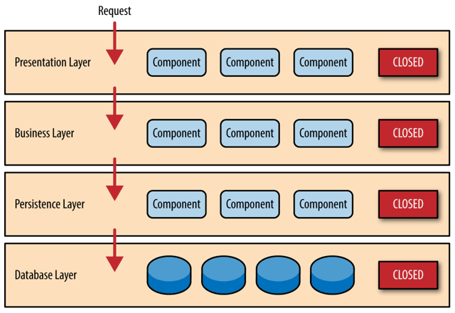
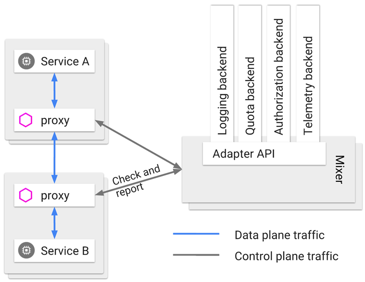

# 服务架构演进史

服务架构的演进历史这一章，我们借讨论历史之名，来梳理微服务发展里程中出现的大量名词、概念，借着微服务的演变过程，我们将从这些概念起源的最初，去分析它们是什么、它们取代了什么、以及它们为什么能够在斗争中取得成功，为什么变得不可或缺的支撑，又或者它们为什么会失败，在竞争中被淘汰，或逐渐湮灭于历史的烟尘当中。

## 原始分布式时代

可能与绝大多数人心中的认知会有差异，“使用多个独立的分布式服务共同构建一个更大型系统”的设想与实际尝试，反而要比今天大家所了解的大型单体系统出现的时间更早。

在20世纪的70年代末期到80年代初，计算机科学刚经历了从以大型机为主向以微型机为主的蜕变，计算机逐渐从一种存在于研究机构、实验室当中的科研设备，转变为存在于商业企业中甚至家庭用户的生产设备。此时的计算机系统通常具有16位、5MB Hz频率以下的处理器和256KB左右的内存地址空间，譬如，著名的[Intel 80286处理器](https://zh.wikipedia.org/wiki/Intel_80286)就是在1982年发布，流行于80年代中后期到90年代初期。当时计算机的硬件水平的局限性，直接影响到了单台机器上信息系统能够达到的最大规模，为了突破算力限制，Unix系统标准化组织[开放软件基金会](https://zh.wikipedia.org/wiki/%E9%96%8B%E6%94%BE%E8%BB%9F%E9%AB%94%E5%9F%BA%E9%87%91%E6%9C%83)（Open Software Foundation，OSF，也即后来的“国际开放标准组织”）制订了一种名为“[分布式运算环境](https://zh.wikipedia.org/wiki/%E5%88%86%E6%95%A3%E5%BC%8F%E9%81%8B%E7%AE%97%E7%92%B0%E5%A2%83)”（Distributed Computing Environment，DCE）的软件架构，其中包括了一整套完整的分布式服务组件与规范，其中很多技术概念对*nix系统乃至于今天计算机技术的诸多领域都产生了巨大而深远的影响，譬如远程服务调用（Remote Procedure Call，当时被称为[DCE/RPC](https://zh.wikipedia.org/wiki/DCE/RPC)，后来Sun向IEFT提交了不限于Unix系统的、基于TCP/IP更开放的远程服务调用标准[ONC RPC](https://zh.wikipedia.org/wiki/%E9%96%8B%E6%94%BE%E7%B6%B2%E8%B7%AF%E9%81%8B%E7%AE%97%E9%81%A0%E7%AB%AF%E7%A8%8B%E5%BA%8F%E5%91%BC%E5%8F%AB)），分布式文件系统（Distributed File System，当时被称为[DCE/DFS](DCE/DFS)）、时间服务、授权服务，等等。

这些技术的主旨是都让分布式环境中的过程调用、存储等操作透明化（这件事情远比当时想的要困难，实际上没有做到透明），使开发人员不必关心他们调用的过程调用或其他资源是位于本地还是远程。这是计算机科学中第一次有组织领导、有标准可循、有巨大投入的分布式计算的尝试，但无论是DCE还是稍后出现的CORBA，都并没有取得成功，将一个系统直接拆分到不同的机器之中，这样做带来的网络传输问题、数据一致性问题和编码复杂度等方面付出的代价远远超过了分布式所取得的收益，这次尝试最大的收获就是对RPC、DFS等概念的开创，以及得到了一个价值千金的教训：“**某个功能能够进行分布式，并不意味着它就应该进行分布式，强行这么做，只会自寻苦果**”。

:::quote Observation about distributed computing

Just because something **can** be distributed doesn’t mean it **should** be distributed. Trying to make a distributed call act like a local call always ends in tears

:::right 

—— [Kyle Brown](https://en.wikipedia.org/wiki/Kyle_Brown_(computer_scientist))，IBM Fellow，[Beyond buzzwords](https://developer.ibm.com/technologies/microservices/articles/cl-evolution-microservices-patterns/)

:::

这个时间段正是[摩尔定律](https://zh.wikipedia.org/wiki/%E6%91%A9%E5%B0%94%E5%AE%9A%E5%BE%8B)最稳定发挥的黄金时期，微型计算机的性能以每两年增长一倍的速度提升。硬件算力束缚软件规模的铁链很快变得松动，信息系统开始了以单台或少数几台微机即可作为服务器的单体系统时代，尽管如此，对分布式计算、远程服务调用的研究从未有中断，关于这条分支早期的发展，笔者已在服务设计风格中“[远程服务调用](/architect-perspective/general-architecture/api-style/rpc.html)”一节有过介绍。

## 单体系统时代

单体系统是绝大部软件从业者都学习、实践过的架构形式，许多介绍微服务的书籍和技术资料中也把这种架构形式称作“巨石系统”，且某些文章中为对比展示出微服务架构的优点，往往会或有意或无意地强调、放大这种架构形式的缺点，以至于让人获得某种巨石系统就“人如其名”是铁板一块无可拆分也不可伸缩的，单体架构就不如微服务架构先进好用的潜在暗示。

如果说单体架构是一块巨石，不可拆分的显然有失偏颇，“单体”只是表明系统中主要的过程调用（不算数据库、文件、缓存等这类资源访问）都是进程内调用，不会发生[进程间通讯](https://zh.wikipedia.org/wiki/%E8%A1%8C%E7%A8%8B%E9%96%93%E9%80%9A%E8%A8%8A)（Inter-Process Communication，IPC。RPC属于IPC的一种特例，但请注意这里两个“PC”不是同个单词的缩写）。事实上，笔者从来没有见过生产环境中的哪个大型的系统是完全不分层的。分层架构（Layered Architecture）已是现在大多数系统建设中普遍认可、普遍采用的设计方法，无论是单体还是微服务，抑或是其他架构风格，都会对代码进行横向拆分，收到的外部的请求在各层之间以不同形式的数据结构进行流转传递，触及最末端的数据库后依次返回响应。在这个意义上的“拆分”，单体架构完全不会展露出丝毫的弱势，反而还可能会因更容易开发、部署、测试而获得一些便捷性上的好处。

:::center

图片来自O'Reilly的开放文档《[Software Architecture Patterns](https://www.oreilly.com/programming/free/files/software-architecture-patterns.pdf)》
:::

至于比较微服务、单体架构哪种先进，笔者认为“先进”不能是绝对的，这点可以举一个非常浅显的例子来说明。譬如，沃尔玛将超市分为仓储部、采购部、安保部、库存管理部、巡检部、质量管理部、市场营销部，等等，可以划分职责，明确边界，让管理能力能支持企业的成长规模；但如果你家楼下开的小卖部，爸、妈加儿子，再算上看家的中华田园犬小黄一共也就只有四名员工，也去追求先进管理，划分仓储部、采购部、库存管理部……那纯粹是给自己找麻烦。

单体系统真正体现弱势的地方在于垂直切分上，哪怕是信息系统中两个相互毫无关联的子系统，也必须部署到一起。当系统规模小时这是优势，但系统规模大的时候，修改时候的部署成本、技术升级时的迁移成本都会变得高昂。按前面的例子来说，就是当公司小时，让安保部和质检部两个不相干的部门在同一栋大楼中办公是节约资源，但当公司人数增加，办公室已经拥挤不堪，也最多只能在楼顶加盖新楼层（相当于增强硬件性能），而不能让安保、质检分开地方办公，这才是缺陷所在。

不过，为了实现垂直拆分，并不意味着一定要依靠微服务架构才能解决，在新旧世纪之交，人们曾经探索过几种服务垂直拆分的方法，这些架构方法后来导致了面向服务架构（Service-Oriented Architecture）的一段兴盛期，我们称其为“SOA时代”。

## SOA时代

当系统规模变大后，为了能对系统进行垂直拆分、复用，人们尝试过多种途径，笔者列举以下三种较有代表性的架构模式，分别为：

- [烟囱式架构](https://en.wikipedia.org/wiki/Information_silo)（Information Silo Architecture）：信息烟囱又名信息孤岛（Information Island），使用这种架构的系统也被称为孤岛式信息系统或者烟囱式信息系统。它指的是一种完全不与其他相关信息系统之间进行互操作或者说协调工作的信息系统。这样的系统其实并没有什么“架构”可言，如果两个部门真的完全不会发生交互，就并没有什么理由强迫把它们必须在一栋楼里办公；两个不发生交互的信息系统，让他它们使用独立的数据库、服务器即可完成拆分，而唯一的问题，也是致命的问题是，企业中真的存在完全不发生交互的部门？对于两个信息系统来说，哪怕真的毫无业务往来关系，但系统的人员、组织、权限等等主数据，会是完全独立、没有任何重叠的吗？这样“独立拆分”、“老死不相往来”的系统，显然不可能是企业所希望见到的。

- [微内核架构](https://zh.wikipedia.org/wiki/%E5%BE%AE%E5%85%A7%E6%A0%B8)（Microkernel Architecture）：微内核架构也被称为插件式架构（Plug-in Architecture）。既然烟囱式架构中，两个没有业务往来关系的系统也可能需要共享一部分的公共的主数据，那不妨就将这些主数据，连同其他可能被所有系统使用到的公共服务、数据、资源集中到一块，成为一个被所有业务系统共同依赖的核心系统（Kernel，也称为Core System），具体的业务系统就以插件模块（Plug-in Modules）的形式存在，这样便可提供可扩展的，灵活的，天然隔离的功能特性。 
这种模式很适合桌面应用程序，也可以在Web应用程序中使用。事实上，本文列举的各种不同的架构模式一般都可视为整个系统的一种插件。对于产品型应用程序来说，如果我们想将新特性和功能及时加入系统，微内核架构是一种不错的选择。微内核的架构也可以嵌入到其它的架构模式之中，通过插件还可以提供逐步演化的功能和增量开发。所以如果你实现能够支持二次开发的软件系统，微内核是一种良好的架构模式。 
不过，微内核架构也有它的局限和前提，这便是它假设各个插件模块之间是互不认识（不可预知系统会安装哪些模块），不会发生交互的，但无论在企业还是互联网，这一前提假设却通常并不成立，我们必须找到办法，既能垂直拆分系统，也能让拆分后的子系统之间可以互相调用通讯。

:::center

图片来自O'Reilly的开放文档《[Software Architecture Patterns](https://www.oreilly.com/programming/free/files/software-architecture-patterns.pdf)》
:::

- [事件驱动架构](https://en.wikipedia.org/wiki/Event-driven_architecture)（Event-Driven Architecture）：为了能让子系统互相通讯，一种可行的方案是在子系统之间建立一套事件队列管道（Event Queues），来自系统外部的消息将以事件的形式发送至管道中，各个子系统可以从管道里获取自己感兴趣、可以处理的事件消息，可以为事件新增或者修改其中的附加信息，甚至可以自己发布一些新的事件到管道队列中去，如此，每一个消息的处理者都是独立的，高度解耦的，但又能与其他处理者（如果存在该消息处理者的话）通过事件管道进行互动。

:::center

图片来自O'Reilly的开放文档《[Software Architecture Patterns](https://www.oreilly.com/programming/free/files/software-architecture-patterns.pdf)》
:::

当系统演化至事件驱动架构时，第一节提到的仍在并行发展的远程服务调用也来到了SOAP时代（详见[远程服务调用](/architect-perspective/general-architecture/api-style/rpc.html)一文），此时SOA已经有了它登场所需要的全部前置条件。SOA的概念最初由Gartner公司提出，2006年，由IBM、Oracle、SAP等公司共同成立了OSOA联盟（Open Service Oriented Architecture），用于制定和推进SOA相关标准，在2007年，国际标准组织（OASIS）领导下，OSOA联盟的职能并入了新成立了[Open CSA](http://www.oasis-opencsa.org/)组织。

尽管SOA仍是抽象概念，而不是特指某一种具体的技术，但它已经比前面所说的三种架构模式要相对具体、充实了很多，已经不能简单视其为一种架构模式，可以称为是一套软件设计的方法论了。它拥有领导制定技术标准的组织Open CSA；有清晰软件设计的指导原则，譬如服务的封装性、自治、松耦合、可重用、可组合、无状态，等等；明确了采用SOAP作为远程调用的协议，依靠SOAP协议族（WSDL、UDDI和一大票WS-*协议）来完成服务的发布、发现和治理；利用一个被称为[企业服务总线](https://zh.wikipedia.org/zh-hans/%E4%BC%81%E4%B8%9A%E6%9C%8D%E5%8A%A1%E6%80%BB%E7%BA%BF)（Enterprise Service Bus，ESB）的消息管道来实现各个子系统之间的通讯交互，令各服务间在ESB调度下无需相互依赖却能相互通讯，既带来了服务松耦合的好处，也为以后可以进一步实现[业务流程编排](https://zh.wikipedia.org/wiki/%E4%B8%9A%E5%8A%A1%E6%B5%81%E7%A8%8B%E7%AE%A1%E7%90%86)（Business Process Management，BPM）提供了基础；使用[服务数据对象](https://zh.wikipedia.org/wiki/%E6%9C%8D%E5%8A%A1%E6%95%B0%E6%8D%AE%E5%AF%B9%E8%B1%A1)（Service Data Object，SDO）来访问和表示数据，使用[服务组件架构](https://zh.wikipedia.org/wiki/%E6%9C%8D%E5%8A%A1%E7%BB%84%E4%BB%B6%E6%9E%B6%E6%9E%84)（Service Component Architecture，SCA）来定义服务封装的形式和服务运行的容器，等等。

当软件架构发展至SOA时代，其中的许多思想已经有了今天微服务的身影，譬如，服务之间的松散耦合、服务注册、发现、治理，等等。这些今天微服务中耳熟能详的概念，在SOA时代就已经出现；今天微服务面临的问题，在SOA架构中就曾经解决一遍，甚至如果仅从技术可行性这一个角度来评判的话，SOA可以说基本成功地解决了这些问题。

但是，SOA并没有能彻底解决的问题是三十年前原始分布式时代时提出的“如何使用多个独立的分布式服务共同构建一个更大型系统？”——这本该是SOA的首要目标。笔者曾在[远程服务调用](/architect-perspective/general-architecture/api-style/rpc.html)一文中提到SOAP协议被逐渐边缘化的本质原因：过于严格的规范定义带来过度的复杂性。而构建在SOAP基础之上的ESB、BPM、SCA、SDO等诸多上层建筑，进一步加剧了这种复杂性。SOA诞生的那一天起，就已经注定了它只能是少数系统阳春白雪式的精致奢侈品，它可以实现多个异构大型系统之间的复杂集成交互，却很难作为一种具有广泛普适性的软件架构风格来推广。SOA最终没有获得成功的致命伤与当年的[EJB](https://zh.wikipedia.org/wiki/EJB)如出一辙，尽管有Sun Microsystems和IBM等一众巨头在背后力挺，EJB仍然败于以Spring、Hibernate为代表的“草根框架”，可见一旦脱离人民群众，终究会淹没在群众的海洋之中，连信息技术也不曾例外过。

当你读到这一段的时候，不妨重新翻到开头，回头想一想“如何使用多个独立的分布式服务共同构建一个更大型系统”这个问题，再回顾下“原始分布式时代”一节中Unix DCE提出的分布式服务的主旨：“让开发人员不必关心服务是远程还是本地，都能够透明地调用服务或者访问资源”。经过了三十年的技术进步，信息系统经历了巨石、烟囱、微内核、事件驱动、SOA等等的架构模式，应用受架构复杂度的牵绊却是越来越大，已经距离“透明”二字越来越远了，这是否算不自觉间忘记掉了当年的初心？接下来我们所谈论的微服务时代，似乎正是带着这样的自省式的问句而开启的。

## 微服务时代

“微服务”这个技术名词最早在2005年就已经被提出，它是由Peter Rodgers博士在2005年度的云计算博览会（Web Services Edge 2005）上首次使用，当时的说法是“Micro-Web-Service”，指的是一种专注于单一职责的、语言无关的、细粒度Web服务（Granular Web Services）。“微服务”一词并不是Peter Rodgers直接凭空创造出来的概念，初生的微服务可以说是SOA发展时催生的产物，就如同EJB推广过程中催生了Spring和Hibernate那样。这一阶段的微服务是作为一种SOA的轻量化的补救方案而被提出的。时至今日，在英文版的维基百科上，仍然将微服务定义为一种SOA的变种形式，所以微服务在最初阶段与SOA、Web Service这些概念有所牵扯也完全可以理解，但现在来看，维基百科对微服务的定义已经颇有些过时了。

:::quote What is microservices 

Microservices is a software development technique — a variant of the service-oriented architecture (SOA) structural style.

:::right

 —— Wikipedia，[Microservices](https://en.wikipedia.org/wiki/Microservices) 

:::

微服务的概念提出后，将近10年的时间里面，都并没有受到太多的追捧，如果只是对现有SOA架构的修修补补，确实是难以唤起广大技术人员的更多激情了。不过，在这10年时间里，微服务本身也在思考、蜕变。2012年，在波兰克拉科夫举行的“33rd Degree Conference”大会上，Thoughtworks首席咨询师James Lewis做了题为《[Microservices - Java, the Unix Way](http://2012.33degree.org/talk/show/67)》的主题演讲，其中提到了单一服务职责、[康威定律](https://en.wikipedia.org/wiki/Conway%27s_law)、自动扩展、领域驱动设计等原则，却只字未提SOA，反而提倡应该重拾Unix的设计哲学（The Unix Philosophy），这点仿佛与笔者在前一节所说的“初心与自省”在遥相呼应。微服务已经迫不及待地要脱离SOA的附庸，成为一种独立的架构风格，也许，还将会是SOA的革命者。

微服务真正的崛起是在2014年，相信阅读此文的大多数读者，也是从Martin Flower与James Lewis合写的文章《[Microservices:a definition of this new architectural term](https://martinfowler.com/articles/microservices.html)》中首次了解到微服务的，并不是指各位一定读过这篇文章，或者准确地说，今天各位所了解的“微服务”是这篇文章中提出的“微服务”。在此文中，定义了现代微服务的概念：“**微服务是一种通过多个小型服务组合来构建单个应用的架构风格，这些服务围绕业务能力而非特定的技术标准来构建。各个服务可以采用不同的编程语言，不同的数据存储技术，运行在不同的进程之中。服务采取轻量级的通讯机制和自动化的部署机制实现通讯与运维**”。此外，文中给出了微服务的九个核心的业务与技术特征，包括：

- **围绕业务能力构建**（Organized around Business Capabilities），这里再次强调了康维定律的重要性
- **分散治理**（Decentralized Governance），这是表达“谁家孩子谁来管”的意思，服务对应的开发团队有直接对服务运行质量负责的责任，也有着不受干预地掌控服务各个方面的权力，譬如选择与其他服务异构的技术来实现自己的服务
- **可独立替换升级的组件**（Componentization via Services），之所以通过“服务”（Service）而不是“类库”（Library）来构建组件，就是为了获得独立升级替换的能力
- **产品化思维**（Products not Projects），避免把软件研发视作要完成某种功能，而是视作一种持续改进、提升的过程
- **数据去中心化**（Decentralized Data Management），提倡数据按领域分散管理、更新、维护、存储
- **基础设施自动化**（Infrastructure Automation），由于服务变多且分散，微服务对CI/CD等基础设施的依赖程度更高，这一点在后续出现的“云原生”概念中，甚至被提升到与微服务本身平行的程度
- **轻量级通讯机制**（Smart Endpoints and Dumb Pipes），弱管道（Dumb Pipes）直接指名道姓地批评ESB那种复杂而刻板的管道通讯机制
- **容错性设计**（Design for Failure），不再虚幻地追求服务永远稳定，而是接受服务会出错的现实，笔者认为这是微服务最大的价值所在，也是这部开源文档标题“The Fenix Project”的含义
- **演进式设计**（Evolutionary Design），承认要设计一个靠谱的微服务，对架构者的能力与经验要求会比单体系统更高，因此建议依赖微服务所获得的灵活性，在有必要“微服务”的地方再进行“微服务”处理

此文中定义的微服务已经明确地与SOA划清了界线，拒绝再贴上任何SOA的标签。如此，微服务的概念才算是一种真正丰满、独立、具体的架构风格，为它在未来的几年时间里如明星一般闪耀崛起于技术舞台铺下了厚实基础。

:::quote Microservices and SOA

This common manifestation of SOA has led some microservice advocates to reject the SOA label entirely, although others consider microservices to be one form of SOA , perhaps service orientation done right. 

:::right

—— Martin Flower / James Lewis，[Microservices](https://martinfowler.com/articles/microservices.html)

:::

从以上微服务的定义和特征中还可以明显地感觉到，微服务是相对自由的架构风格，摒弃了几乎所有可以抛弃的约束和规定，提倡以“实践标准”代替“规范标准”。可是，如果没有了统一的规范和约束，以前SOA所解决的那些分布式服务的问题，不也就一下子都重新都出现了吗？的确如此，服务的注册发现、跟踪治理、负载均衡、故障隔离、认证授权、伸缩扩展、传输通讯、事务处理，等等，这些问题，微服务中不再会有统一的解决方案，即使只讨论Java范围内会使用到的微服务，光一个服务间通讯问题，可以列入解决方案的候选清单的就有：RMI（Sun/Oracle）、Thrift（Facebook）、Dubbo（阿里巴巴）、gRPC（Google）、Motan2（新浪）、Finagle（Twitter）、brpc（百度）、Arvo（Hadoop）、JSON-RPC、REST，等等；光一个服务发现问题，可以选择的就有：Eureka（Netflix）、Consul（HashiCorp）、Nacos（阿里巴巴）、Zookeeper（Apache）、etcd（CoreOS）、CoreDNS（CNCF），等等。其他领域的情况也是与此类似，总之，完全是八仙过海，各显神通的局面。

微服务所带来的自由是一把双刃开锋的宝剑，当软件架构者拿起这把宝剑，一刃指向SOA定下的复杂技术标准，将选择的权力夺回的同一时刻，另外一刃也正朝向着自己映出冷冷的寒光。微服务时代中，软件研发本身的复杂度应该说是有所降低，一个简单服务，并不见得就会同时面临分布式中所有的问题，也就没有必要背上SOA那百宝袋般沉重的技术包袱。需要解决什么问题，就引入什么工具；团队熟悉什么技术，就使用什么框架。此外，像Spring Cloud这样的胶水式的全家桶工具集，通过一致的接口、声明和配置，进一步屏蔽了源自于具体工具、框架的复杂性，降低了在不同工具、框架之间切换的成本，所以，作为一个普通的服务开发者，作为一个“螺丝钉”式的程序员，微服务架构是友善的。可是，微服务对架构者是满满的恶意，对架构能力要求已提升到史无前例的程度，笔者在这部文档的多处反复强调过，技术架构者的第一职责就是做决策权衡，有利有弊才需要决策，有取有舍才需要权衡，如果架构者本身的知识面不足以覆盖所需要决策的内容，恐怕也就无可避免地陷入选择困难症的困境之中。

微服务时代充满着自由的气息，微服务时代充斥着迷茫的选择。软件架构不会止步于自由，微服务仍不是架构探索终点，如果有下一个时代，我希望是信息系统能同时拥有微服务的自由权利，围绕业务能力构建自己的服务而不受技术规范管束，但同时又不必以承担自行解决分布式的问题的责任为代价。管他什么利弊权衡！小孩子才做选择题，成年人全部都要！

## 后微服务时代

在微服务中面临的问题，自SOA时代，甚至可以说自原始分布式时代以来就一直存在，注册发现、跟踪治理、负载均衡，传输通讯，等等，这些问题，在分布式系统中都是无可避免的，但这些问题非得由分布式系统自己来解决吗？

我们先不纠结于微服务或者什么别的架构，直接来看待这些问题。如果某个系统需要伸缩扩容，通常会购买新的服务器；如果某个系统需要解决负载均衡问题，通常会布置负载均衡器；如果需要解决传输安全问题，通常会启用TLS传输链路；如果需要解决服务发现问题，通常会设置DNS服务器，等等。之所以微服务时代我们不得不在应用服务层面而不是基础设施层面去解决这些分布式问题，完全是因为由硬件构成的基础设施，跟不上由软件构成的应用服务的灵活性的无奈之举。软件可以只使用键盘就能拆分出不同的服务，只通过拷贝就能够伸缩扩容服务，硬件难道也可以通过敲键盘就变出相应的应用服务器、负载均衡器、DNS服务器、网络链路设施吗！嗯？好像也可以啊？

行为至此，估计大家已经听出下面要说的是[虚拟化](https://en.wikipedia.org/wiki/Virtualization)技术和[容器化](https://en.wikipedia.org/wiki/OS-level_virtualization)技术了。微服务时代所取得的成就，本身就离不开以Docker为代表的早期容器化技术的巨大贡献。在此之前，笔者从来没有提器过“容器”二字，这并不是刻意冷落，而是早期的容器只被简单地视为一种可快速启动的服务运行环境，目的是方便于程序的分发部署，这个阶段针对单个服务的容器并未真正参与到分布式问题的解决之中。尽管2014年微服务兴起的时候，Docker Swarm（2013年）和Apache Mesos（2012年）已经存在，更早之前也出现过[软件定义网络](https://en.wikipedia.org/wiki/Software-defined_networking)（Software-Defined Networking，SDN）、[软件定义存储](https://en.wikipedia.org/wiki/Software-defined_storage)（Software-Defined Storage，SDS）等技术，但是，被业界广泛认可、普遍采用的通过虚拟化的基础设施去解决分布式架构问题的方案，应该要从2017年Kubernetes赢得容器编排战争的胜利开始算起。

|          | Kubernetes              | Spring Cloud          |
| -------- | ----------------------- | --------------------- |
| 弹性伸缩 | Autoscaling             | N/A                   |
| 服务发现 | KubeDNS  / CoreDNS      | Spring Cloud Eureka   |
| 配置中心 | ConfigMap / Secret      | Spring Cloud Config   |
| 服务网关 | Ingress Controller      | Spring Cloud Zuul     |
| 负载均衡 | Load Balancer           | Spring Cloud Ribbon   |
| 服务安全 | RBAC API                | Spring Cloud Security |
| 跟踪监控 | Metrics API / Dashboard | Spring Cloud Turbine  |
| 降级熔断 | N/A                     | Spring Cloud Hystrix  |

上表列出了在同一个分布式服务的问题在Spring Cloud中提供的应用层面的解决方案与在Kubernetes中提供的基础设施层面的解决方案，尽管因为各自出发点不同，解决问题的方法和效果都有所差异，但这无疑是提供了一条全新的、前途更加广阔的解题思路。“前途广阔”不仅仅是恭维赞赏，当虚拟化的基础设施从单个服务的容器发展至整个服务集群的所有硬件设施时，软件与硬件的界限便开始模糊。一旦硬件能够跟上软件的灵活性，那些与业务无关的技术性问题便有可能能从软件层面剥离，悄无声息地解决于硬件基础设施之内，让软件得以只专注业务，真正“围绕业务能力构建”。如此，DCE中未能实现的“透明的分布式应用”成为可能，Martin Flower设想的“[凤凰服务器](https://martinfowler.com/bliki/PhoenixServer.html)“成为可能，Chad Fowler提出的“[不可变基础设施](http://chadfowler.com/2013/06/23/immutable-deployments.html)”成为可能，笔者将从软件层面独力应对微服务架构问题，发展到软硬一体，合力应对架构问题的时代，称为“后微服务时代”。

Kubernetes是后微服务时代的开端，但Kubernetes并没有能够解决全部的分布式问题，这是因为有一些问题处于应用系统与基础设施的边缘，使得完全在基础设施层面中很难完美地解决。举个例子，譬如微服务A调用了微服务B中发布的两个服务，称为B1和B2，假设B1表现正常但B2出现了持续的500错，那在达到一定阈值之后就应该对B2进行熔断，以避免产生[雪崩效应](https://en.wikipedia.org/wiki/Snowball_effect)。如果仅在基础设施层面，这会遇到一个两难问题，切断A到B的网络通路则会影响到B1的正常调用，不切断的话则持续受B2的错误影响。

为了解决这一类问题，微服务基础设施很快进行了第二次进化，引入了今天被称为“[服务网格](https://en.wikipedia.org/wiki/Service_mesh)”（Service Mesh）的“边车代理模式”（Sidecar Proxy）。所谓的“边车”是一种带垮斗的三轮摩托，我小时候还算常见，现在基本就只在抗日神剧中才会看到了。这里指的意思是会由系统自动在服务容器中注入一个通讯代理服务器（相当于那个挎斗），以类似网络安全里中间人攻击的方式，在应用无感知的情况下，悄然接管掉应用所有对外通讯。这个代理除了实现正常的服务调用通讯外（称为数据平面通讯），同时还接受控制器的指令（称为控制平面通讯），对数据平面通讯的内容进行分析，以实现熔断、认证、度量、监控、负载均衡等各种附加功能。

:::center

图片来自Istio的[配置文档](https://istio.io/docs/reference/config/policy-and-telemetry/mixer-overview/)
:::

很难从概念上判定清楚一个与应用系统运行于同一容器之内的代理服务到底应该算软件还是算基础设施，但它对应用是透明的，不需要改动任何软件代码就可以实现的服务治理，这便足够了。服务网格在2018年才火起来，今天它仍然是个新潮的概念，仍然未完全成熟，甚至连Kubernetes也还算是个新生事物（以它开源来计算）。但笔者相信，未来几年Kubernetes将会成为服务器端标准的运行环境，如同在此之前Linux；服务网格将会成为微服务之间通讯交互的主流模式，把“选择什么通讯协议”、“如何做认证授权”之类的技术问题隔离于微服务之外，取代今天Spring Cloud全家桶中大部分组件的功能，微服务只需要考虑业务本身的逻辑。

上帝的归上帝，凯撒的归凯撒，业务与技术完全分离，远程与本地完全透明，这也许就是最好的时代了吧？

## 无服务时代

TBD