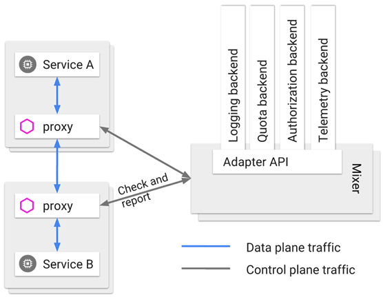

# 后微服务时代

:::tip 后微服务时代

从软件层面独力应对微服务架构问题，发展到软、硬一体，合力应对架构问题的时代，此即为“后微服务时代”。

:::

在微服务中面临的问题，自SOA时代，甚至可以说自原始分布式时代以来就一直存在，注册发现、跟踪治理、负载均衡，传输通讯，等等，这些问题，在分布式系统中都是无可避免的，但这些问题非得由分布式系统自己来解决吗？

我们先不纠结于微服务或者什么别的架构，直接来看待这些问题与它们最常见的解决方法。如果某个系统需要伸缩扩容，通常会购买新的服务器，多部署几套副本实例；如果某个系统需要解决负载均衡问题，通常会布置负载均衡器，选择恰当的均衡算法来分流；如果需要解决传输安全问题，通常会布置TLS传输链路，配置好CA证书以保证通讯不被窃听篡改；如果需要解决服务发现问题，通常会设置DNS服务器，让服务访问依赖稳定的记录名而不是易变的A地址、SRV地址等记录值，等等。计算机科学经过多年的发展，这些问题大多都有了专职化的基础设施去解决，而之所以微服务时代，我们不得不在应用服务层面而不是基础设施层面去解决这些分布式问题，完全是因为由硬件构成的基础设施，跟不上由软件构成的应用服务的灵活性的无奈之举。软件可以只使用键盘就能拆分出不同的服务，只通过拷贝、启动就能够伸缩扩容服务，硬件难道也可以通过敲键盘就变出相应的应用服务器、负载均衡器、DNS服务器、网络链路这些设施吗！嗯？好像也可以啊？

行为至此，估计大家已经听出下面要说的是[虚拟化](https://en.wikipedia.org/wiki/Virtualization)技术和[容器化](https://en.wikipedia.org/wiki/OS-level_virtualization)技术了。微服务时代所取得的成就，本身就离不开以Docker为代表的早期容器化技术的巨大贡献。在此之前，笔者从来没有提器过“容器”二字，这并不是刻意冷落，而是早期的容器只被简单地视为一种可快速启动的服务运行环境，目的是方便于程序的分发部署，这个阶段针对单个服务的容器并未真正参与到分布式问题的解决之中。尽管2014年微服务真正崛起的时候，Docker Swarm（2013年）和Apache Mesos（2012年）已经存在，更早之前也出现过[软件定义网络](https://en.wikipedia.org/wiki/Software-defined_networking)（Software-Defined Networking，SDN）、[软件定义存储](https://en.wikipedia.org/wiki/Software-defined_storage)（Software-Defined Storage，SDS）等技术，但是，被业界广泛认可、普遍采用的通过虚拟化的基础设施去解决分布式架构问题的方案，应该要从2017年Kubernetes赢得容器战争的胜利开始算起。

2017年是容器生态发展历史中具有里程碑意义的一年。在这一年，长期作为Docker竞争对手的[RKT容器](https://coreos.com/rkt/docs/latest/)一派的领导者CoreOS宣布放弃自己的容器管理系统Fleet，未来将会把所有容器管理的功能移至Kubernetes之上去实现。在这一年，容器管理领域的独角兽Rancher Labs宣布放弃其内置了数年的容器管理系统Cattle，提出了“All-in-Kubernetes”战略，从2.0版本开始把1.x版本能够支持多种容器管理工具的Rancher，“升级”为只支持Kubernetes一种容器管理系统。在这一年，Kubernetes的主要竞争者Apache Mesos在9月正式宣布了“[Kubernetes on Mesos](https://k8smeetup.github.io/docs/getting-started-guides/mesos/)”集成计划，由竞争关系转为对Kubernetes提供支持，使其能够与Mesos的其他一级框架（如[HDFS](https://docs.mesosphere.com/latest/usage/service-guides/hdfs/)、[Spark](https://docs.mesosphere.com/latest/usage/service-guides/spark/) 和[Chronos](https://mesos.github.io/chronos/docs/getting-started.html)，等等）进行集群资源动态共享、分配与隔离。在这一年，Kubernetes的最大竞争者Docker Swarm的母公司Docker，终于在10月被迫宣布Docker要同时支持Swarm与Kubernetes两套容器管理系统，事实上承认了Kubernetes的统治地位。这场已经持续了三、四年时间，以Docker Swarm、Apache Mesos与Kubernetes为主要竞争者的“容器战争”终于有了明确的结果，Kubernetes登基加冕是容器发展中一个时代的终章，也将是软件架构发展下一个纪元的开端。笔者在下表列出了在同一个分布式服务的问题在Spring Cloud中提供的应用层面的解决方案与在Kubernetes中提供的基础设施层面的解决方案，尽管因为各自出发点不同，解决问题的方法和效果都有所差异，但这无疑是提供了一条全新的、前途更加广阔的解题思路。

|          | Kubernetes              | Spring Cloud          |
| -------- | ----------------------- | --------------------- |
| 弹性伸缩 | Autoscaling             | N/A                   |
| 服务发现 | KubeDNS  / CoreDNS      | Spring Cloud Eureka   |
| 配置中心 | ConfigMap / Secret      | Spring Cloud Config   |
| 服务网关 | Ingress Controller      | Spring Cloud Zuul     |
| 负载均衡 | Load Balancer           | Spring Cloud Ribbon   |
| 服务安全 | RBAC API                | Spring Cloud Security |
| 跟踪监控 | Metrics API / Dashboard | Spring Cloud Turbine  |
| 降级熔断 | N/A                     | Spring Cloud Hystrix  |

“前途广阔”不仅仅是一句恭维赞赏的客气话，当虚拟化的基础设施从单个服务的容器发展至由多个容器构成的服务集群，以及集群所需的所有通讯、存储设施时，软件与硬件的界限便开始模糊。一旦硬件能够跟上软件的灵活性，那些与业务无关的技术性问题便有可能能从软件层面剥离，悄无声息地解决于硬件基础设施之内，让软件得以只专注业务，真正“围绕业务能力构建”团队与产品。如此，DCE中未能实现的“透明的分布式应用”成为可能，Martin Flower设想的“[凤凰服务器](https://martinfowler.com/bliki/PhoenixServer.html)“成为可能，Chad Fowler提出的“[不可变基础设施](http://chadfowler.com/2013/06/23/immutable-deployments.html)”成为可能，从软件层面独力应对分布式架构所带来的各种问题，发展到应用代码与基础设施软、硬一体，合力应对架构问题的时代，现在常被媒体冠以“云原生”这个颇为抽象的名字加以宣传。云原生时代与此前微服务时代中追求的目标并没有本质改变，在服务架构演进的历史进程中，笔者更愿意称其为“后微服务时代”。

Kubernetes成为容器战争胜利者标志着后微服务时代的开端，但Kubernetes并没有能够完美解决全部的分布式问题——“不完美”的意思是，仅从功能灵活强大这点而言，Kubernetes一般还不如之前的Spring Cloud方案。这是因为有一些问题处于应用系统与基础设施的边缘，使得完全在基础设施层面中确实很难精细化地解决。举个例子，譬如微服务A调用了微服务B中发布的两个服务，称为B1和B2，假设B1表现正常但B2出现了持续的500错，那在达到一定阈值之后就应该对B2进行熔断，以避免产生[雪崩效应](https://en.wikipedia.org/wiki/Snowball_effect)。如果仅在基础设施层面来处理，这会遇到一个两难问题，切断A到B的网络通路则会影响到B1的正常调用，不切断的话则持续受B2的错误影响。这种问题在以前通过Spring Cloud这类应用代码实现的微服务中并不难处理，反正是使用代码（或者配置）来解决问题，只要合乎逻辑，想要去做什么功能，只受限于开发人员的想象力与技术能力，但基础设施是针对整个容器的来整体管理的，粒度就相对粗旷。类似的情况不仅仅在断路器上出现，服务的监控、认证、授权、安全、负载均衡等等都有可能面临进行细化管理的需求，譬如服务调用时的负载均衡，往往需要根据流量特征，调整负载均衡的层次、算法，等等，而DNS尽管能实现一定程度的负载均衡，但通常并不能满足这些额外的需求。

为了解决这一类问题，微服务基础设施很快进行了第二次进化，引入了今天被称为“[服务网格](https://en.wikipedia.org/wiki/Service_mesh)”（Service Mesh）的“边车代理模式”（Sidecar Proxy）。所谓的“边车”是一种带垮斗的三轮摩托，我小时候还算常见，现在基本就只在抗日神剧中才会看到了。这里指的意思是会由系统自动在服务的资源容器（指Kubernetes的Pod）中注入一个通讯代理服务器（相当于那个挎斗），以类似网络安全里中间人攻击的方式进行流量劫持，通过iptable或者ipvs，在应用毫无感知的情况下，悄然接管掉应用所有对外通讯。这个代理除了实现正常的服务调用间通讯外（称为数据平面通讯），同时还接受来自控制器的指令（称为控制平面通讯），根据控制平面中的配置，对数据平面通讯的内容进行分析，以实现熔断、认证、度量、监控、负载均衡等各种附加功能。这样便实现了即不需要在应用层面附带额外的代码，也提供了几乎不亚于应用代码的精细管理能力。

:::center

边车代理流量示意 
图来自Istio的[配置文档](https://istio.io/docs/reference/config/policy-and-telemetry/mixer-overview/)，图中的Mixer在Istio 1.5之后已经取消，这里仅作示意
:::

很难从概念上判定清楚一个与应用系统运行于同一资源容器之内的代理服务到底应该算软件还是算基础设施，但它对应用是透明的，不需要改动任何软件代码就可以实现的服务治理，这便足够了。服务网格在2018年才火起来，今天它仍然是个新潮的概念，Istio和Envoy的发展时间尚短，仍然未完全成熟，甚至连Kubernetes也还算是个新生事物（以它开源的日期来计算）。但笔者相信，未来几年Kubernetes将会成为服务器端标准的运行环境，如同在此之前Linux；服务网格将会成为微服务之间通讯交互的主流模式，把“选择什么通讯协议”、“如何做认证授权”之类的技术问题隔离于应用软件之外，取代今天Spring Cloud全家桶中大部分组件的功能，这是最理想的[Smart Endpoints](https://martinfowler.com/articles/microservices.html#SmartEndpointsAndDumbPipes)解决方案，微服务只需要考虑业务本身的逻辑。

上帝的归上帝，凯撒的归凯撒，业务与技术完全分离，远程与本地完全透明，也许这就是最好的时代了吧？