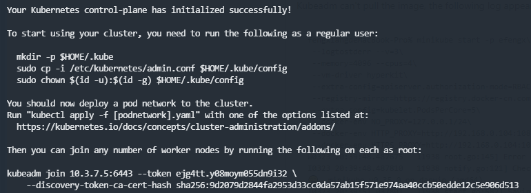

# :white_check_mark:使用Kubeadm部署

尽管使用Rancher或者KubeSphere这样更高层次的管理工具，可以更“傻瓜式”地部署和管理Kubernetes集群，但kubeadm作为官方提供的用于快速安装Kbuernetes的命令行工具，仍然是应该掌握的基础技能。kubeadm随着新版的Kubernetes同步更新，时效性也会比其他更高层次的管理工具来的更好。

随着Kubernetes不断成熟，kuberadm无论是部署单控制平面（Single Control-Plane，单Master节点）集群还是高可用（High-Availability，多Master节点）集群，都已经有了更优秀的易用性，现在手工部署Kubernetes集群已经不是什么太复杂、困难的事情了。本文以Debian系的Linux为例，介绍通过kuberadm部署集群的全过程。

::: tip 注意事项
 1. 安装Kubernetes集群，需要从谷歌的仓库中拉取镜像，由于国内访问谷歌的网络受阻，需要通过科学上网或者在Docker中预先拉取好所需镜像等方式解决。
 2. 集群中每台机器的Hostname不要重复，否则Kubernetes从不同机器收集状态信息时会产生干扰，被认为是同一台机器。
 3. 安装Kubernetes最小需要2核CPU、2GB内存，且为x86架构（暂不支持ARM架构）。对于物理机来说，今时今日要找一台不满足以上条件的机器很困难，但对于云主机来说，尤其是购买网站上最低配置的同学，要注意一下是否达到了最低要求，不清楚的话请在/proc/cpuinf、/proc/meminfo中确认一下。
 4. 确保网络通畅的——这听起来像是废话，但确实有相当一部分的云主机默认不对selinux、iptable、安全组、防火墙进行设置的话，内网各个节点之间、与外网之间会存在访问障碍，导致部署失败。
:::

## 注册apt软件源

由于Kubernetes并不在主流Debian系统自带的软件源中，所以要手工注册，然后才能使用apt-get安装。

官方的GPG Key地址为：[https://packages.cloud.google.com/apt/doc/apt-key.gpg](https://packages.cloud.google.com/apt/doc/apt-key.gpg)，其中包括的软件源的地址为：[https://apt.kubernetes.io/](https://apt.kubernetes.io/)（该地址最终又会被重定向至：[https://packages.cloud.google.com/apt/](https://packages.cloud.google.com/apt/)）。如果能访问google.com域名的机器，采用以下方法注册apt软件源是最佳的方式：

```bash
# 添加GPG Key
$ sudo curl -fsSL https://packages.cloud.google.com/apt/doc/apt-key.gpg | sudo apt-key add -

# 添加K8S软件源
$ sudo add-apt-repository "deb https://apt.kubernetes.io/ kubernetes-xenial main"
```

对于不能访问google.com的机器，就要借助国内的镜像源来安装了。虽然在这些镜像源中我已遇到过不止一次同步不及时的问题了——就是官方源中已经发布了软件的更新版本，而镜像源中还是旧版的，除了时效性问题外，还出现过其他的一些一致性问题，但是总归比没有的强。国内常见用的apt源有阿里云的、中科大的等，具体为：

> 阿里云：
>
> * GPG Key：[http://mirrors.aliyun.com/kubernetes/apt/doc/apt-key.gpg](http://mirrors.aliyun.com/kubernetes/apt/doc/apt-key.gpg)
> * 软件源：[http://mirrors.aliyun.com/kubernetes/apt](http://mirrors.aliyun.com/kubernetes/apt)
>
> 中科大：
>
> * GPG Key：[https://raw.githubusercontent.com/EagleChen/kubernetes\_init/master/kube\_apt\_key.gpg](https://raw.githubusercontent.com/EagleChen/kubernetes_init/master/kube_apt_key.gpg)
> * 软件源：[http://mirrors.ustc.edu.cn/kubernetes/apt](http://mirrors.ustc.edu.cn/kubernetes/apt)

它们的使用方式与官方源注册过程是一样的，只需替换里面的GPG Key和软件源的URL地址即可，譬如阿里云：

```bash
# 添加GPG Key
$ curl -fsSL http://mirrors.aliyun.com/kubernetes/apt/doc/apt-key.gpg | sudo apt-key add -

# 添加K8S软件源
$ sudo add-apt-repository "deb http://mirrors.aliyun.com/kubernetes/apt kubernetes-xenial main"
```

添加源后记得执行一次更新：

```bash
$ sudo apt-get update
```

## 安装kubelet、kubectl、kubeadm

其实并不需要在每个节点都装上kubectl，但是，我缺的是哪点磁盘空间？

下面简要列出了这三个工具/组件的作用，现在看不看得懂都没有关系，以后用到它们的机会多得是，要相信日久总会生情的。

* kubeadm: 引导启动Kubernate集群的命令行工具。
* kubelet: 在群集中的所有计算机上运行的组件, 并用来执行如启动pods和containers等操作。
* kubectl: 用于操作运行中的集群的命令行工具。

```bash
$ sudo apt-get install -y kubelet kubeadm kubectl
```

## 初始化集群前的准备

在使用kubeadm初始化集群之前，还有一些必须的前置工作要妥善处理：

首先，基于安全性（如在文档中承诺的Secret只会在内存中读写）、利于保证节点同步一致性等原因，从1.8版开始，Kubernetes就在它的文档中明确声明了它**默认不支持Swap分区**，在未关闭Swap分区时，集群将直接无法启动。关闭Swap的命令为：

```bash
$ sudo swapoff -a
```

上面这个命令是一次性的，只在当前这次启动中生效，要彻底关闭Swap分区，需要在文件系统分区表的配置文件中去直接除掉Swap分区。使用vim打开/etc/fstab，注释其中带有swap的行即可，或使用以下命令直接完成修改：

```bash
# 还是先备份一下
$ yes | sudo cp /etc/fstab /etc/fstab_bak

# 进行修改
$ sudo cat /etc/fstab_bak | grep -v swap > /etc/fstab
```

> **可选操作**
>
> 当然，在服务器上使用的话，关闭Swap影响还是很大的，如果服务器除了Kubernetes还有其他用途的话（除非实在太穷，否则建议不要这样混用；一定要混用的话，宁可把其他服务搬到Kubernetes上）。关闭Swap有可能会对其他服务产生不良的影响，这时需要修改每个节点的kubelet配置，去掉必须关闭Swap的默认限制，具体操作为：
>
> ```bash
> $ echo "KUBELET_EXTRA_ARGS=--fail-swap-on=false" >> /etc/sysconfig/kubelet
> ```

其次，由于Kubernetes与Docker默认的cgroup（root控制组）驱动程序并不一致，Kubernetes默认为systemd，而Docker默认为cgroupfs。

> **额外知识**
>
> Kubernetes是在Docker之上做容器编排的，为什么它的cgroup驱动会被设计成与Docker的不一致？
>
> 尽管可能绝大多数的Kubernetes都是使用Docker作为容器配合使用的，但这两者并没有什么绝对绑定的依赖关系，Kubenetes对其管理的容器发布了一套名为”容器运行时接口“（Container Runtime Interface，CRI）的API，这套API在设计上，刻意兼容了”容器开放联盟“（Open Container Initiative，OCI）所制定的容器运行时标准，其他符合OCI标准的容器，同样也是可以与Kubernetes配合工作的，常见的有以下四种：
>
> * [CRI-O ](https://github.com/kubernetes-incubator/cri-o)：由Kubernetes自己发布的ORI参考实现
> * [rktlet ](https://github.com/kubernetes-incubator/rktlet)：rkt容器运行时
> * [Frakti ](https://github.com/kubernetes/frakti)：一种基于Hypervisor的容器运行时
> * [Docker CRI shim ](https://github.com/kubernetes/kubernetes/tree/release-1.5/pkg/kubelet/dockershim)：支持Docker直接充当CRI适配器

在这里我们要修改Docker或者Kubernetes其中一个的cgroup驱动，以便两者统一。根据官方文档《[CRI installation](https://kubernetes.io/docs/setup/cri/)》中的建议，对于使用systemd作为引导系统的Linux的发行版，使用systemd作为Docker的cgroup驱动程序可以服务器节点在资源紧张的情况表现得更为稳定。

> **额外知识**
>
> cgroups是Linux内核提供的一种可以限制单个进程或者多个进程所使用资源的机制，可以对cpu，内存等资源实现精细化的控制。

这里选择修改各个节点上Docker的cgroup驱动为systemd，具体操作为编辑（无则新增）/etc/docker/daemon.json文件，加入以下内容即可：

```text
{
  "exec-opts": ["native.cgroupdriver=systemd"]
}
```

然后重新启动Docker容器：

```bash
$ systemctl restart docker
```

## （可选）预拉取镜像

预拉取镜像并不是必须的，本来初始化集群的时候系统就会自动拉取Kubernetes中要使用到的Docker镜像组件，也提供了一个“kubeadm config images pull”命令来一次性的完成拉取，这都是因为如果要手工来进行这项工作，实在非常非常非常的繁琐。

但对于许多人来说这项工作往往又是无可奈何的，Kubernetes的镜像都存储在k8s.gcr.io上，如果您的机器无法直接或通过代理访问到gcr.io（Google Container Registry，敲黑板：这是属于谷歌的网址）的话，初始化集群时自动拉取就无法顺利进行，所以就不得不手工预拉取。

预拉取的意思是，由于Docker只要查询到本地有相同（名称和tag完全相同、哈希相同）的镜像，就不会访问远程仓库，那只要从GitHub上拉取到所需的镜像，再将tag修改成官方的一致，就可以跳过网络访问阶段。

首先使用以下命令查询当前版本需要哪些镜像：

```bash
$ kubeadm config images list --kubernetes-version v1.17.3

k8s.gcr.io/kube-apiserver:v1.17.3
k8s.gcr.io/kube-controller-manager:v1.17.3
k8s.gcr.io/kube-scheduler:v1.17.3
k8s.gcr.io/kube-proxy:v1.17.3
k8s.gcr.io/pause:3.1
k8s.gcr.io/etcd:3.4.3-0
k8s.gcr.io/coredns:1.6.5
……
```

这里必须使用“--kubernetes-version”参数指定具体版本，因为尽管每个版本需要的镜像信息在本地是有存储的，但如果不加的话，Kubernetes会向远程查询最新的版本号，又会因网络无法访问而导致问题。

得到这些镜像名称和tag后，可以从[DockerHub](https://hub.docker.com)上找存有相同镜像的仓库来拉取，至于具体哪些公开仓库有，考虑到以后阅读本文时Kubernetes的版本应该会有所差别，所以需要自行到网站上查询一下。笔者比较常用的是一个名为“anjia0532”的仓库，有机器人自动跟官方同步，相对比较及时。

```bash
#以k8s.gcr.io/coredns:1.6.5为例，每个镜像都要这样处理一次
$ docker pull anjia0532/google-containers.coredns:1.6.5

#修改tag
$ docker tag anjia0532/google-containers.coredns:1.6.5 k8s.gcr.io/coredns:1.6.5

#修改完tag后就可以删除掉旧镜像了
$ docker rmi anjia0532/google-containers.coredns:1.6.5
```

## 初始化集群控制平面

到了这里，终于可以开始Master节点的部署了，先通过su直接切换到root用户（而不是使用sudo），然后使用以下命令开始部署：

```bash
$ kubeadm init --kubernetes-version v1.17.3 --pod-network-cidr=10.244.0.0/16
```

这里使用“--kubernetes-version”参数的原因与前面预拉取是一样的，避免额外的网络访问；另外一个参数“--pod-network-cidr”着在稍后介绍完CNI网络插件时会去说明。

当看到下面信息之后，说明集群主节点已经安装完毕了。



这信息先恭喜你已经把控制平面安装成功了，但还有三行“you need……”、“you should……”、“you can……”开头的内容，这是三项后续的“可选”工作，下面继续介绍。

## （可选）让非Root用户可以使用Kubernetes

Kubernetes最初是以root用户安装的，如果需要非root的其他用户也可以使用Kubernetes集群，那需要为该用户先配置好admin.conf文件。切换至该用户后，进行如下操作：

```bash
$ mkdir -p $HOME/.kube
$ sudo cp -i /etc/kubernetes/admin.conf $HOME/.kube/config
$ sudo chown $(id -u):$(id -g) $HOME/.kube/config
```

当然，如果只是在测试环境，准备后续都准备使用root运行，那这个步骤可以略过。

## （可选）安装CNI插件

CNI即“容器网络接口”，在2016 年，CoreOS发布了CNI规范。2017年5月，CNI被CNCF技术监督委员会投票决定接受为托管项目，从此成为不同容器编排工具（Kubernetes、Mesos、OpenShift）可以共同使用的、解决容器之间网络通讯的统一接口规范。

部署Kubernetes时，我们可以有两种网络方案使得以后受管理的容器之间进行网络通讯：

* 使用Kubernetes的默认网络
* 使用CNI及其插件

第一种方案，尤其不在GCP或者AWS的云主机上，没有它们的命令行管理工具时，需要大量的手工配置，基本上是反人类的。实际通常都会采用第二种方案，使用CNI插件来处理容器之间的网络通讯，所以本节所标识的“\[可选\]”其实也并没什么选择不安装CNI插件的余地。

Kubernetes目前支持的CNI插件有：Calico、Cilium、Contiv-VPP、Flannel、Kube-router、Weave Net等六种，每种网络提供了不同的管理特性（如MTU自动检测）、安全特性（如是否支持加密通讯）、网络策略（如Ingress、Egress规则）、传输性能（甚至对TCP、UDP、HTTP、FTP、SCP等不同协议来说也有不同的性能表现）以及主机的性能消耗。后续我们将专门对不同CNI插件进行测试对比，在环境部署这部分，对于初学者来说，使用Flannel是较为合适的，它是最精简的CNI，没有安全特性的支持，主机压力小，安装便捷，效率也不错，使用以下命令安装Flannel网络：

```bash
$ curl --insecure -sfL https://raw.githubusercontent.com/coreos/flannel/master/Documentation/kube-flannel.yml | kubectl apply -f -
```

使用Flannel的话，要注意要在创建集群时加入“--pod-network-cidr”参数，指明网段划分。

## （可选）移除Master节点上的污点

污点（Taint）是Kubernetes Pod调度中的概念，在这里通俗地理解就是Kubernetes决定在集群中的哪一个节点建立新的容器时，要先排除掉带有特定污点的节点，以避免容器在Kubernetes不希望运行的节点中创建、运行。默认情况下，集群的Master节点是会带有污点的，以避免容器分配到Master中创建。但对于许多学习Kubernetes的同学来说，并没有多宽裕的机器数量，往往是建立单节点集群或者最多只有两、三个节点，这样Master节点不能运行容器就显得十分浪费了。需要移除掉Master节点上所有的污点，在Master节点上执行以下命令即可：

```bash
$ kubectl taint nodes --all node-role.kubernetes.io/master-
```

做到这步，如果你只有一台机器的话，那Kubernetes的安装已经宣告结束了，可以使用此环境来完成后续所有的部署。你还可以通过cluster-info和get nodes子命令来查看一下集群的状态，类似如下所示：


## （可选）启用kubectl命令自动补全功能

由于kubectl命令在后面十分常用，而且Kubernetes许多资源名称都带有随机字符，要手工照着敲很容易出错，强烈推荐启用命令自动补全的功能，这里仅以bash和笔者常用的zsh为例，如果您使用其他shell，需自行调整：

> bash：
>
> ```bash
> $ echo 'source <(kubectl completion bash)' >> ~/.bashrc
> $ echo 'source /usr/share/bash-completion/bash_completion' >> ~/.bashrc
> ```
>
> zsh：
>
> ```bash
> $ echo 'source <(kubectl completion zsh)' >> !/.zshrc
> ```

## 将其他Node节点加入到Kubernetes集群中

在安装Master节点时候，输出的最后一部分内容会类似如下所示：

```text
Then you can join any number of worker nodes by running the following on each as root:

  kubeadm join 10.3.7.5:6443 --token ejg4tt.y08moym055dn9i32 \
    --discovery-token-ca-cert-hash sha256:9d2079d2844fa2953d33cc0da57ab15f571e974aa40ccb50edde12c5e906d513
```

这部分内容是告诉用户，集群的Master节点已经建立完毕，其他节点的机器可以使用“kubeadm join”命令加入集群。这些机器只要完成kubeadm、kubelet、kubectl的安装即可、其他的所有步骤，如拉取镜像、初始化集群等等都不需要去做，就是可以使用该命令加入集群了。需要注意的是，该Token的有效时间为24小时，如果超时，使用以下命令重新获取：

```bash
$ kubeadm token create --print-join-command
```

