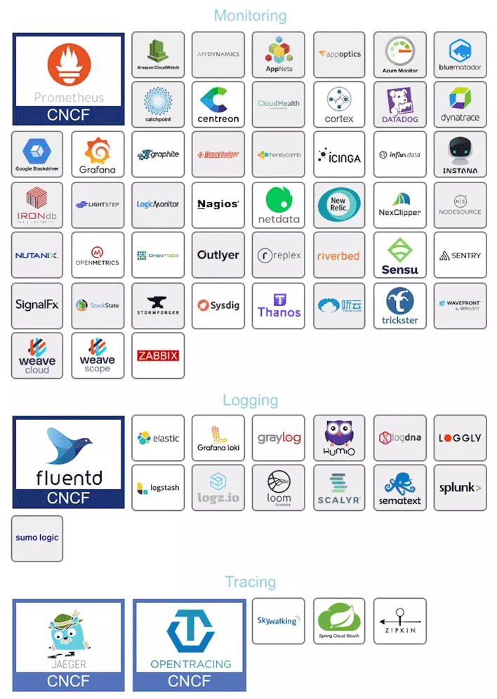

# 可观测性

随着分布式架构渐成主流，[可观测性](https://en.wikipedia.org/wiki/Observability)（Observability）一词也日益频繁地被提起。它与[可控制性](https://en.wikipedia.org/wiki/Controllability)（Controllability）是[Rudolf E. Kálmán](https://en.wikipedia.org/wiki/Rudolf_E._Kálmán)针对线性动态控制系统提出的一组对偶属性，原本的含义是“可以由其外部输出推断其内部状态的程度”。

可观测性是近几年才从控制理论中借用的舶来概念，不过其内容实际在计算机科学中已有多年的实践积累。如今一般会将可观测性具体分解为三个更具体方向进行研究：[日志收集](/distribution/observability/logging.html)（Logging）、[链路追踪](/distribution/observability/tracing.html)（Tracing）和[聚合度量](/distribution/observability/metrics.html)（Metrics），如果此前你从来没接触过分布式系统的观测工作，那可能只会对日志比较了解，对追踪和度量都相对陌生。尽管在分布式系统中追踪和度量必要性和复杂程度确实比单体系统时要更高，但此前单体系统中你肯定已经做过类似的工作，譬如：

- **日志**：日志的主要职责是记录离散事件，通过日志事后分析出程序的行为，譬如曾经调用过什么方法，操作过哪些数据。日志功能非常基础，不论是单体还是微服务，今天你也许还能找到不使用Spring的Java系统，却应该很难找到不使用Slf4j或Common Logging的系统了，Log4j、Slf4j这些日志实现及外观（Facade）类库已事实上成了Java程序标配的基础类库。但你是否曾想过什么是日志？日志的边界在哪里？输出日志是为了解决什么问题？代价是什么？打印日志被认为是程序中最简单的工作之一，在调试问题时常有人说“当初这里记得打点日志就好了”，可见是一项举手之劳的工作。尽管输出日志很简单，但收集和分析日志却可能会很复杂，也许对大多数程序员来说，分析日志就是最常遇见也最有实践可行性的“大数据”系统了。用大数据的视角来观察日志，会有许多应该考虑、可以分析挖掘的内容。
- **追踪**：单体系统时代追踪的概念只局限于[栈追踪](https://en.wikipedia.org/wiki/Stack_trace)（Stack Tracing），你调试程序时，在IDE打个断点，看到的Call Stack视图上的内容便是跟踪；你编写代码时，处理异常调用了Exception::printStackTrace()方法，它输出的堆栈信息也是追踪。微服务时代，追踪就不只局限于调用栈了，一个外部请求需要内部若干服务的共同响应，这时候完整的调用轨迹将跨越了多个服务，包括服务间的网络交互与各个服务内部的调用栈，因此，分布式系统中的追踪在国内常被称为“全链路追踪”（本文就直接称“链路追踪”了），国外一般不叫“全链路”，习惯就称做“分布式追踪”，即[Distributed Tracing](https://opentracing.io/docs/overview/what-is-tracing/)。追踪的主要目的是故障排查，如分析调用链的哪一部分、哪个方法出现错误、阻塞，输入输出是否符合预期等等。
- **度量**：度量是指对系统中某一类信息的总结聚合，譬如，证券市场的每一只股票都会定期公布财务报表，通过财报上的营收、净利、毛利、资产、负载等等一系列数据来体现过去一个财务周期中公司的经营状况，这便是一种信息聚合。Java里有一种很基本的度量便是由虚拟机直接提供的JMX（Java Management eXtensions）度量，诸如内存大小、各分代的用量、峰值的线程数、垃圾收集的吞吐量、频率，等等都可以从JMX中获得。度量的主要目的是监控预警（Monitoring），如某些度量指标达到风险阈值时触发事件，以便自动处理或者提醒管理员介入。

日志、追踪、度量三者并不是完全互相独立的，它之间有有许多天然重合或者可以结合之处，2007年Peter Bourgon撰写的文章《[Metrics, tracing, and logging](https://peter.bourgon.org/blog/2017/02/21/metrics-tracing-and-logging.html)》讲述了这三者之间的关系，如下图所示。

:::center

日志、追踪、度量的目标与结合（[图片来源](https://peter.bourgon.org/blog/2017/02/21/metrics-tracing-and-logging.html)）
:::

在具体产品层面，经过几年的群雄混战，日志、度量两个领域的胜利者已经基本尘埃落定。日志领域早就已经统一到Elastic Stack（ELK）技术栈上，未来要是能出现变化的话，也就是其中的Logstash能看到有被Fluentd取代的趋势，让ELK变成EFK，但整套Elastic Stack技术栈的地位还是相当稳固的。

度量领域，跟随着Kubernetes统一容器编排的步伐，Prometheus也击败了度量领域里以Zabbix为代表的众多前辈，成为了云原生时代度量监控的事实标准。从市场角度来说Prometheus还没有达到Kubernetes那样一统天下的程度，但从社区活跃度上看，Prometheus已占有绝对的优势，在Google和CNCF的推动下，未来前途可期。

:::quote 额外知识：Kubernetes与Prometheus的关系

Kubernetes是CNCF第一个孵化成功的项目，Prometheus是CNCF第二个孵化成功的项目。 Kubernetes起源于Google的编排系统Borg，Prometheus起源于Google为Borg做的度量监控系统BorgMon。

:::

追踪领域与日志、度量不同，它是与具体网络协议、程序语言相关的，收集日志你不必关心某段日志是由Java程序输出的还是由Golang程序输出的，对你来说它们都是一段非结构化文本，同理，度量对你来说也只是一个个聚合的数据指标而已。但是，链路追踪就不一样，各个服务之间是使用HTTP还是gRPC来进行网络访问会直接影响追踪的实现，各个服务是使用Java、Golang还是Node.js来编写，也会直接影响到进程内调用栈的追踪方式。这决定了追踪工具本身有更强烈的探针插件化的需求，也决定了追踪领域很难出现一家独大的情况。近年来各种链路追踪产品层出不穷，市面上主流的工具既有像Datadog这样的一揽子商业方案，也有AWS X-Ray和Google Stackdriver Trace这样的云厂商产品，还有像SkyWalking、Zipkin、Jaeger这样来自开源社区的产品。2017年，CNCF牵头制定了[OpenTracing规范](https://opentracing.io/specification/)，推进追踪领域的工具与协议标准化，未来我们很可能会根据服务具体情况的差异，组合使用不同厂商或组织的追踪工具。

:::center

日志、追踪、度量的相关产品（[图片来源](https://landscape.cncf.io/)）
:::

上图是CNCF [Interactive Landscape](https://landscape.cncf.io/)中列出的日志、追踪、度量领域的常见产品，其实里面很多不同领域的产品是跨界的，譬如ELK可以通过Metricbeat来实现度量的功能，Apache SkyWalking的探针就有同时支持度量和追踪两方面的数据来源，等等。接下来到三个小节，笔者将详细介绍这三个领域中具体需要考虑的问题及其解决方案。

