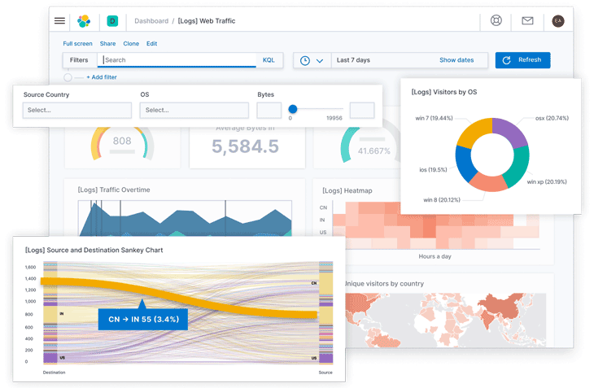

# 日志分析

日志用来记录系统运行期间发生过的离散事件。相信没有哪一个生产系统会认为日志功能是可以缺少的，然而也很少人会把日志作为多关键功能来看待。日志就像阳光与空气，经常被使用，却不怎么被重视。程序员们会说日志简单，其实这是在说“打印日志”这个操作简单，打印日志的目的是为了日后从中得到有价值的信息，而今天只要稍微复杂点的系统，尤其是复杂的分布式系统，就很难只依靠tail、grep、awk来从日志中挖掘信息了，往往还要有专门的全局查询和可视化功能。此时，从打印日志到分析查询之间，还隔着收集、缓冲、聚合、加工、索引、存储等若干个步骤，如下图所示。

:::center

日志处理过程
:::

这一整个链条中涉及到大量值得注意的细节，复杂性并不亚于任何一项技术或业务功能的实现。下面，笔者将以此为线索，以最成熟的Elastic Stack技术栈为例子，介绍该链条每个步骤的目的与注意事项。

## 输出

要是说好的日志能像文章一样，能让人读起来身心舒畅，这话肯定有夸大的成分，不过好的日志应该能做到像“流水账”一样，无有遗漏地记录信息，格式统一，内容恰当。其中，“恰当”是指日志不应该多，也不应该少。“多少”不是指输出的日志行数，尽管笔者听过夸张的系统是单节点INFO级别下每天的日志都能到TB量级（这是代码有问题的），给网络与磁盘I/O带来了不小压力，但笔者通常不以数量来衡量日志是否恰当，“多少”主要是指日志中不该出现的内容不要有，该有的不要少，下面笔者先列出一些常见的“不应该有”的例子：

- **避免打印敏感信息**。日志中完全可以打印当前用户的ID（最好是内部ID，避免登录名或者用户名称），笔者见过有系统就直接用[MDC](https://logging.apache.org/log4j/1.2/apidocs/org/apache/log4j/MDC.html)（Mapped Diagnostic Context）将用户ID自动打印在Pattern Layout上。不用专门提醒，你肯定也知道不该将密码，银行账号， 身份证这些敏感信息打到日志里，但笔者同样见过不止一个系统的日志中直接能找到这些信息的。一旦这些敏感信息随日志流到了后续的索引、存储、归档等步骤后，清理起来将非常麻烦（Elasticsearch要到段文件合并的时候才会物理删除文档）。
- **避免引用慢操作**。日志中打印的信息应该是上下文中可以直接取到的信息，如果当前上下文中根本没有这项数据，需要专门调用远程服务、或从数据库，或者通过大量计算才能取到的话，那应该先考虑这项信息放到日志中是不是必要且恰当的。
- **避免误导他人**。日志中给日后调试除错的人挖坑是十分恶劣却又常见的行为。笔者相信开发人员并不是专门要去误导别人，只是很多人都无意识地这样做了。譬如明明已经在逻辑中妥善处理好了某个异常，偏习惯性地把堆栈打到日志中，有时候更恶劣的还以ERROR或者WARN级别去打，日后要是出问题了，其他人来除错的话往往就使劲盯着这段堆栈找线索了。
- **避免打印追踪诊断信息**。日志中不要打印方法输入参数、输出结果、方法执行时长之类的调试信息。这点是反直觉的，笔者知道不少公司甚至会将其作为最佳实践来提倡，但是笔者仍坚持将其归入反模式中。日志的职责是记录事件，追踪诊断有追踪系统去处理，哪怕贵公司完全没有开发追踪诊断方面功能的打算，笔者也建议使用[BTrace](https://github.com/btraceio/btrace)或者[Arthas](https://github.com/alibaba/arthas)这类“On-The-Fly”的工具来解决调试问题。之所以将其归为反模式，是因为上面说的敏感信息、慢操作等的主要源头就是这些原本想用于调试的日志。譬如，当前方法入口参数有个User对象，如果要输出这个对象的话，常见做法是将它序列化成JSON字符串然后打到日志里，这时候User里面的Password字段、BankCard字段就全暴露出来了；再譬如，当前方法的返回值是个Map，开发期的调试数据只做了三五个Entity，你觉得遍历一下把具体内容打到日志里面没什么问题，生产期这个Map里面搞不好就放了成千上万个Entity，这时候打印日志就相当于引用慢操作。
- ……

另一方面，日志中不该缺少的内容也“不应该少”，以下是部分笔者建议应该输出到日志中的内容：

- **处理请求时的TraceID**。服务收到请求时，如果该请求没有附带TraceID，就应该自动生成唯一的TraceID来对请求进行标记，并使用MDC自动输出到日志。TraceID会贯穿整条调用链，目的是可以通过它把外部请求在分布式系统中的执行过程串联起来。TraceID通常也会随着请求的响应返回到客户端，如果响应内容出现了异常，用户便能通过此ID快速找到与问题相关的日志。TraceID是OpenTracing中的概念，类似的还有用于标识进程内调用状况的SpanID，它们都可以用Spring Cloud Sleuth自动生成，这些概念会放到下一节“[链路追踪](/distribution/observability/tracing.html)”里再详细介绍。尽管TraceID是为分布式跟踪而提出的，但即使对单体系统，生成TraceID、记录到日志并返回给最终用户对快速定位错误也是有益的。
- **系统运行过程中的关键事件**。日志的职责就是记录事件，譬如发生了与预期不符的业务流程、运行期间出现未能处理的异常或警告、定期自动执行的任务，等等，都应该在日志中记录下来。原则上业务领域中发生的事件只要有价值就应该去记录，并不提倡因顾虑日志数量多少对性能的影响而投鼠忌器。开发阶段只要判断清楚事件的重要程度，选定相匹配的日志的级别即可，至于如何快速处理大量日志，这是后面步骤要考虑的问题。退一步说，日志实在太多，由运维人员去调整全局或单个类的日志级别也是可以的。
- **启动时输出配置信息**。与避免输出诊断信息不同，对于系统启动时或者检测到配置中心变化时更新的配置，应将非敏感的配置信息输出到日志中，譬如连接的数据库地址、临时目录的路径等等，初始化配置的逻辑一般只会执行一次，不便于诊断时复现，所以应该输出到日志中。
- ……

## 收集与缓冲

写日志是在服务节点中进行的，但我们不可能在每个节点都单独建设日志查询功能。这不是资源或工作量的问题，而是分布式系统处理一个请求要跨越多个服务节点，为了能看到跨节点的全部日志，就要有能覆盖整个链路的全局日志系统。这个需求决定了每个节点输出日志到文件后，必须将日志文件统一收集起来集中存储、索引，由此便催生了专门的日志收集器。

最初，ELK中日志收集与下一节要讲的加工聚合的职责都是由Logstash来承担的，Logstash既部署在各个节点中作为收集的客户端（Shipper），也同时有独立部署的节点，扮演归集转换日志的服务端（Master）。Logstash有良好的插件化设计，收集、转换、输出都支持插件化定制，应对多重角色本身并没有什么困难。但是Logstash与它的插件是基于JRuby编写的，要跑在单独的Java虚拟机进程上（Logstash的默认的堆大小就到了1GB），对于归集部分（Master）这种消耗并不是什么问题，但作为每个节点都要部署的日志收集器就显得太过负重了。后来，Elastic.co公司将所有需要在服务节点中处理的工作整理成以[Libbeat](https://github.com/elastic/beats/tree/master/libbeat)为核心的[Beats框架](https://github.com/elastic/beats)，并使用Golang重写了一个功能较少，但也更轻量高效的日志收集器，就是今天流行的[Filebeat](https://github.com/elastic/beats/tree/master/filebeat)。

现在的Beats已经是一个很大的家族了，除了Filebeat外，Elastic.co还提供有用于收集Linux审计数据的[Auditbeat](https://github.com/elastic/beats/tree/master/auditbeat)、用于无服务计算架构的[Functionbeat](https://github.com/elastic/beats/tree/master/x-pack/functionbeat)、用于心跳检测的[Heartbeat](https://github.com/elastic/beats/tree/master/heartbeat)、用于聚合度量的[Metricbeat](https://github.com/elastic/beats/tree/master/metricbeat)、用于收集Linux Systemd Journald日志的[Journalbeat](https://github.com/elastic/beats/tree/master/journalbeat)、用于收集Windows事件日志的[Winlogbeat](https://github.com/elastic/beats/tree/master/winlogbeat)，用于网络包嗅探的[Packetbeat](https://github.com/elastic/beats/tree/master/packetbeat)等等，如果再算上大量由社区维护的[Community Beats](https://github.com/elastic/beats/blob/master/libbeat/docs/communitybeats.asciidoc)，那几乎是你能想像到的数据都可以收集到，以至于ELK也可以一定程度上代替度量和跟踪系统，实现它们的部分职能，这对于中小型分布式系统来说是便利的，但对于大型系统，建议还是让专业的工具去做专业的事情。

日志收集器不仅要保证能覆盖全部数据来源，还要尽力保证日志数据的连续性，这其实并不容易做到。譬如淘宝这类大型的互联网系统，每天的日志量超过了10,000TB（10PB）量级，日志收集器的数量能到达百万量级（[数据来源](http://ppt.geekbang.org/slide/download?cid=40&pid=2436)），此时归集到系统中的日志要与实际产生的日志保持绝对的一致性是非常困难的，也不应该为此付出过高成本。换而言之，日志是不追求绝对的一致、完整、精确的，而追求在代价可承受的范围内保证尽可能地保证较高的数据质量。最常见的做法是将压力从Logstash和Elasticsearch转移到抗压能力更强的消息队列缓存中，譬如在Logstash之前架设一个Kafka或者Redis作为缓冲层，面对突发流量，Logstash或Elasticsearch处理能力出现瓶颈时自动削峰填谷，甚至它们完全停顿时也不至于丢失日志数据。

## 加工与聚合

将日志集中收集之后，存入Elasticsearch之前，一般还要对它们进行加工转换和聚合处理。这是因为日志是非结构化数据，一行日志中往往会包含多项信息，如果不做处理，那在Elasticsearch就只能以全文检索的原始方式去使用日志，既不利于统计对比，也不利于条件过滤。举个具体例子，下面是一行Nginx服务器的Access Log，代表了一次页面访问操作：

```nginx
14.123.255.234 - - [19/Feb/2020:00:12:11 +0800] "GET /index.html HTTP/1.1" 200 1314 "https://icyfenix.cn" "Mozilla/5.0 (Windows NT 10.0; WOW64) AppleWebKit/537.36 (KHTML, like Gecko) Chrome/80.0.3987.163 Safari/537.36"
```

在这一行日志里面，包含了下表所列的这10项独立的数据项：

| <div style="width:250px">数据项</div>   | 值                                                        |
| -------- | ------------------------------------------------------------ |
| IP       | 14.123.255.234                                               |
| Username | null                                                         |
| Datetime | 19/Feb/2020:00:12:11 +0800                                   |
| Method   | GET                                                          |
| URL      | /index.html                                                  |
| Protocol | HTTP/1.1                                                     |
| Status   | 200                                                          |
| Size     | 1314                                                         |
| Refer    | https://icyfenix.cn                                          |
| Agent    | Mozilla/5.0 (Windows NT 10.0; WOW64) AppleWebKit/537.36 (KHTML, like Gecko) Chrome/80.0.3987.163 Safari/537.36 |

Logstash最常用的职能就是把日志行中的非结构化数据，通过Grok表达式语法转换为上面表格那样的结构化数据，进行结构化的同时，还可能会根据需要调用其他插件来完成时间处理（统一时间格式）、类型转换（如字符串、数值的转换）、查询归类（譬如将IP地址根据地理信息库按省市归类）等种额外处理，然后再以JSON格式输出到Elasticsearch中（这是最普遍的输出形式，Logstash输出也有很多插件可以具体定制）。这些经过Logstash转换，已经结构化的日志，Elasticsearch便可针对不同的数据项来建立索引，进行条件查询、统计、聚合等操作的了。

提到聚合，这也是Logstash的常见职能之一。日志中存储的是离散事件，离散的意思是每个事件都是相互独立的，譬如有10个用户访问服务，他们操作所产生的事件都在日志中会分别记录。如果想知道这些用户中正常返回（200 OK）的有多少、出现异常的（500 Internal Server Error）的有多少，再生成个可视化统计图表什么的，一种解决方案是通过Elasticsearch本身的处理能力做实时的聚合统计，这很便捷，不过要消耗Elasticsearch服务器的运算资源。另一种解决方案是在收集日志后自动生成某些常用的、固定的聚合指标，这种聚合就会在Logstash中通过聚合插件来完成。这两种聚合方式都有不少实际应用，前者一般用于应对即席查询，后者一般用于应对固定查询。

## 存储与查询

经过收集、缓冲、加工、聚合的日志数据，终于可以放入Elasticsearch中索引存储了。Elasticsearch是整个Elastic Stack技术栈的核心，其他步骤的工具，如Filebeat、Logstash、Kafka都有替代品，有自由选择的余地，唯独Elasticsearch在日志分析这方面没有什么值得一提的竞争者，几乎成了解决此问题的标准答案。这样的结果肯定与Elasticsearch本身是一款优秀产品有关，然而更关键的是Elasticsearch的优势正好与日志分析的需求完美契合：

- 从数据特征的角度看，日志是典型的基于时间的数据流，但它与其他时间数据流，譬如你的新浪微博、微信朋友圈这种社交网络数据又稍有区别：日志虽然增长速度很快，但已写入的数据几乎没有再发生变动的可能。日志的数据特征决定了所有用于日志分析的Elasticsearch都会使用时间范围作为索引，根据实际数据量的大小可能是按月、按周或者按日、按时。以按天索引为例，由于你能准确地预知明天、后天的日期，因此全部索引都可以预先创建，这免去了动态创建的寻找节点、创建分片、在集群中广播变动信息等开销。又由于所有新的日志都是“今天”的日志，所以你建立了“logs_current”这样的索引别名来指向当前索引，接收新的日志，避免代码因日期而变。
- 从数据价值的角度看，日志基本上只会以最近的数据为检索目标，随着时间推移，早期的数据将逐渐失去价值。这点决定了可以很容易根据时间区出分冷数据和热数据，进而对不同数据采用不一样的硬件策略。譬如为热数据配备SSD磁盘和更好的处理器，为冷数据配备HHD磁盘和较弱的处理器，甚至可以放到更为廉价的[对象存储](https://en.wikipedia.org/wiki/Object_storage)（如阿里云的OSS，腾讯云的COS，AWS的S3）中。<br/>注意，本文的主题是日志在可观测性方面的作用，另外还有一些基于日志的其他类型应用，譬如从日志记录的事件中去挖掘业务热点，分析用户习惯等等，这属于大数据挖掘的范畴，并不在我们讨论“价值”的范围之内，事实上它们更可能采用的技术栈是HBase与Spark的组合，而不是Elastic Stack。
- 从数据使用的角度看，分析日志很依赖全文检索和即席查询，对实时性的要求是处于实时与离线两者之间的“近实时”，即不强求日志产生后立刻能查到，但也不能接受日志产生之后按小时甚至按天的频率来更新，这些检索能力和近实时性，也正好都是Elasticsearch的强项。

Elasticsearch只提供了API层面的查询能力，它通常搭配同样出自Elastic.co之手的Kibana一起使用，你可以将Kibana理解为Elastic Stack的GUI部分。Kibana尽管只负责图形界面和展示，但它提供的能力远不止让你能在界面上执行Elasticsearch的查询那么简单。Kibana宣传的核心能力是“探索数据并可视化”，即把存储在Elasticsearch中的数据被检索、聚合、统计后，定制形成各种图形、表格、指标、统计，以此观察系统的运行状态，找出日志事件中潜藏的规律和隐患。按Kibana官方的宣传语来说就是“一张图片胜过千万行日志”。

:::center

Kibana可视化界面（图片来自[Kibana官网](https://www.elastic.co/cn/kibana)）
:::