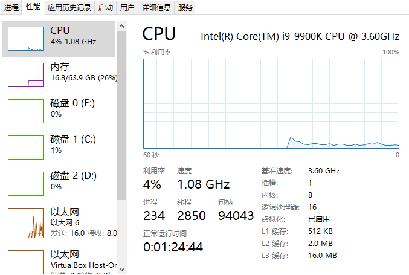
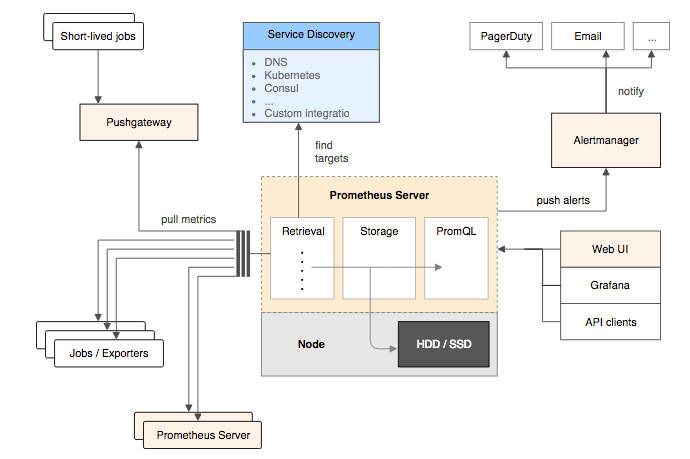

# 聚合度量

度量（Metrics）的目的是揭示系统的总体运行状态。相信大家应该见过这样的场景：舰船的驾驶舱或者卫星发生中心的控制室，在整个房间最显眼的位置，布满整面墙壁的巨型屏幕里显示着一个个指示器、仪表板与统计图表，沉稳端坐中央的指挥官看着屏幕上闪烁变化的指标，果断决策，下达命令……如果以上场景被改成指挥官双手在键盘上飞舞，双眼紧盯着日志或者追踪系统，试图判断出系统工作是否正常。这光想像一下，都能感觉到一股身份与行为不一致的违和气息。由此可见度量与日志、追踪的差别，度量是用经过聚合统计后的高维度信息，以最简单直观的形式来总结复杂的过程，为监控、预警提供决策支持。

:::center



Windows系统的任务管理器界面

:::

如果你人生经历比较平澹，没有驾驶航母的经验，甚至连一颗卫星或者导弹都没有发射过，那就打开电脑吧，按`CTRL`+`ALT`+`DEL`呼出任务管理器，看看上面这个熟悉的界面，它也是一个非常典型度量系统。

度量总体上可分为客户端的指标收集、服务端的存储查询以及终端的监控预警三个相对独立的过程，每个过程在系统中一般也会设置对应的组件来实现，你不妨先翻到下面，看一眼Prometheus的组件流程图作为例子，图中在Prometheus Server左边的部分都属于客户端过程，右边的部分就属于终端过程。

[Prometheus](https://prometheus.io/)在度量领域的统治力虽然还暂时不如日志领域中Elastic Stack的统治地位那么稳固，但基本也已经能算是事实标准了，接下来，笔者将主要以Prometheus为例，介绍这三部分组件的总体思路、大致内容与理论标准。

## 指标收集

指标收集部分要解决两个问题：“如何定义指标”以及“如何将这些指标告诉服务端”，这两个问题听起来应该是与目标系统密切相关，必须根据实际情况才能讨论，其实也并不绝对，无论目标是何种系统，都还是具备一些的共性的。譬如，在确定目标系统前我们无法决定要收集什么指标，但指标的数据类型（Metrics Types）来来去去也基本就以下这几类，对于一个通用的度量系统来说，面向指标的数据类型来设计服务即可满足各种目标系统的监控所需：

- 计数度量器（Counter）：这是最好理解也是最常用的指标形式，计数器就是对有相同量纲、可加减数值的合计量，譬如业务指标像销售额、货物库存量、职工人数等等；技术指标像服务调用次数、网站访问人数等都属于计数器指标。
- 瞬态度量器（Gauge）：瞬态度量器比计数器还要简单，它就表示某个指标在某个时点的数值，连加减统计都不需要。譬如当前Java虚拟机堆内存的使用量，这就是一个瞬态度量器；又譬如，网站访问人数是计数器，而网站在线人数则是瞬态度量器。
- 吞吐率度量器（Meter）：吞吐率度量器顾名思义是用于统计单位时间的吞吐量，即单位时间内某个事件的发生次数。譬如交易系统中常以“TPS”衡量吞吐率，即每秒发生了多少笔事务交易；又譬如港口的货运吞吐率常以“吨/每天”为单位计算，10万吨/天的港口要比1万吨/天的港口的货运规模更大。
- 直方图度量器（Histogram）：直方图在是常见二维统计图，它的两个坐标分别是统计样本和该样本对应的某个属性的度量，以长条图的形式具体数值。举个具体例子，譬如经济报告中要衡量某个地区历年的GDP变化情况，常会以GDP为纵坐标，时间为横坐标构成直方图来呈现。
- 采样点分位图度量器（Quantile Summary）：分位图是统计学中通过比较各分位数的分布情况的工具，用于验证实际值与理论值的差距，评估理论值与实际值之间的拟合度。譬如，我们说“高考成绩一般符合正态分布”，这句话的意思是：高考成绩高低分的人数都较少，中等成绩的较多，将人数按不同分数段统计，得出的统计结果一般能够与正态分布的曲线较好地拟合。
- 除了以上常见的度量器之外，还有Timer、Set、Fast Compass、Cluster Histogram等其他各种度量器，采用不同的度量系统，支持度量器类型的范围肯定会有差别，譬如Prometheus支持了上面提到五种度量器中的Counter、Gauge、Histogram和Summary四种，其他未提及的度量器囿于篇幅就不再逐一介绍了。

对于“如何将这些指标告诉服务端”这个问题，有两种解决方案：`拉取式采集`（Pull-Based Metrics Collection）和`推送式采集`（Push-Based Metrics Collection）。所谓Pull是指度量系统主动从目标系统中拉取指标，相对地，Push就是由目标系统主动向度量系统推送指标。这两种方式并没有绝对的好坏优劣，以前很多老牌的度量系统，如[Ganglia](https://en.wikipedia.org/wiki/Ganglia_(software))、[Graphite](https://graphiteapp.org/)、[StatsD](https://github.com/statsd/statsd)等是基于Push的，而以Prometheus、[Datadog](https://www.datadoghq.com/pricing/)、[Collectd](https://en.wikipedia.org/wiki/Collectd)为代表的另一派度量系统则青睐Pull式采集（Prometheus官方解释[选择Pull的原因](https://prometheus.io/docs/introduction/faq/#why-do-you-pull-rather-than-push?)）。Push还是Pull的抉择，不仅仅在度量中才有，所有涉及到Client和Server通讯的场景，都会涉及到该谁主动（或者双方都可以主动）的问题，譬如上一节中讲的追踪系统也是如此。

:::center

Prometheus组件流程图（图片来自[Prometheus官网](https://github.com/prometheus/prometheus)）
:::

一般来说，度量系统只会支持其中一种指标采集方式，因为度量系统的网络连接数量（以及对应的线程或者协程数）可能非常庞大，如何采集指标将直接影响到整个度量系统的架构设计。Prometheus基于Pull架构的同时还能够（有[限度](https://prometheus.io/docs/practices/pushing/)地）兼容Push式采集，是因为它有Push Gateway（如上图所示）的存在，这是一个位于Prometheus Server外部的相对独立的中介模块，将外部推送来的指标放到Push Gateway中暂存，然后再等候Prometheus Server从Push Gateway中去拉取。Prometheus设计Push Gateway的本意是为了解决Pull的一些固有缺陷，譬如目标系统位于内网（NAT）之中，外网的Prometheus是无法主动连接目标系统的，只能由目标系统主动推送数据；又譬如对小型短生命周期服务，可能还等不及Prometheus来拉取，服务就已经结束运行了，因此也只能由服务自己Push来保证度量的及时准确。

由推和拉决定该谁主动之后的另一个问题是指标应该以怎样的网络访问协议、取数接口、数据类型来获取？这个问题曾经的解决方向是“标准化”，跟计算机科学的很多其他领域一样，定义一个专门用于度量的协议，目标系统按照协议与度量系统交互。譬如网络管理中的[SNMP](https://en.wikipedia.org/wiki/Simple_Network_Management_Protocol)、Windows硬件的[WMI](https://en.wikipedia.org/wiki/Windows_Management_Instrumentation)、以及此前提到的Java的[JMX](https://en.wikipedia.org/wiki/Java_Management_Extensions)都属于这种思路的产物。结果是这些协议都只会在自己那一块小块领域上流行，一方面业务系统要使用这些协议并不容易，你可以想像一下，让订单金额存到SNMP中，让Golang的系统把指标放到JMX Bean里，即便技术上可行，这些也不像是正常程序员会做的事；另一方面，度量系统并不甘心局限于某个领域，成为某项业务的附属品，度量面向的是广义上的信息系统，横跨存储（日志、文件、数据库）、通讯（消息、网络）、中间件（HTTP服务、API服务），直到系统本身的业务指标，甚至还会包括度量系统本身（部署两个独立的Prometheus互相监控是很常见的）。所以，上面这些度量协议都没有成为最终答案的希望。

既然没有标准，有一些度量系统，譬如老牌的Zabbix就支持了SNMP、JMX、IPMI等多种常见的协议，另一些度量系统……说的就是Prometheus相对任性，选择任何一种协议都不去支持，只设计了通过HTTP访问度量端点这一种访问方式。如果目标提供了HTTP的度量端点（如Kubernetes、Etcd等本身就带有Prometheus的Client Library）便直接访问，否则就需要Exporter来充当媒介。Exporter是目标应用的代表，既可以独立运行，也可以与应用运行在同一个进程中（只要集成Prometheus的Client Library便可）。Exporter以HTTP协议（Prometheus在2.0版本之前支持过Protocol Buffer，目前已不再支持）返回符合Prometheus格式要求的文本数据给Prometheus Server。

得益于Prometheus的良好社区生态，现在已经有大量各种用途的Exporter，让Prometheus的监控范围几乎能涵盖所有你所关心的目标，如下表所示。通常你只需要针对自己系统业务方面的度量指标编写Exporter即可。

| 范围     | 常用Exporter                                                 |
| -------- | ------------------------------------------------------------ |
| 数据库   | MySQL Exporter、Redis Exporter、MongoDB Exporter、MSSQL Exporter等 |
| 硬件     | Apcupsd Exporter，IoT Edison Exporter， IPMI Exporter、Node Exporter等 |
| 消息队列 | Beanstalkd Exporter、Kafka Exporter、NSQ Exporter、RabbitMQ Exporter等 |
| 存储     | Ceph Exporter、Gluster Exporter、HDFS Exporter、ScaleIO Exporter等 |
| HTTP服务 | Apache Exporter、HAProxy Exporter、Nginx Exporter等          |
| API服务  | AWS ECS Exporter， Docker Cloud Exporter、Docker Hub Exporter、GitHub Exporter等 |
| 日志     | Fluentd Exporter、Grok Exporter等                            |
| 监控系统 | Collectd Exporter、Graphite Exporter、InfluxDB Exporter、Nagios Exporter、SNMP Exporter等 |
| 其它     | Blockbox Exporter、JIRA Exporter、Jenkins Exporter， Confluence Exporter等 |

顺便一提，前文提到了一堆没有希望成为最终答案的协议，一种名为[OpenMetrics](https://github.com/OpenObservability/OpenMetrics)的度量规范正在从Prometheus的数据格式中逐渐分离出来，有望成为监控数据格式的国际标准，最终结果如何，要看Prometheus本身的发展情况，还有OpenTelemetry与OpenMetrics的关系如何协调。

## 存储查询

指标从目标系统采集过来之后，应存储在度量系统中，以便被后续的分析界面、监控预警所使用。存储数据对于计算机软件来说是最常见的操作之一，但如果用传统关系数据库的思路来解决度量系统的存储，结果可能不会太理想。举个具体例子，假设你建设一个中等规模的、有着200个节点的微服务系统，每个节点要采集的存储、网络、中间件和业务等各种指标加一起，也按200个来计算，监控的频率如果按秒为单位的话，一天时间内就会产生超过34亿条记录：

:::center
> 200（节点）× 200（指标）× 86400（秒）= 3,456,000,000（记录）
:::

也许这种200节点规模的系统，本身一天的业务发生数据都远到不了34亿条，建设度量系统，肯定不能让度量反倒成了系统性能的负担，因此，度量的存储是需要专门研究解决的问题。至于如何解决，让我们先来观察一段Prometheus的真实度量数据，如下所示：

```json
{
	// 时间戳
	"timestamp": 1599117392,
	// 指标名称
	"metric": "total_website_visitors",
	// 标签组
	"tags": {
		"host": "icyfenix.cn",
		"job": "prometheus"
	},
	// 指标值
	"value": 10086
}
```

每一个度量指标由时间戳、名称、值和一组标签构成，除了时间之外，指标不与任何其他因素相关。指标的数据量固然是不小的，但没有嵌套、没有关联、没有主外键，不必关心范式和事务，这些都是可以针对性优化的地方。事实上，业界早就已经存在了专门针对该类型数据的数据库了，即时序数据库（说明一下，时序数据库对度量来说是很良好的选择，但并不是只有用时序数据库才能解决问题，Prometheus流行之前最老牌的度量系统Zabbix用的就是传统关系数据库）。

:::quote 额外知识：时序数据库（Time Series Database）

时序数据库用于存储跟随时间而变化的数据，并且以时间（时间点或者时间区间）来建立索引的数据库。

时序数据库最早是应用于工业（电力行业、化工行业）应用的各类型实时监测、检查与分析设备所采集、产生的数据，这些工业数据的典型特点是产生频率快（每一个监测点一秒钟内可产生多条数据）、严重依赖于采集时间（每一条数据均要求对应唯一的时间）、测点多信息量大（常规的实时监测系统均可达到成千上万的监测点，监测点每秒钟都在产生数据）。

时间序列数据是历史烙印，具有不变性,、唯一性、有序性。时序数据库同时具有数据结构简单，数据量大的特点。

:::

针对时序数据的热点只集中在近期数据（Facebook有研究表明85%的查询都与最近26个小时的数据写入有关）、多写少读（95%以上操作是写操作）、几乎无删改（很少删改或者根本不允许删改）、数据只顺序追加等特点，时序数据库可以做出很激进的存储、访问和保留策略（Retention Policies）。譬如以[LSM-Tree](https://en.wikipedia.org/wiki/Log-structured_merge-tree)代替传统关系型数据库中的[B+Tree](https://en.wikipedia.org/wiki/B%2B_tree)作为存储结构（LSM最适合的场景就是写多读少，且几乎不删改的数据，关于数据库存储结构方面的知识比较繁琐，笔者就不展开了）；譬如根据过期时间（TTL）自动删除相关数据以节省存储空间，同时提高查询性能；譬如对数据进行再采样（Resampling）——最近几天的数据可能需要精确到秒，而查询一个月前的时，只需要精确到天，查询一年前的数据，只要精确到周就够了，这样将数据重新采样汇总就可以极大节省了存储空间。时序数据库中甚至还有一种并不罕见却比较极端的形式，叫做[轮替型数据库](https://en.wikipedia.org/wiki/RRDtool)（Round Robin Database，RRD），以环形缓冲（在“[缓存](/architect-perspective/general-architecture/diversion-system/cache-middleware.html)”中介绍过）的思路实现，只能存储固定数量的最新数据，超期的数据就会被轮替覆盖，因此也有着固定的数据库容量。

Prometheus Server自己就内置了一个时序数据库实现，且颇为强大，近几年在[DB-Engines的排名](https://db-engines.com/en/ranking/time+series+dbms)中不断提升，目前已经跃居TSDB的前三。该时序数据库提供了名为PromQL的数据查询语言，能对时序数据进行丰富的查询、聚合以及逻辑运算。某些时序库（如排名第一的[InfluxDB](https://en.wikipedia.org/wiki/InfluxDB)）会提供类SQL风格查询，但PromQL不是，它是一套完全由Prometheus自己定制的数据查询[DSL](https://en.wikipedia.org/wiki/Domain-specific_language)，写起来风格有点像……嗯像带运算与函数支持的CSS选择器。譬如要查找网站“icyfenix.cn”访问人数，会是如下写法：

```
// 查询命令：
total_website_visitors{host=“icyfenix.cn”}

// 返回结果：
total_website_visitors{host=“icyfenix.cn”,job="prometheus"}=(10086)
```

通过PromQL可以实现指标之间的运算、聚合、统计等操作，在查询界面中往往需要通过PromQL计算多种指标的统计结果才能满足监控的需要，语法方面的细节笔者就不详细展开了，具体可以参考[Prometheus的文档手册](https://prometheus.io/docs/prometheus/latest/querying/basics/)。

## 监控预警

总的来讲，分析和预警是度量的两个最终目的，界面分析和监控预警也是与用户更加贴近的模块，但对度量系统来说，它们都属于相对外围的功能。与追踪系统的情况类似，广义上的度量系统由面向目标系统进行指标采集的客户端（Client，与目标系统进程在一起的Agent，或者代表目标系统的Exporter等都可归为客户端），负责调度、存储和提供查询能力的服务端（Server，Prometheus的服务端是带存储的，但也有很多度量服务端需要配和独立的存储来使用的），以及面向最终用户的终端（Backend，UI界面、监控预警功能等都归为终端）。狭义上的度量系统就只包括客户端和服务端，不包含终端。

严格地讲Prometheus处于狭义和广义的度量系统之间，尽管它确实内置了一个界面解决方案“Console Template”，以模版和JavaScript接口的形式提供了一系列预设的组件（菜单、图表等），让用户编写一段简单的脚本就可以实现可用的监控功能。不过这种可用程度，往往不足以支撑正规的生产部署，只能说是为把度量功能嵌入到系统的某个子系统中提供了一定便利。在生产环境下，大多是Prometheus配合Grafana来进行展示的，这是Prometheus官方推荐的组合方案。但该组合并非唯一选择，如果要搭配Klbana甚至SkyWalking（8.x版之后的SkyWalking支持从Prometheus获取度量数据）来使用也都是可以的。

良好的可视化能力对于度量系统提升产品力十分重要，长期趋势分析（譬如根据对磁盘增长趋势的观察判断什么时候需要扩容）、对照分析（譬如版本升级后对比新旧版本的性能、资源消耗等方面的差异）、故障分析（不仅从日志、追踪自底向上可以分析故障，高维度的度量指标也可能自顶向下寻找到问题的端倪）等分析工作，不仅需要度量指标的持续收集、统计，往往还需要对数据进行可视化，才能让人更容易地从数据中挖掘规律，毕竟数据最终还是要为人类服务的。

除了为分析、决策、故障定位等提供支持的UI界面外，度量信息的另一种主要的消费途径是用来做预警。譬如你希望当磁盘消耗超过90%时给你发送一封邮件甚至是一条微信消息，通知你过来处理，这就是一种预警。Prometheus提供了专门用于预警的Alert Manager，将Alert Manager与Prometheus关联后，可以设置某个指标在多长时间内达到何种条件就会触发预警状态，触发预警后，根据路由中配置的接收器，譬如邮件接收器、Slack接收器、微信接收器、或者更通用的[WebHook](https://en.wikipedia.org/wiki/Webhook)接收器等来自动通知用户。