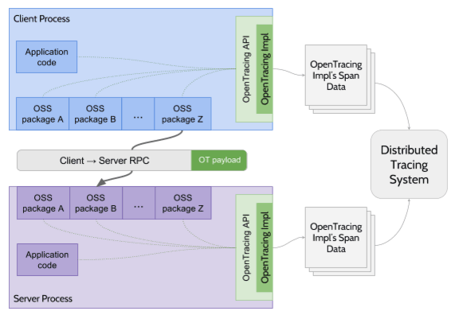

# 链路追踪

虽然 2010 年之前就已经有了 X-Trace、Magpie 等跨服务的追踪系统了，但现代分布式链路追踪公认的起源是 Google 在 2010 年发表的论文《[Dapper : a Large-Scale Distributed Systems Tracing Infrastructure](https://static.googleusercontent.com/media/research.google.com/zh-CN//archive/papers/dapper-2010-1.pdf)》，这篇论文介绍了 Google 从 2004 年开始使用的分布式追踪系统 Dapper 的实现原理。此后，所有业界有名的追踪系统，无论是国外 Twitter 的[Zipkin](https://github.com/openzipkin/zipkin)、Naver 的[Pinpoint](https://github.com/pinpoint-apm/pinpoint)（Naver 是 Line 的母公司，Pinpoint 出现其实早于 Dapper 论文发表，在 Dapper 论文中还提到了 Pinpoint），抑或是国内阿里的鹰眼、大众点评的[CAT](https://github.com/dianping/cat)、个人开源的[SkyWalking](https://github.com/apache/skywalking)（后进入 Apache 基金会孵化毕业）都受到 Dapper 论文的直接影响。

广义上讲，一个完整的分布式追踪系统应该由数据收集、数据存储和数据展示三个相对独立的子系统构成，而狭义上讲的追踪则就只是特指链路追踪数据的收集部分。譬如[Spring Cloud Sleuth](https://spring.io/projects/spring-cloud-sleuth)就属于狭义的追踪系统，通常会搭配 Zipkin 作为数据展示，搭配 Elasticsearch 作为数据存储来组合使用，而前面提到的那些 Dapper 的徒子徒孙们大多都属于广义的追踪系统，广义的追踪系统又常被称为“APM 系统”（Application Performance Management）。

## 追踪与跨度

为了有效地进行分布式追踪，Dapper 提出了“追踪”与“跨度”两个概念。从客户端发起请求抵达系统的边界开始，记录请求流经的每一个服务，直到到向客户端返回响应为止，这整个过程就称为一次“追踪”（Trace，为了不产生混淆，后文就直接使用英文 Trace 来指代了）。由于每次 Trace 都可能会调用数量不定、坐标不定的多个服务，为了能够记录具体调用了哪些服务，以及调用的顺序、开始时点、执行时长等信息，每次开始调用服务前都要先埋入一个调用记录，这个记录称为一个“跨度”（Span）。Span 的数据结构应该足够简单，以便于能放在日志或者网络协议的报文头里；也应该足够完备，起码应含有时间戳、起止时间、Trace 的的 ID、当前 Span 的 ID、父 Span 的 ID 等能够满足追踪需要的信息。每一次 Trace 实际上都是由若干个有顺序、有层级关系的 Span 所组成一颗“追踪树”（Trace Tree），如图 10-5 所示。

:::center

图 10-5 Trace 和 Spans（图片来源于[Dapper 论文](https://static.googleusercontent.com/media/research.google.com/zh-CN//archive/papers/dapper-2010-1.pdf)）
:::

从目标来看，链路追踪的目的是为排查故障和分析性能提供数据支持，系统对外提供服务的过程中，持续地接受请求并处理响应，同时持续地生成 Trace，按次序整理好 Trace 中每一个 Span 所记录的调用关系，便能绘制出一幅系统的服务调用拓扑图。根据拓扑图中 Span 记录的时间信息和响应结果（正常或异常返回）就可以定位到缓慢或者出错的服务；将 Trace 与历史记录进行对比统计，就可以从系统整体层面分析服务性能，定位性能优化的目标。

从实现来看，为每次服务调用记录 Trace 和 Span，并以此构成追踪树结构，听着好像也不是很复杂，然而考虑到实际情况，追踪系统在功能性和非功能性上都有不小的挑战。功能上的挑战来源于服务的异构性，各个服务可能采用不同程序语言，服务间交互可能采用不同的网络协议，每兼容一种场景，都会增加功能实现方面的工作量。而非功能性的挑战具体就来源于以下这四个方面：

- **低性能损耗**：分布式追踪不能对服务本身产生明显的性能负担。追踪的主要目的之一就是为了寻找性能缺陷，越慢的服务越是需要追踪，所以工作场景都是性能敏感的地方。
- **对应用透明**：追踪系统通常是运维期才事后加入的系统，应该尽量以非侵入或者少侵入的方式来实现追踪，对开发人员做到透明化。
- **随应用扩缩**：现代的分布式服务集群都有根据流量压力自动扩缩的能力，这要求当业务系统扩缩时，追踪系统也能自动跟随，不需要运维人员人工参与。
- **持续的监控**：要求追踪系统必须能够 7x24 小时工作，否则就难以定位到系统偶尔抖动的行为。

## 数据收集

目前，追踪系统根据数据收集方式的差异，可分为三种主流的实现方式，分别是**基于日志的追踪**（Log-Based Tracing），**基于服务的追踪**（Service-Based Tracing）和**基于边车代理的追踪**（Sidecar-Based Tracing），笔者分别介绍如下：

- 基于日志的追踪的思路是将 Trace、Span 等信息直接输出到应用日志中，然后随着所有节点的日志归集过程汇聚到一起，再从全局日志信息中反推出完整的调用链拓扑关系。日志追踪对网络消息完全没有侵入性，对应用程序只有很少量的侵入性，对性能影响也非常低。但其缺点是直接依赖于日志归集过程，日志本身不追求绝对的连续与一致，这也使得基于日志的追踪往往不如其他两种追踪实现来的精准。另外，业务服务的调用与日志的归集并不是同时完成的，也通常不由同一个进程完成，有可能发生业务调用已经顺利结束了，但由于日志归集不及时或者精度丢失，导致日志出现延迟或缺失记录，进而产生追踪失真。这也是前面笔者介绍 Elastic Stack 时提到的观点，ELK 在日志、追踪和度量方面都可以发挥作用，这对中小型应用确实有一定便利，但是大型系统最好还是由专业的工具做专业的事。<br/>日志追踪的代表产品是 Spring Cloud Sleuth，下面是一段由 Sleuth 在调用时自动生成的日志记录，可以从中观察到 TraceID、SpanID、父 SpanID 等追踪信息。

  ```
  # 以下为调用端的日志输出：
  Created new Feign span [Trace: cbe97e67ce162943, Span: bb1798f7a7c9c142, Parent: cbe97e67ce162943, exportable:false]
  2019-06-30 09:43:24.022 [http-nio-9010-exec-8] DEBUG o.s.c.s.i.web.client.feign.TraceFeignClient - The modified request equals GET http://localhost:9001/product/findAll HTTP/1.1

  X-B3-ParentSpanId: cbe97e67ce162943
  X-B3-Sampled: 0
  X-B3-TraceId: cbe97e67ce162943
  X-Span-Name: http:/product/findAll
  X-B3-SpanId: bb1798f7a7c9c142

  # 以下为服务端的日志输出：
  [findAll] to a span [Trace: cbe97e67ce162943, Span: bb1798f7a7c9c142, Parent: cbe97e67ce162943, exportable:false]
  Adding a class tag with value [ProductController] to a span [Trace: cbe97e67ce162943, Span: bb1798f7a7c9c142, Parent: cbe97e67ce162943, exportable:false]
  ```

- 基于服务的追踪是目前最为常见的追踪实现方式，被 Zipkin、SkyWalking、Pinpoint 等主流追踪系统广泛采用。服务追踪的实现思路是通过某些手段给目标应用注入追踪探针（Probe），针对 Java 应用一般就是通过 Java Agent 注入的。探针在结构上可视为一个寄生在目标服务身上的小型微服务系统，它一般会有自己专用的服务注册、心跳检测等功能，有专门的数据收集协议，把从目标系统中监控得到的服务调用信息，通过另一次独立的 HTTP 或者 RPC 请求发送给追踪系统。因此，基于服务的追踪会比基于日志的追踪消耗更多的资源，也有更强的侵入性，换来的收益是追踪的精确性与稳定性都有所保证，不必再依靠日志归集来传输追踪数据。<br/>下面是一张 Pinpoint 的追踪效果截图，从图中可以看到参数、变量等相当详细方法级调用信息。笔者在上一节“[日志分析](/distribution/observability/logging.html)”里把“打印追踪诊断信息”列为反模式，如果需要诊断需要方法参数、返回值、上下文信息，或者方法调用耗时这类数据，通过追踪系统来实现是比通过日志系统实现更加恰当的解决方案。
  :::center
  
  图 10-6 Pinpoint 的追踪截图（图片来自网络）
  :::
  也必须说明清楚，像图 10-6 中 Pinpoint 这种详细程度的追踪对应用系统的性能压力是相当大的，一般仅在除错时开启，而且 Pinpoint 本身就是比较重负载的系统（运行它必须先维护一套 HBase），这严重制约了它的适用范围，目前服务追踪的其中一个发展趋势是轻量化，国产的 SkyWalking 正是这方面的佼佼者。
- 基于边车代理的追踪是服务网格的专属方案，也是最理想的分布式追踪模型，它对应用完全透明，无论是日志还是服务本身都不会有任何变化；它与程序语言无关，无论应用采用什么编程语言实现，只要它还是通过网络（HTTP 或者 gRPC）来访问服务就可以被追踪到；它有自己独立的数据通道，追踪数据通过控制平面进行上报，避免了追踪对程序通信或者日志归集的依赖和干扰，保证了最佳的精确性。如果要说这种追踪实现方式还有什么缺点的话，那就是服务网格现在还不够普及，未来随着云原生的发展，相信它会成为追踪系统的主流实现方式之一。还有就是边车代理本身的对应用透明的工作原理决定了它只能实现服务调用层面的追踪，像上面 Pinpoint 截图那样本地方法调用级别的追踪诊断是做不到的。<br/>现在市场占有率最高的边车代理[Envoy](https://www.envoyproxy.io/)就提供了相对完善的追踪功能，但没有提供自己的界面端和存储端，所以 Envoy 和 Sleuth 一样都属于狭义的追踪系统，需要配合专门的 UI 与存储来使用，现在 SkyWalking、Zipkin、[Jaeger](https://www.jaegertracing.io/)、[LightStep Tracing](https://lightstep.com/products/)等系统都可以接受来自于 Envoy 的追踪数据，充当它的界面端。

## 追踪规范化

比起日志与度量，追踪这个领域的产品竞争要相对激烈得多。一方面，目前还没有像日志、度量那样出现具有明显统治力的产品，仍处于群雄混战的状态。另一方面，几乎市面上所有的追踪系统都是以 Dapper 的论文为原型发展出来的，基本上都算是同门师兄弟，功能上并没有太本质的差距，却又受制于实现细节，彼此互斥，很难搭配工作。这种局面只能怪当初 Google 发表的 Dapper 只是论文而不是有约束力的规范标准，只提供了思路，并没有规定细节，譬如该怎样进行埋点、Span 上下文具体该有什么数据结构，怎样设计追踪系统与探针或者界面端的 API 接口，等等，都没有权威的规定。

为了推进追踪领域的产品的标准化，2016 年 11 月，CNCF 技术委员会接受了 OpenTracing 作为基金会第三个项目。OpenTracing 是一套与平台无关、与厂商无关、与语言无关的追踪协议规范，只要遵循 OpenTracing 规范，任何公司的追踪探针、存储、界面都可以随时切换，也可以相互搭配使用。

操作层面，OpenTracing 只是制定了一个很薄的标准化层，位于应用程序与追踪系统之间，这样探针与追踪系统就可以不是同一个厂商的产品，只要它们都支持 OpenTracing 协议即可互相通讯。此外，OpenTracing 还规定了微服务之间发生调用时，应该如何传递 Span 信息（OpenTracing Payload），以上这些都如图 10-7 绿色部分所示。

:::center

图 10-7 符合 OpenTracing 的软件架构（[图片来源](https://medium.com/opentracing/towards-turnkey-distributed-tracing-5f4297d1736)）
:::

OpenTracing 规范公布后，几乎所有业界有名的追踪系统，譬如 Zipkin、Jaeger、SkyWalking 等都很快宣布支持 OpenTracing，但谁也没想到的是，Google 自己却在此时出来表示反对，并提出了与 OpenTracing 目标类似的 OpenCensus 规范，随后又得到了巨头 Microsoft 的支持和参与。OpenCensus 不仅涉及追踪，还把指标度量也纳入进来；内容上不仅涉及规范制定，还把数据采集的探针和收集器都一起以 SDK（目前支持五种语言）的形式提供出来。

OpenTracing 和 OpenCensus 迅速形成了可观测性的两大阵营，一边是在这方面深耕多年的众多老牌 APM 系统厂商，另一边是分布式追踪概念的提出者 Google，以及与 Google 同样庞大的 Microsoft。对追踪系统的规范化工作，并没有平息厂商竞争的混乱，反倒是把水搅得更加浑了。

正当群众们买好西瓜搬好板凳的时候，2019 年，OpenTracing 和 OpenCensus 又忽然宣布握手言和，它们共同发布了可观测性的终极解决方案[OpenTelemetry](https://opentelemetry.io/)，并宣布会各自冻结 OpenTracing 和 OpenCensus 的发展。OpenTelemetry 野心颇大，不仅包括追踪规范，还包括日志和度量方面的规范、各种语言的 SDK、以及采集系统的参考实现，它距离一个完整的追踪与度量系统，仅仅是缺了界面端和指标预警这些会与用户直接接触的后端功能，OpenTelemetry 将它们留给具体产品去实现，勉强算是没有对一众 APM 厂商赶尽杀绝，留了一条活路。

OpenTelemetry 一诞生就带着无比炫目的光环，直接进入 CNCF 的孵化项目，它的目标是统一追踪、度量和日志三大领域（目前主要关注的是追踪和度量，日志方面，官方表示将放到下一阶段再去处理）。不过，OpenTelemetry 毕竟是 2019 年才出现的新生事物，尽管背景渊源深厚，前途光明，但未来究竟如何发展，能否打败现在已经有的众多成熟系统，目前仍然言之尚早。
