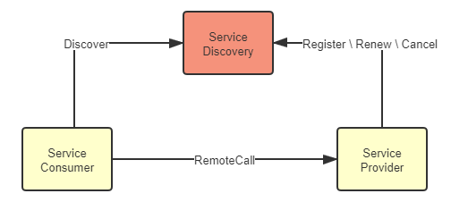
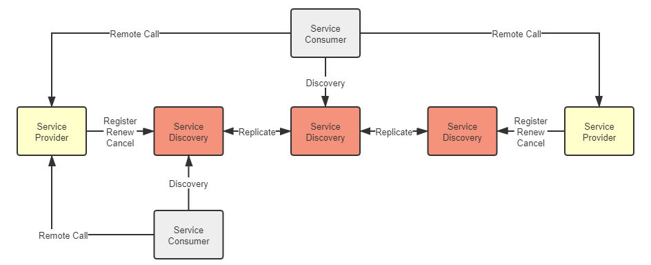

# 服务发现

自“子程序”诞生之日起，计算机实现了通过方法调用来组装复用指令序列，打开了软件达到更大规模一扇大门。无论是编译期链接的C/CPP，抑或是运行期链接的Java，都存有着将代码中的方法入口的符号引用转换为进程内存地址的直接引用的、不可或缺的链接过程。自“远程服务调用”诞生之日起，通过分布于网络中不同机器的互相协作来复用功能，是软件发展规模的第二次飞跃，此时如何确定目标方法的确切位置，便是与编译链接有着等同意义的问题，解决该问题的过程就被称作“[服务发现](https://en.wikipedia.org/wiki/Service_discovery)”（Service Discovery）。

所有的远程服务调用都是使用“IP地址、端口号、服务标识”构成的三元组来确定一个远程服务的精确坐标的。其中“IP地址、端口号”的含义在各种远程服务中都一致，这源于TCP/IP协议在计算机网络中统治性地位，IP和端口代表了某台服务器上的某个应用程序所提供的数据交换接口。而“服务标识”则与应用层协议相关，可以是多样的，譬如HTTP的远程服务，标识是URL地址；RMI的远程服务，标识是Stub类中的方法；SOAP的远程服务，标识是WSDL中的定义，等等。远程服务的多样性导致了“服务发现”也会有两种不同的理解，一种是以UDDI为代表的“百科全书式”的服务发现，上至提供服务的企业信息（企业实体、联系地址、分类目录等等），下至服务的程序接口细节（方法名称、参数、返回值、技术规范等等）都在服务发现的管辖范围之内；另一种是类似于DNS这样“门牌号码式”的服务发现，只满足从某个代表服务提供者的符号（如域名、服务ID）到服务实际主机的翻译转换，并不关心服务具体是哪个厂家提供的，也不关心服务由几个方法，各自有什么参数所构成，默认这些细节信息是服务消费者本身所了解的，此时服务坐标就可以退化为简单的“IP+端口”。当今，后一种服务发现占主流地位，本文后续所说的服务发现，如无说明，均是特指的是后者。

原本服务发现只依赖DNS将一个网络名称翻译为一个或者多个IP地址（或者SRV等其他记录）便可实现，后来负载均衡器也承担了一部分服务发现的职责，这些内容我们在“[透明多级分流系统](/architect-perspective/general-architecture/diversion-system/)”一节中曾经详细解析过，这种方式在软件追求不间断长时间运行的时代是合适的。但随着微服务的逐渐流行，服务的非正常宕机重启和正常的上线下线变得更加频繁，仅靠着DNS服务器和负载均衡器等基础设施就显得有些逐渐疲于应对，无法跟上服务变动的步伐了。人们开始尝试使用ZooKeeper这样的分布式K/V框架，通过软件自身来完成服务注册与发现，ZooKeeper曾短暂统治过远程服务发现，是微服务早期对服务发现的主流选择，但毕竟ZooKeeper是很底层的分布式工具，用户自己还需要做相当多的工作才能满足服务发现的需求。到了2014年，在Netflix内部经受过长时间实际考验的、专门用于服务发现的Eureka宣布开源，并很快被被纳入Spring Cloud，成为Spring默认的远程服务发现的解决方案。从此Java程序员再无需再在服务注册这件事情上花费太多的力气。到2018年，Spring Cloud Eureka进入维护模式以后，HashiCorp的Consul和阿里巴巴的Nacos很就快从Eureka手上接过传承的衣钵。此时的服务发现框架已经发展得相当成熟，考虑到几乎方方面面的问题，譬如支持通过DNS或者HTTP请求进行符号与实际地址的转换，支持各种各样的服务健康检查方式，支持集中配置、K/V存储、跨数据中心的数据交换等多种功能，可算是应用自身去解决服务发现的一个顶峰。如今，云原生时代来临，基础设施的灵活性得到大幅度的增强，最初的使用基础设施来透明化地做服务发现的方式又重新被人们所重视，如何在基础设施和网络协议层面，对应用尽可能无感知、尽可能方便地实现服务发现是目前一个主要的发展方向。

本文中，我们将会分析服务发现的几个关键的子问题，并且探讨、对比时下最常见的用作服务发现的几种形式。首先，第一个问题是“服务发现”具体是指进行过什么操作？这里面其实包含了三个必须的过程：

- **服务的注册**（Service Registration）：当服务启动的时候，它应该通过某些形式（譬如调用API、产生事件消息、在zk/etcd的指定位置记录、存入数据库，等等）将自己的坐标信息通知到服务注册中心，这个过程可能由应用程序来完成（譬如Spring Cloud的@EnableDiscoveryClient注解），也可能有容器框架（譬如Kubernetes）来完成。
- **服务的维护**（Service Maintaining）：尽管服务发现框架通常都有提供下线机制，但并没有什么办法保证每次服务都能[优雅地下线](https://whatis.techtarget.com/definition/graceful-shutdown-and-hard-shutdown)（Graceful Shutdown）而不是由于宕机、断网等原因突然失联。所以服务发现框架必须要自己去保证所维护的服务列表的正确性，以避免告知消费者服务的坐标后，得到的服务却不能使用的尴尬情况。现在的服务发现框架，往往都能支持多种协议（HTTP、TCP等）、多种方式（长连接、心跳、探针、进程状态等）去监控服务是否健康存活，将不健康的服务自动下线。
- **服务的发现**（Service Discovery）：这里的发现是狭义特指消费者从服务发现框架中，把一个符号（譬如Eureka中的ServiceID、Nacos中的服务名、或者通用的[FDQN](https://en.wikipedia.org/wiki/Fully_qualified_domain_name)）转换为服务实际坐标的过程，这个过程现在一般是通过HTTP API请求或者通过DNS Lookup操作来完成（还有一些相对少用的方式，如Kubernetes也支持注入环境变量）。

以上三点只列举了必须的过程，在此之余还会有一些可选的功能，譬如在服务发现时进行的负载均衡、流量管控、K/V存储、元数据管理、业务分组，等等，这部分后续会有专门介绍，就不再展开。我们来讨论另一个很常见的问题，说起服务发现的文章，总是无可避免地会先扯到“CP”还是“AP”的问题上。为什么服务发现对CAP如此关注、如此敏感呢？我们可以从服务发现在整个系统中所处的角色来着手分析这个问题，在概念模型中，服务中心所处的地位是如下图所示这样的：提供者在服务发现中注册、续约和下线自己的真实坐标，消费者根据某种符号从服务发现中获取到真实坐标，它们都可以视为系统中平等的微服务，如下图所示：

:::center

概念模型

:::

但在真实的系统中，服务发现的地位还是有一些特殊，并不能为完全视其为一个普通的服务。服务发现是整个系统中所有其他服务都直接依赖的最基础服务（类似相同待遇的大概就数配置中心了，现在服务发现框架也开始同时提供配置中心的功能，以避免配置中心又去专门搞出一集群的节点来），几乎没有办法在业务层面进行容错处理。服务注册中心一旦崩溃，整个系统都受波及，因此必须尽最大可能在技术层面保证可用性。所以，分布式系统中，服务注册中心一般会以内部小集群的方式部署，提供三个或者五个节点（通常最多七个，一般也不会更多了，否则日志复制的开销太高）来保证高可用性，如下图所示：

:::center

真实系统

:::

同时，也请注意到上图中各服务发现节点之间的“Replicate”字样，作为用户，我们当然期望服务注册一直可用永远健康的同时，也能够在访问每一个节点中都能取到一致的数据，这两个需求就构成了CAP矛盾。以AP、CP两种取舍作为选择维度，以最有代表性的Eureka和Consul为例，Consul采用[Raft协议](/distribution/consensus/raft.html)，要求多数派节点写入成功后服务的注册或变动才算完成，严格地保证了在集群外部读取到的服务发现结果一定是一致的；Eureka的各个节点间采用异步复制来交换服务注册信息，服务注册或变动时，并不需要等待信息在其他节点复制完成，而是马上在该服务发现节点就宣告可见（但其他节点是否可见并不保证）。这两点差异带来的影响并不在于服务注册的快慢（当然，快慢确实是有差别），而在于你如何看待以下这件事情：

> 假设系统形成了A、B两个网络分区后，A区的服务只能从区域内的服务发现节点获取到A区的服务坐标，B区的服务只能取到在B区的服务坐标，这对你的系统会有什么影响？

- 如果这件事情对你并没有什么影响，甚至有可能还是有益的，就应该倾向于选择AP的服务发现。譬如假设A、B就是不同的机房，是机房间的网络交换机导致服务发现集群出现的分区问题，但每个分区中的服务仍然能独立提供完整且正确的服务能力，此时尽管不是有意而为，但网络分区在事实上避免了跨机房的服务请求，反而还带来了服务调用链路优化的效果。

- 如果这件事情也可能对你影响非常大，甚至可能带来比整个系统宕机更坏的结果，就应该倾向于选择CP的服务发现。譬如系统中大量依赖了集中式缓存、消息总线、或者其他有状态的服务，一旦这些服务全部或者部分被分隔到某一个分区中，会对整个系统的操作的正确性产生直接影响的话，那与其搞出一堆数据错误，还不如停机来得痛快。

数据一致性是分布式系统永恒的话题，在服务发现这个场景里，权衡的主要关注点是一旦出现分区所带来的后果，其他在正常运行过程中的速度问题都是次要的。最后，我们再来讨论一个很“务实”的话题，现在那么多的服务发现框架，哪一款最好？或者说应该如何挑选适合的？

现在直接以服务发现、服务注册中心为目标，或者间接用来实现这个目标的方式主要有以下三类：

- 在分布式K/V存储框架上自己实现的服务发现，这类的代表是ZooKeeper、Doozerd、Etcd 这些K/V框架提供了分布式环境下读写操作的共识保证，Etcd采用的是我们学习过的Raft算法，ZooKeeper采用的是ZAB算法（一种Multi Paxos的派生算法），所以采用这种方案，就不必纠结CP还是AP的问题，它们都是CP的。这类框架的宣传语中往往会主动提及“高可用性”，潜台词其实是“在保证一致性和分区容错性的前提下，尽最大努力实现最高的可用性”，譬如Etcd的宣传语就是“高可用的集中配置和服务发现”（**Highly-Available** Key Value Store for Shared Configuration and Service Discovery）。这些K/V框架的另一个共同特点是在整体较高复杂度的架构和算法的外部，维持着极为简单的应用接口，只有基本的CRUD和Watch等少量API，所以要在上面完成功能齐全的服务发现，很多基础的能力，譬如服务如何注册、如何做健康检查，等等都必须自己实现，如今一般也只有“大厂”才会直接这些框架去做服务发现了。
- 以基础设施（主要就是DNS服务器）来实现服务发现，这类的代表是SkyDNS、KubeDNS、CoreDNS 在Kubernetes 1.3之前的版本使用SkyDNS作为默认的DNS服务，其工作原理是从kube-apiserver中监听集群服务的变化，然后根据服务生成NS、SRV等DNS记录存放到Etcd中，kubelet会在每个Pod内部设置DNS服务的地址为SkyDNS的地址，需要调用服务时，只需查询DNS把域名转换成IP列表便可实现分布式的服务发现。在Kubernetes 1.3之后，SkyDNS不再是默认的DNS服务器，由不使用Etcd而是只将DNS记录存储在内存中的KubeDNS代替，到了1.11版，就更推荐采用扩展性很强的CoreDNS，此时可以通过各种插件来决定是否要采用Etcd存储、重定向、定制DNS记录、记录日志，等等。 采用这种方案，是CP还是AP就取决于后端采用何种存储，如果是基于Etcd实现的，那自然是CP的，如果是基于内存异步复制的方案实现的，那就是AP的。以基础设施来做服务发现，好处是对应用透明，任何语言、框架、工具都肯定是支持HTTP、DNS的，所以完全不受程序技术选型的约束，但坏处是透明的并不一定是简单的，你必须自己考虑如何去做客户端负载均衡、如何调用远程方法等这些问题，而且必须遵循或者说受限于这些基础设施本身所采用的实现机制，譬如服务健康检查里，服务的缓存期限就必须采用TTL（Time to Live）来决定，这是DNS协议所规定的，如果想改用KeepAlive长连接来实时判断服务是否存活就很麻烦。
- 专门用于服务发现的框架和工具，这类的代表是Eureka、Consul和Necos 这一类框架中，你可以自己决定是CP还是AP的问题，譬如CP的Consul、AP的Eureka，还有同时支持CP和AP的Nacos（Nacos采用类Raft协议做的CP，采用自研的Distro协议做的AP，这里“同时是“都支持”的意思，它们必须二取其一，不是说CAP全能满足）。另外，还有很重要一点是它们对应用并不是透明的，尽管Consul、Necos也支持基于DNS的服务发现，尽管这些框架都基本上做到了以声明代替编码（譬如在Spring Cloud中只改动pom.xml、配置文件和注解即可实现），但它们依然是应用程序有感知的。所以或多或少还需要考虑你所用的程序语言、技术框架的集成问题。但这一点其实并不见得就是坏处，譬如采用Eureka做服务注册，那在远程调用服务时你就可以用OpenFeign做客户端，写个声明式接口就能跑，相当能偷懒；在做负载均衡时你就可以采用Ribbon做客户端，要换均衡算法改个配置就成，这些“不透明”实际上都为编码开发带来了一定便捷，而前提是你选用的语言和框架支持。如果老板提出要在Rust上用Eureka，你就只能无奈叹息了（原本这里我写的是Node、Go、Python等，查了一下这些居然都有非官方的Eureka客户端，用的人多就是有好处啊）。