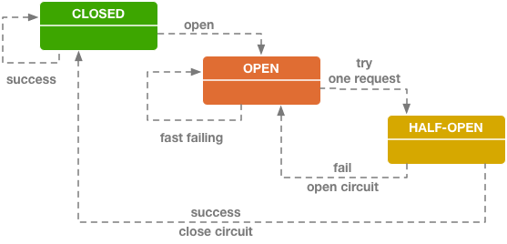
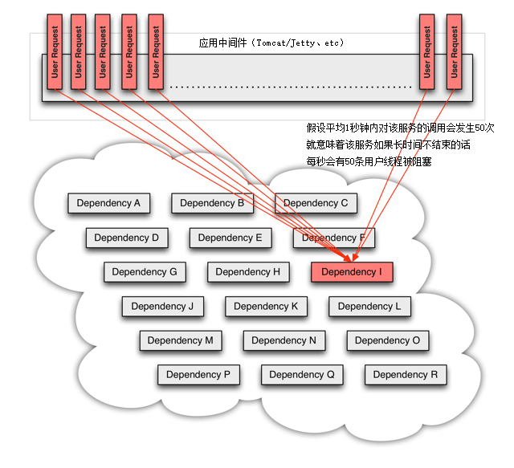

# 服务容错

Martin Fowler与James Lewis提出的“[微服务的九个核心特征](/architecture/architect-history/microservices.html)”是构建微服务系统的指导性原则，但不是技术规范，并没有严格的约束力。在实际构建系统时候，其中多数特征可能会有或多或少的妥协，譬如分散治理、数据去中心化、轻量级通讯机制、演进式设计，等等。但也有一些特征是无法做出妥协的，其中的典型就是今天我们讨论的主题：容错性设计（Design for Failure）。

容错性设计不能妥协来源于分布式系统的本质是不可靠的，一个大的服务集群中，程序可能崩溃、节点可能宕机、网络可能中断，这些“意外情况”其实全部都在“意料之中”。原本一个信息系统进行分布式的主要动力之一就是为了提升系统的可用性——最低限度也必须保证将原有系统重构为分布式架构之后，可用性不会倒退下降才行。如果服务集群中出现任何一点差错都能让系统发生“千里之堤溃于蚁穴”的情况，那分布式系统恐怕就根本不会成为一种可用的系统架构形式。

## 容错策略

要落实容错性设计这条原则，除了思想观念上转变过来，正视服务必然是会出错的，对它进行有计划的防御之外，还必须了解一些常用的`容错策略`和`容错设计模式`，作为具体设计与编码实践的指导。`容错策略`指的是“面对故障，我们该做些什么”，稍后将讲解的`容错设计模式`指的是“要实现某种容错策略，我们该如何去做”。常见的容错策略有以下几种：

- **故障转移**（Failover）：高可用的服务集群中，多数的服务——尤其是那些经常被其他服务所依赖的关键路径上的服务，均会部署多有个副本。这些副本可能部署在不同的节点（避免节点宕机）、不同的网络交换机（避免网络分区）甚至是不同的可用区（避免整个地区发生灾害或电力、骨干网故障）中。故障转移是指如果调用的服务器出现故障，系统不会立即向调用者返回失败结果，而是自动切换到其他服务副本，尝试其他副本能否返回成功调用的结果，从而保证了整体的高可用性。 
  故障转移的容错策略应该有一定的调用次数限制，譬如允许最多重试3个服务，如果都发生报错，那还是会返回调用失败。原因不仅是因为重试是有执行成本的，更是因为过度的重试反而可能让系统处于更加不利的状况。譬如有以下调用链：
    :::center
    >  Service A --> Service B --> Service C
    :::
  假设A的超时阈值为100ms，而B调用C花费60ms，然后不幸失败了，这时候做故障转移其实已经没有太大意义了，因为即时下一次调用能够返回正确结果，也很可能同样需要耗费60ms时间，时间总和就已经触及A服务的超时阈值，所以在这种情况下故障转移反而对系统是不利的。
- **快速失败**（Failfast）：还有另外一些业务场景是不允许做故障转移的，故障转移策略能够实施的前提是要求服务具备幂等性，对于非幂等的服务，重复调用就可能产生脏数据，引起的麻烦远大于单纯的某次服务调用失败，此时就应该以快速失败作为首选的容错策略。譬如，在支付场景中，需要调用银行的扣款接口，如果该接口返回的结果是网络异常，程序是很难判断到底是扣款指令发送给银行时出现的网络异常，还是银行扣款后返回结果给服务时出现的网络异常的。为了避免重复扣款，此时最恰当可行的方案就是尽快让服务报错，坚决避免重试，尽快抛出异常，由调用者自行处理。
- **安全失败**（Failsafe）：在一个调用链路中的服务通常也有主路和旁路之分，并不是其中每个服务都是不可或缺的，有部分服务失败了也并不影响核心业务的正确性。传统上，开发基于Spring管理的应用程序时，通过扩展点、事件或者AOP注入的逻辑往往就属于旁路逻辑，典型的有审计、日志、调试信息，等等。对属于旁路逻辑，通常后续处理不会依赖其返回值，或者它的返回值是什么都不会影响后续处理的结果（譬如只是将返回值记录到数据库，并不使用它参与最终结果的运算）。此时，一种理想的容错策略是即使旁路逻辑调用实际失败了，也当作正确来返回，如果需要返回值的话，系统就自动返回一个符合要求的数据类型的对应零值，然后再自动记录一条服务调用出错的日志备查即可，这种策略被称为安全失败。
- **沉默失败**（Failsilent）：如果大量的请求需要等到超时（或者长时间处理后）才宣告失败，很容易由于某个远程服务的请求堆积而消耗大量的线程、内存、网络等资源，进而影响到整个系统的稳定。面对这种情况，一种合理的失败策略是当请求失败后，就默认服务提供者一定时间内无法再对外提供服务，将错误隔离开来，避免对系统其他部分产生影响，此即为沉默失败策略。
- **故障恢复**（Failback）：故障恢复一般不单独存在，而是作为其他容错策略的补充措施，一般在微服务管理框架中，如果设置容错策略为故障恢复的话，通常默认会采用`快速失败`加上`故障恢复`的策略组合。它是指当服务调用出错了以后，将该次调用失败的信息存入一个消息队列中，然后由系统自动开始异步重试调用。 故障恢复策略一方面是尽力促使失败的调用最终能够被正常执行，另一方面也可以为服务注册中心和负载均衡器及时提供服务恢复的通知信息。故障恢复显然也是要求服务必须具备幂等性的，由于它的重试是后台异步进行，所以即使最后调用成功了，原来的请求也早已经响应完毕。故障恢复策略可以用于对实时性要求不高的主路逻辑，同样适合处理那些不需要返回值的旁路逻辑。为了避免在内存中异步调用任务堆积，故障恢复同样应该有最大重试次数的限制。
- **并行调用**（Forking）：上面五种以“Fail”开头的策略是针对调用失败时如何进行弥补的，以下这两种则是在调用之前就开始考虑如何获得最大的成功概率。并行调用的策略很符合人们日常对一些重要环节进行的“双重保险”或者“多重保险”的处理思路，它是指一开始就同时向多个服务副本发起调用，只要有其中任何一个返回成功，那调用便宣告成功，这是一种在关键场景中使用更高的执行成本换取执行时间和成功概率的策略。
- **广播调用**（Broadcast）：广播调用与并行调用是相对应的，都是同时发起多个调用，但并行调用是任何一个调用结果返回成功便宣告成功，广播调用则是要求所有的请求全部都成功，这次调用才算是成功，任何一个服务提供者出现异常都算调用失败，广播调用通常会被用于实现“刷新缓存”这类的操作。

容错策略并非计算机科学独有的，在交通、能源、航天等很多领域都有容错性设计，也会使用到上面这些策略，并在自己的行业领域中进行解读与延伸。这里介绍的容错策略并非全部，只是最常见的几种，笔者将它们各自的优缺点、应用场景总结为以下表格，供大家使用时参考：

| 容错策略 | 优点                                                        | 缺点                                                         | 应用场景                                                |
| -------- | ----------------------------------------------------------- | ------------------------------------------------------------ | ------------------------------------------------------- |
| 
**故障转移**
 | 系统自动处理，调用者对失败的信息不可见                             | 增加调用时间，额外的资源开销                                 | 调用幂等服务 对调用时间不敏感的场景                     |
| **快速失败** | 调用者有对失败的处理完全控制权 不依赖服务的幂等性 | 调用者必须正确处理失败逻辑，如果一味只是对外抛异常，容易引起雪崩 | 调用非幂等的服务 超时阈值较低的场景                 |
| **安全失败** | 不影响主路逻辑                                    | 只适用于旁路调用                                             | 调用链中的旁路服务                                      |
| **沉默失败** | 控制错误不影响全局 | 出错的地方将在一段时间类不可用 | 频繁超时的服务 |
| **故障恢复** | 调用失败后自动重试，也不影响主路逻辑                        | 推荐用于旁路服务调用，或者对实时性要求不高的主路逻辑 重试任务可能产生堆积，重试仍然可能失败 | 调用链中的旁路服务 对实时性要求不高的主路逻辑也可以使用 |
| **并行调用** | 尽可能在最短时间内获得最高的成功率                          | 额外消耗机器资源，大部分调用可能都是无用功                   | 资源充足且对失败容忍度低的场景                          |
| **广播调用** | 支持同时对批量的服务提供者发起调用                             | 资源消耗大，失败概率高                                       | 只适用于批量操作的场景                                   |

## 容错设计模式

为了实现各种容错策略，开发人员总结出了一些被实践证明有效的服务容错的设计模式，譬如微服务中常见的断路器模式、舱壁隔离模式，超时重试模式等。还要将在下节介绍的流量控制模式，如滑动时间窗模式、漏桶模式、令牌桶模式，等等。

### 断路器模式

断路器模式是微服务架构中最常见的服务容错设计模式，以至于像Hystrix这种服务治理工具往往被人们忽略了它的服务隔离、请求合并、请求缓存等其他服务治理职能，直接将它称之为微服务断路器或者熔断器。这个设计模式最早由技术作家Michael Nygard在《[Release It!](https://book.douban.com/subject/2065284/)》一书中提出的，后又因Martin Fowler的《[Circuit Breaker](https://martinfowler.com/bliki/CircuitBreaker.html)》一文而广为人知。

断路器的基本思路很简单的，就是通过代理（断路器对象）来一对一地（一个远程服务对应一个断路器对象）接管服务调用者的远程请求。断路器会持续监控并统计服务返回的结果（成功、失败、超时、拒绝），当出现故障（失败、超时、拒绝）的次数达到断路器的阈值时，它状态就自动变为“OPEN”，后续此断路器代理的远程访问都将直接返回调用失败，而不会发生真正的远程服务访问。通过断路器对远程服务的熔断，避免因持续的失败或拒绝而消耗资源，因持续的超时而堆积请求，最终的效果就是避免雪崩效应的出现。由此可见，断路器本质是一种`快速失败`策略的实现方式，它的工作过程可以通过下面序列图来表示：

<mermaid style="margin-bottom: 0px">
sequenceDiagram
	服务调用者 ->>+ 断路器: 请求
	断路器 ->>+ 服务提供者: 代理远程请求
	服务提供者 -->>- 断路器: 成功返回
	断路器 -->>- 服务调用者: 代理远程响应
	par 失败未超过断路阈值
		服务调用者 ->>+ 断路器: 请求
		断路器 ->>+ 服务提供者: 代理远程请求
		服务提供者 -->- 断路器: 请求失败/超时/拒绝
		断路器 -->>- 服务调用者: 代理请求失败
	and 失败达到断路阈值
		服务调用者 ->>+ 断路器: 请求
		断路器 ->>+ 服务提供者: 代理远程请求
		服务提供者 -->- 断路器: 请求失败/超时/拒绝
		断路器 ->> 断路器: 打开断路器
		断路器 -->>- 服务调用者: 代理请求失败
	and 失败超过断路阈值
		服务调用者 ->>+ 断路器: 请求
		断路器 -->>- 服务调用者: 请求失败
	end
</mermaid>

从调用序列来看，断路器模式是一种根据状态机变化，自动调整代理请求策略的过程。断路器的状态一般要设置三种：

- **CLOSED**：表示断路器关闭，此时的远程请求会真正发送给服务提供者。断路器刚刚建立时默认处于这种状态，此后将持续监视远程请求的数量和执行结果，决定是否要进入OPEN状态。
- **OPEN**：表示断路器开启，此时不会进行远程请求，直接给服务调用者返回调用失败的信息，以实现`快速失败`策略。
- **HALF OPEN**：这是一种中间状态。断路器必须带有自动的故障恢复能力，当进入OPEN状态一段时间以后，将“自动”（一般是由下一次请求而不是计时器触发的，所以这里自动带引号）切换到HALF OPEN状态。该状态下，会放行一次远程调用，然后根据这次调用的结果成功与否，转换为CLOSED或者OPEN状态，以实现断路器的弹性恢复。

这些状态的转换逻辑与条件如下图所示：

:::center

断路器的状态转换逻辑（[图片来源](https://tech.ebayinc.com/engineering/application-resiliency-using-netflix-hystrix/)）
:::

OPEN和CLOSED状态的含义是清晰的，与我们日常生活中电路的断路器并没有什么差别，值得讨论的是这两者的转换条件是什么？一种最简单直接的方案是只要遇到一次调用失败，那就默认以后所有的调用都会接着失败，断路器直接进入OPEN状态，但这样做的效果是很差的，虽然避免了故障扩散和请求堆积，却使得外部看来系统将表现极其不稳定。现实中可行的办法是在以下两个条件同时满足时，断路器状态转变为OPEN：

- 条件1：一段时间（譬如10秒以内）内请求数量达到一定阈值（譬如20个请求）。这个条件的意思是如果请求本身就很少，那就用不着断路器介入。
- 条件2：这些请求的故障率（发生失败、超时、拒绝的统计比例）到达一定阈值（譬如50%）。这个条件的意思是如果请求本身都能正确返回，也用不着断路器介入。

以上两个条件同时满足时，断路器就会转变为OPEN状态。括号中举例的数值是Netflix Hystrix的默认值，其他服务治理的工具，譬如Resilience4j、Envoy等也同样会包含有类似的设置。

借着断路器的上下文，笔者顺带讲一下微服务中两个常见易混淆概念`服务熔断`和`服务降级`之间的联系与差别。断路器做的事情是自动进行服务熔断，这是一种快速失败的容错策略。而在快速失败策略（还有其他策略，如故障转移超过阈值等）明确反馈了故障给上游服务后，上游服务必须能够主动处理调用失败的后果，而不是坐视故障扩散，这里的“处理”指的就是一种典型的服务降级逻辑，降级逻辑可以是但不应该全部都是把异常信息抛到用户界面去，而是应该尽力想办法通过其他路径处理问题，把原本要处理的业务记录下来留待以后重新处理是最低限度的通用降级逻辑。举个不太吉利的例子，你女朋友有事召唤你，不仅打你手机没人接，打了你另外三个不同朋友的手机号，都还是没能找到你（故障转移并超过阈值）。这时候她只能在微信上给你留言“不回电话就分手”，以此来与你取得联系（服务降级逻辑）。

服务降级不一定是在出现错误后被动执行的，多数情况下，人们所谈论的降级更可能是指需要主动迫使服务进入降级逻辑的场景。譬如，出于应对可预见的峰值流量，或者是系统检修等原因，要关闭系统部分功能或关闭部分旁路服务，这时候就有可能会主动迫使这些服务降级。当然，此时服务降级就不一定是出于服务容错的目的了，更可能属于下一节要将的讲解的流量控制的范畴。

### 舱壁隔离模式

介绍过服务熔断和服务降级，我们再来看看另一个微服务治理中常听见的概念：`服务隔离`。舱壁隔离模式是常用的实现服务隔离的设计模式，舱壁这个词是来自造船业的舶来品，它原本的意思是设计舰船时，要在每个区域设计独立的水密舱室，一旦某个舱室进水，也只是影响这个舱室中的货物，而不至于让整艘舰艇沉没。这种思想就很符合容错策略中`失败静默`策略。

前面断路器中已经多次提到，调用外部服务的故障大致可以分为“失败”（如400 Bad Request、500 Internal Server Error等错误）、“拒绝”（如401 Unauthorized、403 Forbidden等错误）以及“超时”（如408 Request Timeout、504 Gateway Timeout等错误）三大类，其中“超时”引起的故障尤其容易给调用者带来全局性的风险。这是由于目前主流的网络访问大多是基于TPR并发模型（Thread per Request）来实现的，只要请求一直不结束（无论是以成功结束还是以失败结束），就要一直占用着某个线程不能释放。而线程是典型的整个系统的全局性资源，尤其是Java这类将线程映射为操作系统内核线程来实现的语言环境中，为了不让一个远程服务的局部失败演变成全局性的影响，就必须设置某种止损方案，这便是`服务隔离`的意义。

我们来看一个具体的场景，当分布式系统所依赖的某个服务，譬如下图中的“服务I”发生了超时，那在高流量的访问下——可以具体点，假设平均1秒钟内对该服务的调用会发生50次，这就意味着该服务不结束的画，每秒会有50条用户线程被阻塞。如果这样的访问量一直持续，我们按Tomcat默认的HTTP超时时间20秒来计算，20秒内将会阻塞掉1000条用户线程，此后才陆续会有用户线程因超时被释放出来，回归Tomcat的全局线程池中。一般Java应用的线程池最大只会设置到200至400之间，这意味着此时系统在外部将表现为全面瘫痪，而不是只有涉及到“服务I”的功能不可用，因为Tomcat已经没有任何空余的线程来为其他请求提供服务了。

:::center

由于某个外部服务导致的阻塞（[图片来自Hystrix使用文档](https://github.com/Netflix/Hystrix/wiki)）
:::

对于这类情况，一种可行的解决办法是为每个服务单独设立线程池，这些线程池默认不预置活动线程，只用来控制单个服务的最大连接数。譬如，对出问题的“服务I”设置了一个最大线程数为5的线程池，这时候它的超时故障就只会最多阻塞5条用户线程，而不至于影响全局。此时，其他不依赖“服务I”的用户线程依然能够正常对外提供服务。

:::center

通过线程池将阻塞限制在一定范围内（[图片来自Hystrix使用文档](https://github.com/Netflix/Hystrix/wiki)）

:::

使用局部的线程池来控制服务的最大连接数有许多好处，当服务出问题时能够隔离影响，当服务恢复后，可以通过清理掉局部线程池，瞬间恢复该服务的调用，而如果是Tomcat的全局线程池被占满，再恢复就会十分麻烦。但是，局部线程池有一个显著的弱点，它额外增加了CPU的开销，每个独立的线程池都要进行排队、调度和下文切换工作。根据Netflix官方给出的数据，一旦启用Hystrix线程池来进行服务隔离，大概会为每次服务调用增加约3ms至10ms的延时，如果调用链中有20个外部服务，那每次请求就要多付出60ms至200ms的代价来换取服务隔离的安全保障。

另外，还有一种更轻量的可以用来控制服务最大连接数的办法：信号量机制（Semaphore）。如果不考虑清理线程池、客户端主动中断线程这些额外的功能，仅仅是为了控制一个服务并发调用的最大次数，那可以只为每个远程服务维护一个线程安全的计数器即可，并不需要建立局部线程池。具体做法是当服务开始调用时计数器加1，服务返回结果后计数器减1，一旦计数器超过设置的阈值就立即开始限流，在回落到阈值范围之前都不再允许请求了。由于不需要承担线程的排队、调度、切换工作，所以单纯维护一个作为计数器的信号量的性能损耗相对就要小很多。

以上介绍的是从微观的、服务调用的角度应用的舱壁隔离设计模式，舱壁隔离模式还可以在更高层、更宏观的角度来使用，按功能、按子系统、按用户类型等条件来隔离都是可能的，譬如，根据用户等级、用户是否VIP、用户来访的地域等各种因素，将请求分流到独立的服务实例去，这样即使某一个实例完全崩溃了，也只是影响到其中某一部分的用户，把影响尽可能降低。一般来说，我们会选择将服务层面的隔离实现在服务调用端或者边车代理上，将系统层面的隔离实现在DNS或者网关处。

### 重试模式

我们已经介绍了使用断路器模式实现`快速失败`策略，使用舱壁隔离模式实现`静默失败`策略。在断路器中举例的主动对非关键的旁路服务进行降级，亦可算作是对`安全失败`策略的一种体现。那还剩下`故障转移`和`故障恢复`两种策略的实现尚未涉及。接下来，笔者以重试模式来介绍这两种容错策略的主流实现方案。

`故障转移`和`故障恢复`策略都需要对服务进行重复调用，差别是这些重复调用有可能是同步的，也可能是后台异步进行；有可能会重复调用同一个服务，也可能会调用到服务的其他副本。无论具体是通过怎样的方式调用、调用的服务实例是否相同，都可以归结为重试设计模式的应用范畴。

重试模式适合解决系统中的瞬时故障，简单的说就是有可能自己恢复（Resilient，自愈，也称为回弹性）的临时性失灵，网络抖动、服务的临时过载（如返回了503 Bad Gateway错误）这些都属于瞬时故障。重试模式实现并不困难，即使不考虑框架的支持，自己编写十几行代码也足以完成。在实践中，重试模式面临的风险反而大多来源于太过简单而导致的滥用。我们判断是否应该且是否能够对一个服务进行重试时，要**同时**满足以下几个前提条件：

- 仅在主路逻辑的关键服务上进行同步的重试，不是关键的服务，一般不把重试作为首选容错方案，尤其不该进行同步重试。
- 仅对由瞬时故障导致的失败进行重试。尽管一个故障是否属于可自愈的瞬时故障并不容易精确判定，但从HTTP的状态码上至少可以获得一些初步的结论，譬如，当发出的请求收到了401 Unauthorized响应，说明服务本身是可用的，只是你没有权限调用，这时候再去重试就没有什么意义。功能完善的服务治理工具会提供具体的重试策略配置（如Envoy的[Retry Policy](https://www.envoyproxy.io/learn/automatic-retries)），可以根据包括HTTP响应码在内的各种具体条件来设置不同的重试参数。
- 仅对具备幂等性的服务进行重试。如果服务调用者和提供者不属于同一个团队，那服务是否幂等其实也是一个难以精确判断的问题，但仍可以找到一些总体上通用的原则。譬如，RESTful服务中的POST请求是非幂等的，而GET、HEAD、OPTIONS、TRACE由于不会改变资源状态，这些请求应该被设计成幂等的；PUT请求是幂等的，因为n个PUT请求会覆盖相同的资源n-1次；DELETE也可看作是幂等的，同一个资源首次删除会得到200 OK响应，此后应该得到204 No Content响应。这些都是HTTP协议中定义的通用的指导原则，虽然对于具体服务如何实现并无强制约束力，但我们自己建设系统时，遵循业界惯例也是一种良好的习惯。
- 重试必须有明确的终止条件，常用的终止条件有两种：
  - 超时终止：无论是否进行重试，所有调用远程服务都应该要有超时机制避免无限期的等待。这里只是强调重试模式更加应该配合上超时机制来使用，否则重试对系统很可能反而是有害的，笔者已经在前面介绍`故障转移`策略时举过具体的例子，这里就不重复了。
  - 次数终止：重试必须要有一定限度，不能无限制地做下去（通常就只试2、3次）。它不仅会给调用者带来负担，对于服务提供者也是同样是负担。所以不应该将重试次数设的太大。此外，如果服务提供者返回的响应头中带有[Retry-After](https://tools.ietf.org/html/rfc7231#section-7.1.3)的话，尽管它没有强制约束力，我们也应该充分尊重服务端的要求，做个“有礼貌”的调用者。

由于重试模式可以在网络链路的多个环节中去实现，譬如客户端发起调用时自动重试，网关中自动重试、负载均衡器中自动重试，等等，而且现在的微服务框架都足够便捷，往往只许设置一两个开关参数就可以开启对某个服务甚至全部服务的重试机制。所以，对于没有太多经验的程序员，有可能根本意识不到其中会带来多大的负担。譬如，一套基于Netflix OSS建设的微服务系统，如果同时在Zuul、Feign和Ribbon上都打开了重试功能，且不考虑重试被超时终止的话，那总重试次数就相当于它们的重试次数的乘积。假设按它们都重试4次，且Ribbon可以转移4个服务副本来计算，理论上最多会产生4×4×4×4=256次请求。

熔断、隔离、重试、降级、超时等概念都是建立具有韧性的微服务系统的必须的保障措施。目前，这些措施的正确运作，主要是依靠开发人员对服务逻辑的了解，以及运维人员的经验去静态调整配置参数和阈值，但是面对能够自动伸缩（Auto Scale）的大型分布式系统，静态的配置往往起不到良好的效果，这就需要系统不仅要有能力自动根据服务负载来调整服务器的数量规模，同时还要有能力根据服务调用的统计的结果，或者[启发式搜索](https://en.wikipedia.org/wiki/Heuristic_(computer_science))的结果来自动变更容错策略和参数，这方面研究现在还处于各大厂在内部分头摸索的初级阶段，是服务治理的未来重要发展方向之一。

本节介绍的容错策略和容错设计模式，目的均是为了避免服务集群中某个节点的故障导致整个系统发生雪崩效应，但仅仅做到容错，只让故障不扩散是远远不够的，我们还希望系统或者至少系统的核心功能能够表现出快速的响应的能力，而不受或少受硬件资源、网络带宽和系统中一两个缓慢服务的拖累。下一节，我们将面向如何解决集群中的短板效应，去讨论服务质量、流量管控等话题。