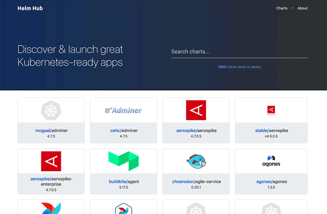

# 应用为中心的封装

看完容器技术发展的历程，不知你会不会感到有种“套娃式”的迷惑感？容器的崛起缘于chroot、namespaces、cgroups等内核提供的隔离能力，系统级虚拟化技术使得同一台机器上互不干扰地运行多个服务成为可能；为了降低用户使用内核隔离能力的门槛，随后出现了LXC，它是namespaces、cgroups特性的上层封装，使得“容器”一词真正走出实验室，走入工业界实际应用；为了实现跨机器的软件绿色部署，出现了Docker，它（最初）是LXC的上层封装，彻底改变了软件打包分发的方式，迅速被大量企业广泛采用；为了满足大型系统对服务集群化的需要，出现了Kubernetes，它（最初）是Docker的上层封装，让以多个容器共同协作构建出健壮的分布式系统，成为今天云原生时代的技术基础设施。

那Kubernetes会是容器化崛起之路的终点线吗？它达到了人们对云原生时代技术基础设施的期望了吗？从能力角度讲，是可以说是的，Kubernetes被誉为云原生时代的操作系统，自诞生之日起就因其出色管理能力、扩展性的与以声明代替命令的交互理念收获了无数喝彩声；但是，从易用角度讲，坦白说差距还非常大，云原生基础设施的其中一个重要目标是接管掉业务系统复杂的非功能特性，让业务研发与运维工作变得足够简单，不受分布式的牵绊，然而Kubernetes被诟病得最多的就是复杂，自诞生之日起就以陡峭的学习曲线而闻名。

举个具体例子，用Kubernetes部署一套[Spring Cloud版的Fenix's Bookstore](/exploration/projects/microservice_arch_springcloud.html)，你需要分别部署一个到多个的配置中心、注册中心、服务网关、安全认证、用户服务、商品服务、交易服务，对每个微服务都配置好相应的Kubernetes工作负载与服务访问，为每一个微服务的Deployment、ConfigMap、StatefulSet、HPA、Service、ServiceAccount、Ingress等资源都编写好元数据配置。这个过程最难的地方不仅在于繁琐，还在于要写出合适的元数据描述文件，既需要懂的开发（网关中服务调用关系、使用容器的镜像版本、运行依赖的环境变量这些参数等等，只有开发最清楚），又需要懂运维（要部署多少个服务，配置何种扩容缩容策略、数据库的密钥文件地址等等，只有运维最清楚），有时候还需要懂平台（需要什么的调度策略，如何管理集群资源，通常只有平台组、中间件组或者核心系统组的同学才会关心），一般企业根本找不到合适的角色来为它管理、部署和维护应用。

这个事儿Kubernetes心里其实也挺委屈，因为以上复杂性不能说是Kubernetes带来的，而是分布式架构本身的原罪。对于大规模的分布式集群，无论是最终用户部署应用，还是软件公司管理应用都存在诸多痛点。这些困难的实质源于Docker容器镜像封装了单个服务，Kubernetes通过资源封装了服务集群，却没有一个载体真正封装整个应用，将原本属于应用内部的技术细节圈禁起来，不要暴露给最终用户、系统管理员和平台维护着，让使用者去埋单；应用难以管理矛盾在于封装应用的方法没能将开发、运维、平台等各种角色的关注点恰当地分离。

既然微服务时代，应用的形式已经不再限于单个进程，那也该到了重新定义“以应用为中心的封装”这句话的时候了。至于具体怎样的封装才算是正确，今天还未有特别权威结论，不过经过人们的尝试探索，已经窥见未来容器应用的一些雏形，笔者将近几年来研究的几种主流思路列出供你参考。

## Kustomize

最初，由Kubernetes官方给出“如何封装应用”的解决方案是“用配置文件来配置配置文件”，这不是绕口令，你可以理解为一种针对YAML的模版引擎的变体。Kubernetes官方认为应用就是一组具有相同目标的Kubernetes资源的集合，如果逐一管理、部署每项资源元数据过于繁琐的话，那就提供一种便捷的方式，把应用中不变的信息与易变的信息分离开来解决管理问题，把应用所有涉及的资源自动生成一个多合一（All-in-One）的整合包来解决部署问题。

完成这项工作的工具叫做[Kustomize](https://github.com/kubernetes-sigs/kustomize)，它原本只是一个独立的小程序，从Kubernetes 1.14起，被吸纳入`kubectl`命令之中，成为随着Kubernetes提供的内置功能。Kustomize使用[Kustomization文件](https://kubernetes-sigs.github.io/kustomize/api-reference/glossary/)来组织与应用相关的所有资源，Kustomization本身也是一个以YAML格式编写的配置文件，里面定义了构成应用的全部资源，以及资源中需根据情况被覆盖的变量值。

Kustomize的主要价值是根据环境来生成不同的部署配置。只要建立多个Kustomization文件，开发人员就能以[基于基准进行派生](https://kubernetes.io/zh/docs/tasks/manage-kubernetes-objects/kustomization/)（Base and Overlay）的方式，对不同的模式（譬如生产模式、调试模式）、不同的项目（同一个产品对不同客户的客制化）定制出不同的资源整合包。在配置文件里，无论是开发关心的信息，还是运维关心的信息，只要是在元数据中有描述的内容，最初都是由开发人员来编写的，然后在编译期间由负责CI/CD的产品人员针对项目进行定制，最后在部署期间由运维人员通过kubectl的补丁（Patch）机制更改其中需要运维去关注的属性，譬如构造一个补丁来增加Deployment的副本个数，构造另外一个补丁来设置Pod的内存限制，等等。

```
k8s
 ├── base
 │     ├── deployment.yaml
 │     ├── kustomization.yaml
 │     └── service.yaml
 └── overlays
       └── prod
       │     ├── load-loadbalancer-service.yaml
       │     └── kustomization.yaml
       └── debug
             └── kustomization.yaml
```

Kustomize使用Base、Overlay和Patch生成最终配置文件的思路与Docker中分层镜像的思路有些相似，既规避了以“字符替换”对资源元数据文件的入侵，也不需要用户学习额外的DSL语法（譬如Lua）。从效果来看，使用由Kustomize编译生成的All-in-One整合包来部署应用是相当方便的，只要一行命令就能够把应用涉及的所有服务一次安装好，本文档附带的[Kubernetes版本](/exploration/projects/microservice_arch_kubernetes.html)和[Istio版本](/exploration/projects/servicemesh_arch_istio.html)的Fenix's Booktstore都使用了这种方式来发布应用的，你不妨实际体验一下。

但是毕竟Kustomize只是一个“小工具”性质的辅助功能，对于开发人员，Kustomize只能简化产品针对不同情况的重复配置，其实并没有真正解决应用管理复杂的问题，要做的事、要写的配置，最终都没有减少，只是不用反复去写罢了；对于运维人员，应用维护不仅仅只是部署那一下，应用的整个生命周期，除了安装外还有更新、回滚、卸载、多版本、多实例、依赖项维护等诸多问题都很麻烦。这些问题需要更加强大的管理工具去解决，譬如下一节的主角Helm。不过Kustomize能够以极小的成本，在一定程度上分离了开发和运维的工作，无需像Helm那样需要一套独立的体系来管理应用，这种轻量便捷，本身也是一种可贵的价值。

## Helm与Chart

另一种更具系统性的管理和封装应用的解决方案参考了各大Linux发行版管理应用的思路，代表为[Deis公司](https://deis.com)开发的[Helm](https://helm.sh/)和它的应用格式Chart。Helm一开始的目标就很明确：如果说Kubernetes是云原生操作系统的话，那Helm就要成为这个操作系统上面的应用商店与包管理工具。

Linux下的包管理工具和封装格式，如Debian系的apt-get命令与dpkg格式、RHEL系的yum命令与rpm格式相信大家肯定不陌生。有了包管理工具，你只要知道应用的名称，就可以很方便地从应用仓库中下载、安装、升级、部署、卸载、回滚程序，而且包管理工具自己掌握着应用的依赖信息和版本变更情况，具备完整的自管理能力，每个应用需要依赖哪些前置的第三方库，在安装的时候都会一并处理好。

Helm模拟的就是上面这种做法，它提出了与Linux包管理直接对应的Chart格式和Repository应用仓库，针对Kubernetes中特有的一个应用经常要部署多个版本的特点，也提出了Release的专有概念。

Chart用于封装Kubernetes应用涉及到的所有资源，通常以目录内的文件集合的形式存在。目录名称就是Chart的名称（没有版本信息），譬如官方仓库中WordPress Chart的目录结构是这样的：

```
WordPress
 ├── templates
 │     ├── NOTES.txt
 │     ├── deployment.yaml
 │     ├── externaldb-secrets.yaml
 │     └── 版面原因省略其他资源文件
 │     └── ingress.yaml
 └── Chart.yaml
 └── requirements.yaml
 └── values.yaml
```

其中有几个固定的配置文件：`Chart.yaml`给出了应用自身的详细信息（名称、版本、许可证、自述、说明、图标，等等），`requirements.yaml`给出了应用的依赖关系，依赖项指向的是另一个应用的坐标（名称、版本、Repository地址），`values.yaml`给出了所有可配置项目的预定义值。可配置项是指需要部署期间由运维人员调整的那些参数，它们以花括号包裹在`templates`目录下的资源文件中，部署应用时，Helm会先将管理员设置的值覆盖到`values.yaml`的默认值上，然后以字符串替换的形式传递给`templates`目录的资源模版，最后生成要部署到Kubernetes的资源文件。由于Chart封装了足够丰富的信息，所以Helm除了支持命令行操作外，也能很容易地根据这些信息自动生成图形化的应用安装、参数设置界面。

Repository仓库用于实现Chart的搜索与下载服务，Helm社区维护了公开的Stable和Incubator的中央仓库（界面如下图所示），也支持其他人或组织搭建私有仓库和公共仓库，并能够通过Hub服务把不同个人或组织搭建的公共仓库聚合起来，形成更大型的分布式应用仓库，有利于Chart的查找与共享。

:::center

Helm Hub商店（图片来自[Helm官网](https://helm.sh/)）
:::

Helm提供了应用全生命周期、版本、依赖项的管理能力，同时，Helm还支持额外的扩展插件，能够加入CI/CD或者其他方面的辅助功能，这样的定位已经从单纯的工具升级到应用管理平台了。强大的功能让Helm收到了不少支持，有很多应用主动入驻到官方的仓库中。从2018年起，Helm项目被托管到CNFC，成为其中的一个孵化项目。

Helm以模仿Linux包管理器的思路去管理Kubernetes应用，一定程度上是可行的，不过，Linux与Kubernetes中部署应用还是存在一些差别，最重要的一点是在Linux中99%的应用都只会安装一份，而Kubernetes里为了保证可用性，同一个应用部署多份副本才是常规操作。Helm为了支持对同一个Chart包进行多次部署，每次安装应用都会产生一个Release，Release相当于该Chart的安装实例。对于无状态的服务，靠着不同的Release就已经足够支持多个服务并行工作了，但对于有状态的服务来说，服务会与特定资源或者服务产生依赖关系，譬如要部署数据库，通常要依赖特定的存储来保存持久化数据，这样事情就变得复杂起来。Helm无法很好地管理这种有状态的依赖关系，这一类问题就是Operator要解决的痛点了。

## Operator与CRD

[Operator](https://www.redhat.com/zh/topics/containers/what-is-a-kubernetes-operator)不应当被称作是一种工具或者系统，它应该算是一种封装、部署和管理Kubernetes应用的方法，尤其是针对最复杂的有状态应用去封装运维能力的解决方案，最早由CoreOS公司（于2018年被RedHat收购）的华人程序员邓洪超所提出。

如果上一节“[以容器构建系统](/immutable-infrastructure/container/container-build-system.html)”介绍Kubernetes资源与控制器模式时你没有开小差的话，那么Operator中最核心的理念你其实就已经理解得差不多了。简单地说，Operator是通过Kubernetes 1.7开始支持的自定义资源（Custom Resource Definitions，CRD，此前曾经以TPR，即Third Party Resource的形式提供过类似的能力），把应用封装为另一种更高层次的资源，再把Kubernetes的控制器模式从面向于内置资源，扩展到了面向所有自定义资源，以此来完成对复杂应用的管理。下面是笔者引用了一段RedHat官方对Operator设计理念的阐述：

:::quote Operator设计理念

Operator是使用自定义资源（CR，笔者注：CR即Custom Resource，是CRD的实例）管理应用及其组件的自定义Kubernetes控制器。高级配置和设置由用户在CR中提供。Kubernetes Operator基于嵌入在Operator逻辑中的最佳实践将高级指令转换为低级操作。Kubernetes Operator监视CR类型并采取特定于应用的操作，确保当前状态与该资源的理想状态相符。

:::right

—— [什么是 Kubernetes Operator](https://www.redhat.com/zh/topics/containers/what-is-a-kubernetes-operator)，RedHat

:::

以上这段文字不是笔者转述，而是直接由RedHat官方撰写和翻译成中文的，准确严谨但比较拗口，对于没接触过Operator的人并不友好，什么叫做“高级指令”？什么叫做“低级操作”？两者之间具体如何转换？为了能够理解这些问题，我们需要先弄清楚有状态和无状态应用的含义及影响，然后再来理解Operator所做的工作。

有状态应用（Stateful Application）与无状态应用（Stateless Application）说的是应用程序是否要自己持有其运行所需的数据，如果程序每次运行都跟首次运行一样，不会依赖之前任何操作所遗留下来的痕迹，那它就是无状态的；反之，如果程序推倒重来之后，用户能察觉到该应用已经发生变化，那它就是有状态的。无状态应用在分布式系统中具有非常巨大的价值，我们都知道分布式中的CAP不兼容原理，如果无状态，那就不必考虑状态一致性，没有了C，那A和P便可以兼得，换而言之，只要资源足够，无状态应用天生就是高可用的。但不幸的是现在的分布式系统中多数关键的基础服务都是有状态的，如缓存、数据库、对象存储、消息队列，等等，只有Web服务器这类服务属于无状态。

站在Kubernetes的角度看，是否有状态的本质差异在于有状态应用会对某些外部资源有绑定性的直接依赖，譬如Elasticsearch建立实例时必须依赖特定的存储位置，重启后仍然指向同一个数据文件的实例才能被认为是相同的实例。另外，有状态应用多个应用实例之间往往有着特定到拓扑关系与顺序关系，譬如Etcd的节点间选主和投票，节点们都需要得知彼此的存在。为了管理好那些与应用实例密切相关的状态信息，Kubernetes从1.9版本开始正式发布了StatefulSet及对应的StatefulSetController。与普通ReplicaSet中的Pod相比，由StatefulSet管理的Pod具备以下几项额外特性：

- **Pod会按顺序创建和按顺序销毁**：StatefulSet中的各个Pod会按顺序地创建出来，创建后续的Pod前，必须要保证前面的Pod已经转入就绪状态。删除StatefulSet中的Pod时会按照与创建顺序的逆序来执行。
- **Pod具有稳定的网络名称**：Kubernetes中的Pod都具有唯一的名称，在普通的副本集中这是靠随机字符产生的，而在StatefulSet中管理的Pod，会以带有顺序的编号作为名称，且能够在重启后依然保持不变。。
- **Pod具有稳定的持久存储**：StatefulSet中的每个Pod都可以拥有自己独立的PersistentVolumeClaim资源。即使Pod被重新调度到其它节点上，它所拥有的持久磁盘也依然会被挂载到该Pod，这点会在“容器持久化”中进一步介绍。

只是罗列出特性，应该很难快速理解StatefulSet的设计意图，笔者打个比方来帮助你理解：如果把ReplicaSet中的Pod比喻为养殖场中的“肉猪”，那StatefulSet就是被家庭当宠物圈养的“荷兰猪”，不同的肉猪在食用功能上并没有什么区别，但每只宠物猪都是无独一无二的，有专属于自己的名字、习性与记忆，事实上，早期的StatefulSet就曾经有一段时间用过PetSet这个名字。

当StatefulSet出现以后，Kubernetes就能满足Pod重新创建后仍然保留上一次运行状态的需求，不过有状态应用的维护并不仅限于此，譬如对于一套Elasticsearch集群来说，通过StatefulSet最多只能做到创建集群、删除集群、扩容缩容等最基本的操作，其他的运维操作，譬如备份和恢复数据、创建和删除索引、调整平衡策略等操作也十分常用，但是StatefulSet并不能为此提供任何帮助。

笔者再举个实际例子来说明Operator是如何解决那些StatefulSet覆盖不到的有状态服务管理需求的：假设要部署一套Elasticsearch集群，通常要在StatefulSet中定义相当多的细节，譬如服务的端口、Elasticsearch的配置、更新策略、内存大小、虚拟机参数、环境变量、数据文件位置，等等，为了便于你对已经反复提及的Kubernetes的复杂有更加直观的体验，这里就奢侈一次，挥霍一次版面，将满足这个需求的YAML全文贴出如下：

```yaml
apiVersion: v1
kind: Service
metadata:
  name: elasticsearch-cluster
spec:
  clusterIP: None
  selector:
    app: es-cluster
  ports:
  - name: transport
    port: 9300
---
apiVersion: v1
kind: Service
metadata:
  name: elasticsearch-loadbalancer
spec:
  selector:
    app: es-cluster
  ports:
  - name: http
    port: 80
    targetPort: 9200
  type: LoadBalancer
---
apiVersion: v1
kind: ConfigMap
metadata:
  name: es-config
data:
  elasticsearch.yml: |
    cluster.name: my-elastic-cluster
    network.host: "0.0.0.0"
    bootstrap.memory_lock: false
    discovery.zen.ping.unicast.hosts: elasticsearch-cluster
    discovery.zen.minimum_master_nodes: 1
    xpack.security.enabled: false
    xpack.monitoring.enabled: false
  ES_JAVA_OPTS: -Xms512m -Xmx512m
---
apiVersion: apps/v1beta1
kind: StatefulSet
metadata:
  name: esnode
spec:
  serviceName: elasticsearch
  replicas: 3
  updateStrategy:
    type: RollingUpdate
  template:
    metadata:
      labels:
        app: es-cluster
    spec:
      securityContext:
        fsGroup: 1000
      initContainers:
      - name: init-sysctl
        image: busybox
        imagePullPolicy: IfNotPresent
        securityContext:
          privileged: true
        command: ["sysctl", "-w", "vm.max_map_count=262144"]
      containers:
      - name: elasticsearch
        resources:
            requests:
                memory: 1Gi
        securityContext:
          privileged: true
          runAsUser: 1000
          capabilities:
            add:
            - IPC_LOCK
            - SYS_RESOURCE
        image: docker.elastic.co/elasticsearch/elasticsearch:7.9.1
        env:
        - name: ES_JAVA_OPTS
          valueFrom:
              configMapKeyRef:
                  name: es-config
                  key: ES_JAVA_OPTS
        readinessProbe:
          httpGet:
            scheme: HTTP
            path: /_cluster/health?local=true
            port: 9200
          initialDelaySeconds: 5
        ports:
        - containerPort: 9200
          name: es-http
        - containerPort: 9300
          name: es-transport
        volumeMounts:
        - name: es-data
          mountPath: /usr/share/elasticsearch/data
        - name: elasticsearch-config
          mountPath: /usr/share/elasticsearch/config/elasticsearch.yml
          subPath: elasticsearch.yml
      volumes:
        - name: elasticsearch-config
          configMap:
            name: es-config
            items:
              - key: elasticsearch.yml
                path: elasticsearch.yml
  volumeClaimTemplates:
  - metadata:
      name: es-data
    spec:
      accessModes: [ "ReadWriteOnce" ]
      resources:
        requests:
          storage: 5Gi
```

出现如此大量的细节配置，其根本原因在于Kubernetes完全不知道Elasticsearch是个什么东西，所有Kubernetes不知道的信息、不能启发式推断出来的信息，都必须由用户在资源的元数据定义中明确列出，必须一步一步手把手地“教会”Kubernetes如何部署Elasticsearch，这种形式就属于RedHat在Operator设计理念介绍中所说的“低级操作”。

如果我们使用[Elastic.co官方提供的Operator](https://github.com/elastic/cloud-on-k8s)，那情况就会简单得多了，Elasticsearch Operator提供了一种`kind: Elasticsearch`的自定义资源，在它的帮助下，仅需十行代码，将用户的意图是“部署三个版本为7.9.1的ES集群节点”说清楚即可，便能实现与前面StatefulSet那一大堆配置相同乃至更强大的效果，如下面代码所示。

```yaml
apiVersion: elasticsearch.k8s.elastic.co/v1
kind: Elasticsearch
metadata:
  name: elasticsearch-cluster
spec:
  version: 7.9.1
  nodeSets:
  - name: default
    count: 3
    config:
      node.master: true
      node.data: true
      node.ingest: true
      node.store.allow_mmap: false
```

有了Elasticsearch Operator的自定义资源，相当于Kubernetes已经学会怎样操作了Elasticsearch，知道所有它相关的参数含义与默认值，无需用户再手把手地教了，这种就是所谓的“高级指令”。

Operator将简洁的高级指令转化为Kubernetes中具体操作的方法，与前面Helm或者Kustomize的思路并不相同。Helm和Kustomize最终仍然是依靠Kubernetes的内置资源来跟Kubernetes打交道的，Operator则是要求开发者自己实现一个专门针对该自定义资源的控制器，在控制器中维护自定义资源的期望状态。通过程序编码来扩展Kubernetes，比只通过内置资源来与Kubernetes打交道要灵活得多，譬如当需要更新集群中某个Pod对象的时候，由Operator开发者自己编码实现的控制器完全可以在原地对Pod进行重启，而无需像Deployment那样必须先删除旧Pod，然后再创建新Pod。

使用CRD定义高层次资源、使用配套的控制器来维护期望状态，带来的好处不仅仅是“高级指令”的便捷，而是遵循Kubernetes一贯基于资源与控制器的设计原则的同时，又不必再受制于Kubernetes内置资源的表达能力。只要Operator的开发者愿意编写代码，前面曾经提到那些StatfulSet不能支持的能力，如备份恢复数据、创建删除索引、调整平衡策略等操作，都完全可以实现出来。

把运维的操作封装在程序代码上，表面看最大的受益者是运维人员，开发人员要为此付出更多劳动。然而Operator并没有被开发者抵制，让它变得小众，反而由于代码相对于资源配置的表达能力提升，让开发与运维之间的协作成本降低而备受开发者的好评。Operator变成了近两、三年容器封装应用的一股新潮流，现在很多复杂分布式系统都有了官方或者第三方提供的Operator（[这里收集了一部分](https://github.com/operator-framework/awesome-operators)）。RedHat公司也持续在Operator上面大量投入，推出了简化开发人员编写Operator的[Operator Framework/SDK](https://github.com/operator-framework/operator-sdk)。

目前看来，应对有状态应用的封装运维，Operator也许是最有可行性的方案，但这依然不是一项轻松的工作。以[Etcd的Operator](https://github.com/coreos/etcd-operator)为例，Etcd本身不算什么特别复杂的应用，Operator实现的功能看起来也相当基础，主要有创建集群、删除集群、扩容缩容、故障转移、滚动更新、备份恢复等功能，其代码就已经超过一万行了。现在开发Operator的确还是有着相对较高的门槛，通常由专业的平台开发者而非业务开发或者运维人员去完成，但是Operator符合技术潮流，顺应软件业界所提倡的DevOps一体化理念，等Operator的支持和生态进一步成熟之后，开发和运维都能从中受益，未来应该能成长为一种应用封装的主流形式。

## 开放应用模型

本节介绍的最后一种应用封装的方案，是阿里云和微软在2019年10月上海QCon大会上联合发布的[开放应用模型](https://oam.dev/)（Open Application Model，OAM），它不仅是中国云计算企业参与制定乃至主导发起的国际技术规范，也是业界首个云原生应用标准定义与架构模型。

开放应用模型思想的核心是如何将开发人员、运维人员与平台人员关注点分离，开发人员关注业务逻辑的实现，运维人员关注程序平稳运行，平台人员关注基础设施的能力与稳定性，长期让几个角色厮混在同一个All-in-One资源文件里，并不能擦出什么火花，反而将配置工作弄得越来越复杂，将“[YAML Engineer](https://www.stackery.io/blog/stop-yaml-engineering/)”弄成了容器界的嘲讽梗。

开放应用模型把云原生应用定义为“由一组相互关联但又离散独立的组件构成，这些组件实例化在合适的运行时上，由配置来控制行为并共同协作提供统一的功能”。没看明白定义并没有关系，为了便于跟稍后的概念对应，笔者首先把这句话拆解、翻译为你更加看**不**明白的另一种形式：

:::quote OAM定义的应用

一个`Application`由一组`Components`构成，每个`Component`的运行状态由`Workload`描述，每个`Component`可以施加`Traits`来获取额外的运维能力，同时我们可以使用`Application Scopes`将`Components`划分到一或者多个应用边界中，便于统一做配置、限制、管理。把`Components`、`Traits`和`Scopes`组合在一起实例化部署，形成具体的`Application Configuration`，以便解决应用的多实例部署与升级。

:::

然后，笔者通过解析上述所列的核心概念来帮助你理解OAM对应用的定义。这句话里面每一个用英文标注出来的技术名词都是OAM在Kubernetes基础上扩展而来概念，每一个名词都有专门的自定义资源与之对应，换而言之，它们并非纯粹的抽象概念，而是可以被实际使用的自定义资源。这些概念的具体含义是：

- **服务组件**（Components）：由Component构成应用的思想自SOA以来就屡见不鲜，然而OAM的Component不仅仅是特指构成应用“整体”的一个“部分”，它还有一个重要职责是抽象那些应该由开发人员去关注的元素。譬如应用的名字、自述、容器镜像、运行所需的参数，等等。
- **工作负荷**（Workload）：Workload决定了应用的运行模式，每个Component都要设定自己的Workload类型，OAM按照“是否可访问、是否可复制、是否长期运行”预定义了六种Workload类型，如下表所示。如有必要还可以通过CRD与Operator去扩展。

  | 工作负荷         | 可访问 | 可复制 | 长期运行 |
  | ---------------- | :----: | :----: | :----: |
  | Server           | √      | √     | √ |
  | Singleton Server | √ | × | √ |
  | Worker           | × | √ | √ |
  | Singleton Worker | × | × | √ |
  | Task             | × | √ | × |
  | Singleton Task   | × | × | × |

- **运维特征**（Traits）：开发活动有大量复用功能的技巧，但运维活动却很贫乏，平时能为运维写个Shell脚本或者简单工具已经算是个高级的运维人员了。OAM的Traits就用于封装模块化后的运维能力，可以针对运维中的可重复操作预先设定好一些具体的Traits，譬如日志收集Trait、负载均衡Trait、水平扩缩容Trait，等等。 这些预定义的Traits定义里，会注明它们可以作用于哪种类型的工作负荷、包含能填哪些参数、哪些必填选填项、参数的作用描述是什么，等等。
- **应用边界**（Application Scopes）：多个Component共同组成一个Scope，你可以根据Component的特性或者作用域来划分Scope，譬如具有相同网络策略的Component放在同一个Scope中，具有相同健康度量策略的Component放到另一个Scope中。同时，一个Component也可能属于多个Scope，譬如一个Component完全可能既需要配置网络策略，也需要配置健康度量策略。
- **应用配置**（Application Configuration）：将Component（必须）、Trait（必须）、Scope（非必须）组合到一起进行实例化，就形成了一个完整的应用配置。

OAM使用上述介绍的这些自定义资源将原先All-in-One的复杂配置做了一定层次的解耦，开发人员负责管理Component；运维人员将Component组合并绑定Trait变成Application Configuration；平台人员或基础设施提供方负责提供OAM的解释能力，将这些自定义资源映射到实际的基础设施。不同角色分工协作，整体简化了单个角色关注的内容，使得不同角色可以更聚焦更专业的做好本角色的工作，整个过程如下图所示。

:::center

OAM角色关系图（图片来自[OAM规范GitHub](https://github.com/oam-dev/spec/)）
:::

OAM未来能否成功，很大程度上取决于云计算厂商的支持力度，因为OAM的自定义资源一般是由云计算基础设施负责解释和驱动的，譬如阿里云的[EDAS](https://help.aliyun.com/product/29500.html)就已内置了OAM的支持。如果你希望能够应用于私有Kubernetes环境，目前OAM的主要参考实现是[Rudr](https://github.com/oam-dev/rudr)（已声明废弃）和[Crossplane](https://crossplane.io/)，Crossplane是一个仅发起一年多的CNCF沙箱项目，主要参与者包括阿里云、微软、Google、RedHat等工程师。Crossplane提供了OAM中全部的自定义资源以及控制器，安装后便可用OAM定义的资源来描述应用。

---

**后记**：今天容器圈的发展是一日千里，各种新规范、新技术层出不穷，本节根据人气和代表性，列举了其中最出名的四种，其他笔者未提到的应用封装技术还有[CNAB](https://cnab.io/)、[Armada](https://github.com/airshipit/armada)、[Pulumi](https://www.pulumi.com/)等等。这些封装技术会有一定的重叠之处，但并非都是重复的轮子，实际应用时往往会联合其中多个工具一起使用。应该如何封装应用才是最佳的实践，目前尚且没有定论，但是以应用为中心的理念却已经成为明确的共识。