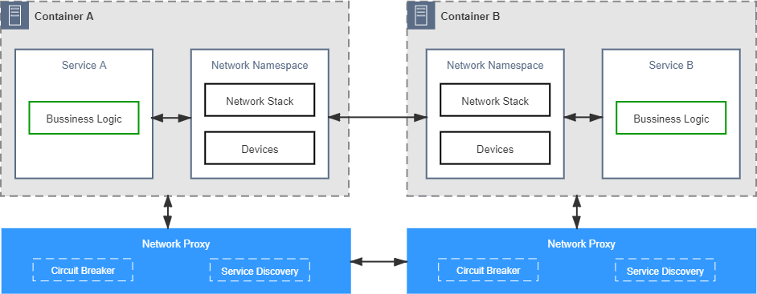
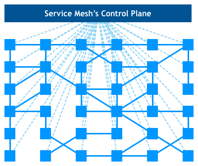

# 透明通讯的涅槃

:::tip 被分布式舍弃的Unix的设计哲学

原始分布式时代提出的构建“符合Unix的设计哲学的”、“如同本地调用一般简单透明的”分布式系统这个目标，是软件开发者对分布式系统最初的美好愿景，迫于现实，它会在一定时期内被妥协、被舍弃，分布式将会经过一段越来越复杂的发展进程。但是，到了三十多年以后的未来，随着微服务的逐渐成熟完善，成为大型软件的主流架构风格以后，这个美好的愿景终将还是会重新被开发者拾起。

:::right

—— [服务架构演进史](/architecture/architect-history/) · [原始分布式时代](/architecture/architect-history/primitive-distribution.html)

:::

Kubernetes为它管理的工作负载提供了工业级的韧性与弹性，还为每个处于运行状态的Pod维护了相互连通的虚拟化网络。不过，程序的通讯不同于简单地在网络上拷贝数据，具备可连通的网络环境仅仅是程序间能够可靠通讯的必要但非充分的条件，作为一名经历过SOA、微服务、云原生洗礼的的分布式程序员，你必定已深谙路由、容错、限流、加密、认证、授权、跟踪、度量等问题在程序间通讯中都是无法豁免的。

本文档的“[远程服务调用](/architect-perspective/general-architecture/api-style/rpc.html#通信的成本)”一节，笔者以“通讯的成本”为题，讲述了三十多年计算机科学家们对“远程服务调用有否可能是透明通讯”的一场声势浩大的论战。今天服务网格的诞生在某种意义上就是当年透明通讯的重生，服务网格试图以容器、虚拟化网络、边车代理构筑的新一代通讯基础设施为武器，重新对已盖棺定论三十多年的程序间通讯原则发起冲击。今天，这场关于通讯的变革仍然在酝酿发展当中，最后到底会是成功的逆袭，抑或是另一场失败，笔者不敢妄言定论，但是作为通讯发展历史的一名见证者，笔者丝毫不吝对服务网格投去最高的期许与最深的祝福。

## 通讯的成本

程序间通讯作为服务架构的核心内容，本文档开篇的[服务架构演进史](/architecture/architect-history/)其实已从宏观角度讲述过它的演进过程。这节里，我们不妨再从更微观更聚焦的角度，通过以下五个阶段的变化，观察分布式服务的通讯是如何逐步演进至今天的服务网格的。

- **第一阶段**：将通讯的非功能性需求视作业务逻辑的一部分，可靠通讯由程序员来保障。 本阶段是早期软件企业尝试分布式时选择的技术策略。这类系统原本所具有的通讯能力并不是作为业务功能的一部分被设计出来的，而是遇到问题后修补累计所形成的。开始时，系统往往只具最基本的网络API，譬如集成了OKHTTP、gRPC这样库来访问远程服务，如果接收到报错，就编写对应的重试或降级逻辑去解决。系统进入生产环境后，遇到并解决的一个个具体通讯问题，都在业务系统中留下了越来越多关于通讯的功能逻辑。这些通讯的功能逻辑由系统的开发人员直接编写，与业务逻辑直接同处一个进程空间之中，如下图所示（注：本图与后面一系列图片中，笔者均以断路器和服务发现这两个常见的功能来泛指所有的分布式通讯所需的能力）。
  
  :::center
  
  控制逻辑和业务逻辑耦合
  :::
  
  这一阶段的主要矛盾是绝大多数擅长业务逻辑的开发人员都并不擅长处理通讯方面的问题，要写出正确、高效、健壮的分布式通讯代码，是一项专业性极强的工作。由此决定了大多数的普通软件企业都很难在这个阶段支撑起一个靠谱的分布式系统来。另一方面，把专业的通讯工作强加于普通开发人员，无疑为他们带来了更多工作量，尤其是这些“额外的工作”与原有的业务逻辑耦合在一起，让系统越来越复杂，也越来越容易出错。
  
- **第二阶段**：将代码中的通讯功能重构抽离成为公共组件库，可靠通讯由专业的平台程序员来保障。 
  解耦依赖的有效办法是抽取分离代码与封装重构组件。微服务的普及离不开一系列封装了分布式通讯能力的公共组件库，代表性产品有Twitter的Finagle、Spring Cloud中的许多组件等。这些公共的通讯组件由熟悉分布式的专业开发人员编写和维护，不仅效率更高、质量更好，一般还提供了经过良好设计的API接口，让业务代码可以使用它们的能力，又无需把处理通讯的逻辑散布于业务代码当中。

  :::center
  
  抽取公共的分布式通讯组件
  :::

  分布式通讯组件让普通程序员开发出靠谱的微服务系统成为可能，这是无可抹杀的成绩，但普通程序员的使用它们的成本依然很高，不仅要学习分布式的知识，要学习公共组件的功能应该如何使用，而且，对于同一种问题往往还需学习多种不同的组件。这是因为通讯组件首先是一段特定语言开发出来的程序，是与语言绑定的，一个Python写的组件再优秀，对Java系统来说也没有太多价值。目前，基于公共组件库开发微服务是应用最为广泛的解决方案，但并不是一个完美的解决方案，这是微服务基础设施完全成熟之前必然会出现的应用形态，同时也决定了这是微服务进化过程中必然会被替代的过渡形态。
  
- **第三阶段**：将负责通讯的公共组件库分离到进程之外，程序通过网络代理来保障可靠的通讯，可靠通讯由专门的网络代理提供商来保障。 为了能够把分布式通讯组件与具体的编程语言脱钩，也为了避免程序员还要去专门学习这些组件的编程模型与API接口，演进出了能专门负责可靠通讯的网络代理。这些网络代理不再与业务逻辑部署于同一个进程空间，但与业务系统仍处于同一个容器或者虚拟机当中，可以通过回环设备或者[UDS](https://en.wikipedia.org/wiki/Unix_domain_socket)（Unix Domain Socket）进行访问，具备较高的性能。只要使用代理接管掉程序七层或四层流量，就能够在代理上完成断路、容错等几乎所有的分布式通讯功能，这类代表性产品就是前面提到过的Netflix Prana。
  
  :::center
  
  通过网络代理获得可靠的通讯能力
  :::
  
  通过网络代理来提升通讯质量的思路提出以后，虽然本身使用面并不算十分广泛，但它的方向是正确的。这种思路后来演化出了两种进化形态：如果将网络代理从进程身边拉远，让它与进程处于不同的机器上，可以同时给多个进程提供通讯服务，这就形成了后来的微服务网关，在网关上同样可以实现流控、容错等功能；如果将网络代理往进程方向推近，让它与进程处于一个共享了网络名称空间的容器组之中，这就形成了下一阶段所说的边车代理。
  
- **第四阶段**：将网络代理以边车的形式注入到应用容器，自动劫持应用的网络流量，可靠通讯由专门的通讯基础设施来保障。 与前一阶段独立代理相比，以边车模式工作的网络代理拥有两个无可比拟的重要优势：第一个优势是它对流量的劫持是强制性的，通常是直接写容器的路由转发表实现。此前，独立的网络代理只有程序先去访问它，它才能被动地为程序提供可靠通讯服务，只要程序依然有选择不访问它的可能性（请注意上阶段的图中保留了两个容器网络设备直接连接的箭头），代理就永远只能充当服务者而不能成为管理者。另一个优势是边车代理对应用是透明的，无需对已部署的应用程序代码进行任何改动，不需要引入任何的库（有部分边车代理会要求有轻量级的SDK，也有的采用透明SDK注入的方式实现），也不需要专门访问某个网络位置。这意味着它对所有现存程序都具备直接的可用性。目前边车代理的代表性产品有Linkerd、Envoy、MOSN等。
  
  :::center
  
  边车代理模式
  :::
  
  如果说边车代理还有什么不足的话，那大概就是来自于运维人员的不满了。边车代理能够透明且具有强制力地解决可靠通讯的问题，但它本身也需要有足够的信息才能完成这项工作，譬如获取可用服务的列表，譬如得到每个服务名称对应的IP地址，等等。这些信息不会从天上掉下来自动到边车里去，是需要由管理员主动去告知代理，或者代理主动从约定的好的位置获取的。可见，管理代理本身也会产生通讯的需求。如果没有额外的支持，这些管理方面的通讯都得由运维人员去埋单，由此而生的不满可以理解。为了管理与协调边车代理，程序间通讯进化到了最后一个阶段：服务网格。
  
- **第五阶段**：将边车代理统一管控起来实现安全、可靠、可观测的通讯，将数据平面与控制平面分离开来，实现通用、透明的通讯，这项工作就由专门的服务网格框架来保障。 从总体架构看，服务网格包括两大块内容，分别是由一系列与微服务共同部署的边车代理，以及用于控制这些代理的管理器所构成。代理与代理之间需要通讯，用以转发程序间通讯的数据包；代理与管理器之间也需要通讯，用以传递设备、管理、遥测等信息。服务网格使用数据平面（Data Plane）通讯和控制平面（Control Plane）通讯来形容这两类流量，下图中实线就表示数据平面通讯，虚线表示控制平面通讯。

  :::center
  
  服务网格的控制平面通讯与数据平面通讯（[图片来源](https://philcalcado.com/2017/08/03/pattern_service_mesh.html)）
  :::

  数据平面与控制平面并非什么新鲜概念，它最初出现在网络分层之中，通常是指网络层的划分。软件定义网络中更是将解耦数据平面与控制平面作为其最主要特征之一。服务网格将网络管理的概念引入到程序通讯之中，既可以说是对程序通讯的一种变革创新，也可以说是对网络通讯的一种发展传承。
  
  分离数据平面与控制平面的实质是将“程序”与“网络”解藕，将网络中可能出现的各种问题（譬如出错重试），与可能实现的各种功能（譬如跟踪度量）的解决方案从程序中拿出，放到控制平面上去处理，制造出一种这些问题在程序间通讯中根本不存在的假象，仿佛网络和远程服务都是完美可靠的。这种完美的假象，让应用之间可以简单透明地交互，能够在不同的云服务提供商之间平稳地迁移；同时，也能让管理者能够不通过程序支持就能得到遥测所需的全部信息，或者根据角色、权限进行访问控制，这就是服务网格的核心价值所在。

## 服务网格

上节介绍了服务网格降低通讯成本的思路，将程序员从网络通讯中解放出来，这节里 ，笔者简要介绍服务网格的实现细节，试图向读者展示它们是如何做到的。

### 注入边车

XDS、Service Mesh Interface（SMI）规范与生态

### 管理流量

东西、南北向流量管理

内部流量出口与外部流量入口，Ingress和Engress

### 认证授权

### 遥测