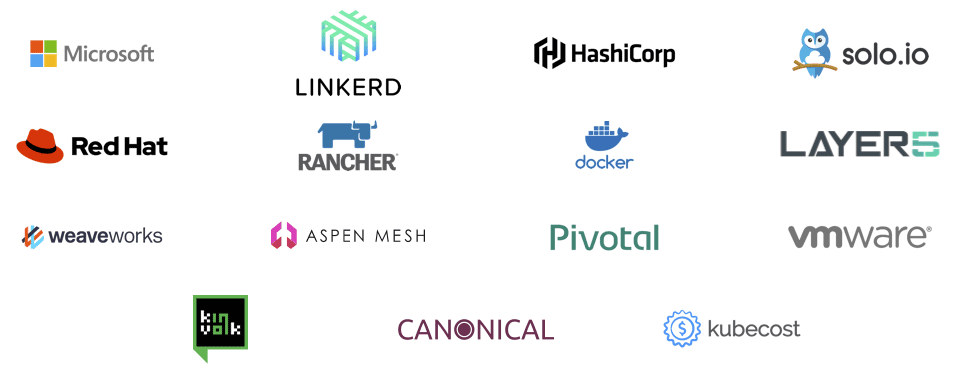
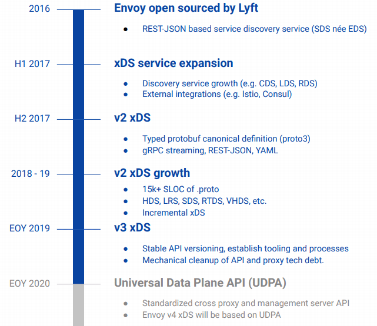

# 服务网格与生态

服务网格目前仍然处于技术浪潮的早期，但其价值已被业界所普遍认可，几乎所有希望能够影响云原生发展方向的企业都已参与进来。从最早2016年的[Linkerd](https://linkerd.io/)和[Envoy](https://www.envoyproxy.io/)，到2017年Google、IBM和Lyft共同发布的Istio，再到后来CNCF将Buoyant的[Conduit](https://conduit.io/)改名为[Linkerd2](https://linkerd.io/2/overview/)再度参与Istio竞争。2018年后，服务网格的话语权争夺战已全面升级至由云计算巨头直接主导，Google将Istio搬上Google Cloud Platform，推出了Istio的公有云托管版本Google Cloud Service Mesh，亚马逊推出了用于AWS的App Mesh、微推出了Azure完全托管版本的Service Fabric Mesh，发布了自家的控制平面[Open Service Mesh](https://openservicemesh.io/) ，国内的阿里巴巴也推出了基于Istio的修改版[SOFAMesh](https://github.com/sofastack/sofa-mesh)，并开源了自己研发的[MOSN](https://mosn.io/)代理，可以说，云计算的所有玩家都正在布局服务网格生态。

市场繁荣的同时也带来了碎片化的问题，一个技术领域能够形成能被业界普遍承认的规范标准，是这个领域从分头研究、各自开拓的萌芽状态，走向工业化生产应用的成熟状态的重要标志，标准的诞生可以说是每一项技术必须经历的“成人礼”。前面我们曾接触过容器运行时领域的CRI规范、容器网络领域的CNI规范、容器存储领域的CSI规范，尽管服务网格诞生至今只有数年，但作为微服务、云原生的前沿热点，它也正在酝酿自己的标准规范，即本节的主角：[服务网格接口](https://smi-spec.io/)（Service Mesh Interface，SMI）与[通用数据平面API](https://github.com/cncf/udpa)（Universal Data Plane API，UDPA）。

:::center

SMI规范与UDPA规范
:::

由于服务网格的实质上是数据平面产品与控制平面产品的集合，所以在规范上也很自然地分成了两类：SMI规范提供了外部环境（Kubernetes）与控制平面交互的标准，使得Kubernetes及在其之上的应用能够无缝地切换各种服务网格产品。UDPA规范则提供了控制平面与数据平面交互的标准，使得服务网格产品能够灵活地搭配不同的边车代理，针对不同场景的需求，发挥各款边车代理的功能或者性能优势。这两个规范并没有重叠，它们的关系与CRI和OCI规范之间的关系颇有些相似。

## 服务网格接口

2019年5月的KubeCon大会上，微软联合Linkerd、HashiCorp、Solo、Kinvolk和Weaveworks等一众云原生服务商宣布了Service Mesh Interface规范，希望能在各家的服务网格产品之上建立一个抽象的API层，然后通过这个抽象来解耦和屏蔽底层服务网格实现，让上层的应用、工具、生态系统可以建立在同一个业界标准之上，从而实现跨不同实现的可移植性和互通性。

如果你更熟悉Istio的话，不妨把SMI的作用理解为它提供了一套Istio中[VirtualService](https://istio.io/latest/zh/docs/reference/config/networking/virtual-service/#VirtualService) 、[DestinationRule](https://istio.io/latest/zh/docs/concepts/traffic-management/#destination-rules)、[Gateway](https://istio.io/latest/zh/docs/reference/config/networking/gateway/)等私有概念的行业标准版本，使用SMI中定义的标准资源，应用就可以在不同的控制平面上灵活迁移，只要它们都支持SMI规范即可。

SMI与Kubernetes是直接绑定的，规范的落地执行完全依靠在Kubernetes中部署SMI定义的CRD来实现，这点在SMI的目标中被形容为“Kubernetes Native”，也是微软选择在KubeCon大会上公布SMI规范的原因。但是SMI不与包括行业第一的Istio或者微软自家Open Service Mesh在内的任何控制平面所绑定，这点在SMI的目标中被形容为“Provider Agnostic”。Provider Agnostic对消费者有利，但对目前处于行业领先地位的Istio肯定是不利的，所以SMI没有得到Istio及其背后的Google、IBM与Lyft的支持也就完全可以理解。

在过去两年里，Istio无论是发展策略上还是设计上（过度设计）的风评并不算好，业界一直在期待Google和Istio能做出改进，这种期待在持续两年的失望之后，已经有很多用户在考虑Istio以外的选择了。SMI一发布就吸引了除了Istio之外几乎所有的服务网格玩家参与进来了，恐怕并不是只因为微软号召力的缘故。而且，SMI自己提供了一个[Istio的适配器](https://github.com/servicemeshinterface/smi-adapter-istio)，以便使用Istio的程序能平滑地迁移的SMI之上，所以遗留代码并不会构成为Istio构成太坚固的壁垒。

2020年4月，SMI被托管到CNCF，成为其中的一个Sandbox项目（Sandbox是最低级别的项目，CNCF只提供有限度的背书），如果能够经过孵化、毕业阶段的话，SMI就有望成为公认的行业标准，这也是开源技术社区里民主管理的一点好处。

:::center

SMI规范的参与者
:::

讲述了SMI的背景与价值，笔者再简要介绍一下SMI的主要内容。目前（[v0.5版本](https://github.com/servicemeshinterface/smi-spec/blob/master/SPEC_LATEST_STABLE.md)）的SMI规范包括四方面的API构成，分别是：

- **流量规范**（Traffic Specs）：目标是定义流量的表示方式，譬如TCP流量、HTTP/1流量、HTTP/2流量、gRPC流量、WebSocket流量等等，该如何在配置中抽象及使用。目前SMI只提供了TCP和HTTP流量的直接支持，而且都比较简陋（甚至连Header都不支持）。暂时只能自我安慰地解释SMI在流量协议的扩展方面是完全开放的，没有功能有可能自己扩充，哪怕不支持的或私有协议的流量也有可能使用SMI来管理。流量表示是做路由和访问控制的必要基础，因为必须要根据流量中的特征为条件才能进行转发和控制，流量规范中已经自带了路由能力，访问控制则被放到独立的规范中去实现。
- **流量拆分**（Traffic Split）：目标是定义不同版本服务之间的流量比例，提供流量治理的能力，譬如限流、降级、容错，等等，以满足灰度发布、A/B测试等场景。SMI的流量拆分是直接基于Kubernetes的Service资源来设置的，这样做的好处是不需要理解新的概念，而坏处是要拆分流量就必须定义出具有层次结构的Service（即Service后面不是Pod，而是其他Service）；而Istio中则是设计了VirtualService的概念来实现的，通过subset来拆分流量。
- **流量度量**（Traffic Metrics）：目标是为资源提供通用集成点，度量工具可以通过访问这些集成点来抓取指标。这部分完全遵循了Kubernetes的[Metrics API](https://kubernetes.io/docs/tasks/debug-application-cluster/resource-metrics-pipeline/)进行扩充。
- **流量访问控制**（Traffic Access Control）：目标是根据客户端的身份配置，对特定的流量访问特定的服务提供简单的访问控制。SMI绑定了Kubernetes的ServiceAccount来做服务身份访问控制，这里说的“简单”不是指它使用简单，而是说它只支持ServiceAccount一种身份机制，这在正式使用中恐怕是不足以应付所有场景的，日后应该还会扩充。

这些四种API目前暂时均是Alpha版本，意味着它们还未成熟，随时可能发生变动。从目前版本来看，至少与Istio的私有API相比，SMI没有明显优势，不过考虑SMI还处于项目早期阶段，不够强大也情有可原，希望未来SMI可以成长为一个足够坚实可用的技术规范，这有助于避免数据平面出现一家独大的情况，有利于竞争与发展。

## 统一数据面API

同样是2019年5月，CNCF创立了一个名为“通用数据平面API工作组”（Universal Data Plane API Working Group，UDPA-WG）的组织，工作目标是制定类似于软件定义网络中OpenFlow协议的数据平面交互标准。工作组的名字已经决定了所产出的标准名字必定就是“Universal Data Plane API”。

如果不纠结于是否足够标准、是否由足够权威组织来制定的话，上一节介绍数据平面时提到的Envoy xDS协议族其实就已经完全满足了控制平面与数据平面交互的需要。事实上，Envoy正是UDPA-WG工作组的主要成员，在2019年11月的EnvoyCon大会上，Envoy的核心开发者、UDPA的负责人之一，来自Google公司的Harvey Tuch做了一场以“[The Universal Dataplane API （UDPA）：Envoy’s Next Generation APIs](https://envoycon2019.sched.com/event/UxwL/the-universal-dataplane-api-udpa-envoys-next-generation-apis-harvey-tuch-google)”为题的演讲，详细而清晰地说明了xDS与UDAP之间的关系：UDAP的研发就是基于xDS的经验为基础的，在未来xDS将逐渐向UDPA靠拢，最终将基于UDPA来实现。

:::center

UDPA规范与xDS协议融合时间表（[图片来源](https://envoycon2019.sched.com/event/UxwL/the-universal-dataplane-api-udpa-envoys-next-generation-apis-harvey-tuch-google)）
:::

上图是笔者在Harvey Tuch演讲PPT中截取的UDPA与xDS的融合时间表，在演讲中Harvey Tuch还提到了xDS协议的演进节奏会定为每年推出一个大版本、每个版本从发布到淘汰起要经历Alpha、Stable、Deprecated、Removed四个阶段、每个阶段持续一年时间，简单地说就是一个大版本xDS被移除前会有三年的生命周期。基于UDPA的xDS v4 API原本计划会在2020年发布，进入Alpha阶段，不过，笔者写下这段文字的时间是2020年的10月中旬，已经可以肯定地说上面所列的计划必然破产，因为从目前公开的资料看来，UDPA仍然处于早期设计阶段，距离完备都尚有一段很长的路程，所以基于UDPA的xDS v4在2020年是铁定出不来了。

在规范内容方面，由于连Alpha状态都还未能达到，目前公开的资料还很少，大家都在翘首以盼。从GitHub和Google文档上能找到部分设计原型文件来看，UDAP的主要内容会分为传输协议（UDPA-TP，TransPort）和数据模型（UDPA-DM，Data Model）两部分，这两部分是独立设计的，以后完全有可能会出现不同的数据模型公用同一套传输协议的可能。

## 服务网格生态

2016年“Service Mesh”一词诞生至今不过短短四年时间，服务网格已经从研究理论变成了研发技术，用户也从观望走向生产落地。目前，服务网格市场已形成了初步的生态，尽管还没有决出最终的胜利者，但已经能基本看清这个领域里有望染指圣杯的玩家。下面，笔者介绍一下目前服务网格产品的主流竞争者，在数据平面的产品有：

- **Linkerd**：2016年1月发布的[Linkerd](https://github.com/linkerd/linkerd)是服务网格的鼻祖，使用Scala语言开发的Linkerd-proxy也就成为了业界第一款边车代理。2017年1月，Linkerd成功进入CNCF，成为云原生基金会的孵化项目，但此时的Linkerd其实已经显露出了明显的颓势：由于Linkerd-proxy运行需要Java虚拟机的支持，启动时间、预热、内存消耗等方面，相比起晚它半年发布的挑战者Envoy均处于全面优势，因而很快Linkerd就被Istio与Envoy的组合所击败，结束了它短暂的统治期。
- **Envoy**：2016年9月开源的[Envoy](https://github.com/envoyproxy/envoy)是目前边车代理产品中市场占有率最高的一款，已经在很多个企业的生产环境里经受过大量检验。Envoy最初由Lyft公司开发，后来Lyft与Google和IBM达成合作协议，Envoy就成了Istio的默认数据平面。Envoy使用C++语言实现，比起Linkerd在资源消耗方面有明显的改善。此外，由于采用了公开的xDS协议进行控制，Envoy并不为Istio所私有，这个特性让Envoy被很多其他的管理平面选用，为它夺得市场占有率桂冠做出了重要贡献。2017年9月，Envoy加入CNCF，成为CNCF继Linkerd之后的第二个数据平面项目。
- **nginMesh**：2017年9月，在NGINX Conf 2017大会上，Nginx官方公布了基于著名服务器产品Nginx实现的边车代理[nginMesh](https://github.com/nginxinc/nginmesh)。nginMesh使用C语言开发（有部分模块用了Golang和Rust），是Nginx从网络通讯踏入程序通讯的一次重要尝试。原本Nginx在网络通讯和流量转发方面拥有其他厂商无可匹敌的成熟经验，本该成为数据平面的有力竞争者才对。然而结果却是Nginix在这方面投入资源有限，方向摇摆，让nginMesh的发展一直都不温不火，到了2020年，nginMesh终于宣告失败，项目转入“非活跃”（No Longer Under Active）状态。
- **Conduit/Linkerd 2**：2017年12月，在KubeCon大会上，Buoyant公司发布了Conduit的0.1版本，这是Linkerd被Envoy击败后，Buoyant公司使用Rust语言重新开发的第二代的服务网格产品，最初是以Conduit命名，在Conduit加入CNCF后不久，宣布与原有的Linkerd项目合并，被重新命名为[Linkerd 2](https://github.com/linkerd/linkerd2)（这样就只算一个项目了）。[Linkerd2-proxy](https://github.com/linkerd/linkerd2-proxy)在使用Rust重写后，性能与资源消耗方面都已不输Envoy，但它的定位通常是作为Linkerd 2的专有数据平面，成功与否很大程度上取决于Linkerd 2的发展如何。
- **MOSN**：2018年6月，来自蚂蚁金服的[MOSN](https://github.com/mosn/mosn)宣布开源，MOSN是SOFAStack中的一部分，使用Golang语言实现，在阿里巴巴及蚂蚁金服中经受住了大规模的应用考验。由于MOSN是技术阿里生态的一部分，对于使用了Dubbo框架，或者SOFABolt这样的RPC协议的微服务应用，MOSN往往能够提供些额外的便捷性。2019年12月，MOSN也加入了[CNCF Landscape](https://landscape.cncf.io/)。

以上介绍的是知名度和使用率最高的一部分数据平面，选择时也考虑了不同程序语言的代表性，其他的未提及的数据平面还有[HAProxy Connect](https://github.com/haproxytech/haproxy-consul-connect)、[Traefik](https://github.com/traefik/traefik)、[ServiceComb Mesher](https://github.com/apache/servicecomb-mesher)等等，就不再逐一展开了。除了数据平面，服务网格中另外一条争夺激烈的战线是控制平面产品，主要有：

- **Linkerd 2**：Buoyant公司的服务网格产品，无论是数据平面抑或是控制平面均使采用了“Linkerd”和“Linkerd 2”的名字。现在Linkerd 2的身份已经从统治者变成了Istio的挑战者，虽然代理的性能已赶上了Envoy，但功能上Linkerd 2仍不足以与Istio媲美，在mTLS、多集群支持、支持流量拆分条件的丰富程度等方面Istio都比Linkerd 2要更有优势，毕竟两者背后的研发资源并不对等，一方是创业公司Buoyant，另一方是Google、IBM等巨头。然而，相比起Linkerd 2，Istio的缺点很大程度上也是由于其功能丰富带来的，真的每个用户都需要支持非Kubernetes环境、支持多集群单控制平面、支持切换不同的数据平面等这类特性吗？在满足需要的前提下，更小的功能集合往往意味着更高的性能与易用性。
- **Istio**：Google、IBM和Lyft公司联手打造的产品，以自己的Envoy为默认数据平面。Istio是目前功能最强大的服务网格，如果你苦恼于这方面产品的选型，直接挑选Istio不一定是最合适的，但能保证应该是不会出现明显问题的选择；同时Istio也是市场占有率第一的控制平面，不少公司的发布的服务网格产品都是在它基础上派生增强而来，譬如蚂蚁金服的SOFAMesh、Google Cloud Service Mesh等。不过服务网格毕竟比容器运行时、容器编排要年轻，Istio在服务网格领域尽管占有不小的优势，但统治力还远远不能与容器运行时领域的Docker和容器编排领域的Kubernetes相媲美。
- **Consul Connect**：Consul Connect是来自HashiCorp公司的服务网格，Consul Connect的目标是提供将现有由Consul管理的集群平滑升级为服务网格的解决方案。如同Connect这个名字所预示的“链接”含义，Consul Connect十分强调它整合集成的角色定位，不与具体的网络和运行平台绑定，可以切换多种数据平面（默认为Envoy），支持多种运行平台，譬如Kubernetest、Nomad或者标准的虚拟机环境。
- **OSM**：Open Service Mesh（OSM）是微软公司在2020年8月开源的服务网格，同样以Envoy为数据平面。OSM的其中一个项目目标是作为SMI规范的参考实现。同时，为了与Istio进行差异化竞争，OSM明确以“轻量简单”为卖点，通过减少边缘功能和对外暴露的API数量，降低服务网格的学习使用成本。现在服务网格正处于群雄争霸的战国时期，世界三大云计算厂商中，亚马逊的AWS App Mesh走的是专有闭源的发展路线，只有微软与Google具有相似体量，能够对等地竞争。但它们又选择了截然不同的竞争策略：OSM开源后，微软马上将其捐献给CNCF，成为开源社区的一部分；与此相对，尽管CNCF与Istio都有着Google的背景关系，但Google却不惜违反与IBM、Lyft之间的协议，拒绝将Istio托管至CNCF，而是自建新组织转移了Istio的商标所有权，这种做法不出意外地遭到开源界的抗议，让观众产生了一种微软与Google身份错位的感觉，在云计算的激烈竞争中，已经再也分不清楚谁是恶龙、谁是屠龙少年了。

上面未提到的控制平面还有许多，譬如[Traefik Mesh](https://traefik.io/traefik-mesh/)、[Kuma](https://github.com/kumahq/kuma)等等，就不再展开介绍了。服务网格也许是未来的发展方向，但想要真正发展成熟并大规模落地还有很长的一段路要走。一方面，相当多的程序员已经习惯了通过代码与组件库去进行微服务治理，并且已经积累了很多的经验，也能把产品做得足够成熟稳定，因此对服务网格的需求并不迫切；另一方面，目前服务网格产品的成熟度还有待提高，冒险迁移过于激进，也容易面临兼容性的问题。也许要等到服务网格开始远离市场宣传的喧嚣，才会走向真正的落地。