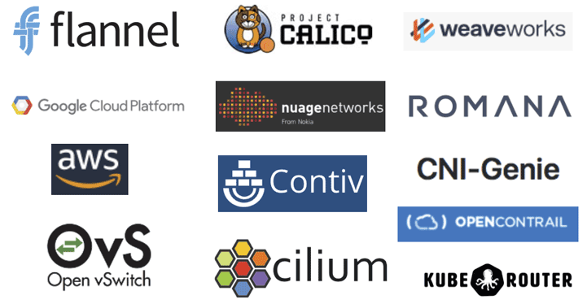
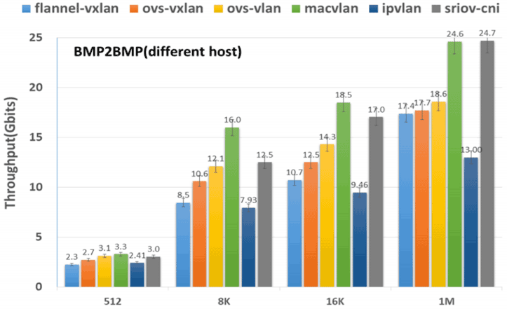
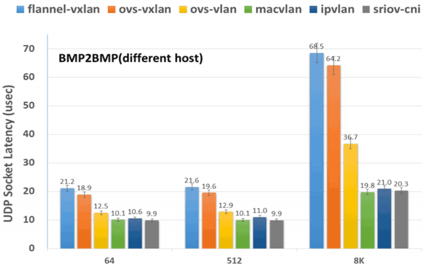

# 容器网络与生态

容器网络的第一个业界标准源于Docker在2015年发布的[libnetwork](https://github.com/moby/libnetwork)项目，如果你还记得在“[容器的崛起](/immutable-infrastructure/container/history.html)”中关于[libcontainer](https://github.com/opencontainers/runc/tree/master/libcontainer)的故事，那从名字上就很容易推断出libnetwork项目的目的与意义所在。这是Docker用Golang编写的、专门用来抽象容器间网络通信的一个独立模块，与libcontainer是作为OCI的标准实现类似，libnetwork是作为Docker提出的CNM规范（Container Network Model）的标准实现而设计的。不过，与libcontainer因孵化出runC项目，时至今日仍然广为人知的结局不同，libnetwork随着Docker Swarm的失败，已经基本失去了实用价值，只具备历史与学术研究方面的价值了。

## CNM与CNI

如今容器网络的事实标准[CNI](https://github.com/containernetworking/cni/blob/master/SPEC.md)（Container Networking Interface）与CNM在目标上几乎是完全重叠的，由此决定了CNI与CNM之间只能是你死我活的竞争关系，这与容器运行时中提及的CRI和OCI的关系明显不同，CRI与OCI目标并不一样，两者有足够空间可以和平共处。

尽管CNM规范已是明日黄花，但它作为容器网络的先行者，对后续的容器网络标准制定有直接的指导意义，提出容器网络标准的目的就是为了把网络功能从容器运行时引擎或者容器编排系统中剥离出去，网络的专业性和针对性极强，如果不把它变成外部可扩展的功能，都由自己来做的话，不仅费时费力，还难以讨好。这个特点从下图所列的一大堆容器网络提供商就可见一斑。

:::center

部分容器网络提供商
:::

网络的专业性与针对性也决定了CNM和CNI均采用了插件式的设计，需要接入什么样的网络，就设计一个对应的网络插件即可。所谓的插件，在形式上也就是一个可执行文件，再配上相应的Manifests描述。为了方便插件编写，CNM将协议栈、网络接口（对应于veth、tap/tun等）和网络（对应于Bridge、VXLAN、MACVLAN等）分别抽象为Sandbox、Endpoint和Network，并在接口的API中提供了这些抽象资源的读写操作。而CNI中尽管也有Sandbox、Network的概念，含义也与CNM大致相同，不过在Kubernetes资源模型的支持下，它就无需刻意地强调某一种网络资源应该如何描述、如何访问了，因此结构上显得更加轻便。

从程序功能上看，CNM和CNI的网络插件提供的能力都能划分为网络的管理与IP地址的管理两类，插件可以选择只实现其中的某一个，也可以全部都实现：

- **管理网络创建与删除**。l 解决如何创建网络，如何将容器接入到网络，以及容器如何退出和删除网络。这个过程实际上是对容器网络的生命周期管理，如果你更熟悉Docker命令，可以类比理解为基本上等同于`docker network`命令所做事情。CNM规范中定义了创建网络、删除网络、容器接入网络、容器退出网络、查询网络信息、创建通信Endpoint、删除通信Endpoint等十个编程接口，而CNI中就更加简单了，只要实现对网络的增加与删除两项操作即可。你甚至不需要学过Golang语言，只从名称上都能轻松看明白以下接口中每个方法的含义是什么：

  ```go
  type CNI interface {
  	AddNetworkList (net *NetworkConfigList, rt *RuntimeConf) (types.Result, error)
      DelNetworkList (net *NetworkConfigList, rt *RuntimeConf) error
  
      AddNetwork (net *NetworkConfig, rt *RuntimeConf) (types.Result, error)
      DelNetwork (net *NetworkConfig, rt *RuntimeConf) error
  }
  ```

- **管理IP地址分配与回收**。解决如何为三层网络分配唯一的IP地址的问题，二层网络的MAC地址天然就具有唯一性，无需刻意地考虑如何分配的问题。但是三层网络的IP地址只有通过精心规划，才能保证在全局网络中都是唯一的，否则，如果两个容器之间可能存在相同地址，那它们就最多只能做NAT，而不可能做到直接通信。<br/>相比起基于UUID或者数字序列实现的全局唯一ID产生器，IP地址的全局分配工作要更加困难一些，首先是要符合IPv4的网段规则，且保证不重复，这在分布式环境里只能依赖Etcd、ZooKeeper等协调工具来实现，Docker自己也提供了类似的libkv来完成这项工作。其次是必须考虑到回收的问题，否则一旦Pod发生持续重启就有可能耗尽某个网段中的所有地址。最后还必须要关注时效性，原本IP地址的获取采用标准的[DHCP](https://en.wikipedia.org/wiki/Dynamic_Host_Configuration_Protocol)协议（Dynamic Host Configuration Protocol）即可，但DHCP有可能产生长达数秒的延迟，对于某些生存周期很短的Pod，这已经超出了它的忍受限度，因此在容器网络中，往往Host-Local的IP分配方式会比DHCP更加实用。


## CNM到CNI

容器网络标准能够提供一致的网络操作界面，不论是什么网络插件都使用一致的API，提高了网络配置的自动化程度和在不同网络间迁移的体验，对最终用户、容器提供商、网络提供商来说都是三方共赢的事情。

CNM规范发布以后，借助Docker在容器领域的强大号召力，很快就得到了网络提供商与开源组织的支持，不说专门为Docker设计针对容器互联的网络，最起码也会让现有的网络方案兼容于CNM规范，以便能在容器圈中多分一杯羹，譬如Cisco的[Contiv](https://contiv.io/)、OpenStack的[Kuryr](https://github.com/openstack/kuryr)、Open vSwitch的[OVN](https://github.com/ovn-org/ovn)（Open Virtual Networking）以及来自开源项目的[Calico](https://github.com/projectcalico/calico)和[Weave](https://github.com/weaveworks/weave)等都是CNM阵营中的成员。唯一对CNM持有不同意见的是那些和Docker存在直接竞争关系的产品，譬如Docker的最大竞争对手，来自CoreOS公司的[RKT](https://coreos.com/rkt/)容器引擎。其实凭良心说，并不是其他容器引擎想刻意去抵制CNM，而是Docker制定CNM规范时完全基于Docker本身来设计，并没有考虑CNM用于其他容器引擎的可能性。

为了平衡CNM规范的影响力，也是为了在Docker的垄断背景下寻找一条出路，RKT提出了与CNM目标类似的“[RKT网络提案](https://github.com/rkt/rkt/issues/273)”（RKT Networking Proposal）。一个业界标准成功与否，很大程度上取决于它支持者阵营的规模，对于容器网络这种插件式的规范更是如此。Docker力推的CNM毫无疑问是当时统一容器网络标准的最有力竞争者，如果没有外力的介入，有极大可能会成为最后的胜利者。然而，影响容器网络发展的外力还是出现了，即使此前笔者没有提过CNI，你也应该很容易猜到，在容器圈里能够掀翻Docker的“外力”，也就唯有Kubernetes一家而已。

Kubernetes开源的初期（Kubernetes 1.5提出CRI规范之前），在容器引擎上是选择彻底绑定于Docker的，但是，在容器网络的选择上，Kubernetes一直都坚持独立于Docker自己来维护网络。CNM和CNI提出以前的早期版本里，Kubernetes会使用Docker的空置网络模式（`--network=none`）来创建Pause容器，然后通过内部的kubenet来创建网络设施，再让Pod中的其他容器加入到Pause容器的名称空间中共享这些网络设施。

:::quote 额外知识：kubenet

[kubenet](https://kubernetes.io/docs/admin/network-plugins/#kubenet)是kubelet内置的一个非常的简单的网络，采用网桥来解决Pod间通信。kubenet会自动创建一个名为cbr0的网桥，当有新的Pod启动时，会由kubenet自动将其接入cbr0网桥中，再将控制权交还给kubelet，完成后续的Pod创建流程。kubenet采用Host-Local的IP地址管理方式，具体来说是根据当前服务器对应的Node资源上的`PodCIDR`字段所设的网段来分配IP地址。当有新的Pod启动时，会由本地节点的IP段中分配一个空闲的IP给Pod使用。

:::

CNM规范还未提出之前，Kubernetes自己来维护网络是必然的结果，因为Docker自带的网络基本上只聚焦于如何解决本地通信，完全无法满足Kubernetes跨集群节点的容器编排的需要。CNM规范提出之后，原本Kubernetes应该是除Docker外最大的受益者才对，CNM的价值就是能很方便地引入其他网络插件来替代掉Docker自带的网络，但Kubernetes却对Docker的CNM规范表现得颇为犹豫，经过一番评估考量，Kubernetes最终决定去转为去支持当时极不成熟的RKT的网络提案，与CoreOS合作以RKT网络提案为基础发展出CNI规范。

Kubernetes Network SIG的Leader、Google的工程师Tim Hockin专门撰写过一篇文章《[Why Kubernetes doesn't use libnetwork](https://kubernetes.io/blog/2016/01/why-kubernetes-doesnt-use-libnetwork/)》来解释为何Kubernetes要拒绝CNM与libnetwork。当时容器编排战争还处于三国争霸（Kubernetes、Apache Mesos、Docker Swarm）的拉锯阶段，即使强势如Kubernetes，拒绝CNM其实也要冒不小的风险，付出颇大的代价，因为这个决定不可避免会引发一系列技术和非技术的问题，譬如网络提供商要为Kubernetes专门编写不同的网络插件、由`docker run`启动的独立容器将会无法与Kubernetes启动的容器直接相互通信，等等。

促使Kubernetes拒绝CNM的理由也同样有来自于技术和非技术方面的。技术方面，Docker的网络模型做出了许多对Kubernetes无效的假设：Docker的网络有本地网络（不带任何跨节点协调能力，譬如Bridge模式就没有全局统一的IP分配）和全局网络（跨主机的容器通信，例如Overlay模式）的区别，本地网络对Kubernetes来说毫无意义，而全局网络又默认依赖libkv来实现全局IP地址管理等跨机器的协调工作。这里的libkv是Docker建立的lib*家族中另一位成员，用来对标Etcd、ZooKeeper等分布式K/V存储，这对于已经拥有了Etcd的Kubernetes来说如同鸡肋。非技术方面，Kubernetes决定放弃CNM的原因很大程度上还是由于他们与Docker在发展理念上的冲突，Kubernetes当时已经开始推进Docker从必备依赖变为可选引擎的重构工作，而Docker则坚持CNM只能基于Docker来设计。Tim Hockin在文章中举了一个例子：CNM的网络驱动没有向外部暴露网络所连接容器的具体名称，只使用一个内部分配的ID来代替，这让外部（包括网络插件和容器编排系统）很难将网络连接的容器与自己管理的容器对应关联起来，当他们向Docker开发人员反馈这个问题时，问题被以“工作符合预期结果”（Working as Intended）为理由直接关闭掉，Tim Hockin还专门列出了这些问题的详细清单，如[libnetwork #139](https://github.com/docker/libnetwork/issues/139)、[libnetwork #486](https://github.com/docker/libnetwork/issues/486)、[libnetwork #514](https://github.com/docker/libnetwork/pull/514)、[libnetwork #865](https://github.com/docker/libnetwork/issues/865)、[docker #18864](https://github.com/docker/docker/issues/18864)，这种设计被Kubernetes认为是人为地给非Docker的第三方容器引擎使用CNM设置障碍。整个沟通过程中，Docker表现得也极为强硬，明确表示他们对偏离当前路线或委托控制的想法都不太欢迎。上面这些“非技术”的问题，即使没有Docker的支持，Kubernetes自己也并非不能从“技术上”去解决，但Docker的理念令Kubernetes感到忧虑，因为Kubernetes在Docker之上扩展的很多功能，Kubernetes却并不想这些功能永远绑定在Docker之上。

CNM与libnetwork是2015年5月1日发布的，CNI则是在2015年7月发布，两者正式诞生只相差不到两个月时间，这显然是竞争的需要而非单纯的巧合。五年之后的今天，这场容器网络的话语权之争已经尘埃落定，CNI获得全面的胜利，除了Kubernetes和RKT外，Amazon ECS、RedHat OpenShift、Apache Mesos、Cloud Foundry等容器编排圈子中除了Docker之外其他具有影响力的参与者都已宣布支持CNI规范，原本已经加入了CNM阵营的Contiv、Calico、Weave网络提供商也纷纷推出了自己的CNI插件。

## 网络插件生态

时至今日，支持CNI的网络插件已多达数十种，笔者不太可能逐一细说，不过，跨主机通信的网络实现方式来去也就下面这三种，我们不妨以网络实现模式为主线，每种模式介绍一个具有代表性的插件，以达到对网络插件生态窥斑见豹的效果。

- **Overlay模式**：我们已经学习过Overlay网络，知道这是一种虚拟化的上层逻辑网络，好处在于它不受底层物理网络结构的约束，有更大的自由度，更好的易用性；坏处是由于额外的包头封装导致信息密度降低，额外的隧道封包解包会导致传输性能下降。<br/>在虚拟化环境（例如 OpenStack）中的网络限制往往较多，譬如不允许机器之间直接进行二层通信，只能通过三层转发。在这类被限制网络的环境里，基本上就只能选择Overlay网络插件，常见的Overlay网络插件有Flannel（VXLAN模式）、Calico（IPIP模式）、Weave等等。<br/>这里以Flannel-VXLAN为例，由CoreOS开发的Flannel可以说是最早的跨节点容器通信解决方案，很多其他网络插件的设计中都能找到Flannel的影子。早在2014年，VXLAN还没有进入Linux内核的时候，Flannel就已经开始流行，当时的Flannel只能采用自定义的UDP封包实现自己私有协议的Overlay网络，由于封包、解包的操作只能在用户态中进行，而数据包在内核态的协议栈中流转，这导致数据要反复在用户态、内核态之间拷贝，性能堪忧。从此Flannel就给人留下了速度慢的坏印象。VXLAN进入Linux内核后，这种内核态用户态的转换消耗已经完全消失，Flannel-VXLAN的效率比起Flannel-UDP有了很大提升，目前已经成为最常用的容器网络插件之一。
- **路由模式**：路由模式其实属于Underlay模式的一种特例，这里将它单独作为一种网络实现模式来介绍。相比起Overlay网络，路由模式的主要区别在于它的跨主机通信是直接通过路由转发来实现的，因而无需在不同主机之间进行隧道封包。这种模式的好处是性能相比Overlay网络有明显提升，坏处是路由转发要依赖于底层网络环境的支持，并不是你想做就能做到的。路由网络要求要么所有主机都位于同一个子网之内，都是二层连通的，要么不同二层子网之间由支持[边界网关协议](https://en.wikipedia.org/wiki/Border_Gateway_Protocol)（Border Gateway Protocol，BGP）的路由相连，并且网络插件也同样支持BGP协议去修改路由表。<br/>上一节介绍Linux网络基础知识时，笔者提到过Linux下不需要专门的虚拟路由，因为Linux本身就具备路由的功能。路由模式就是依赖Linux内置在系统之中的路由协议，将路由表分发到子网的每一台物理主机的。这样，当跨主机访问容器时，Linux主机可以根据自己的路由表得知该容器具体位于哪台物理主机之中，从而直接将数据包转发过去，避免了VXLAN的封包解包而导致的性能降低。 常见的路由网络有Flannel（HostGateway模式）、Calico（BGP模式）等等。<br/>这里以Flannel-HostGateway为例，Flannel通过在各个节点上运行的Flannel Agent（Flanneld）将容器网络的路由信息设置到主机的路由表上，这样一来，所有的物理主机都拥有整个容器网络的路由数据，容器间的数据包可以被Linux主机直接转发，通信效率与裸机直连都相差无几，不过由于Flannel Agent只能修改它运行主机上的路由表，一旦主机之间隔了其他路由设备，譬如路由器或者三层交换机，这个包就会在路由设备上被丢掉，要解决这种问题就必须依靠BGP路由和Calico-BGP这类支持标准BGP协议修改路由表的网络插件共同协作才行。
- **Underlay模式**：这里的Underlay模式特指让容器和宿主机处于同一网络，两者拥有相同的地位的网络方案。Underlay网络要求容器的网络接口能够直接与底层网络进行通信，因此该模式是直接依赖于虚拟化设备与底层网络能力的。常见的Underlay网络插件有MACVLAN、[SR-IOV](https://en.wikipedia.org/wiki/Single-root_input/output_virtualization)（Single Root I/O Virtualization）等。<br/>对于真正的大型数据中心、大型系统，Underlay模式才是最有发展潜力的网络模式。这种方案能够最大限度地利用硬件的能力，往往有着最优秀的性能表现。但也是由于它直接依赖于硬件与底层网络环境，必须根据软、硬件情况来进行部署，难以做到Overlay网络那样开箱即用的灵活性<br/>这里以SR-IOV为例，SR-IOV不是某种专门的网络名字，而是一种将[PCIe](https://en.wikipedia.org/wiki/PCI_Express)设备共享给虚拟机使用的硬件虚拟化标准，目前用在网络设备上应用比较多，理论上也可以支持其他的PCIe硬件。通过SR-IOV能够让硬件在虚拟机上实现独立的内存地址、中断和DMA流，而无需虚拟机管理系统的介入。对于容器系统来说，SR-IOV的价值是可以直接在硬件层面虚拟多张网卡，并且以硬件直通（Passthrough）的形式交付给容器使用。但是SR-IOV直通部署起来通常都较为繁琐，现在容器用的SR-IOV方案不少是使用[MACVTAP](https://en.wikipedia.org/wiki/MacVTap)来对SR-IOV网卡进行转接的，MACVTAP提升了SR-IOV的易用性，但是这种转接又会带来额外的性能损失，并不一定会比其他网络方案有更好的表现。

了解过CNI插件的大致的实现原理与分类后，相信你的下一个问题就是哪种CNI网络最好？如何选择合适的CNI插件？选择CNI网络插件主要有两方面的考量因素，首先必须是你系统所处的环境是支持的，这点在前面已经有针对性地介绍过。在环境可以支持的前提下，另外一个因素就是性能与功能方面是否合乎你的要求。

性能方面，笔者引用一组测试数据供你参考。这些数据来自于2020年8月刊登在IETF的论文《[Considerations for Benchmarking Network Performance in Containerized Infrastructures](https://tools.ietf.org/id/draft-dcn-bmwg-containerized-infra-01.html)》，此文中测试了不同CNI插件在[裸金属服务器](https://en.wikipedia.org/wiki/BareMetal)之间（BMP to BMP，Bare Metal Pod）、虚拟机之间（VMP to VMP，Virtual Machine Pod）、以及裸金属服务器与虚拟机之间（BMP to VMP）的本地网络和跨主机网络的通信表现。囿于篇幅，这里只列出最具代表性的是裸金属服务器之间的跨主机通信，其结果如下图所示：

:::center

512 Bytes - 1M Bytes中TCP吞吐量（结果越高，性能越好）


64 Bytes - 8K Bytes中UDP延迟时间（结果越低，性能越好）
:::

从测试结果可见，MACVLAN和SR-IOV这样的Underlay网络插件的吞吐量最高、延迟最低，仅从网络性能上看它们肯定是最优秀的，相对而言Flannel-VXLAN这样的Overlay网络插件，其吞吐量只有MACVLAN和SR-IOV的70%左右，延迟更是高了两至三倍之多。Overlay为了易用性、灵活性所付出的代价还是不可忽视的，但是对于那些不以网络I/O为性能瓶颈的系统而言，这样的代价并非一定不可接受，就看你心中对通用性与性能是如何权衡取舍。

功能方面的问题就比较简单了，完全取决于你的需求是否能够满足。对于容器编排系统来说，网络并非孤立的功能模块，只提供网络通信就可以的，譬如Kubernetes的NetworkPolicy资源是用于描述“两个Pod之间是否可以访问”这类ACL策略。但它不属于CNI的范畴，因此不是每个CNI插件都会支持NetworkPolicy的声明，如果有这方面的需求，就应该放弃Flannel，去选择Calico、Weave等插件。类似的其他功能上的选择的例子还有很多，笔者不再一一列举。