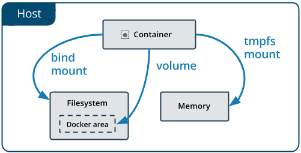
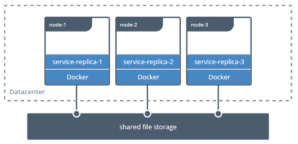
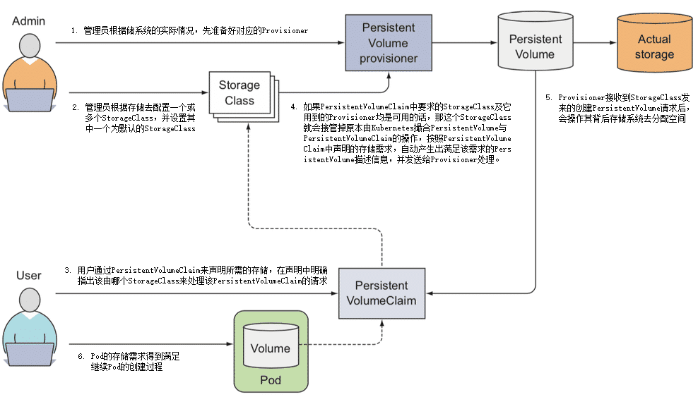

# Kubernetes存储设计

Kubernete在规划存储能力的时候，依然遵循着它的一贯设计哲学，用户负责以资源和声明式API来描述自己的意图，Kubernetes负责根据意图完成具体的操作。然而，即使是遵循了Kubernetes一贯的设计哲学，相比起提供其他能力的资源，Kubernetes内置的存储能力依然显得格外地复杂，甚至可以说是有些繁琐的。如果你是Kubernetes的拥趸，无法认同笔者对Kubernetes的批评，那不妨来看一看下列围绕着“Volume”所衍生的概念，它们仅是Kubernetes存储相关的概念的一个子集，请你思考一下这些概念是否全都是必须的，是否还有整合的空间，是否有化繁为简的可能性：

> - **概念**：[Volume](https://kubernetes.io/docs/concepts/storage/volumes/)、[PersistentVolume](https://kubernetes.io/docs/concepts/storage/persistent-volumes/)、[PersistentVolumeClaim](https://v1-17.docs.kubernetes.io/docs/concepts/storage/persistent-volumes/#persistentvolumeclaims)、[Provisioner](https://kubernetes.io/docs/concepts/storage/dynamic-provisioning/)、[StorageClass](https://v1-17.docs.kubernetes.io/docs/concepts/storage/storage-classes/)、[Volume Snapshot](https://v1-17.docs.kubernetes.io/docs/concepts/storage/volume-snapshots/)、[Volume Snapshot Class](https://v1-17.docs.kubernetes.io/docs/concepts/storage/volume-snapshot-classes/)、[Ephemeral Volumes](https://kubernetes.io/docs/concepts/storage/ephemeral-volumes/)、[FlexVolume Driver](https://github.com/kubernetes/community/blob/master/contributors/devel/sig-storage/flexvolume.md)、[Container Storage Interface](https://github.com/container-storage-interface/spec/blob/master/spec.md)、[CSI Volume Cloning](https://v1-17.docs.kubernetes.io/docs/concepts/storage/volume-pvc-datasource/)、[Volume Limits](https://v1-17.docs.kubernetes.io/docs/concepts/storage/storage-limits/)、[Volume Mode](https://kubernetes.io/docs/concepts/storage/persistent-volumes/#volume-mode)、[Access Modes](https://kubernetes.io/docs/concepts/storage/persistent-volumes/#volume-mode)、[Storage Capacity](https://kubernetes.io/docs/concepts/storage/storage-capacity/)……
> - **操作**：[Mount](https://kubernetes.io/docs/concepts/storage/persistent-volumes/#mount-options)、[Bind](https://kubernetes.io/docs/concepts/storage/persistent-volumes/#using)、[Use](https://kubernetes.io/docs/concepts/storage/persistent-volumes/#using)、[Provision](https://kubernetes.io/docs/concepts/storage/persistent-volumes/#provisioning)、[Claim](https://kubernetes.io/docs/concepts/storage/persistent-volumes/#claims-as-volumes)、[Reclaim](https://kubernetes.io/docs/concepts/storage/persistent-volumes/#reclaiming)、[Reserve](https://kubernetes.io/docs/concepts/storage/persistent-volumes/#reserving-a-persistentvolume)、[Expand](https://kubernetes.io/docs/concepts/storage/persistent-volumes/#expanding-persistent-volumes-claims)、[Clone](https://kubernetes.io/docs/concepts/storage/volume-pvc-datasource/#usage)、[Schedule](https://kubernetes.io/docs/concepts/storage/storage-capacity/#scheduling)、[Reschedule](https://kubernetes.io/docs/concepts/storage/storage-capacity/#rescheduling)……

诚然，Kubernetes摆弄出如此多关于存储的术语概念，很重要的一个原因是要尽可能多地兼容各种存储系统，为此不得不预置了很多In-Tree（意思是在Kubernetes的代码树里）插件来对接，让用户根据自己业务的需要来选择。同时，为了兼容那些不在预置范围内的需求场景，支持用户使用FlexVolume或者CSI来定制Out-of-Tree（意思是在Kubernetes的代码树之外）的插件，实现更加丰富多样的存储能力。下表列出了部分Kubernetes目前提供的存储与扩展：

| Temp     | Ephemeral（Local） | Persistent（Network） | Extension |
| -------- | ------------------- | ----------------------- | --------- |
| EmptyDir | HostPath<br/>GitRepo<br/>Local<br/>Secret<br/>ConfigMap<br/>DownwardAPI | AWS Elastic Block Store<br/>GCE Persistent Disk<br/>Azure Data Disk<br/>Azure File Storage<br/>vSphere<br/>CephFS and RBD<br/>GlusterFS<br/>iSCSI<br/>Cinder<br/>Dell EMC  ScaleIO<br/>…… | FlexVolume<br/>CSI |

迫使Kubernetes存储设计成如此繁复，其实还有另外一个非技术层面的原因。复杂性归根结底源于Kubernetes是一个工业级的、面向大规模生产应用的容器编排系统，这意味着即使发现某些已存在的功能有更好的实现方式，直到旧版本被基本淘汰出生产环境以前，原本已支持的功能都不允许突然间被移除或者替换掉，否则，如果生产系统一更新版本，已有的功能就出现异常，那对产品的累积的良好信誉是颇为不利的。

为了兼容性而导致的复杂性在一定程度上可以被谅解，但这样的设计的确令Kubernetes的学习曲线变得更加陡峭。Kubernets官方文档的主要作用是参考手册，它并不会告诉你Kubernetes中各种概念的演化历程、版本发布新功能的时间线、改动的缘由与背景等信息。Kubernetes的文档系统只会以“平坦”的方式来陈述目前可用的所有功能，这有利于熟练的管理员快速查询到关键信息，却不利于初学者去理解Kubernetes的设计思想，由于难以理解那些概念和操作的本意，往往只能死记硬背，也就很难分辨出它们应该如何被“更正确”的使用。介绍Kubernetes设计理念的职责，应该要由[Kubernetes官方的Blog](https://kubernetes.io/blog/)与定位超越了帮助手册的非官方资料去完成。本节中，笔者就将以Volume概念的演化历程为主线去介绍前面提及的那些概念与操作，以此帮助大家窥探Kubernetes的存储设计理念。

## Mount和Volume

Mount和Volume最初都是来自操作系统的基础概念，Mount是动词，表示将某个外部存储挂载到系统中，Volume是名词，它是物理存储的逻辑抽象，目的是为物理存储提供更有弹性的分割方式。容器发源于对操作系统层的虚拟化，为了满足容器内生成数据的外部存储需求，也很自然地会将Mount和Volume的概念延拓至容器中。因此，关于Volume的发展演进，笔者就以Docker的Mount（挂载）为起点来介绍。

目前，Docker内建支持三种挂载类型，分别是Bind（`--mount type=bind`）、Volume（`--mount type=volume`）和tmpfs（`--mount type=tmpfs`），如下图所示。其中tmpfs用于在内存中读写临时数据，鉴于本节主要讨论的对象是持久化的存储，所以后面我们将着重关注Bind和Volume两种挂载类型。

:::center

Docker的三种挂载类型（图片来自[Docker官网文档](https://docs.docker.com/storage/)）
:::

Bind Mount是Docker最早提供的（发布时就支持）挂载类型，它就是指把宿主机的某个目录（或文件）挂载到容器的指定目录（或文件）下，譬如以下命令中参数`-v`表达的意思就是将外部的HTML文档挂到Nginx容器的默认网站根目录下：

```bash
docker run -v /icyfenix/html:/usr/share/nginx/html nginx:latest
```

这里有一点值得注意，虽然命令中`-v`参数是`--volume`的缩写，但`-v`最初只是用来创建Bind Mount而不是创建Volume Mount的，这种迷惑的行为并非Docker的本愿，只是因为Docker刚发布时考虑得不够周全，随随便便就在参数中占用了“Volume”这个词，到后来需要扩展Volume的概念来支持Volume Mount时，前面的`-v`已经被用户广泛使用了，所以也就只得如此将就着继续用。从Docker 17.06版本开始，它在Docker Swarm中借用了`--mount`参数过来，这个参数默认创建的是Volume Mount，可以通过明确的type子参数来指定另外两种挂载类型。上面命令可以等价于`--mount`版本如下形式：

```bash
docker run --mount type=bind,source=/icyfenix/html,destination=/usr/share/nginx/html nginx:latest
```

为什么Docker后来要扩展新的Volume Mount类型呢？或者说，Bind Mount有什么不足之处？如果只限于在开发期间上使用，Bind Mount并不会有什么问题，但是用在生产环境就颇为不便了。Bind Mount只是让容器与本地主机之间建立了某个目录的映射关系，如果不同主机上的容器需要共享同一份存储的话，必须先把共享存储挂载到每一台宿主机操作系统的某个目录下，然后才能逐个挂载到容器内使用。跨主机共享存储的场景如下图所示。

:::center

跨主机的共享存储需求（图片来自[Docker官网文档](https://docs.docker.com/storage/volumes/)）
:::

即使只考虑本地主机的场景，Docker出于管理需求也有提出Volume的必要。Bind Mount的设计里，Docker只有容器的控制权，存放容器生产数据的主机目录是完全独立的，与Docker没有什么关系，既不受Docker保护，也不受Docker管理。数据很容易被其他进程访问到，甚至是被修改和删除。如果用户想对挂载的目录进行备份、迁移等管理运维操作，也只能在Docker之外靠管理员人工进行，这都增加了数据安全与操作意外的风险。Docker希望能有一种抽象的资源代表数据在主机中的存储位置，以便让Docker来管理这些资源，由此就很自然地想到了对操作系统里Volume的概念进行延伸。

提出Volume还有最后也是最重要的一个目的：为了提升Docker对不同存储系统的支撑能力，同时也是为了减轻Docker本身的工作量。如果Docker要越过操作系统去支持挂载某种存储系统中的目录，首先必须要知道该如何访问它，然后才能将容器中的读写操作自动转移到该位置。Docker把解决如何访问存储的功能模块称为存储驱动（Storage Driver），只要使用`docker info`命令，就能查看到当前Docker所支持的存储驱动。尽管Docker已经内置了市面上主流的OverlayFS驱动，譬如Overlay、Overlay2、AUFS、BTRFS、ZFS，等等。但面对云计算的崛起，仅靠Docker自己来支持全部云计算厂商的存储系统是不太现实的，因此Docker提出了与Storage Driver相对应的Volume Driver（卷驱动）的概念。用户可以通过`docker plugin install`命令安装[外部的卷驱动](https://docs.docker.com/engine/extend/legacy_plugins/)，并在创建Volume的时候指定一个其存储系统匹配的卷驱动，譬如希望存储在AWS Elastic Block Store上，就找一个AWS EBS的驱动，如果想存储在Azure File Storage上，也找一个对应的Azure File Storage驱动即可。创建Volume时不指定卷驱动的话，那默认就是local类型，在Volume中存放的数据会存储在宿主机的`/var/lib/docker/volumes/`目录中。

到了容器编排系统里，Kubernetes同样也将Docker中Volume的概念延续了下来，并且进一步强化了它。Kubernetes中的Volume有明确的生命周期——与挂载它的Pod相同的生命周期，这意味着Volume比Pod中运行的任何容器的存活期都更长，Pod中不同的容器能自动共享相同的Volume，当容器重新启动时，Volume中的数据也会自动得到保留。 当然，一旦整个Pod被销毁，Volume也将不再存在，数据通常也会被销毁掉，至于实际是否会真正删除，取决于具体的回收策略以及存储驱动是如何实现的。

Kubernetes原本内置了相当多In-Tree的卷驱动，且时间上还早于Docker宣布支持卷驱动功能，这种策略使得Kubernetes能够在云存储提供商发布官方驱动之前就将其纳入到支持范围中，同时减轻了管理员维护的工作量，为它在诞生初期快速占领市场做出了一定的贡献。但是，这种策略也让Kubernetes丧失了添加或修改卷驱动的灵活性，只能在更新大版本时才能加入或者修改驱动，导致云存储提供商被迫与Kubernetes的发布节奏保持一致。此外，还涉及到第三方存储代码混杂在Kubernetes二进制文件中可能引起的可靠性和安全性问题。因此，当Kubernetes成为市场主流以后——准确的时间点是从1.14版本开始，Kubernetes启动了In-Tree卷驱动的CSI外置迁移工作，按照计划，在1.21到1.22版本（大约在2021年中期）时，Kubernetes中主要的卷驱动，如AWS EBS、GCE PD、vSphere等都会迁移至CSI的Out-of-Tree实现，不再提供In-Tree的支持。这种做法在设计上无疑是最正确的，然而，这又面临了该如何兼容旧功能的问题，譬如下面YAML定义了一个Pod：

```yaml
apiVersion: v1
kind: Pod
metadata:
  name: nginx-pod-example
spec:
  containers:
  - name: nginx
    image: nginx:latest
    volumeMounts:
    - name: html-pages-volume
      mountPath: /usr/share/nginx/html
    - name: config-volume
      mountPath: /etc/nginx
  volumes:
    - name: html-pages-volume
      hostPath:                 # 来自本地的存储
        path: /srv/nginx/html
        type: Directory
    - name: config-volume
      awsElasticBlockStore:     # 来自AWS ESB的存储
        volumeID: vol-0b39e0b08745caef4
        fsType: ext4
```

其中用到了类型为`hostPath`的Volume，这相当于Docker中驱动类型为local的Volume，不需要专门的驱动；而类型为`awsElasticBlockStore`的Volume，从名字上就能看出是指存储驱动为AWS EBS的Volume，当CSI迁移完成，`awsElasticBlockStore`从In-Tree卷驱动中移除掉之后，它就应该按照CSI的写法改写成如下形式：

```yaml
    - name: config-volume
      csi:
        driver: ebs.csi.aws.com
        volumeAttributes: 
          - volumeID: vol-0b39e0b08745caef4
          - fsType: ext4
```

这样的要求显然有悖于升级版本不得影响还在大范围使用的已有功能的原则，所以Kubernetes 1.17中提出了[CSIMigration的解决方案](https://kubernetes.io/blog/2019/12/09/kubernetes-1-17-feature-csi-migration-beta/)，让Out-of-Tree的驱动能够自动伪装成In-Tree的接口来提供服务。

笔者专门花这两段来介绍Volume的CSI迁移，并非由于它是多么重要的特性，而是这种兼容性设计本身就是Kubernetes设计理念的一个缩影，在Kubernetes的代码与功能中随处可见。好的设计需要权衡多个方面的利益，很多时候都得顾及现实的影响，而不能仅仅考虑理论最优的方案。

## Static Provisioning

从操作系统里继承下来的Volume概念，在Docker和Kubernetes中继续按照一致的逻辑延伸拓展，这种有传承的概念通常会显得清晰易懂，没有歧义。如果仅用Volume就解决所有问题，Kubernetes的存储便不会如此繁琐，可惜的是容器编排系统里仅仅有Volume并不能够满足全部的需要，核心矛盾是Volume的生命周期与Pod相同，一旦Pod被销毁，Volume也会随之而去。对于无状态应用，这很合理，但对于有状态应用，譬如数据库之类的应用就对此完全不可接受，谁也不会希望数据库的Pod崩溃重启之后便会自动丢失掉全部资料。

于是Kubernetes再次对Volume做了进一步的延伸，派生出了PersistentVolume的概念，从“Persistent”这个单词就能够顾名思义，它是指能够将数据进行持久化存储的一种资源对象。PersistentVolume可以独立于Pod存在，生命周期与Pod无关，因此也决定了PersistentVolume不会依附于某一个主机节点上，你看前面表格中“Persistent”一列里基本都是网络或者云服务存储就是很好的印证。

::: quote 额外知识：Local PersistentVolume

对于部署在云端数据中心的系统，通过网络访问同一个可用区中的远程存储，速度是完全可以接受的。但对于私有部署的系统，基于性能考虑，使用本地存储往往会更为常见。

考虑到这样的实际需求，从1.10版起，Kubernetes开始支持[Local PersistentVolume](https://kubernetes.io/blog/2019/04/04/kubernetes-1.14-local-persistent-volumes-ga/)，这是一种将一整块本地磁盘作为PersistentVolume供容器使用的专用方案。专用方案就是字面意思，它并不适用于全部应用，Local PersistentVolume只是针对以磁盘I/O为瓶颈的特定应用的解决方案，副作用十分明显：由于不能保证这种本地磁盘在每个节点中都一定存在，所以Kubernetes在调度时就必须考虑到PersistentVolume分布情况，只能把使用了Local PersistentVolume的Pod调度到有这种PersistentVolume的节点上。调度器中专门有个叫做[Volume Binding Mode](https://kubernetes.io/docs/concepts/storage/storage-classes/#volume-binding-mode)的模式来支持这项处理，尽管如此，一旦使用了Local PersistentVolume，无疑是会限制Pod的可调度范围。

:::

:::center

Volume与PersistentVolume
:::

将PersistentVolume与Pod分离开来后，就需要专门考虑它该如何被Pod使用。原本在Pod中引用其他资源是常有的事，要么直接通过资源名称直接引用，要么通过[标签选择器](https://kubernetes.io/docs/concepts/overview/working-with-objects/labels/)（Selectors）间接引用。但是类似的方法在这里却并不妥当，请想一下“Pod该使用何种存储”这件事情，应该是系统管理员（运维人员）说的算，还是由用户（开发人员）说的算？合理的答案是他们一起说的才算，因为只有开发能准确评估Pod运行需要消耗多大的存储空间，只有运维能清楚知道当前系统可以使用的存储设备状况，为了让他们得以各自提供自己擅长的信息，Kubernetes又增加了PersistentVolumeClaim资源。下面Kubernetes官方给出的概念定义也特别强调了PersistentVolume是由管理员（运维人员）负责维护的，用户（开发人员）通过PersistentVolumeClaim来匹配到合乎需求的PersistentVolume：

:::quote PersistentVolume & PersistentVolumeClaim 

A PersistentVolume （PV） is a piece of storage in the cluster that has been provisioned **by an administrator**. <br/>A PersistentVolumeClaim （PVC） is a request for storage **by a user**. 

::: right

—— Kubernetes Reference Documentation，[Persistent Volumes](https://jamesdefabia.github.io/docs/user-guide/persistent-volumes/)

:::

PersistentVolume已经算是抽象Volume的具象化表现了，通俗地说就是已经被管理员分配好的具体的（这里的“具体的”是指明确的容量、访问模式、存储位置等信息）存储；PersistentVolumeClaim则是Pod对其所需存储能力的声明，通俗地说就是满足这个Pod正常运行要满足怎样的条件，譬如要消耗多大的容量、要支持怎样的访问方式。两者配合工作过程是：

1. 管理员准备好要使用的存储系统，它应是某种网络文件系统（NFS）或者云储存系统，应该具备跨主机共享的能力。
2. 管理员根据存储系统的实际情况，手工预先分配好若干个PersistentVolume，并定义好每个PersistentVolume可以提供的具体能力。譬如以下例子所示：

   ```yaml
   apiVersion: v1
   kind: PersistentVolume
   metadata:
     name: nginx-html
   spec:
     capacity:
       storage: 5Gi                          # 最大容量为5GB
     accessModes:
       - ReadWriteOnce                       # 访问模式为RXO
     persistentVolumeReclaimPolicy: Recycle  # 回收策略是Recycle
     nfs:                                    # 存储驱动是NFS
       path: /html
       server: 172.17.0.2
   ```
    以上YAML中定义的存储能力具体为：
   - 最大容量是5GB。
   - 访问模式是“只能被一个节点读写挂载”（ReadWriteOnce，RWO），另外两种可选的访问模式是“可以被多个节点以只读方式挂载”（ReadOnlyMany，ROX）和“可以被多个节点读写挂载”（ReadWriteMany，RWX）。
   - 回收策略是Recycle，即在Pod被销毁时，自动执行`rm -rf /volume/*`这样的命令来自动删除资料，另外两种可选的回收策略是Retain（即人工回收）以及Delete（用于AWS EBS、GCE PersistentDisk、OpenStack Cinder这些云存储的删除）。
   - 存储驱动是NFS，其他常见的存储驱动还有AWS EBS、GCE PD、iSCSI、RBD（Ceph Block Device）、GlusterFS、HostPath，等等。
3. 用户根据业务系统的实际情况，创建PersistentVolumeClaim，列出所需的存储能力。譬如以下例子所示：

   ```yaml
   kind: PersistentVolumeClaim
   apiVersion: v1
   metadata:
     name: nginx-html-claim
   spec:
     accessModes:
       - ReadWriteOnce    # 支持RXO访问模式
     resources:
       requests:
         storage: 5Gi     # 最小容量5GB
   ```

   以上YAML中声明了要求容量不得小于5GB，必须支持RWO的访问模式。

4. Kubernetes创建Pod的过程中，会根据系统中PersistentVolume与PersistentVolumeClaim的供需关系对两者进行撮合，撮合成功则将它们绑定。
5. 以上几步都顺利完成的话，意味着Pod的存储需求得到满足，继续Pod的创建过程，整个过程如下图所示。

:::center

PV\PVC运作过程（图片来自《[Kubernetes in Action](https://www.manning.com/books/kubernetes-in-action)》）
:::

Kubernetes对PersistentVolumeClaim与PersistentVolume撮合的结果是产生一对一的绑定关系，“一对一”的意思是PersistentVolume一旦绑定在某个PersistentVolumeClaim上，直到释放以前都会被这个PersistentVolumeClaim所独占，不能再与其他PersistentVolumeClaim进行绑定。这意味着即使PersistentVolumeClaim申请的存储空间比PersistentVolume能够提供的要少，依然要求整个存储空间都为该PersistentVolumeClaim所用，这有可能会造成资源的浪费。譬如，某个PersistentVolumeClaim要求3GB的存储容量，当前Kubernetes手上只剩下一个5GB的PersistentVolume了，此时Kubernetes只好将这个PersistentVolume与申请资源的PersistentVolumeClaim进行绑定，平白浪费了2GB空间。假设后续有另一个PersistentVolumeClaim申请2GB的存储空间，那它也只能等待管理员分配新的PersistentVolume，或者有其他PersistentVolume被回收之后才被能成功分配。

## Dynamic Provisioning

即使Kubernetes有了PersistentVolume以后，也仍未解决全部问题，PersistentVolume能够满足有状态应用的需要，但是当应用规模较大时，PersistentVolume很难被自动化的问题就会突显出来。这是由于Pod创建过程中去挂载某个Volume，必须要求该Volume是真实存在的，否则Pod启动所依赖的数据（如一些配置、数据、外部资源等等）都可能无从读取。Kubernetes有能力随着流量压力和硬件资源状况，自动扩缩Pod的数量，但是当Kubernetes自动扩展出一个新的Pod后，并没有办法让Pod去自动挂载一个还未被分配资源的PersistentVolume。想解决这个问题，要么要求多个不同的Pod都共用相同的PersistentVolumeClaim，这种方案确实只靠PersistentVolume就能解决，却损失了隔离性，难以通用；要么就要求每个Pod用到的PersistentVolume都是已经被预先建立并分配好的，这种方案靠管理员提前手工分配存储也可以实现，却损失了自动化能力。

无论哪种情况，都算不上完美，难以符合Kubernetes工业级编排系统的产品定位，纯粹靠管理员手工分配PersistentVolume对中小型系统来说尚可一用，但对与大型系统，面对成百上千，来自成千上万的Pod，靠管理员手工分配存储实在是捉襟见肘疲于应付。在2017年Kubernetes发布1.6版本后，终于提供了今天被称为Dynamic Provisioning的解决方案，让系统管理员摆脱了人工分配的PersistentVolume的窘境，与之相对，人们把此前的分配方式称为Static Provisioning。

所谓的Dynamic Provisioning方案，是指在用户声明存储能力的需求时，不是期望通过Kubernetes撮合来获得一个人工预置的PersistentVolume，而是由特定的资源分配器（Provisioner）自动地在资源池或者云存储中分配符合用户存储需要的PersistentVolume，然后挂载到Pod中使用，完成这件事情的资源被命名为StorageClass。Dynamic Provisioning的具体工作过程是：

1. 管理员根据储系统的实际情况，先准备好对应的Provisioner。Kubernetes官方已经提供了一系列[预置的In-Tree Provisioner](https://kubernetes.io/docs/concepts/storage/storage-classes/)，放置在`kubernetes.io`API组之下。其中部分Provisioner已经有了官方的CSI驱动，譬如vSphere的Kubernetes自带驱动为`kubernetes.io/vsphere-volume`，VMware的官方驱动为`csi.vsphere.vmware.com`。

2. 管理员不再是手工去分配PersistentVolume了，而是根据存储去配置StorageClass。Pod是可以自动扩缩的，而存储则是相对固定的，哪怕使用的是具有扩展能力的云存储，也会将它们视为存储容量、访问IOPS等参数可变的固定存储，譬如你可以将来自不同云存储提供商、不同性能、支持不同访问模式的存储配置为各种类型的StorageClass，这也是它名字中“Class”的含义，譬如以下例子所示：

   ```yaml
   apiVersion: storage.k8s.io/v1
   kind: StorageClass
   metadata:
     name: standard
   provisioner: kubernetes.io/aws-ebs  #AWS EBS的Provisioner
   parameters:
     type: gp2
   reclaimPolicy: Retain
   ```

3. 用户依然通过PersistentVolumeClaim来声明所需的存储，但是应在声明中明确指出该由哪个StorageClass来代替Kubernetes处理该PersistentVolumeClaim的请求，譬如以下例子所示：

   ```yaml
   apiVersion: v1
   kind: PersistentVolumeClaim
   metadata:
     name: standard-claim
   spec:
     accessModes:
     - ReadWriteOnce
     storageClassName: standard  #明确指出该由哪个StorageClass来处理该PersistentVolumeClaim的请求
     resource:
       requests:
         storage: 5Gi
   ```

4. 如果PersistentVolumeClaim中要求的StorageClass及它用到的Provisioner均是可用的话，那这个StorageClass就会接管掉原本由Kubernetes撮合PersistentVolume与PersistentVolumeClaim的操作，按照PersistentVolumeClaim中声明的存储需求，自动产生出满足该需求的PersistentVolume描述信息，并发送给Provisioner处理。
5. Provisioner接收到StorageClass发来的创建PersistentVolume请求后，会操作其背后存储系统去分配空间，如果分配成功，就生成并返回符合要求的PersistentVolume给Pod使用。
6. 以上几步都顺利完成的话，意味着Pod的存储需求得到满足，继续Pod的创建过程，整个过程如下图所示。

:::center

StorageClass运作过程（图片来自《[Kubernetes in Action](https://www.manning.com/books/kubernetes-in-action)》）
:::

Dynamic Provisioning与Static Provisioning并不是各有用途的互补设计，而是对同一个问题先后出现的两种解决方案。你完全可以只用Dynamic Provisioning来实现所有的Static Provisioning能够实现的存储需求，包括那些不需要动态分配的场景，譬如之前例子里使用HostPath在本地静态分配存储，便可以用指定`no-provisioner`作为Provisioner的StorageClass，使用Local Persistent Volume来代替，譬如以下例子所示：

```yaml
apiVersion: storage.k8s.io/v1
kind: StorageClass
metadata:
  name: local-storage
provisioner: kubernetes.io/no-provisioner
volumeBindingMode: WaitForFirstConsumer
```

使用Dynamic Provisioning来分配存储由很多优点，不仅省去了管理员的人工操作的中间层，也不再需要将PersistentVolume这样的概念暴露给最终用户，因为Dynamic Provisioning里的PersistentVolume只是处理过程的中间产物，用户不再需要接触和理解它，只需要知道由PersistentVolumeClaim去描述存储需求，由StorageClass去满足存储需求即可。只描述意图而不关心具体处理过程是声明式编程的精髓，也是流程自动化的必要保障。由Dynamic Provisioning来分配存储还能获得更高的可管理性，譬如前面提到的回收策略，当Volume跟随Pod一同被销毁时，以前经常会配置回收策略为Recycle来回收空间，即让系统自动执行`rm -rf /volume/*`命令，这种方式往往过于粗暴，遇到更精细的管理需求，譬如“删除到回收站”或者“粉碎式彻底删除”这样的功能实现起来就很麻烦。而Dynamic Provisioning中由于有Provisioner的存在，如何创建、如何回收都是由Provisioner的代码所管理的，这就带来了更高的灵活性。现在Kubernetes官方已经明确建议废弃掉Recycle策略，如有这类需求就改由Dynamic Provisioning去实现了。

Static Provisioning的主要使用价值已局限于管理员能够手工管理存储的小型集群，它符合很多小型系统，尤其是私有化部署系统的现状，但并不符合当今运维自动化的提倡的思路。Static Provisioning的存在某种程度上也可以视为是对历史的一种兼容，在可见的将来，Kubernetes肯定都还将会把Static Provisioning作为用户分配存储的一种主要方案供用户选用。