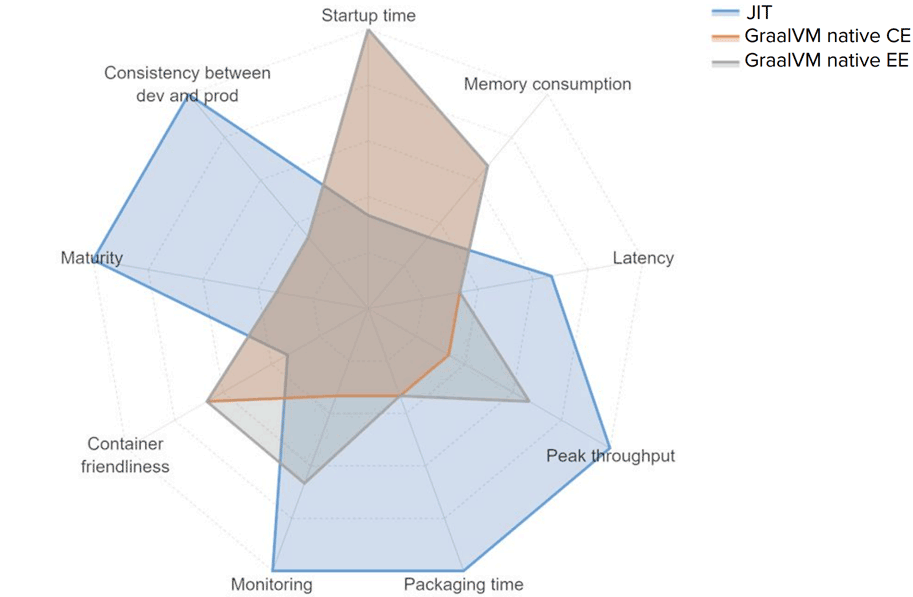

# Spring over Graal

前面几部分，我们以定性的角度分析了Graal VM诞生的背景与它的价值，在最后这部分，我们尝试进行一些实践和定量的讨论，介绍具体如何使用Graal VM之余，也希望能以更加量化的角度去理解程序运行在Graal VM之上，会有哪些具体的收益和代价。

尽管需要到2020年10月正式发布之后，Spring对Graal VM的支持才会正式提供，但现在的我们其实已经可以使用Graal VM来（实验性地）运行Spring、Spring Boot、Spring Data、Netty、JPA等等的一系列组件（不过SpringCloud中的组件暂时还不行）。接下来，我们将尝试使用Graal VM来编译一个标准的Spring Boot应用：

- **环境准备**：

  - 安装Graal VM，你可以选择直接[下载](https://github.com/graalvm/graalvm-ce-builds/releases)安装（版本选择Graal VM CE 20.0.0），然后配置好PATH和JAVA_HOME环境变量即可；也可以选择使用[SDKMAN](https://sdkman.io/install)来快速切换环境。个人推荐后者，毕竟目前还不适合长期基于Graal VM环境下工作，经常手工切换会很麻烦。

    ``` bash
    # 安装SDKMAN
    $ curl -s "https://get.sdkman.io" | bash
    
    # 安装Graal VM
    $ sdk install java 20.0.0.r8-grl
    ```

  - 安装本地镜像编译依赖的LLVM工具链。

    ```bash
    # gu命令来源于Graal VM的bin目录
    $ gu install native-image
    ```

    请注意，这里已经假设你机器上已有基础的GCC编译环境，即已安装过build-essential、libz-dev等套件。没有的话请先行安装。对于Windows环境来说，这步是需要Windows SDK 7.1中的C++编译环境来支持。我个人并不建议在Windows上进行Java应用的本地化操作，如果说在Linux中编译一个本地镜像，通常是为了打包到Docker，然后发布到服务器中使用。那在Windows上编译一个本地镜像，你打算用它来干什么呢？

- **编译准备**：

  - 首先，我们先假设你准备编译的代码是“符合要求”的，即没有使用到Graal VM不支持的特性，譬如前面提到的Finalizer、CGLIB、InvokeDynamic这类功能。然后，由于我们用的是Graal VM的Java 8版本，也必须假设你编译使用Java语言级别在Java 8以内。

  - 然后，我们需要用到尚未正式对外发布的Spring Boot 2.3，目前最新的版本是Spring Boot 2.3.0.M4。请将你的pom.xml中的Spring Boot版本修改如下（假设你编译用的是Maven，用Gradle的请自行调整）：

    ```xml
    <parent>
        <groupId>org.springframework.boot</groupId>
        <artifactId>spring-boot-starter-parent</artifactId>
        <version>2.3.0.M4</version>
        <relativePath/>
    </parent>
    ```

    由于是未发布的Spring Boot版本，所以它在Maven的中央仓库中是找不到的，需要手动加入Spring的私有仓库，如下所示：

    ```xml
    <repositories>
        <repository>
            <id>spring-milestone</id>
            <name>Spring milestone</name>
            <url>https://repo.spring.io/milestone</url>
        </repository>
    </repositories>
    ```

  - 最后，尽管我们可以通过命令行（使用native-image命令）来直接进行编译，这对于没有什么依赖的普通Jar包、写一个Helloworld来说都是可行的，但对于Spring Boot，光是在命令行中写Classpath上都忙活一阵的，建议还是使用[Maven插件](https://www.graalvm.org/docs/reference-manual/native-image/#integration-with-maven)来驱动Graal VM编译，这个插件能够根据Maven的依赖信息自动组织好Classpath，你只需要填其他命令行参数就行了。因为并不是每次编译都需要构建一次本地镜像，为了不干扰使用普通Java虚拟机的编译，建议在Maven中独立建一个Profile来调用Graal VM插件，具体如下所示：

    ```xml
    <profiles>
      <profile>
        <id>graal</id>
        <build>
          <plugins>
            <plugin>
              <groupId>org.graalvm.nativeimage</groupId>
              <artifactId>native-image-maven-plugin</artifactId>
              <version>20.0.0</version>
              <configuration>
                <buildArgs>-Dspring.graal.remove-unused-autoconfig=true --no-fallback -H:+ReportExceptionStackTraces --no-server</buildArgs>
              </configuration>
              <executions>
                <execution>
                  <goals>
                    <goal>native-image</goal>
                  </goals>
                  <phase>package</phase>
                </execution>
              </executions>
            </plugin>
            <plugin>
              <groupId>org.springframework.boot</groupId>
              <artifactId>spring-boot-maven-plugin</artifactId>
            </plugin>
          </plugins>
        </build>
      </profile>
    </profiles>
    ```

    这个插件同样在Maven中央仓库中不存在，所以也得加上前面Spring的私有库：

    ```xml
    <pluginRepositories>
        <pluginRepository>
            <id>spring-milestone</id>
            <name>Spring milestone</name>
            <url>https://repo.spring.io/milestone</url>
        </pluginRepository>
    </pluginRepositories>
    ```

    至此，编译环境的准备顺利完成。

- **程序调整**：

  - 首先，前面提到了Graal VM不支持CGLIB，只能使用JDK动态代理，所以应当把Spring对普通类的Bean增强给关闭掉：

    ```java
    @SpringBootApplication(proxyBeanMethods = false)
    public class ExampleApplication {
    
        public static void main(String[] args) {
            SpringApplication.run(ExampleApplication.class, args);
        }
    
    }
    ```

  - 然后，这是最麻烦的一个步骤，你程序里反射调用过哪些API、用到哪些资源、动态代理，还有哪些类型需要在编译期初始化的，都必须使用JSON配置文件逐一告知Graal VM。前面也说过了，这事情只有理论上的可行性，实际做起来完全不可操作。Graal VM的开发团队当然也清楚这一点，所以这个步骤实际的处理途径有两种，第一种是假设你依赖的第三方包，全部都在Jar包中内置了以上编译所需的配置信息，这样你只要提供你程序里用户代码中用到的配置即可，如果你程序里没写过反射、没用过动态代理什么的，那就什么配置都无需提供。第二种途径是Graal VM计划提供一个Native Image Agent的代理，只要将它挂载在在程序中，以普通Java虚拟机运行一遍，把所有可能的代码路径都操作覆盖到，这个Agent就能自动帮你根据程序实际运行情况来生成编译所需要的配置，这样无论是你自己的代码还是第三方的代码，都不需要做预先的配置。目前，第二种方式中的Agent尚未正式发布，只有方式一是可用的。幸好，Spring与Graal VM共同维护的在[Spring Graal Native](https://github.com/spring-projects-experimental/spring-graal-native)项目已经提供了大多数Spring Boot组件的配置信息（以及一些需要在代码层面处理的Patch），我们只需要简单依赖该工程即可。

    ```xml
    <dependencies>
        <dependency>
            <groupId>org.springframework.experimental</groupId>
            <artifactId>spring-graal-native</artifactId>
            <version>0.6.1.RELEASE</version>
        </dependency>
        <dependency>
          <groupId>org.springframework</groupId>
          <artifactId>spring-context-indexer</artifactId>
        </dependency>
    </dependencies>
    ```

    另外还有一个小问题，由于目前Spring Boot嵌入的Tomcat中，WebSocket部分在JMX反射上还有一些瑕疵，在[修正该问题的PR](https://github.com/apache/tomcat/pull/274)被Merge之前，暂时需要手工去除掉这个依赖：

    ```xml
    <dependencies>
        <dependency>
            <groupId>org.springframework.boot</groupId>
            <artifactId>spring-boot-starter-web</artifactId>
            <exclusions>
                <exclusion>
                    <groupId>org.apache.tomcat.embed</groupId>
                    <artifactId>tomcat-embed-websocket</artifactId>
                </exclusion>
            </exclusions>
        </dependency>
    </dependencies>
    ```

  - 最后，在Maven中给出程序的启动类的路径：

    ```xml
    <properties>
        <start-class>com.example.ExampleApplication</start-class>
    </properties>
    ```

- **开始编译**：

  - 到此一切准备就绪，通过Maven进行编译：

    ```bash
    $ mvn -Pgraal clean package
    ```

    编译的结果默认输出在target目录，以启动类的名字命名。

  - 因为AOT编译可以放心大胆地进行大量全程序的重负载优化，所以无论是编译时间还是空间占用都非常可观。笔者在intel 9900K、64GB内存的机器上，编译了一个只引用了org.springframework.boot:spring-boot-starter-web的Helloworld类型的工程，大约耗费了两分钟时间。

    ```
    [com.example.exampleapplication:9839]   (typeflow):  22,093.72 ms,  6.48 GB
    [com.example.exampleapplication:9839]    (objects):  34,528.09 ms,  6.48 GB
    [com.example.exampleapplication:9839]   (features):   6,488.74 ms,  6.48 GB
    [com.example.exampleapplication:9839]     analysis:  65,465.65 ms,  6.48 GB
    [com.example.exampleapplication:9839]     (clinit):   2,135.25 ms,  6.48 GB
    [com.example.exampleapplication:9839]     universe:   4,449.61 ms,  6.48 GB
    [com.example.exampleapplication:9839]      (parse):   2,161.78 ms,  6.32 GB
    [com.example.exampleapplication:9839]     (inline):   3,113.77 ms,  6.25 GB
    [com.example.exampleapplication:9839]    (compile):  15,892.88 ms,  6.56 GB
    [com.example.exampleapplication:9839]      compile:  25,044.34 ms,  6.56 GB
    [com.example.exampleapplication:9839]        image:   6,580.71 ms,  6.63 GB
    [com.example.exampleapplication:9839]        write:   1,362.73 ms,  6.63 GB
    [com.example.exampleapplication:9839]      [total]: 120,410.26 ms,  6.63 GB
    [INFO]
    [INFO] --- spring-boot-maven-plugin:2.3.0.M4:repackage (repackage) @ exampleapplication ---
    [INFO] Replacing main artifact with repackaged archive
    [INFO] ------------------------------------------------------------------------
    [INFO] BUILD SUCCESS
    [INFO] ------------------------------------------------------------------------
    [INFO] Total time: 02:08 min
    [INFO] Finished at: 2020-04-25T22:18:14+08:00
    [INFO] Final Memory: 38M/599M
    [INFO] ------------------------------------------------------------------------
    ```

- **效果评估**：

  - 笔者使用Graal VM编译一个最简单的Helloworld程序（就只在控制台输出个Helloworld，什么都不依赖），最终输出的结果大约3.6MB，启动时间能低至2ms左右。如果用这个程序去生成Docker镜像（不基于任何基础镜像，即使用FROM scratch打包），产生的镜像还不到3.8MB。 而OpenJDK官方提供的Docker镜像，即使是slim版，其大小也在200MB到300MB之间。

  - 使用Graal VM编译一个简单的Spring Boot Web应用，仅导入Spring Boot的Web Starter的依赖的话，编译结果有77MB，原始的Fat Jar包大约是16MB，这样打包出来的Docker镜像可以不依赖任何基础镜像，大小仍然是78MB左右（实际使用时最好至少也要基于alpine吧，不差那几MB）。相比起空间上的收益，启动时间上的改进是更主要的，Graal VM的本地镜像启动时间比起基于虚拟机的启动时间有着绝对的优势，一个普通Spring Boot的Web应用启动一般2、3秒之间，而本地镜像只要100毫秒左右即可完成启动，这确实有了数量级的差距。

  - 不过，必须客观地说明一点，尽管Graal VM在启动时间、空间占用、内存消耗等容器化环境中比较看重的方面确实比HotSpot有明显的改进，尽管Graal VM可以放心大胆地使用重负载的优化手段，但如果是处于长时间运行这个前提下，至少到目前为止，没有任何迹象表明它能够超越经过充分预热后的HotSpot。在延迟、吞吐量、可监控性等方面，仍然是HotSpot占据较大优势，下图引用了DEVOXX 2019中Graal VM团队自己给出的Graal VM与HotSpot JIT在各个方面的对比评估：

:::center

Graal VM与HotSpot的对比
:::

Graal VM团队同时也说了，Graal VM有望在2020年之内，在延迟和吞吐量这些关键指标上追评HotSpot现在的表现。Graal VM毕竟是一个2018年才正式公布的新生事物，我们能看到它这两三年间在可用性、易用性和性能上持续地改进，Graal VM有望成为Java在微服务时代里的最重要的基础设施变革者，这项改进的结果如何，甚至可能与Java的前途命运息息相关。